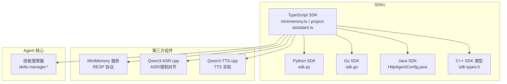
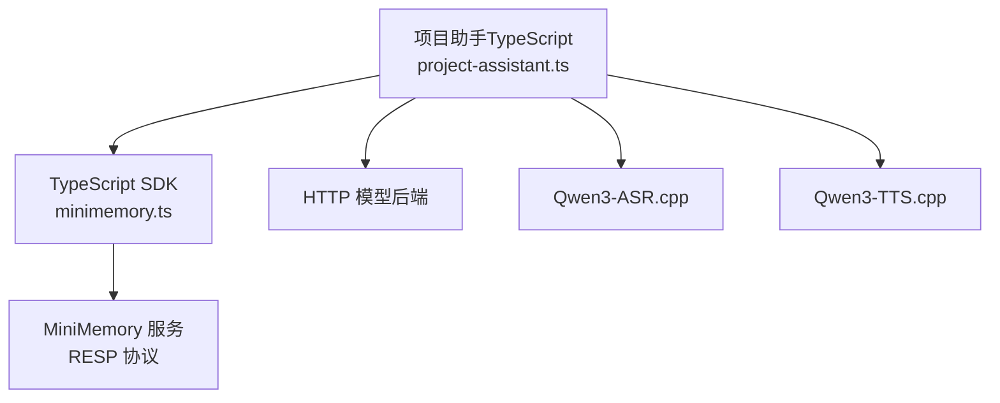
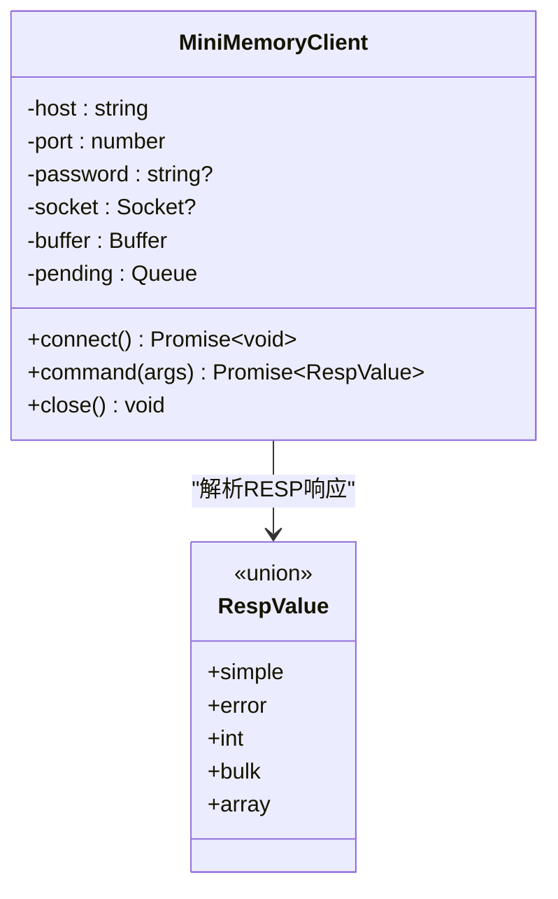
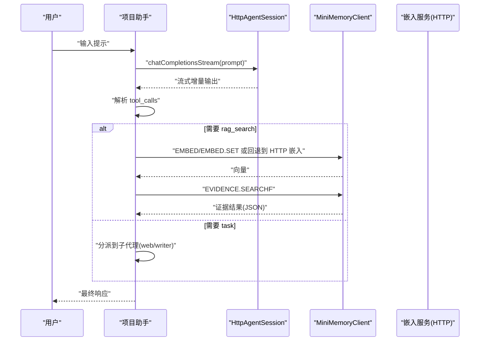
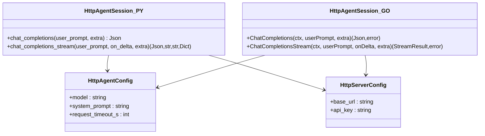
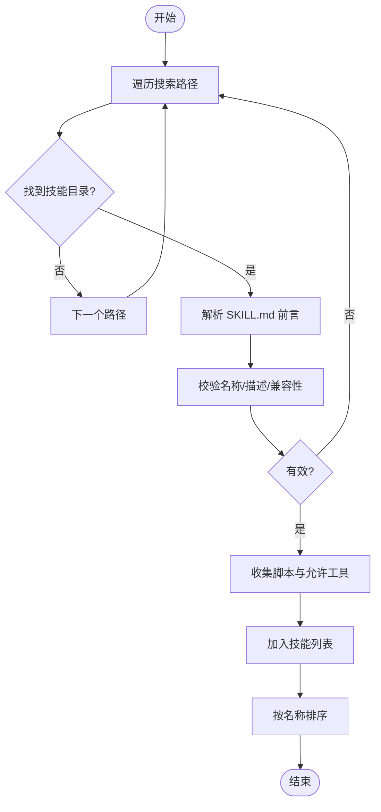
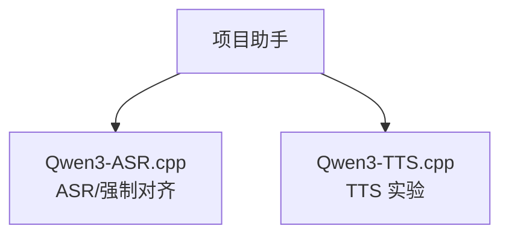
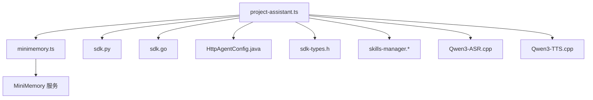

# 第三方集成

<cite>
**本文引用的文件**
- [minimemory.ts](file://SDKs/typescript/src/minimemory.ts)
- [project-assistant.ts](file://SDKs/typescript/src/project-assistant.ts)
- [README.md（MiniMemory）](file://third_party/MiniMemory/README.md)
- [README.md（Qwen3-ASR.cpp）](file://third_party/qwen3-asr.cpp/README.md)
- [README.md（Qwen3-TTS.cpp）](file://third_party/qwen3-tts-cpp/README.md)
- [sdk.py（Python SDK）](file://SDKs/python/src/llama_agent_sdk/sdk.py)
- [sdk.go（Go SDK）](file://SDKs/go/llamaagentsdk/sdk.go)
- [HttpAgentConfig.java（Java SDK）](file://SDKs/java/src/main/java/ai/llama/agent/sdk/HttpAgentConfig.java)
- [sdk-types.h（C++ SDK 类型）](file://agent/sdk/sdk-types.h)
- [skills-manager.cpp](file://agent/skills/skills-manager.cpp)
- [skills-manager.h](file://agent/skills/skills-manager.h)
- [package.json（TypeScript SDK）](file://SDKs/typescript/package.json)
</cite>

## 目录
1. [简介](#简介)
2. [项目结构](#项目结构)
3. [核心组件](#核心组件)
4. [架构总览](#架构总览)
5. [组件详解](#组件详解)
6. [依赖关系分析](#依赖关系分析)
7. [性能考量](#性能考量)
8. [故障排除指南](#故障排除指南)
9. [结论](#结论)
10. [附录](#附录)

## 简介
本文件面向第三方集成场景，围绕以下能力提供完整技术文档：
- MiniMemory 集成：通过 RESP 协议访问 MiniMemory 服务，实现嵌入向量检索、图谱与证据检索、认证与命令封装。
- ASR/TTS 功能：集成 Qwen3-ASR.cpp（高性能语音识别与强制对齐）与 Qwen3-TTS.cpp（实验阶段文本转语音）。
- 模型支持扩展：通过统一的 HTTP 接口与 SDK，接入不同模型后端；结合 MiniMemory 的嵌入空间与图谱能力，实现 RAG 与结构化检索。
- 硬件加速：利用 Apple Silicon Metal 加速、GGML Flash Attention、量化与 mmap 等优化，提升推理性能。

本指南涵盖集成方式、配置选项、性能影响、使用场景与最佳实践，并提供接口规范、兼容性要求与故障排除要点。

## 项目结构
本仓库采用多语言 SDK 与第三方组件并存的组织方式：
- SDKs：提供 TypeScript、Python、Go、Java 四种语言的 HTTP Agent SDK，统一抽象聊天补全与流式输出。
- third_party：MiniMemory（类 Redis 内存 KV + 图谱/证据检索）、Qwen3-ASR.cpp（ASR 与强制对齐）、Qwen3-TTS.cpp（TTS 实验实现）。
- agent：C++ 核心代理与工具框架，包含技能管理器（agentskills.io 规范）。

**图表来源**
- [minimemory.ts:101-181](file://SDKs/typescript/src/minimemory.ts#L101-L181)
- [project-assistant.ts:1-442](file://SDKs/typescript/src/project-assistant.ts#L1-L442)
- [README.md（MiniMemory）:1-960](file://third_party/MiniMemory/README.md#L1-L960)
- [README.md（Qwen3-ASR.cpp）:1-268](file://third_party/qwen3-asr.cpp/README.md#L1-L268)
- [README.md（Qwen3-TTS.cpp）:1-58](file://third_party/qwen3-tts-cpp/README.md#L1-L58)
- [sdk.py（Python SDK）:102-224](file://SDKs/python/src/llama_agent_sdk/sdk.py#L102-L224)
- [sdk.go（Go SDK）:38-267](file://SDKs/go/llamaagentsdk/sdk.go#L38-L267)
- [HttpAgentConfig.java（Java SDK）:1-32](file://SDKs/java/src/main/java/ai/llama/agent/sdk/HttpAgentConfig.java#L1-L32)
- [sdk-types.h（C++ SDK 类型）:1-59](file://agent/sdk/sdk-types.h#L1-L59)
- [skills-manager.cpp:1-330](file://agent/skills/skills-manager.cpp#L1-L330)
- [skills-manager.h:1-63](file://agent/skills/skills-manager.h#L1-L63)

**章节来源**
- [minimemory.ts:1-183](file://SDKs/typescript/src/minimemory.ts#L1-L183)
- [project-assistant.ts:1-442](file://SDKs/typescript/src/project-assistant.ts#L1-L442)
- [README.md（MiniMemory）:1-960](file://third_party/MiniMemory/README.md#L1-L960)
- [README.md（Qwen3-ASR.cpp）:1-268](file://third_party/qwen3-asr.cpp/README.md#L1-L268)
- [README.md（Qwen3-TTS.cpp）:1-58](file://third_party/qwen3-tts-cpp/README.md#L1-L58)
- [sdk.py（Python SDK）:1-224](file://SDKs/python/src/llama_agent_sdk/sdk.py#L1-L224)
- [sdk.go（Go SDK）:1-267](file://SDKs/go/llamaagentsdk/sdk.go#L1-L267)
- [HttpAgentConfig.java（Java SDK）:1-32](file://SDKs/java/src/main/java/ai/llama/agent/sdk/HttpAgentConfig.java#L1-L32)
- [sdk-types.h（C++ SDK 类型）:1-59](file://agent/sdk/sdk-types.h#L1-L59)
- [skills-manager.cpp:1-330](file://agent/skills/skills-manager.cpp#L1-L330)
- [skills-manager.h:1-63](file://agent/skills/skills-manager.h#L1-L63)

## 核心组件
- MiniMemory 客户端（TypeScript）：实现 RESP2 编码/解码、认证、命令队列与异步响应解析，用于调用 EMBED、EVIDENCE.SEARCHF 等命令。
- 项目助手（TypeScript）：封装 RAG 搜索、子代理（Web 搜索/抓取、写作）调用，集成 MiniMemory 与嵌入服务。
- HTTP Agent SDK（多语言）：统一的聊天补全与流式 SSE 接口，支持超时、鉴权头、消息历史管理。
- 技能管理器（C++）：按 agentskills.io 规范发现与注入技能，生成系统提示片段。
- ASR/TTS（第三方）：Qwen3-ASR.cpp 提供高性能 ASR 与强制对齐；Qwen3-TTS.cpp 为实验阶段 TTS 实现。

**章节来源**
- [minimemory.ts:101-181](file://SDKs/typescript/src/minimemory.ts#L101-L181)
- [project-assistant.ts:174-238](file://SDKs/typescript/src/project-assistant.ts#L174-L238)
- [sdk.py（Python SDK）:102-224](file://SDKs/python/src/llama_agent_sdk/sdk.py#L102-L224)
- [sdk.go（Go SDK）:38-267](file://SDKs/go/llamaagentsdk/sdk.go#L38-L267)
- [HttpAgentConfig.java（Java SDK）:1-32](file://SDKs/java/src/main/java/ai/llama/agent/sdk/HttpAgentConfig.java#L1-L32)
- [skills-manager.cpp:1-330](file://agent/skills/skills-manager.cpp#L1-L330)
- [skills-manager.h:1-63](file://agent/skills/skills-manager.h#L1-L63)
- [README.md（Qwen3-ASR.cpp）:1-268](file://third_party/qwen3-asr.cpp/README.md#L1-L268)
- [README.md（Qwen3-TTS.cpp）:1-58](file://third_party/qwen3-tts-cpp/README.md#L1-L58)

## 架构总览
下图展示第三方集成的整体架构：TypeScript 项目助手通过 HTTP SDK 与模型后端通信，同时通过 MiniMemory 客户端访问 MiniMemory 服务，实现嵌入向量检索与图谱证据检索；ASR/TTS 作为独立组件可被上层工具调用。

**图表来源**
- [project-assistant.ts:240-434](file://SDKs/typescript/src/project-assistant.ts#L240-L434)
- [minimemory.ts:101-181](file://SDKs/typescript/src/minimemory.ts#L101-L181)
- [README.md（MiniMemory）:1-960](file://third_party/MiniMemory/README.md#L1-L960)
- [README.md（Qwen3-ASR.cpp）:1-268](file://third_party/qwen3-asr.cpp/README.md#L1-L268)
- [README.md（Qwen3-TTS.cpp）:1-58](file://third_party/qwen3-tts-cpp/README.md#L1-L58)

## 组件详解

### MiniMemory 集成（TypeScript 客户端）
- 协议与认证
  - 使用 RESP2 数组命令格式发送命令，支持 AUTH 认证；认证失败将抛出错误。
  - 响应解析支持简单字符串、整数、批量字符串、数组类型，最终转换为 JSON。
- 命令封装
  - connect：建立 TCP 连接，自动处理认证。
  - command：发送命令并等待响应，内部维护 pending 队列与缓冲区。
  - close：销毁连接并清理未决请求。
- 在项目助手中的应用
  - 通过 ragSearchMiniMemory 调用 EMBED/EMBED.SET 生成查询向量，或回退到 HTTP 嵌入接口。
  - 使用 EVIDENCE.SEARCHF 执行结构化检索，支持标签、元数据、图谱链路等过滤与裁剪。

**图表来源**
- [minimemory.ts:3-99](file://SDKs/typescript/src/minimemory.ts#L3-L99)
- [minimemory.ts:101-181](file://SDKs/typescript/src/minimemory.ts#L101-L181)

**章节来源**
- [minimemory.ts:1-183](file://SDKs/typescript/src/minimemory.ts#L1-L183)
- [project-assistant.ts:174-238](file://SDKs/typescript/src/project-assistant.ts#L174-L238)
- [README.md（MiniMemory）:128-254](file://third_party/MiniMemory/README.md#L128-L254)

### 项目助手（TypeScript）与 RAG 工作流
- 预检与健康检查：preflight 通过 /health 端点确认后端可用。
- 技能注入：loadSkillsSection 从本地与用户目录加载技能文件，生成系统提示片段。
- 工具定义：
  - rag_search：调用 MiniMemory 执行证据检索，支持 top_k、metric、dim、标签、元数据、图谱链路等参数。
  - task：分派到子代理（web、writer）。
  - web_search/web_fetch：网络搜索与网页抓取。
- 子代理：
  - Web 子代理：执行搜索与抓取任务，返回结构化结果。
  - Writer 子代理：结合 RAG 与系统提示生成高质量内容。

**图表来源**
- [project-assistant.ts:240-434](file://SDKs/typescript/src/project-assistant.ts#L240-L434)
- [minimemory.ts:101-181](file://SDKs/typescript/src/minimemory.ts#L101-L181)
- [sdk.py（Python SDK）:146-224](file://SDKs/python/src/llama_agent_sdk/sdk.py#L146-L224)

**章节来源**
- [project-assistant.ts:161-434](file://SDKs/typescript/src/project-assistant.ts#L161-L434)
- [sdk.py（Python SDK）:102-224](file://SDKs/python/src/llama_agent_sdk/sdk.py#L102-L224)

### HTTP Agent SDK（多语言）
- 统一接口
  - chat_completions：非流式请求，返回完整响应。
  - chat_completions_stream：流式请求，按 SSE data: 行解析增量内容、推理内容与工具调用。
  - 消息历史：自动维护 messages 列表，支持 clear 清空。
- 配置与安全
  - HttpServerConfig：base_url、api_key。
  - HttpAgentConfig：model、working_dir、system_prompt、max_iterations、request_timeout_s。
  - Go SDK 还支持自定义 User-Agent。
- 错误处理
  - Python/Go SDK 对 HTTP 非 2xx 状态码进行错误包装；TypeScript SDK 通过 Promise reject 传播。

**图表来源**
- [sdk.py（Python SDK）:102-224](file://SDKs/python/src/llama_agent_sdk/sdk.py#L102-L224)
- [sdk.go（Go SDK）:38-267](file://SDKs/go/llamaagentsdk/sdk.go#L38-L267)
- [HttpAgentConfig.java（Java SDK）:1-32](file://SDKs/java/src/main/java/ai/llama/agent/sdk/HttpAgentConfig.java#L1-L32)

**章节来源**
- [sdk.py（Python SDK）:1-224](file://SDKs/python/src/llama_agent_sdk/sdk.py#L1-L224)
- [sdk.go（Go SDK）:1-267](file://SDKs/go/llamaagentsdk/sdk.go#L1-L267)
- [HttpAgentConfig.java（Java SDK）:1-32](file://SDKs/java/src/main/java/ai/llama/agent/sdk/HttpAgentConfig.java#L1-L32)

### 技能管理器（C++）
- 规范与发现
  - 遵循 agentskills.io 规范，从多个搜索路径发现技能目录，解析 SKILL.md 前言元数据。
  - 校验技能名称格式、描述长度、兼容性信息等。
- 注入系统提示
  - 生成 XML 片段注入系统提示，包含技能名称、描述、脚本与允许工具等。

**图表来源**
- [skills-manager.cpp:240-288](file://agent/skills/skills-manager.cpp#L240-L288)
- [skills-manager.h:11-24](file://agent/skills/skills-manager.h#L11-L24)

**章节来源**
- [skills-manager.cpp:1-330](file://agent/skills/skills-manager.cpp#L1-L330)
- [skills-manager.h:1-63](file://agent/skills/skills-manager.h#L1-L63)

### ASR/TTS 集成
- Qwen3-ASR.cpp
  - 支持 ASR、强制对齐与联合流水线；Apple Silicon Metal 加速、Flash Attention、量化与 mmap 优化。
  - 输出格式：ASR 返回纯文本；强制对齐返回 JSON 包含词级时间戳。
  - 性能：提供基准与优化说明，适用于实时语音处理。
- Qwen3-TTS.cpp
  - 实验阶段，目标是提供无依赖的 C++ 推理实现；音频解码正在开发中。

**图表来源**
- [README.md（Qwen3-ASR.cpp）:1-268](file://third_party/qwen3-asr.cpp/README.md#L1-L268)
- [README.md（Qwen3-TTS.cpp）:1-58](file://third_party/qwen3-tts-cpp/README.md#L1-L58)

**章节来源**
- [README.md（Qwen3-ASR.cpp）:1-268](file://third_party/qwen3-asr.cpp/README.md#L1-L268)
- [README.md（Qwen3-TTS.cpp）:1-58](file://third_party/qwen3-tts-cpp/README.md#L1-L58)

## 依赖关系分析
- TypeScript 项目助手依赖：
  - TypeScript SDK（minimemory.ts）：MiniMemory 客户端。
  - Python/Go/Java SDK：统一的 HTTP 接口，便于跨语言协作。
  - 技能管理器：C++ 实现，用于生成系统提示。
  - ASR/TTS：第三方组件，作为工具被调用。
- MiniMemory 服务端：
  - 支持嵌入生成与图谱证据检索，可通过配置启用 llama.cpp 集成以自动生成向量。

**图表来源**
- [project-assistant.ts:1-442](file://SDKs/typescript/src/project-assistant.ts#L1-L442)
- [minimemory.ts:1-183](file://SDKs/typescript/src/minimemory.ts#L1-L183)
- [sdk.py（Python SDK）:1-224](file://SDKs/python/src/llama_agent_sdk/sdk.py#L1-L224)
- [sdk.go（Go SDK）:1-267](file://SDKs/go/llamaagentsdk/sdk.go#L1-L267)
- [HttpAgentConfig.java（Java SDK）:1-32](file://SDKs/java/src/main/java/ai/llama/agent/sdk/HttpAgentConfig.java#L1-L32)
- [sdk-types.h（C++ SDK 类型）:1-59](file://agent/sdk/sdk-types.h#L1-L59)
- [skills-manager.cpp:1-330](file://agent/skills/skills-manager.cpp#L1-L330)
- [README.md（MiniMemory）:1-960](file://third_party/MiniMemory/README.md#L1-L960)
- [README.md（Qwen3-ASR.cpp）:1-268](file://third_party/qwen3-asr.cpp/README.md#L1-L268)
- [README.md（Qwen3-TTS.cpp）:1-58](file://third_party/qwen3-tts-cpp/README.md#L1-L58)

**章节来源**
- [project-assistant.ts:1-442](file://SDKs/typescript/src/project-assistant.ts#L1-L442)
- [minimemory.ts:1-183](file://SDKs/typescript/src/minimemory.ts#L1-L183)
- [sdk.py（Python SDK）:1-224](file://SDKs/python/src/llama_agent_sdk/sdk.py#L1-L224)
- [sdk.go（Go SDK）:1-267](file://SDKs/go/llamaagentsdk/sdk.go#L1-L267)
- [HttpAgentConfig.java（Java SDK）:1-32](file://SDKs/java/src/main/java/ai/llama/agent/sdk/HttpAgentConfig.java#L1-L32)
- [sdk-types.h（C++ SDK 类型）:1-59](file://agent/sdk/sdk-types.h#L1-L59)
- [skills-manager.cpp:1-330](file://agent/skills/skills-manager.cpp#L1-L330)
- [README.md（MiniMemory）:1-960](file://third_party/MiniMemory/README.md#L1-L960)
- [README.md（Qwen3-ASR.cpp）:1-268](file://third_party/qwen3-asr.cpp/README.md#L1-L268)
- [README.md（Qwen3-TTS.cpp）:1-58](file://third_party/qwen3-tts-cpp/README.md#L1-L58)

## 性能考量
- MiniMemory
  - RESP 协议开销低，适合高频检索；建议启用认证与合理超时，避免长连接阻塞。
  - EMBED/EMBED.SET 与 EVIDENCE.SEARCHF 的组合可减少往返次数，提升端到端吞吐。
- ASR/TTS
  - Apple Silicon Metal 加速与 Flash Attention 显著降低延迟；量化模型（Q8_0）可进一步节省内存。
  - 强制对齐与联合流水线可减少中间步骤，但需注意语言检测与文本预处理成本。
- HTTP SDK
  - 流式 SSE 可边解码边输出，降低首字节延迟；合理设置超时与重试策略。
  - 多语言 SDK 在消息拼接与工具调用聚合上保持一致行为，便于横向扩展。

[本节为通用性能讨论，无需特定文件来源]

## 故障排除指南
- MiniMemory 连接与认证
  - 确认 requirepass 配置与 AUTH 命令顺序；若认证失败，客户端会抛出错误。
  - 检查服务端绑定地址与端口，确保防火墙放行。
- 嵌入向量生成
  - 若 MiniMemory 未启用嵌入生成，项目助手会回退到 HTTP 嵌入接口；检查 /v1/embeddings 可用性与响应格式。
  - 确保向量维度与模型一致，避免检索失败。
- RAG 检索参数
  - top_k、metric、dim、TAG/META、GRAPHFROM/GRAPHREL/GRAPHDEPTH/GRAPHCHAINLEN 参数需与 MiniMemory 命令一致。
- ASR/TTS
  - 确认音频格式（WAV PCM 16kHz 单声道 16bit）与采样率转换正确。
  - Apple Silicon 平台优先使用 Metal 后端；Linux 可启用 CUDA（如适用）。
- HTTP SDK
  - Python/Go SDK 对非 2xx 状态码会返回错误；检查 base_url、API Key 与网络连通性。
  - 流式解析需逐行读取 SSE，注意异常中断与重连策略。

**章节来源**
- [minimemory.ts:115-132](file://SDKs/typescript/src/minimemory.ts#L115-L132)
- [project-assistant.ts:161-172](file://SDKs/typescript/src/project-assistant.ts#L161-L172)
- [README.md（MiniMemory）:128-254](file://third_party/MiniMemory/README.md#L128-L254)
- [README.md（Qwen3-ASR.cpp）:202-227](file://third_party/qwen3-asr.cpp/README.md#L202-L227)
- [sdk.py（Python SDK）:126-131](file://SDKs/python/src/llama_agent_sdk/sdk.py#L126-L131)
- [sdk.go（Go SDK）:112-125](file://SDKs/go/llamaagentsdk/sdk.go#L112-L125)

## 结论
通过统一的 HTTP SDK 与 MiniMemory 的 RESP 协议客户端，本项目实现了从模型后端到知识检索与结构化推理的完整链路。结合 Qwen3-ASR.cpp 的高性能语音处理能力，可快速构建具备多模态输入与检索增强能力的智能体系统。建议在生产环境中：
- 明确 MiniMemory 的认证与持久化策略，确保检索稳定性。
- 选择合适的量化与硬件后端，平衡精度与延迟。
- 使用技能管理器与系统提示注入机制，持续扩展代理能力。

[本节为总结性内容，无需特定文件来源]

## 附录

### 接口规范与兼容性
- HTTP 聊天补全
  - 端点：/v1/chat/completions
  - 方法：POST
  - 请求体字段：model、messages、stream、extra（工具调用、权限等）
  - 响应：非流式返回完整 JSON；流式按 SSE data: 行输出增量块
- MiniMemory 命令
  - AUTH：认证
  - EMBED/EMBED.SET：生成并写入向量
  - EVIDENCE.SEARCHF：结构化证据检索
- 技能规范
  - agentskills.io：技能目录、SKILL.md 前言元数据、脚本与允许工具

**章节来源**
- [sdk.py（Python SDK）:126-224](file://SDKs/python/src/llama_agent_sdk/sdk.py#L126-L224)
- [sdk.go（Go SDK）:100-267](file://SDKs/go/llamaagentsdk/sdk.go#L100-L267)
- [minimemory.ts:172-180](file://SDKs/typescript/src/minimemory.ts#L172-L180)
- [README.md（MiniMemory）:128-254](file://third_party/MiniMemory/README.md#L128-L254)
- [skills-manager.h:11-24](file://agent/skills/skills-manager.h#L11-L24)

### 配置指南与示例
- MiniMemory
  - 常用配置：bind/port、requirepass、AOF 与快照策略、内存上限与淘汰策略
  - 启用嵌入生成：embedding.enabled、embedding.model_path、embedding.host/port、embedding.llama_server/autostart
- 项目助手（TypeScript）
  - 命令行参数：--url、--model、--prompt、--working-dir、--minimemory-host、--minimemory-port、--minimemory-pass、--embed-model
  - 工具参数：rag_search 的 query/top_k/metric/dim/tags/meta/graph_* 等
- ASR/TTS
  - 构建与运行：CMake、编译、模型转换与音频格式要求
  - 性能剖析：开启计时宏与查看详细阶段耗时

**章节来源**
- [README.md（MiniMemory）:35-85](file://third_party/MiniMemory/README.md#L35-L85)
- [project-assistant.ts:275-308](file://SDKs/typescript/src/project-assistant.ts#L275-L308)
- [README.md（Qwen3-ASR.cpp）:34-107](file://third_party/qwen3-asr.cpp/README.md#L34-L107)
- [README.md（Qwen3-TTS.cpp）:26-45](file://third_party/qwen3-tts-cpp/README.md#L26-L45)

### 最佳实践
- 检索增强
  - 使用统一的嵌入空间（如 multilingual-e5-large-instruct）与固定维度，确保跨文档一致性。
  - 结合图谱命令（GRAPH.ADDEDGE/NEIGHBORSX2/EDGE.LIST2）与证据检索，减少二次查询。
- 语音处理
  - 优先使用 Apple Silicon Metal 后端；对长音频采用分段处理与缓存策略。
  - 强制对齐用于精确定位，配合 ASR 联合流水线提升下游任务质量。
- 多语言 SDK
  - 统一超时与鉴权头，保证跨语言行为一致；在工具调用聚合时合并增量输出。

**章节来源**
- [README.md（MiniMemory）:142-193](file://third_party/MiniMemory/README.md#L142-L193)
- [README.md（Qwen3-ASR.cpp）:127-151](file://third_party/qwen3-asr.cpp/README.md#L127-L151)
- [sdk.py（Python SDK）:120-131](file://SDKs/python/src/llama_agent_sdk/sdk.py#L120-L131)
- [sdk.go（Go SDK）:88-98](file://SDKs/go/llamaagentsdk/sdk.go#L88-L98)