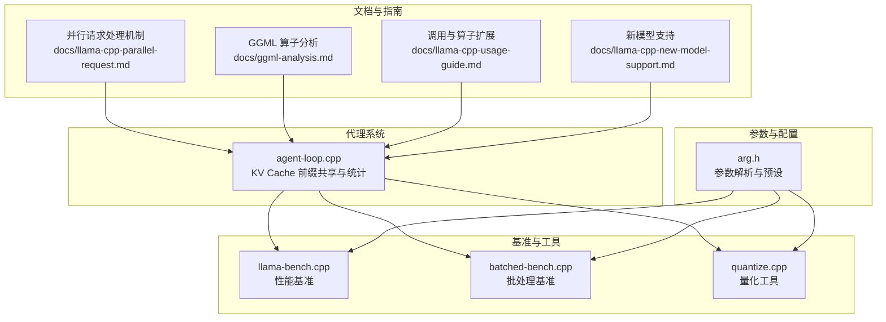
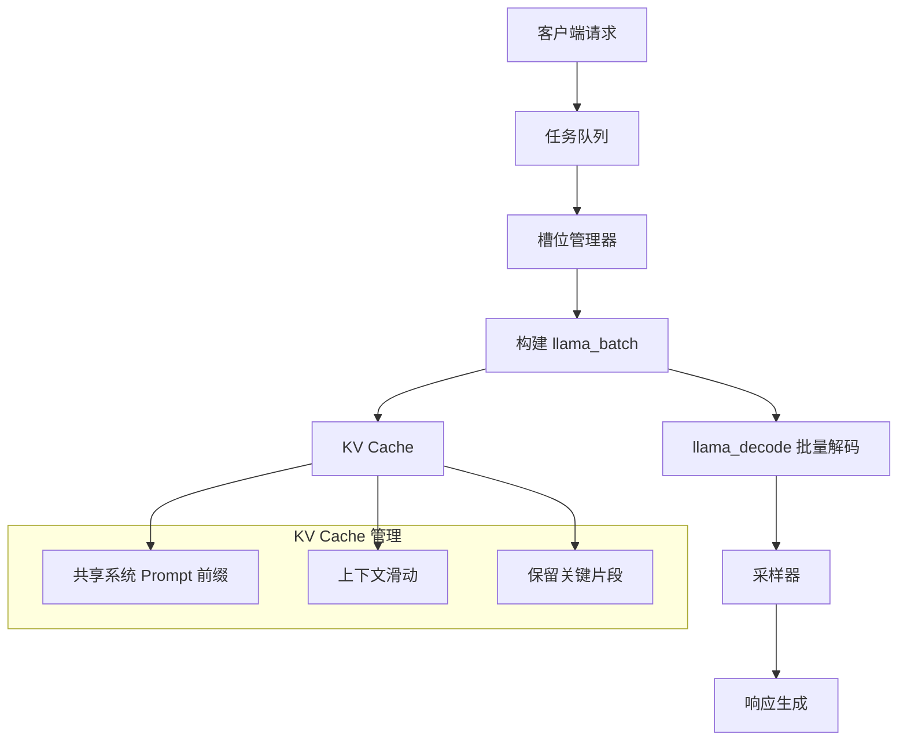
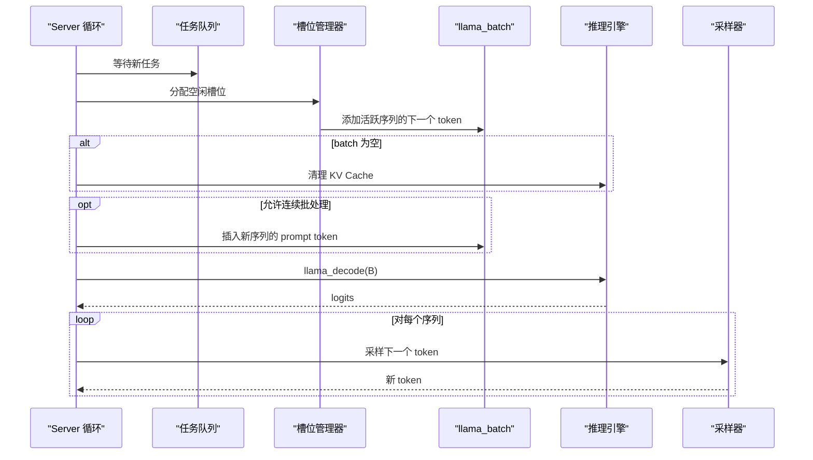
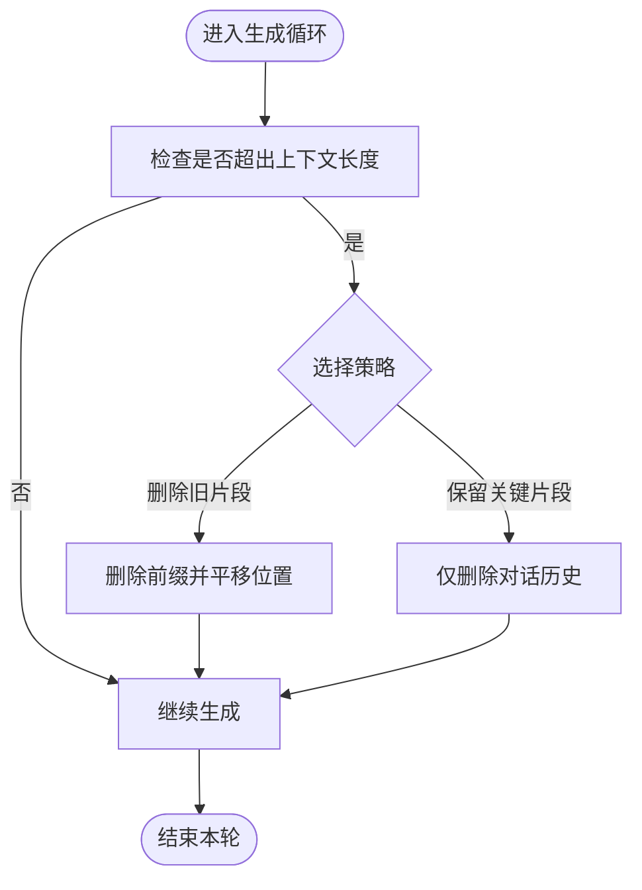
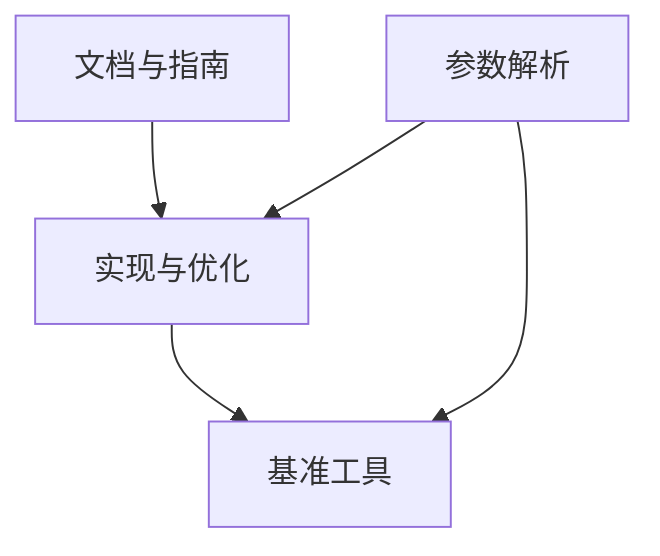

# 性能优化

<cite>
**本文引用的文件**
- [llama-cpp 并行请求处理机制](file://docs/llama-cpp-parallel-request.md)
- [GGML 算子分析与使用指南](file://docs/ggml-analysis.md)
- [llama.cpp 调用指南与算子扩展](file://docs/llama-cpp-usage-guide.md)
- [llama.cpp 新模型支持指南](file://docs/llama-cpp-new-model-support.md)
- [llama.cpp 项目总览](file://third_party/llama.cpp/README.md)
- [agent-loop.cpp](file://agent/agent-loop.cpp)
- [llama-bench.cpp](file://third_party/llama.cpp/tools/llama-bench/llama-bench.cpp)
- [batched-bench.cpp](file://third_party/llama.cpp/tools/batched-bench/batched-bench.cpp)
- [quantize.cpp](file://third_party/llama.cpp/tools/quantize/quantize.cpp)
- [arg.h](file://third_party/llama.cpp/common/arg.h)
</cite>

## 目录
1. [简介](#简介)
2. [项目结构](#项目结构)
3. [核心组件](#核心组件)
4. [架构总览](#架构总览)
5. [详细组件分析](#详细组件分析)
6. [依赖分析](#依赖分析)
7. [性能考量](#性能考量)
8. [故障排查指南](#故障排查指南)
9. [结论](#结论)
10. [附录](#附录)

## 简介
本指南聚焦于 llama.cpp 的性能优化，围绕并行请求处理、批处理优化、KV Cache 管理、内存与量化优化、连续批处理（Continuous Batching）、序列共享与上下文滑动等关键技术展开。文档同时给出参数调优、硬件加速配置、量化策略、缓存策略、基准测试方法、瓶颈分析与监控指标解读，并总结不同硬件平台的优化要点与最佳实践。

## 项目结构
本仓库在 llama.cpp 基础之上，提供了面向代理系统的封装与示例，以及官方文档与工具链。与性能优化直接相关的核心模块包括：
- 文档与指南：并行请求、GGML 算子、调用流程、新模型支持
- 代理系统：agent-loop.cpp 展示了 KV Cache 前缀共享与统计采集
- 基准与工具：llama-bench、batched-bench、quantize
- 参数解析：common/arg.h 提供参数解析与预设机制

**图表来源**
- [llama-cpp 并行请求处理机制](file://docs/llama-cpp-parallel-request.md)
- [GGML 算子分析与使用指南](file://docs/ggml-analysis.md)
- [llama.cpp 调用指南与算子扩展](file://docs/llama-cpp-usage-guide.md)
- [llama.cpp 新模型支持指南](file://docs/llama-cpp-new-model-support.md)
- [agent-loop.cpp](file://agent/agent-loop.cpp)
- [llama-bench.cpp](file://third_party/llama.cpp/tools/llama-bench/llama-bench.cpp)
- [batched-bench.cpp](file://third_party/llama.cpp/tools/batched-bench/batched-bench.cpp)
- [quantize.cpp](file://third_party/llama.cpp/tools/quantize/quantize.cpp)
- [arg.h](file://third_party/llama.cpp/common/arg.h)

**章节来源**
- [llama.cpp 项目总览](file://third_party/llama.cpp/README.md)

## 核心组件
- 并行请求与批处理：通过 Batch 与 Sequence 机制将多用户请求打包，统一调度与解码，最大化 GPU/CPU 利用率。
- KV Cache 管理：提供序列级 KV Cache 的增删改查与上下文滑动，支持共享前缀与增量更新。
- 连续批处理（Continuous Batching）：迭代级调度，动态插入新请求、回收已完成序列，降低空闲时间。
- 后端与算子：基于 GGML 的多后端（CPU/CUDA/Metal/Vulkan/SYCL）与算子映射，Flash Attention 等高性能实现。
- 量化与内存：支持多种量化格式，降低显存占用；结合上下文长度与序列数控制内存峰值。
- 基准与工具：llama-bench、batched-bench、quantize 提供性能评估与量化转换能力。

**章节来源**
- [llama-cpp 并行请求处理机制](file://docs/llama-cpp-parallel-request.md)
- [GGML 算子分析与使用指南](file://docs/ggml-analysis.md)
- [llama.cpp 调用指南与算子扩展](file://docs/llama-cpp-usage-guide.md)
- [llama.cpp 新模型支持指南](file://docs/llama-cpp-new-model-support.md)

## 架构总览
llama.cpp 的性能优化围绕“批处理 + KV Cache + 连续调度 + 后端算子”协同工作：
- Server 层负责任务队列与槽位管理，将活跃序列与新请求合并到 batch。
- Inference Engine 通过 llama_decode 对 batch 进行一次性解码，随后对每个序列采样。
- KV Cache 在序列间共享公共前缀，减少重复计算；支持上下文滑动与保留策略。
- 后端根据硬件选择最优算子实现（如 Flash Attention），提升注意力计算效率。

**图表来源**
- [llama-cpp 并行请求处理机制](file://docs/llama-cpp-parallel-request.md)

## 详细组件分析

### 并行请求与连续批处理
- 核心思想：将多个序列的 token 合并到一个 batch，统一解码；迭代过程中动态收集活跃序列的新 token，必要时插入新序列。
- 关键点：
  - llama_batch 支持多序列混合，pos 为序列内相对位置。
  - 连续批处理在每轮迭代清空 batch，收集活跃序列的下一个 token，若 batch 为空则清理 KV Cache。
  - 大 batch 分块处理（n_batch）避免内存溢出，提高吞吐。

**图表来源**
- [llama-cpp 并行请求处理机制](file://docs/llama-cpp-parallel-request.md)

**章节来源**
- [llama-cpp 并行请求处理机制](file://docs/llama-cpp-parallel-request.md)

### KV Cache 管理与上下文滑动
- API 能力：删除指定序列、复制序列 KV Cache、保留特定序列、调整位置（上下文滑动）。
- 优化策略：
  - 共享系统 Prompt：将系统 Prompt 编码到序列 0，复制到所有用户序列，最大化缓存命中。
  - 上下文滑动：当超出 n_ctx 时，删除旧片段或保留关键片段，维持生成连贯性。
  - 统一 buffer 模式（kv_unified）：在共享前缀场景更高效；独立序列场景禁用可降低碎片化。

**图表来源**
- [llama-cpp 并行请求处理机制](file://docs/llama-cpp-parallel-request.md)

**章节来源**
- [llama-cpp 并行请求处理机制](file://docs/llama-cpp-parallel-request.md)

### 后端与算子映射（Flash Attention、RoPE、注意力掩码）
- 后端：CPU、CUDA、Metal、Vulkan、SYCL 等，不同后端对算子实现差异显著。
- 算子映射：Transformer 层的注意力、FFN、RoPE、Softmax 等均可映射到 GGML 算子。
- 性能关键：Flash Attention 在多序列批处理中显著提升注意力计算效率；RoPE 参数（频率、类型）影响长上下文稳定性；因果掩码确保生成正确性。

**图表来源**
- [GGML 算子分析与使用指南](file://docs/ggml-analysis.md)
- [llama.cpp 调用指南与算子扩展](file://docs/llama-cpp-usage-guide.md)

**章节来源**
- [GGML 算子分析与使用指南](file://docs/ggml-analysis.md)
- [llama.cpp 调用指南与算子扩展](file://docs/llama-cpp-usage-guide.md)

### 量化与内存优化
- 量化类型：F32/F16/BF16 与多种 Q/K-quants/I-quants，量化可显著降低显存占用。
- 量化 API：支持按块量化、重要性矩阵（imatrix）等高级选项。
- 内存估算：KV Cache 大小与 n_ctx、层数、维度、类型相关；序列数增加带来碎片化风险。
- 策略建议：优先使用适配硬件的量化格式（如 CUDA 下的 K-quants），在满足精度前提下尽可能降低类型位宽。

**章节来源**
- [GGML 算子分析与使用指南](file://docs/ggml-analysis.md)
- [llama.cpp 新模型支持指南](file://docs/llama-cpp-new-model-support.md)

### 代理系统中的 KV Cache 前缀共享与统计
- agent-loop.cpp 展示了将“基础系统提示”作为共享前缀，子代理提示以固定前缀开头，从而最大化缓存命中，减少重复计算。
- 统计采集：记录 cached_tokens 等指标，便于评估共享效果与优化收益。

**章节来源**
- [agent-loop.cpp](file://agent/agent-loop.cpp)

## 依赖分析
- 文档与指南为实现提供理论依据与最佳实践路径。
- 代理系统依赖并行请求与 KV Cache 管理，结合基准工具进行性能评估。
- 参数解析模块为工具链提供统一的参数入口，便于自动化与预设。

**图表来源**
- [llama-cpp 并行请求处理机制](file://docs/llama-cpp-parallel-request.md)
- [GGML 算子分析与使用指南](file://docs/ggml-analysis.md)
- [llama.cpp 调用指南与算子扩展](file://docs/llama-cpp-usage-guide.md)
- [llama.cpp 新模型支持指南](file://docs/llama-cpp-new-model-support.md)
- [arg.h](file://third_party/llama.cpp/common/arg.h)

**章节来源**
- [arg.h](file://third_party/llama.cpp/common/arg.h)

## 性能考量
- 批处理优化
  - 动态批大小：根据活跃序列数量与硬件能力动态调整 n_batch。
  - 分块处理：大 batch 按 n_batch 分块，避免内存峰值过高。
  - logits 过滤：仅对需要输出的 token 计算 logits，减少冗余。
- KV Cache 优化
  - 共享系统 Prompt：序列复制（seq_cp）最大化缓存命中。
  - 上下文滑动：保留关键片段，删除历史，维持长上下文稳定性。
  - 统一 buffer：在共享前缀场景启用 kv_unified。
- 硬件加速与后端
  - CUDA/Metal/Vulkan/SYCL：选择与硬件匹配的后端，确保算子实现（如 Flash Attention）可用。
  - 线程与微批：n_threads 与 n_threads_batch 需与模型规模与硬件特性平衡。
- 量化与内存
  - 优先 K-quants/I-quants；在满足精度前提下降低类型位宽。
  - 控制 n_ctx 与 n_seq_max，避免 KV Cache 内存不足。
- 连续批处理
  - 迭代级调度，动态插入新请求，及时回收已完成序列，最大化利用率。

[本节为通用指导，无需列出具体文件来源]

## 故障排查指南
- KV Cache 分配失败
  - 降低 n_ctx 或 n_seq_max；检查 kv_unified 与共享策略是否合适。
- 生成内容异常
  - 检查 RoPE 类型与频率参数；确认因果掩码正确应用。
- 性能不达预期
  - 启用 Flash Attention（后端支持时）；优化批大小与分块；评估量化精度与类型。
- 基准与监控
  - 使用 llama-bench 与 batched-bench 评估不同配置下的吞吐与延迟；关注缓存命中统计（cached_tokens）。

**章节来源**
- [llama.cpp 新模型支持指南](file://docs/llama-cpp-new-model-support.md)

## 结论
llama.cpp 的性能优化建立在“批处理 + KV Cache + 连续调度 + 后端算子”的协同之上。通过共享前缀、上下文滑动、量化与硬件后端选择，可在多用户并发场景下实现高吞吐与低延迟。结合基准工具与统计指标，可系统性地定位瓶颈并持续优化。

[本节为总结性内容，无需列出具体文件来源]

## 附录

### 性能基准测试方法
- llama-bench：评估不同线程数、上下文长度、后端下的吞吐与延迟。
- batched-bench：评估多序列批处理下的吞吐与缓存命中情况。
- 量化评估：使用 quantize.cpp 将模型量化为不同格式，比较显存占用与精度。

**章节来源**
- [llama-bench.cpp](file://third_party/llama.cpp/tools/llama-bench/llama-bench.cpp)
- [batched-bench.cpp](file://third_party/llama.cpp/tools/batched-bench/batched-bench.cpp)
- [quantize.cpp](file://third_party/llama.cpp/tools/quantize/quantize.cpp)

### 参数调优与配置要点
- 上下文与批处理：n_ctx、n_batch、n_ubatch、n_seq_max
- 线程与调度：n_threads、n_threads_batch
- KV Cache 类型：type_k、type_v、kv_unified
- 后端与注意力：flash_attn_type、offload_kqv
- 量化：选择合适的 ggml_type 与量化格式

**章节来源**
- [llama-cpp 并行请求处理机制](file://docs/llama-cpp-parallel-request.md)
- [llama.cpp 调用指南与算子扩展](file://docs/llama-cpp-usage-guide.md)

### 不同硬件平台的优化策略
- Apple Silicon：Metal 后端，注意 NEON/ARM NEON 优化；RoPE 类型与频率需匹配。
- NVIDIA GPU：CUDA 后端，优先启用 Flash Attention；K-quants 量化；合理设置 n_gpu_layers。
- Vulkan/SYCL：跨平台 GPU，关注算子实现与内存带宽；量化与批大小平衡。
- CPU：BLAS/AVX/AVX2/AVX512/AMX，适当增大 n_threads；谨慎使用高精度类型。

**章节来源**
- [llama.cpp 项目总览](file://third_party/llama.cpp/README.md)