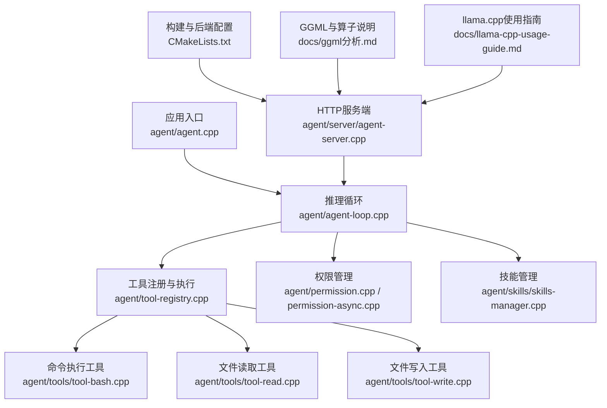
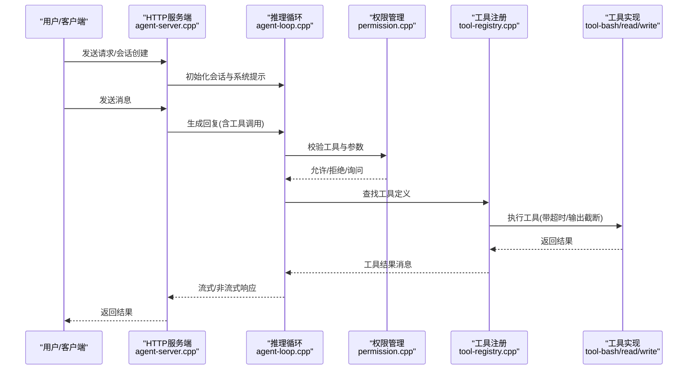
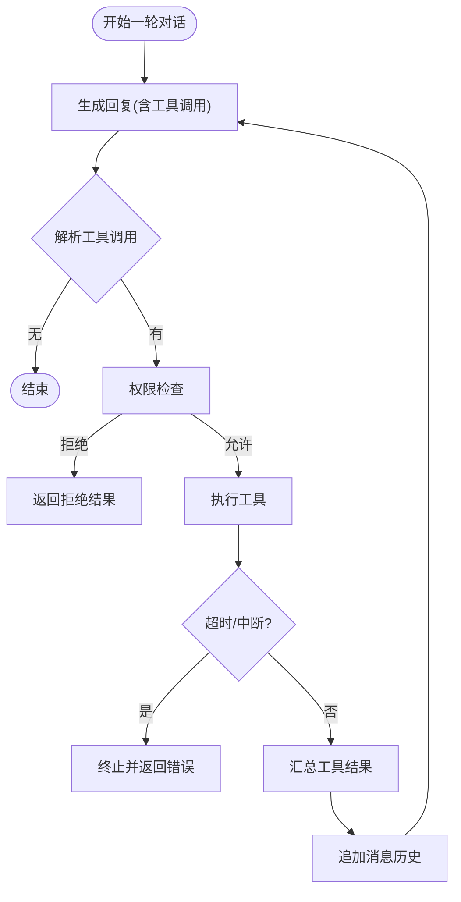
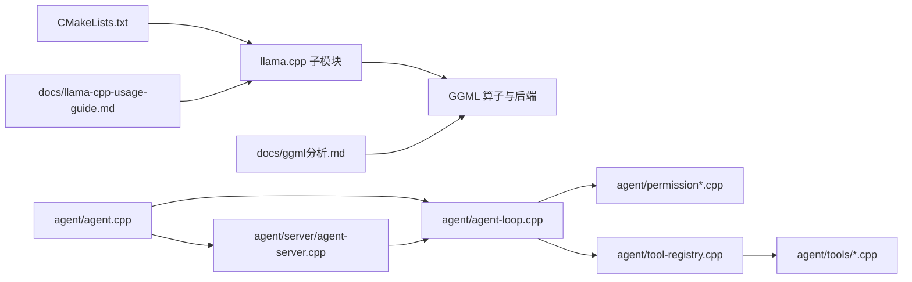

# 故障排除和常见问题

<cite>
**本文引用的文件**
- [CMakeLists.txt](file://CMakeLists.txt)
- [agent.cpp](file://agent/agent.cpp)
- [agent-loop.cpp](file://agent/agent-loop.cpp)
- [permission.cpp](file://agent/permission.cpp)
- [permission-async.cpp](file://agent/permission-async.cpp)
- [tool-registry.cpp](file://agent/tool-registry.cpp)
- [tool-bash.cpp](file://agent/tools/tool-bash.cpp)
- [tool-read.cpp](file://agent/tools/tool-read.cpp)
- [tool-write.cpp](file://agent/tools/tool-write.cpp)
- [skills-manager.cpp](file://agent/skills/skills-manager.cpp)
- [agent-server.cpp](file://agent/server/agent-server.cpp)
- [ggml分析.md](file://docs/ggml-analysis.md)
- [llama.cpp使用指南.md](file://docs/llama-cpp-usage-guide.md)
</cite>

## 目录
1. [简介](#简介)
2. [项目结构](#项目结构)
3. [核心组件](#核心组件)
4. [架构总览](#架构总览)
5. [详细组件分析](#详细组件分析)
6. [依赖分析](#依赖分析)
7. [性能考虑](#性能考虑)
8. [故障排除指南](#故障排除指南)
9. [结论](#结论)
10. [附录](#附录)

## 简介
本指南面向在实际运行 llama.cpp-agent 时可能遇到的各类故障与常见问题，覆盖模型加载失败、内存不足、并发处理异常、权限拒绝、工具执行错误等场景。内容包括：
- 故障现象与原因分析
- 诊断步骤与修复方法
- 预防措施与最佳实践
- 错误代码对照表与日志分析技巧
- 配置错误定位与修复建议
- 专家级诊断流程与快速查找索引

## 项目结构
该项目由三层组成：
- 应用入口与主循环：负责启动模型、初始化推理后端、交互循环与工具执行
- 服务端与会话管理：提供 HTTP API、会话管理、权限异步响应与音频能力
- 工具与技能：提供文件读写、命令执行、技能解析与提示注入

**图表来源**
- [agent.cpp:101-588](file://agent/agent.cpp#L101-L588)
- [agent-loop.cpp:1-800](file://agent/agent-loop.cpp#L1-L800)
- [tool-registry.cpp:1-86](file://agent/tool-registry.cpp#L1-L86)
- [tool-bash.cpp:1-281](file://agent/tools/tool-bash.cpp#L1-L281)
- [tool-read.cpp:1-120](file://agent/tools/tool-read.cpp#L1-L120)
- [tool-write.cpp:1-80](file://agent/tools/tool-write.cpp#L1-L80)
- [permission.cpp:1-310](file://agent/permission.cpp#L1-L310)
- [permission-async.cpp:1-283](file://agent/permission-async.cpp#L1-L283)
- [skills-manager.cpp:1-330](file://agent/skills/skills-manager.cpp#L1-L330)
- [agent-server.cpp:1-731](file://agent/server/agent-server.cpp#L1-L731)
- [CMakeLists.txt:1-44](file://CMakeLists.txt#L1-L44)
- [ggml分析.md:1-804](file://docs/ggml-analysis.md#L1-L804)
- [llama.cpp使用指南.md:1-1031](file://docs/llama-cpp-usage-guide.md#L1-L1031)

**章节来源**
- [agent.cpp:101-588](file://agent/agent.cpp#L101-L588)
- [agent-server.cpp:105-731](file://agent/server/agent-server.cpp#L105-L731)
- [CMakeLists.txt:1-44](file://CMakeLists.txt#L1-L44)

## 核心组件
- 模型加载与后端初始化：负责加载模型、初始化推理后端、NUMA 与日志级别控制
- 推理循环与工具执行：负责对话消息构建、工具调用、权限校验、结果回传
- 权限管理：同步与异步两种策略，支持危险命令识别、外部路径访问限制、重复调用防护
- 工具集：bash、read、write 等常用工具，具备超时控制、输出截断与错误封装
- 服务端与会话：提供 HTTP API、健康检查、会话管理、权限异步响应、音频能力
- 技能管理：解析 SKILL.md，注入可用技能提示，限制重复与冲突

**章节来源**
- [agent.cpp:212-288](file://agent/agent.cpp#L212-L288)
- [agent-loop.cpp:482-666](file://agent/agent-loop.cpp#L482-L666)
- [permission.cpp:34-140](file://agent/permission.cpp#L34-L140)
- [permission-async.cpp:10-122](file://agent/permission-async.cpp#L10-L122)
- [tool-registry.cpp:49-86](file://agent/tool-registry.cpp#L49-L86)
- [tool-bash.cpp:50-258](file://agent/tools/tool-bash.cpp#L50-L258)
- [tool-read.cpp:17-93](file://agent/tools/tool-read.cpp#L17-L93)
- [tool-write.cpp:10-57](file://agent/tools/tool-write.cpp#L10-L57)
- [agent-server.cpp:70-103](file://agent/server/agent-server.cpp#L70-L103)
- [skills-manager.cpp:240-330](file://agent/skills/skills-manager.cpp#L240-L330)

## 架构总览
系统采用“主循环 + 工具执行 + 权限控制”的核心架构，并通过 HTTP 服务对外提供能力。模型加载与后端初始化在应用入口完成；推理循环负责消息与工具调用；权限模块贯穿工具执行前后；服务端负责 API 与会话生命周期。

**图表来源**
- [agent-server.cpp:303-426](file://agent/server/agent-server.cpp#L303-L426)
- [agent-loop.cpp:695-788](file://agent/agent-loop.cpp#L695-L788)
- [permission.cpp:108-140](file://agent/permission.cpp#L108-L140)
- [tool-registry.cpp:49-86](file://agent/tool-registry.cpp#L49-L86)
- [tool-bash.cpp:50-258](file://agent/tools/tool-bash.cpp#L50-L258)

**章节来源**
- [agent-server.cpp:303-426](file://agent/server/agent-server.cpp#L303-L426)
- [agent-loop.cpp:695-788](file://agent/agent-loop.cpp#L695-L788)

## 详细组件分析

### 模型加载与后端初始化
- 关键点：初始化后端、NUMA、日志级别、模型加载失败直接退出
- 常见问题：CUDA 不可用、显存不足、模型路径错误、后端未正确启用
- 诊断要点：查看后端初始化日志、确认 CUDA/GPU 环境变量、核对模型路径与格式

**章节来源**
- [agent.cpp:221-258](file://agent/agent.cpp#L221-L258)
- [CMakeLists.txt:11-28](file://CMakeLists.txt#L11-L28)

### 推理循环与工具执行
- 关键点：消息历史维护、工具调用解析、权限检查、超时与中断处理、输出截断
- 常见问题：工具执行超时、权限拒绝、重复调用被阻断、外部路径访问受限
- 诊断要点：查看工具执行耗时、权限提示、外部路径提示、重复调用检测

**图表来源**
- [agent-loop.cpp:695-788](file://agent/agent-loop.cpp#L695-L788)
- [permission.cpp:108-140](file://agent/permission.cpp#L108-L140)

**章节来源**
- [agent-loop.cpp:482-666](file://agent/agent-loop.cpp#L482-L666)

### 权限管理（同步与异步）
- 同步权限：交互式询问、危险命令识别、外部路径检查、重复调用防护
- 异步权限：请求ID、回调通知、等待响应、会话作用域、取消请求
- 常见问题：权限未配置导致默认拒绝、异步请求未及时响应、重复调用触发阻断

**章节来源**
- [permission.cpp:34-140](file://agent/permission.cpp#L34-L140)
- [permission-async.cpp:10-122](file://agent/permission-async.cpp#L10-L122)
- [permission-async.cpp:124-209](file://agent/permission-async.cpp#L124-L209)

### 工具集与执行
- bash 工具：跨平台进程管理、管道读取、超时与中断、输出截断
- read 工具：敏感文件保护、路径合法性检查、偏移与限制
- write 工具：父目录创建、覆盖/新建提示、错误封装
- 常见问题：命令超时、权限不足、文件不存在/不可写、输出过大被截断

**章节来源**
- [tool-bash.cpp:50-258](file://agent/tools/tool-bash.cpp#L50-L258)
- [tool-read.cpp:17-93](file://agent/tools/tool-read.cpp#L17-L93)
- [tool-write.cpp:10-57](file://agent/tools/tool-write.cpp#L10-L57)

### 服务端与会话管理
- 关键点：HTTP 路由、健康检查、会话管理、权限异步响应、音频能力
- 常见问题：路由未正确挂载、会话状态异常、权限异步回调丢失、音频模型加载失败

**章节来源**
- [agent-server.cpp:303-426](file://agent/server/agent-server.cpp#L303-L426)
- [agent-server.cpp:500-731](file://agent/server/agent-server.cpp#L500-L731)

### 技能管理
- 关键点：SKILL.md 解析、前端元数据校验、脚本发现、XML 注入提示
- 常见问题：文件名/目录名不合法、描述过长、兼容性字段超限、重复技能覆盖

**章节来源**
- [skills-manager.cpp:240-330](file://agent/skills/skills-manager.cpp#L240-L330)

## 依赖分析
- 构建与后端：CMake 控制 CUDA 后端开关、llama.cpp 子模块集成
- 运行时：llama.cpp 后端（CPU/CUDA/Metal/Vulkan/SYCL）、GGML 算子、量化类型
- 服务端：HTTP 路由、会话管理、权限异步、音频模型（可选）

**图表来源**
- [CMakeLists.txt:30-42](file://CMakeLists.txt#L30-L42)
- [agent.cpp:36-53](file://agent/agent.cpp#L36-L53)
- [agent-server.cpp:105-231](file://agent/server/agent-server.cpp#L105-L231)
- [ggml分析.md:1-804](file://docs/ggml-analysis.md#L1-L804)
- [llama.cpp使用指南.md:1-1031](file://docs/llama-cpp-usage-guide.md#L1-L1031)

**章节来源**
- [CMakeLists.txt:1-44](file://CMakeLists.txt#L1-L44)
- [agent.cpp:36-53](file://agent/agent.cpp#L36-L53)
- [agent-server.cpp:105-231](file://agent/server/agent-server.cpp#L105-L231)

## 性能考虑
- 线程与批处理：合理设置 n_threads/n_batch/n_ubatch，避免过度并行导致抖动
- KV 缓存与上下文：n_ctx 影响显存占用与速度，注意预热与缓存复用
- 后端选择：GPU 后端（CUDA/Metal/Vulkan）在大模型上显著提速，CPU 后端适合小模型或调试
- 工具执行：bash 工具超时与输出截断，避免长时间阻塞与内存膨胀
- 日志级别：降低日志级别减少 IO 开销，便于生产环境稳定运行

[本节为通用指导，无需特定文件引用]

## 故障排除指南

### 1. 模型加载失败
- 现象
  - 启动即报错“Failed to load the model”
  - 服务端启动后 /health 返回异常
- 可能原因
  - 模型路径错误或文件损坏
  - CUDA 后端未启用或驱动不匹配
  - 显存不足或内存碎片
  - GGUF 格式不兼容或量化类型不受支持
- 诊断步骤
  - 检查模型路径与文件存在性
  - 查看后端初始化日志（CUDA/GPU/NUMA）
  - 使用较低 n_ctx/n_batch 重试
  - 切换 CPU 后端验证模型可用性
- 修复建议
  - 重新下载/转换模型至 GGUF
  - 确认 CUDA 环境变量与驱动版本
  - 释放显存或降低模型规模
  - 使用 CPU 后端进行最小化验证

**章节来源**
- [agent.cpp:253-257](file://agent/agent.cpp#L253-L257)
- [agent-server.cpp:605-612](file://agent/server/agent-server.cpp#L605-L612)

### 2. 内存不足（OOM）
- 现象
  - 推理阶段崩溃或卡死
  - 显存分配失败或频繁回收
- 可能原因
  - n_ctx 过大、n_batch 过大
  - KV 缓存未复用或上下文叠加
  - 多会话并发导致显存紧张
- 诊断步骤
  - 降低 n_ctx 与 n_batch
  - 检查会话清理与关闭
  - 使用 CPU 后端对比验证
- 修复建议
  - 适当降低上下文长度
  - 合理拆分任务，避免单次长上下文
  - 使用 CPU 后端或混合精度

**章节来源**
- [agent-server.cpp:222-226](file://agent/server/agent-server.cpp#L222-L226)

### 3. 并发处理异常
- 现象
  - 多会话请求导致性能下降或崩溃
  - 路由器模式下代理异常
- 可能原因
  - 线程竞争与共享状态未保护
  - 路由器未正确转发模型参数
- 诊断步骤
  - 查看会话管理与路由日志
  - 核对模型选择参数（router 模式）
- 修复建议
  - 确保会话隔离与资源释放
  - 在 router 模式下明确指定 model 参数

**章节来源**
- [agent-server.cpp:258-426](file://agent/server/agent-server.cpp#L258-L426)

### 4. 权限拒绝
- 现象
  - 工具执行被阻断，提示“Permission denied”
  - 外部路径访问被拒绝
- 可能原因
  - 默认权限策略为 ASK/DENY
  - 危险命令被识别（如 rm、sudo、chmod 777）
  - 重复调用被判定为“doom loop”
- 诊断步骤
  - 查看权限提示与危险命令标记
  - 检查外部路径访问提示
  - 确认 session 覆盖与最近调用记录
- 修复建议
  - 使用 YOLO 模式（开发测试）或明确授权
  - 避免危险命令，改用安全替代方案
  - 合理设计工具调用，避免重复调用

**章节来源**
- [permission.cpp:108-140](file://agent/permission.cpp#L108-L140)
- [permission.cpp:217-223](file://agent/permission.cpp#L217-L223)
- [agent-loop.cpp:542-565](file://agent/agent-loop.cpp#L542-L565)

### 5. 工具执行错误
- bash 工具
  - 现象：命令超时、进程无法终止、输出过大被截断
  - 诊断：查看超时与退出码、确认工作目录与权限
  - 修复：调整超时、拆分命令、避免一次性输出过多
- read 工具
  - 现象：文件不存在、非常规文件、敏感文件保护
  - 诊断：确认路径与权限、检查敏感文件名单
  - 修复：使用绝对路径、避开敏感文件
- write 工具
  - 现象：父目录创建失败、写入失败、权限不足
  - 诊断：确认目标路径与权限、检查磁盘空间
  - 修复：确保目录存在、提升权限或更换路径

**章节来源**
- [tool-bash.cpp:50-258](file://agent/tools/tool-bash.cpp#L50-L258)
- [tool-read.cpp:17-93](file://agent/tools/tool-read.cpp#L17-L93)
- [tool-write.cpp:10-57](file://agent/tools/tool-write.cpp#L10-L57)

### 6. HTTP 服务异常
- 现象：/health 不可用、路由 4xx/5xx、权限异步回调丢失
- 可能原因：路由未挂载、会话管理异常、权限异步未配置回调
- 诊断步骤：查看服务端日志、确认路由与会话状态
- 修复建议：补全路由、确保回调注册、清理会话资源

**章节来源**
- [agent-server.cpp:303-426](file://agent/server/agent-server.cpp#L303-L426)
- [agent-server.cpp:70-103](file://agent/server/agent-server.cpp#L70-L103)

### 7. 音频能力（ASR/TTS）异常
- 现象：POST /v1/audio/speech 返回 503 或未实现
- 可能原因：模型未加载、tokenizer 未加载
- 诊断步骤：查看加载日志、确认模型路径
- 修复建议：补齐模型路径与必要参数

**章节来源**
- [agent-server.cpp:429-497](file://agent/server/agent-server.cpp#L429-L497)
- [agent-server.cpp:530-566](file://agent/server/agent-server.cpp#L530-L566)

### 8. 错误代码对照表（HTTP）
- 400：无效请求（JSON 解析错误、缺少参数）
- 500：服务器内部错误（未捕获异常）
- 503：服务不可用（TTS/ASR 未启用或加载失败）
- 健康检查：/health 200 表示服务就绪

**章节来源**
- [agent-server.cpp:70-103](file://agent/server/agent-server.cpp#L70-L103)
- [agent-server.cpp:429-497](file://agent/server/agent-server.cpp#L429-L497)

### 9. 调试工具与日志分析
- 日志级别：通过 verbosity 控制日志输出，生产环境建议 INFO 以上
- 关键日志：模型加载、后端初始化、HTTP 路由、权限提示、工具执行耗时
- 建议：结合时间戳与线程 ID 定位并发问题；使用较低 n_ctx 快速复现

**章节来源**
- [agent.cpp:223-224](file://agent/agent.cpp#L223-L224)
- [agent-server.cpp:239-246](file://agent/server/agent-server.cpp#L239-L246)

### 10. 配置错误与修复建议
- CUDA 后端未启用：检查 CMake 选项与环境变量
- 模型路径错误：确认 GGUF 文件存在且可读
- n_parallel 与 KV 统一：router 模式默认设置，确保与后端一致
- 子代理深度：--max-subagent-depth 限制递归深度，防止栈溢出

**章节来源**
- [CMakeLists.txt:11-28](file://CMakeLists.txt#L11-L28)
- [agent-server.cpp:222-226](file://agent/server/agent-server.cpp#L222-L226)
- [agent.cpp:173-210](file://agent/agent.cpp#L173-L210)

### 11. 专家级诊断流程
- 第一步：确认后端与模型
  - 检查 CUDA/NUMA 初始化日志
  - 验证模型加载成功与格式正确
- 第二步：评估资源与并发
  - 降低 n_ctx/n_batch/n_threads
  - 检查会话与路由状态
- 第三步：定位工具与权限
  - 查看权限提示与危险命令标记
  - 检查外部路径与重复调用
- 第四步：工具执行与输出
  - 关注超时与输出截断
  - 拆分复杂命令，避免一次性输出过多
- 第五步：服务端与 API
  - 核对路由与参数传递
  - 确认权限异步回调与会话清理

**章节来源**
- [agent.cpp:221-258](file://agent/agent.cpp#L221-L258)
- [agent-server.cpp:258-426](file://agent/server/agent-server.cpp#L258-L426)
- [agent-loop.cpp:482-666](file://agent/agent-loop.cpp#L482-L666)

## 结论
本指南从系统架构、核心组件、依赖关系与性能角度出发，提供了覆盖模型加载、内存、并发、权限与工具执行的完整故障排除路径。建议在生产环境中：
- 严格控制日志级别与资源参数
- 明确权限策略与危险命令白名单
- 合理拆分任务与控制上下文长度
- 建立完善的监控与日志分析体系

[本节为总结，无需特定文件引用]

## 附录

### A. 快速查找索引
- 模型加载失败：[agent.cpp:253-257](file://agent/agent.cpp#L253-L257)
- 权限拒绝：[permission.cpp:108-140](file://agent/permission.cpp#L108-L140)
- 工具执行超时：[tool-bash.cpp:94-132](file://agent/tools/tool-bash.cpp#L94-L132)
- 外部路径访问：[agent-loop.cpp:516-540](file://agent/agent-loop.cpp#L516-L540)
- HTTP 路由与健康检查：[agent-server.cpp:303-426](file://agent/server/agent-server.cpp#L303-L426)

### B. 常见问题分类
- 启动与后端
  - CUDA 后端未启用：[CMakeLists.txt:11-28](file://CMakeLists.txt#L11-L28)
  - NUMA 初始化：[agent.cpp](file://agent/agent.cpp#L227)
- 模型与推理
  - 模型加载失败：[agent.cpp:253-257](file://agent/agent.cpp#L253-L257)
  - KV 缓存与上下文：[agent-server.cpp:222-226](file://agent/server/agent-server.cpp#L222-L226)
- 权限与安全
  - 危险命令识别：[permission.cpp:43-62](file://agent/permission.cpp#L43-L62)
  - 外部路径检查：[permission.cpp:306-308](file://agent/permission.cpp#L306-L308)
  - 重复调用防护：[permission.cpp:217-223](file://agent/permission.cpp#L217-L223)
- 工具与文件
  - bash 超时与中断：[tool-bash.cpp:94-132](file://agent/tools/tool-bash.cpp#L94-L132)
  - read 敏感文件保护：[tool-read.cpp:42-45](file://agent/tools/tool-read.cpp#L42-L45)
  - write 目录创建：[tool-write.cpp:32-39](file://agent/tools/tool-write.cpp#L32-L39)
- 服务端与 API
  - 路由挂载：[agent-server.cpp:303-426](file://agent/server/agent-server.cpp#L303-L426)
  - 权限异步回调：[agent-server.cpp:70-103](file://agent/server/agent-server.cpp#L70-L103)