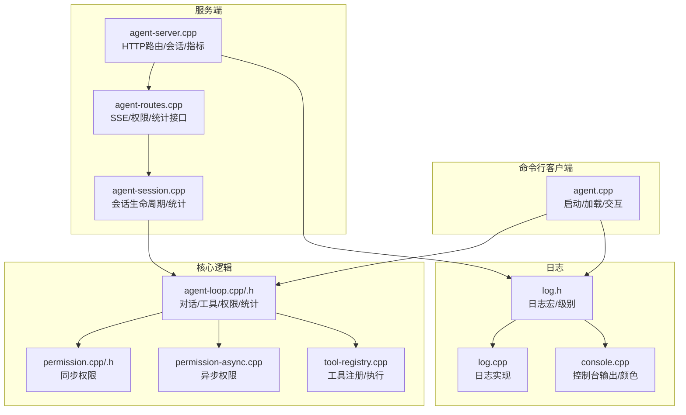
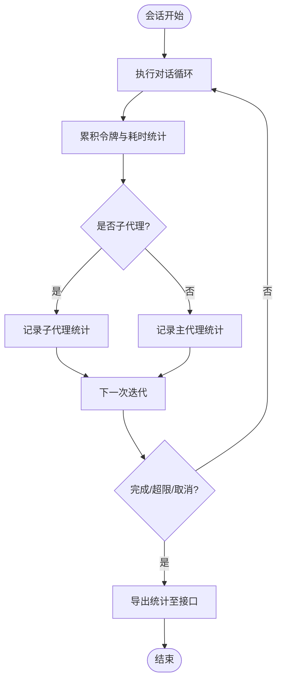
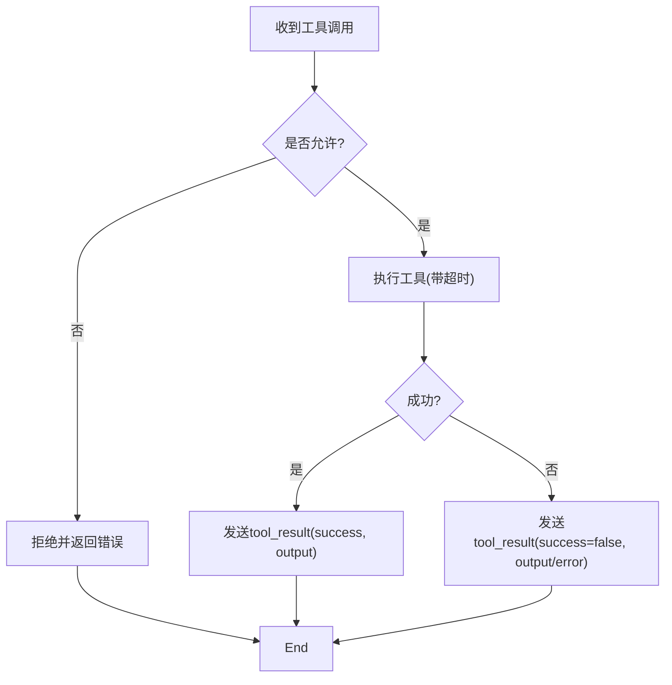
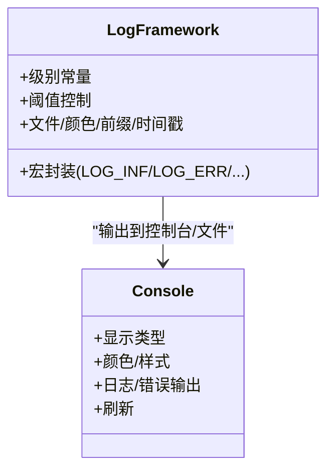
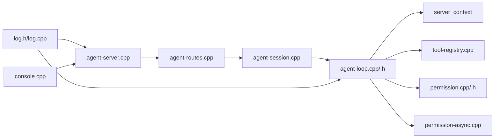

# 监控和日志

<cite>
**本文引用的文件**
- [agent.cpp](file://agent/agent.cpp)
- [agent-loop.cpp](file://agent/agent-loop.cpp)
- [agent-loop.h](file://agent/agent-loop.h)
- [permission.cpp](file://agent/permission.cpp)
- [permission-async.cpp](file://agent/permission-async.cpp)
- [permission.h](file://agent/permission.h)
- [tool-registry.cpp](file://agent/tool-registry.cpp)
- [agent-server.cpp](file://agent/server/agent-server.cpp)
- [agent-session.cpp](file://agent/server/agent-session.cpp)
- [agent-routes.cpp](file://agent/server/agent-routes.cpp)
- [log.h](file://third_party/llama.cpp/common/log.h)
- [log.cpp](file://third_party/llama.cpp/common/log.cpp)
- [console.cpp](file://third_party/llama.cpp/common/console.cpp)
</cite>

## 目录
1. [简介](#简介)
2. [项目结构](#项目结构)
3. [核心组件](#核心组件)
4. [架构总览](#架构总览)
5. [详细组件分析](#详细组件分析)
6. [依赖关系分析](#依赖关系分析)
7. [性能考量](#性能考量)
8. [故障排查指南](#故障排查指南)
9. [结论](#结论)
10. [附录](#附录)

## 简介
本指南面向运维与开发团队，围绕 llama.cpp-agent 的监控与日志体系，提供系统化的监控指标、日志记录策略、性能监控工具、告警机制与故障定位方法。内容覆盖代理系统运行状态、工具执行、权限控制、会话管理等关键维度，并给出可操作的监控仪表板配置建议、告警规则与性能基线建立思路。

## 项目结构
- 命令行客户端：负责加载模型、启动推理线程、加载技能与 AGENTS.md、初始化 MCP 工具、进入交互循环或单次处理模式。
- 服务端：提供 HTTP API（含 SSE 流式事件）、会话管理、权限异步处理、统计信息查询、健康检查与指标导出。
- 权限与工具：统一注册与执行工具，内置权限检查与危险命令识别；支持异步权限请求与响应。
- 日志与控制台：基于通用日志框架输出调试/信息/警告/错误级别日志，支持阈值控制、颜色、前缀与时间戳。



图表来源
- [agent.cpp:101-584](file://agent/agent.cpp#L101-L584)
- [agent-server.cpp:105-730](file://agent/server/agent-server.cpp#L105-L730)
- [agent-routes.cpp:1-494](file://agent/server/agent-routes.cpp#L1-L494)
- [agent-session.cpp:1-348](file://agent/server/agent-session.cpp#L1-L348)
- [agent-loop.cpp:1-800](file://agent/agent-loop.cpp#L1-L800)
- [agent-loop.h:1-276](file://agent/agent-loop.h#L1-L276)
- [permission.cpp:1-310](file://agent/permission.cpp#L1-L310)
- [permission-async.cpp:1-283](file://agent/permission-async.cpp#L1-L283)
- [tool-registry.cpp:1-86](file://agent/tool-registry.cpp#L1-L86)
- [log.h:1-120](file://third_party/llama.cpp/common/log.h#L1-L120)
- [log.cpp:415-446](file://third_party/llama.cpp/common/log.cpp#L415-L446)
- [console.cpp:1124-1165](file://third_party/llama.cpp/common/console.cpp#L1124-L1165)

章节来源
- [agent.cpp:101-584](file://agent/agent.cpp#L101-L584)
- [agent-server.cpp:105-730](file://agent/server/agent-server.cpp#L105-L730)

## 核心组件
- 会话管理与统计
  - 会话信息包含状态、创建时间、最后活动时间、消息数与统计指标（输入/输出/缓存令牌、提示/生成耗时）。
  - 支持清理空闲会话、查询会话列表与单个会话详情。
- 权限控制
  - 同步权限：交互式阻塞式确认，支持危险命令识别、外部目录访问检测、重复调用检测。
  - 异步权限：非阻塞权限请求，通过 SSE 事件通知前端，支持一次性/会话级/永久级响应。
- 工具执行
  - 工具注册表统一管理工具定义与参数 Schema，按需过滤 Bash 命令白名单，执行超时控制。
- 日志与控制台
  - 统一日志级别与阈值控制，支持颜色、前缀、时间戳、文件输出与刷新。
  - 控制台输出支持不同显示类型（用户输入、推理内容、错误等），便于终端交互。

章节来源
- [agent-session.cpp:91-256](file://agent/server/agent-session.cpp#L91-L256)
- [agent-loop.h:68-162](file://agent/agent-loop.h#L68-L162)
- [permission.cpp:34-140](file://agent/permission.cpp#L34-L140)
- [permission-async.cpp:10-178](file://agent/permission-async.cpp#L10-L178)
- [tool-registry.cpp:11-86](file://agent/tool-registry.cpp#L11-L86)
- [log.h:24-120](file://third_party/llama.cpp/common/log.h#L24-L120)
- [console.cpp:1124-1165](file://third_party/llama.cpp/common/console.cpp#L1124-L1165)

## 架构总览
下图展示从 HTTP 请求到会话执行、工具调用与权限处理的端到端流程，以及事件流式输出与统计上报路径。

```mermaid
sequenceDiagram
participant Client as "客户端"
participant Routes as "agent-routes.cpp"
participant Session as "agent-session.cpp"
participant Loop as "agent-loop.cpp/.h"
participant Perm as "permission.cpp/.h"
participant PermAsync as "permission-async.cpp"
participant Tools as "tool-registry.cpp"
Client->>Routes : POST /v1/agent/session/ : id/chat
Routes->>Session : send_message_multimodal(user_message, callback)
Session->>Loop : run_streaming_multimodal(..., async_perms)
Loop->>Loop : generate_completion_streaming(...)
alt 需要工具调用
Loop->>Tools : execute(name, args)
opt 需要权限
Loop->>PermAsync : request_permission(...)
PermAsync-->>Loop : request_id
Loop-->>Client : event(permission_required)
Client->>Routes : POST /v1/agent/permission/ : id
Routes->>Session : respond_permission(...)
Session->>PermAsync : respond(...)
PermAsync-->>Loop : 唤醒等待
end
Loop-->>Client : event(tool_start/tool_result)
end
Loop-->>Client : event(completed/error)
Client->>Routes : GET /v1/agent/session/ : id/stats
Routes->>Session : get_stats()
Session-->>Routes : session_stats
Routes-->>Client : 统计数据
```

图表来源
- [agent-routes.cpp:200-400](file://agent/server/agent-routes.cpp#L200-L400)
- [agent-session.cpp:103-211](file://agent/server/agent-session.cpp#L103-L211)
- [agent-loop.cpp:230-480](file://agent/agent-loop.cpp#L230-L480)
- [agent-loop.h:190-244](file://agent/agent-loop.h#L190-L244)
- [permission-async.cpp:124-178](file://agent/permission-async.cpp#L124-L178)
- [tool-registry.cpp:49-86](file://agent/tool-registry.cpp#L49-L86)

## 详细组件分析

### 会话与统计（agent-session/agent-server）
- 关键指标
  - 输入/输出/缓存令牌总量与平均速度
  - 提示阶段与生成阶段累计耗时
  - 子代理运行次数与对应令牌消耗
- 运维要点
  - 定期清理长时间空闲会话，避免资源泄露。
  - 对外暴露 /v1/agent/session/:id/stats 接口，便于仪表板聚合。
  - 模型切换或重启后，统计在内存中重置，需结合持久化存储或外部指标系统。



图表来源
- [agent-session.cpp:103-211](file://agent/server/agent-session.cpp#L103-L211)
- [agent-loop.cpp:715-787](file://agent/agent-loop.cpp#L715-L787)
- [agent-loop.h:68-81](file://agent/agent-loop.h#L68-L81)

章节来源
- [agent-session.cpp:91-256](file://agent/server/agent-session.cpp#L91-L256)
- [agent-server.cpp:303-350](file://agent/server/agent-server.cpp#L303-L350)

### 权限控制（同步与异步）
- 同步权限（交互式）
  - 危险命令白名单/黑名单匹配、外部目录访问检测、重复调用检测。
  - 用户选择“允许/拒绝/总是/永不”，支持会话内记忆。
- 异步权限（SSE）
  - 发起权限请求并返回 request_id；前端轮询 /v1/agent/session/:id/permissions 获取待决请求。
  - 前端通过 /v1/agent/permission/:id 回答，支持一次性/会话级/永久级作用域。

```mermaid
sequenceDiagram
participant Loop as "agent-loop.cpp"
participant PermAsync as "permission-async.cpp"
participant Routes as "agent-routes.cpp"
participant Client as "客户端"
Loop->>PermAsync : request_permission(request)
PermAsync-->>Loop : request_id
Loop-->>Client : event(permission_required){request_id,...}
Client->>Routes : GET /v1/agent/session/ : id/permissions
Routes-->>Client : 待决权限列表
Client->>Routes : POST /v1/agent/permission/ : id {allow, scope}
Routes->>PermAsync : respond(request_id, allowed, scope)
PermAsync-->>Loop : 唤醒等待
Loop-->>Client : event(permission_resolved)
```

图表来源
- [agent-loop.cpp:240-244](file://agent/agent-loop.cpp#L240-L244)
- [permission-async.cpp:124-178](file://agent/permission-async.cpp#L124-L178)
- [agent-routes.cpp:364-408](file://agent/server/agent-routes.cpp#L364-L408)

章节来源
- [permission.cpp:34-140](file://agent/permission.cpp#L34-L140)
- [permission-async.cpp:10-178](file://agent/permission-async.cpp#L10-L178)
- [agent-routes.cpp:364-408](file://agent/server/agent-routes.cpp#L364-L408)

### 工具执行与超时
- 工具注册与过滤：根据会话配置过滤 Bash 命令白名单，防止只读模式下的破坏性操作。
- 执行与超时：每个工具执行带超时控制，超时或异常均以事件形式反馈给前端。
- 输出截断：长输出在终端与事件中进行截断，避免过载。



图表来源
- [tool-registry.cpp:62-86](file://agent/tool-registry.cpp#L62-L86)
- [agent-loop.cpp:607-666](file://agent/agent-loop.cpp#L607-L666)

章节来源
- [tool-registry.cpp:11-86](file://agent/tool-registry.cpp#L11-L86)
- [agent-loop.cpp:482-666](file://agent/agent-loop.cpp#L482-L666)

### 日志与控制台
- 日志级别与阈值
  - 支持 DEBUG/INFO/WARN/ERROR/OUTPUT 级别，可通过阈值控制抑制冗余日志。
  - 默认在启动时设置阈值，部分阶段提升阈值以打印内存分解信息。
- 控制台输出
  - 不同显示类型（用户输入、推理内容、错误等）使用不同颜色与样式，便于终端交互。
- 日志格式与轮转
  - 可启用前缀与时间戳，支持输出到文件；建议结合系统日志轮转策略（如 logrotate）实现长期留存与压缩。



图表来源
- [log.h:24-120](file://third_party/llama.cpp/common/log.h#L24-L120)
- [log.cpp:415-446](file://third_party/llama.cpp/common/log.cpp#L415-L446)
- [console.cpp:1124-1165](file://third_party/llama.cpp/common/console.cpp#L1124-L1165)

章节来源
- [log.h:24-120](file://third_party/llama.cpp/common/log.h#L24-L120)
- [log.cpp:415-446](file://third_party/llama.cpp/common/log.cpp#L415-L446)
- [console.cpp:1124-1165](file://third_party/llama.cpp/common/console.cpp#L1124-L1165)
- [agent.cpp:223-224](file://agent/agent.cpp#L223-L224)
- [agent-server.cpp:238-246](file://agent/server/agent-server.cpp#L238-L246)

## 依赖关系分析
- 组件耦合
  - agent-loop 依赖 server_context、tool-registry、permission 系列与会话上下文。
  - agent-session 封装 agent-loop 并提供并发安全与异步权限桥接。
  - agent-routes 负责 HTTP/SSE 与权限接口，协调会话与事件流。
- 外部依赖
  - 第三方 llama.cpp 日志与控制台框架提供统一日志能力。
- 潜在风险
  - 权限异步队列与会话清理需配合超时与取消信号，避免悬挂请求。
  - 工具执行超时与输出截断需在前端与后端协同处理，确保事件完整性。



图表来源
- [agent-loop.cpp:1-800](file://agent/agent-loop.cpp#L1-L800)
- [agent-session.cpp:1-348](file://agent/server/agent-session.cpp#L1-L348)
- [agent-routes.cpp:1-494](file://agent/server/agent-routes.cpp#L1-L494)
- [agent-server.cpp:105-730](file://agent/server/agent-server.cpp#L105-L730)
- [log.h:1-120](file://third_party/llama.cpp/common/log.h#L1-L120)
- [log.cpp:415-446](file://third_party/llama.cpp/common/log.cpp#L415-L446)
- [console.cpp:1124-1165](file://third_party/llama.cpp/common/console.cpp#L1124-L1165)

章节来源
- [agent-loop.cpp:1-800](file://agent/agent-loop.cpp#L1-L800)
- [agent-session.cpp:1-348](file://agent/server/agent-session.cpp#L1-L348)
- [agent-routes.cpp:1-494](file://agent/server/agent-routes.cpp#L1-L494)
- [agent-server.cpp:105-730](file://agent/server/agent-server.cpp#L105-L730)

## 性能考量
- 令牌与吞吐
  - 通过 session_stats 中的 total_input、total_output、total_prompt_ms、total_predicted_ms 计算平均速度与吞吐。
  - 生成阶段吞吐受批大小、线程数与硬件影响，建议在部署环境固定参数并建立基线。
- 延迟与中断
  - 交互式 ESC 中断与用户取消标志应与前端轮询结合，避免无效等待。
- 工具执行
  - 为高风险工具设置更短超时，避免阻塞对话循环。
- 日志开销
  - 在生产环境提高日志阈值，关闭不必要的前缀与时间戳，减少 IO 压力。

## 故障排查指南
- 健康检查
  - 使用 /health 或 /v1/health 快速判断服务可用性。
- 权限问题
  - 若出现频繁 permission_required 事件，检查会话配置中的 allowed_tools 与 bash 白名单。
  - 确认前端已正确回答权限请求，否则会话可能长时间处于 WAITING_PERMISSION。
- 工具失败
  - 查看 tool_result 事件中的 success 与 output/error 字段，结合工具超时与输出截断策略定位问题。
- 会话堆积
  - 使用 /v1/agent/sessions 列表与 /v1/agent/session/:id 查询状态，必要时清理空闲会话。
- 日志定位
  - 提升日志阈值到 DEBUG，开启时间戳与前缀，结合系统日志轮转定位异常。

章节来源
- [agent-server.cpp:303-350](file://agent/server/agent-server.cpp#L303-L350)
- [agent-routes.cpp:364-408](file://agent/server/agent-routes.cpp#L364-L408)
- [agent-session.cpp:333-347](file://agent/server/agent-session.cpp#L333-L347)
- [log.h:69-81](file://third_party/llama.cpp/common/log.h#L69-L81)

## 结论
本指南梳理了 llama.cpp-agent 的监控与日志体系，明确了会话统计、权限控制、工具执行与日志输出的关键路径。建议在生产环境中：
- 建立统一的日志阈值与格式规范，结合系统日志轮转；
- 通过 SSE 事件与会话统计接口构建可视化仪表板；
- 设定权限与工具超时基线，完善告警规则；
- 规范故障排查流程，确保快速定位与恢复。

## 附录

### 监控指标清单（建议）
- 会话层
  - 活跃会话数、会话创建/销毁速率、平均消息数、空闲会话清理数
- 令牌与吞吐
  - 输入/输出/缓存令牌总量、平均速度（tok/s）、提示/生成耗时分布
- 权限层
  - 权限请求总数、拒绝率、会话内“总是”授权比例、重复调用检测触发次数
- 工具层
  - 工具调用次数与成功率、平均执行时延、超时次数、输出长度分布
- 系统层
  - CPU/内存/GPU 使用率、HTTP 请求延迟与错误率、SSE 连接数

### 日志级别与格式规范
- 级别映射
  - DEBUG/INFO/WARN/ERROR/OUTPUT 分别对应不同阈值与输出通道。
- 建议格式
  - 时间戳 + 级别 + 模块 + 内容；可选前缀与颜色（仅终端）。
- 轮转策略
  - 建议按天/大小轮转，保留 7–14 天历史，压缩旧日志。

### 告警规则建议
- 会话异常
  - 空闲会话未清理、权限请求长期挂起、工具超时率上升
- 性能退化
  - 平均生成时延超过基线 30%、吞吐下降、缓存命中率异常
- 系统异常
  - /health 不可用、HTTP 5xx 比例升高、日志 ERROR 突增