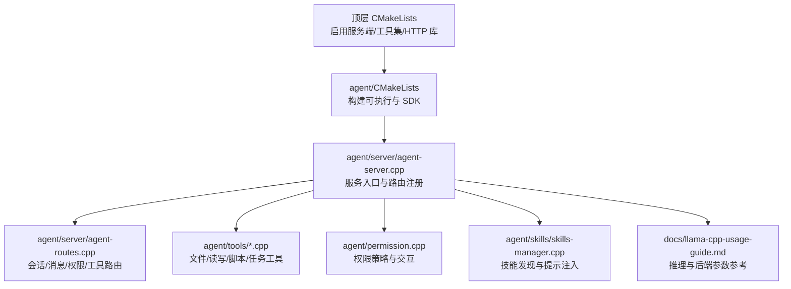
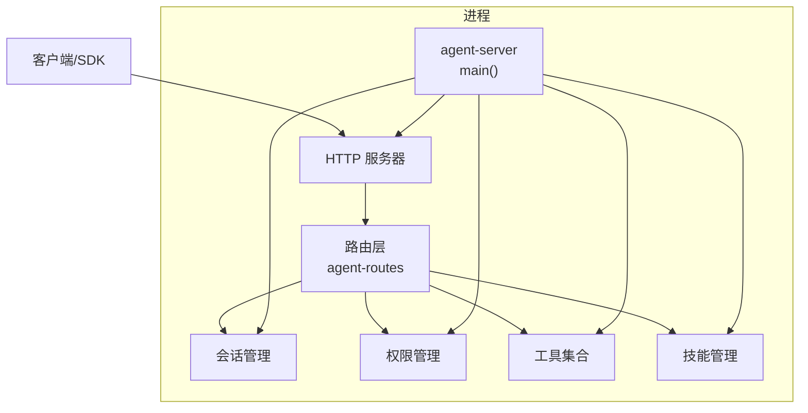
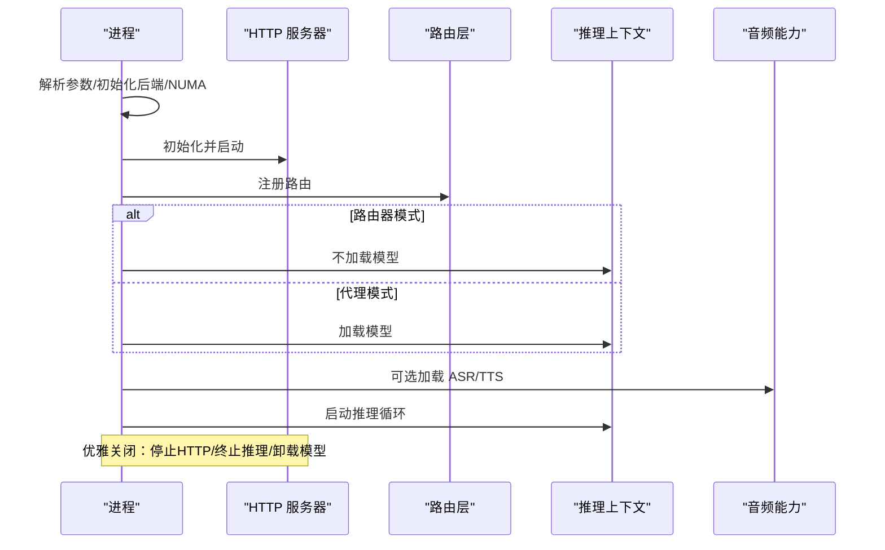
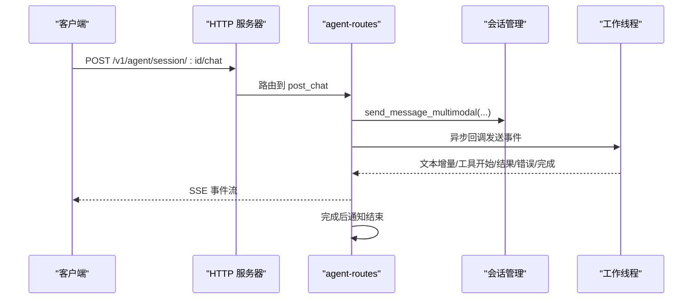
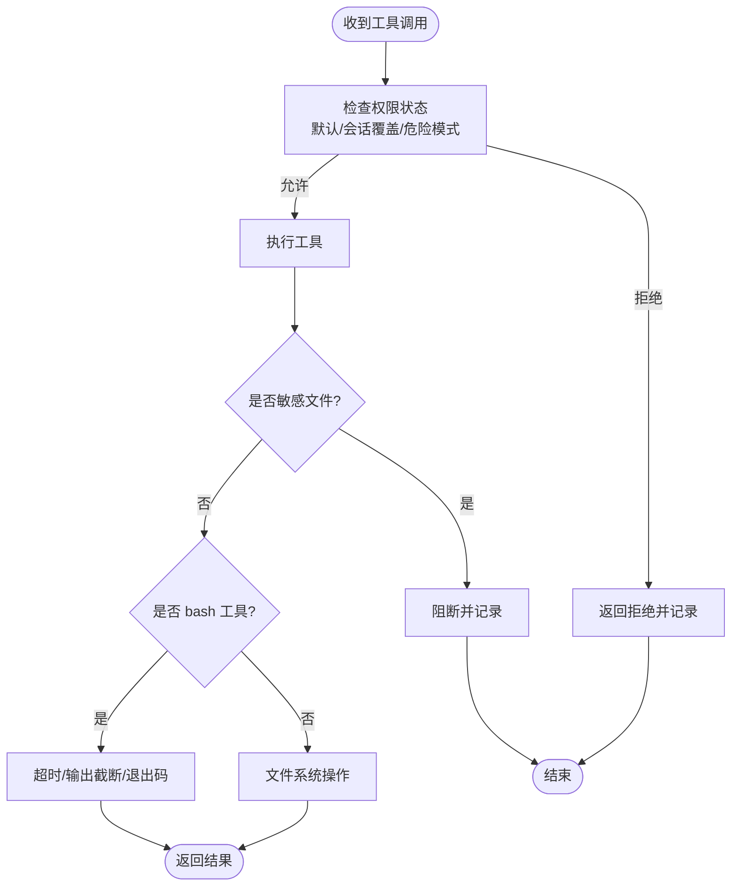
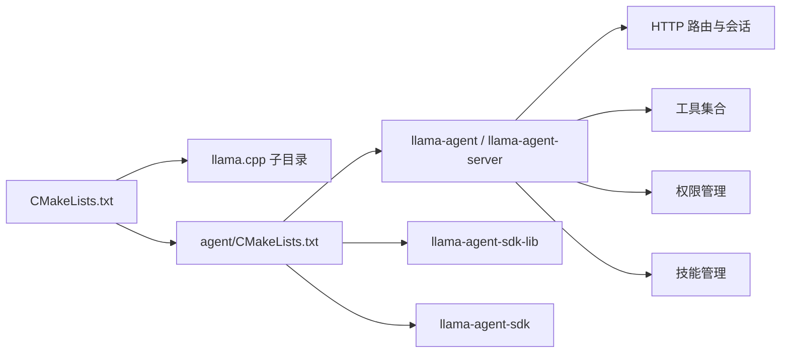

# 部署和运维

<cite>
**本文引用的文件**   
- [CMakeLists.txt](file://CMakeLists.txt)
- [agent/CMakeLists.txt](file://agent/CMakeLists.txt)
- [agent/server/agent-server.cpp](file://agent/server/agent-server.cpp)
- [agent/server/agent-routes.cpp](file://agent/server/agent-routes.cpp)
- [agent/tools/tool-bash.cpp](file://agent/tools/tool-bash.cpp)
- [agent/tools/tool-read.cpp](file://agent/tools/tool-read.cpp)
- [agent/tools/tool-write.cpp](file://agent/tools/tool-write.cpp)
- [agent/permission.cpp](file://agent/permission.cpp)
- [agent/skills/skills-manager.cpp](file://agent/skills/skills-manager.cpp)
- [agent/tools/tool-task.cpp](file://agent/tools/tool-task.cpp)
- [SDKs/go/go.mod](file://SDKs/go/go.mod)
- [SDKs/python/pyproject.toml](file://SDKs/python/pyproject.toml)
- [SDKs/java/pom.xml](file://SDKs/java/pom.xml)
- [docs/llama-cpp-usage-guide.md](file://docs/llama-cpp-usage-guide.md)
</cite>

## 目录
1. [简介](#简介)
2. [项目结构](#项目结构)
3. [核心组件](#核心组件)
4. [架构总览](#架构总览)
5. [详细组件分析](#详细组件分析)
6. [依赖分析](#依赖分析)
7. [性能考虑](#性能考虑)
8. [故障排除指南](#故障排除指南)
9. [结论](#结论)
10. [附录](#附录)

## 简介
本文件面向生产环境的部署与运维，围绕 llama.cpp-agent 的可执行程序与服务端能力，系统性阐述部署架构、资源配置、性能优化、监控与日志、故障排查、备份恢复与安全加固等运维主题。内容结合源码中服务器启动流程、HTTP 路由、会话管理、权限控制、工具链与子代理任务等模块，提供可操作的运维建议与最佳实践。

## 项目结构
该项目采用 CMake 构建，顶层 CMakeLists 负责启用 llama.cpp 的服务端与工具集，并根据平台条件选择 CUDA 后端；agent 子目录构建可执行程序与 SDK 库。服务端入口位于 agent/server/agent-server.cpp，提供 OpenAI 兼容接口与会话管理、权限控制、工具调用、音频能力等。

图表来源
- [CMakeLists.txt:1-44](file://CMakeLists.txt#L1-L44)
- [agent/CMakeLists.txt:1-209](file://agent/CMakeLists.txt#L1-L209)
- [agent/server/agent-server.cpp:105-731](file://agent/server/agent-server.cpp#L105-L731)
- [agent/server/agent-routes.cpp:104-494](file://agent/server/agent-routes.cpp#L104-L494)
- [docs/llama-cpp-usage-guide.md:18-76](file://docs/llama-cpp-usage-guide.md#L18-L76)

章节来源
- [CMakeLists.txt:1-44](file://CMakeLists.txt#L1-L44)
- [agent/CMakeLists.txt:1-209](file://agent/CMakeLists.txt#L1-L209)

## 核心组件
- 服务入口与生命周期
  - 服务入口解析参数、初始化后端与模型、启动 HTTP 服务、注册路由、初始化音频能力（ASR/TTS）、启动主推理循环与清理流程。
- HTTP 路由与会话
  - 提供健康检查、模型列表、聊天补全、SSE 流式响应、会话管理、权限请求、工具清单、统计等接口。
- 工具与权限
  - 文件读写、脚本执行、任务派生（子代理）等工具；内置敏感文件识别、危险命令模式匹配、交互式权限确认。
- 技能系统
  - 基于目录结构与 Frontmatter 的技能发现与提示注入，支持 XML 包裹的可用技能清单。
- SDK 支持
  - Go/Java/Python SDK 的模块与构建元数据，便于客户端集成。

章节来源
- [agent/server/agent-server.cpp:105-731](file://agent/server/agent-server.cpp#L105-L731)
- [agent/server/agent-routes.cpp:104-494](file://agent/server/agent-routes.cpp#L104-L494)
- [agent/tools/tool-bash.cpp:50-281](file://agent/tools/tool-bash.cpp#L50-L281)
- [agent/tools/tool-read.cpp:17-120](file://agent/tools/tool-read.cpp#L17-L120)
- [agent/tools/tool-write.cpp:10-80](file://agent/tools/tool-write.cpp#L10-L80)
- [agent/permission.cpp:35-310](file://agent/permission.cpp#L35-L310)
- [agent/skills/skills-manager.cpp:96-330](file://agent/skills/skills-manager.cpp#L96-L330)
- [SDKs/go/go.mod:1-4](file://SDKs/go/go.mod#L1-L4)
- [SDKs/python/pyproject.toml:1-16](file://SDKs/python/pyproject.toml#L1-L16)
- [SDKs/java/pom.xml:1-19](file://SDKs/java/pom.xml#L1-L19)

## 架构总览
服务端采用“HTTP 服务器 + 推理上下文 + 会话管理 + 工具与权限”的分层设计。启动时先启动 HTTP 服务以便对外提供 /health 等探活接口，随后加载模型与音频能力，再进入主推理循环。路由层负责将请求分发至会话管理、工具执行与权限决策。

图表来源
- [agent/server/agent-server.cpp:248-731](file://agent/server/agent-server.cpp#L248-L731)
- [agent/server/agent-routes.cpp:475-494](file://agent/server/agent-routes.cpp#L475-L494)

## 详细组件分析

### 服务启动与生命周期
- 关键点
  - 解析参数与子代理深度控制、默认并发与 KV 统一策略设置。
  - 初始化后端、NUMA、HTTP 上下文与路由注册。
  - 路由器模式与代理模式的差异：前者代理到下游模型，后者直接加载本地模型。
  - 音频能力（ASR/TTS）可独立启用，支持语音合成与转录占位。
  - 优雅关闭：信号处理、HTTP 停止、推理上下文终止、模型卸载。
- 运维要点
  - 启动顺序：先 HTTP 再模型，确保 /health 可用。
  - 资源释放：退出路径包含停止 HTTP、终止推理、卸载模型、释放后端。
  - 子代理深度限制：通过参数与运行时配置控制嵌套深度，避免资源耗尽。

图表来源
- [agent/server/agent-server.cpp:218-731](file://agent/server/agent-server.cpp#L218-L731)

章节来源
- [agent/server/agent-server.cpp:105-731](file://agent/server/agent-server.cpp#L105-L731)

### HTTP 路由与会话管理
- 能力概览
  - 健康检查、模型列表、聊天补全、SSE 流式响应、会话创建/查询/删除、消息历史、权限请求与处理、工具清单、统计。
- SSE 流式响应
  - 使用队列与条件变量实现事件流，支持 keep-alive 与完成标记，保证客户端持续接收事件直至完成。
- 运维要点
  - SSE 长连接需配合反向代理（如 Nginx）正确透传头部与超时配置。
  - 会话统计可用于容量规划与成本估算。

图表来源
- [agent/server/agent-routes.cpp:199-348](file://agent/server/agent-routes.cpp#L199-L348)

章节来源
- [agent/server/agent-routes.cpp:104-494](file://agent/server/agent-routes.cpp#L104-L494)

### 工具与权限控制
- 工具
  - bash：跨平台命令执行，支持超时、输出截断、退出码与超时标记。
  - read/write：文件读写，含相对路径解析、父目录创建、敏感文件阻断。
  - task：派生子代理任务，支持同步/后台模式与断点续跑。
- 权限
  - 默认策略：交互式确认、危险命令白名单/黑名单、项目根路径约束、近期调用去抖。
  - 敏感文件识别：对 .env、密钥文件、证书等进行阻断。
- 运维要点
  - 生产环境建议开启权限确认与项目根路径限制，避免越权访问。
  - bash 超时与输出截断防止长时间阻塞与内存膨胀。
  - 对敏感文件与危险命令建立审计与告警。

图表来源
- [agent/tools/tool-bash.cpp:50-281](file://agent/tools/tool-bash.cpp#L50-L281)
- [agent/tools/tool-read.cpp:17-120](file://agent/tools/tool-read.cpp#L17-L120)
- [agent/tools/tool-write.cpp:10-80](file://agent/tools/tool-write.cpp#L10-L80)
- [agent/permission.cpp:108-140](file://agent/permission.cpp#L108-L140)

章节来源
- [agent/tools/tool-bash.cpp:50-281](file://agent/tools/tool-bash.cpp#L50-L281)
- [agent/tools/tool-read.cpp:17-120](file://agent/tools/tool-read.cpp#L17-L120)
- [agent/tools/tool-write.cpp:10-80](file://agent/tools/tool-write.cpp#L10-L80)
- [agent/permission.cpp:35-310](file://agent/permission.cpp#L35-L310)

### 技能系统
- 能力
  - 基于目录与 Frontmatter 的技能发现，生成 XML 格式的可用技能清单，注入到提示模板中。
- 运维要点
  - 技能目录命名与文件结构需符合规范，避免重复与冲突。
  - 生成的 XML 需注意长度限制与特殊字符转义。

章节来源
- [agent/skills/skills-manager.cpp:96-330](file://agent/skills/skills-manager.cpp#L96-L330)

### SDK 支持
- Go/Java/Python 的模块与构建元数据，便于客户端集成 OpenAI 兼容接口与会话管理。
- 运维要点
  - 版本与依赖一致性管理，确保与服务端接口兼容。

章节来源
- [SDKs/go/go.mod:1-4](file://SDKs/go/go.mod#L1-L4)
- [SDKs/python/pyproject.toml:1-16](file://SDKs/python/pyproject.toml#L1-L16)
- [SDKs/java/pom.xml:1-19](file://SDKs/java/pom.xml#L1-L19)

## 依赖分析
- 构建与后端
  - 顶层 CMake 控制是否启用 CUDA、HTTP 库与 llama.cpp 子目录；agent/CMakeLists 决定目标产物（可执行、SDK 库、HTTP 服务）。
- 运行时依赖
  - llama.cpp 推理后端、线程库、平台特定网络库（Windows 下 ws2_32）。
- 第三方音频能力
  - ASR/TTS 模块作为可选功能，需在编译期启用并提供模型路径。

图表来源
- [CMakeLists.txt:30-44](file://CMakeLists.txt#L30-L44)
- [agent/CMakeLists.txt:52-148](file://agent/CMakeLists.txt#L52-L148)

章节来源
- [CMakeLists.txt:1-44](file://CMakeLists.txt#L1-L44)
- [agent/CMakeLists.txt:1-209](file://agent/CMakeLists.txt#L1-L209)

## 性能考虑
- 线程与批处理
  - 通过 n_threads、n_threads_batch、n_ctx、n_batch、n_ubatch 等参数影响吞吐与延迟；合理设置批大小与上下文长度。
- 并发与会话
  - SSE 流式响应与多会话并发需结合反向代理与连接池配置，避免阻塞。
- 后端选择
  - 在支持的平台上启用 CUDA 后端可显著提升吞吐；在容器或受限环境中可回退 CPU。
- 工具与 I/O
  - bash 超时与输出截断、文件读写限制，避免单个工具拖垮整体性能。
- 模型加载
  - 路由器模式与代理模式的模型加载时机不同，需结合业务场景选择。

章节来源
- [agent/server/agent-server.cpp:222-226](file://agent/server/agent-server.cpp#L222-L226)
- [docs/llama-cpp-usage-guide.md:56-76](file://docs/llama-cpp-usage-guide.md#L56-L76)
- [agent/tools/tool-bash.cpp:25-281](file://agent/tools/tool-bash.cpp#L25-L281)

## 故障排除指南
- 启动失败
  - 检查 HTTP 服务初始化与监听地址；查看模型加载日志；确认 CUDA/后端初始化是否成功。
- 会话异常
  - 查看会话统计与事件流是否正常；确认权限请求是否被正确处理。
- 工具执行失败
  - bash：检查超时、输出截断、退出码；read/write：检查路径解析与权限；敏感文件阻断。
- 权限相关
  - 确认默认策略、会话覆盖、危险命令匹配与项目根路径判断。
- 音频能力
  - ASR/TTS 模型加载失败时，检查模型路径与后端支持情况。

章节来源
- [agent/server/agent-server.cpp:519-731](file://agent/server/agent-server.cpp#L519-L731)
- [agent/server/agent-routes.cpp:104-494](file://agent/server/agent-routes.cpp#L104-L494)
- [agent/tools/tool-bash.cpp:50-281](file://agent/tools/tool-bash.cpp#L50-L281)
- [agent/permission.cpp:108-140](file://agent/permission.cpp#L108-L140)

## 结论
llama.cpp-agent 提供了从推理到会话、工具与权限的完整服务端能力。生产部署应重点关注：启动顺序与探活、并发与批处理参数、权限与安全策略、工具执行的超时与截断、以及音频能力的可选启用。通过合理的资源配置与监控告警，可获得稳定且高性能的服务体验。

## 附录

### 部署与运维最佳实践
- 部署架构
  - 单机部署：直接运行可执行文件，结合反向代理暴露 /health 与 /v1/* 接口。
  - 路由器模式：集中管理多个模型实例，通过 /models/load 与代理路由转发。
  - 容器化：打包运行时依赖，固定模型挂载与配置卷，启用健康检查。
- 资源配置
  - 线程与批处理：依据 CPU/内存与 GPU 能力调整 n_threads、n_batch、n_ctx。
  - CUDA：在支持的硬件上启用，避免与 CPU 混用导致资源争用。
- 监控与日志
  - 指标：请求速率、P95/P99 延迟、会话活跃数、工具执行成功率、权限拒绝率。
  - 日志：启动日志、模型加载日志、SSE 事件流、权限交互记录、工具执行摘要。
- 备份与恢复
  - 会话与消息：定期导出会话历史与统计；模型文件与配置独立备份。
  - 快速恢复：预热模型与音频能力，缩短冷启动时间。
- 安全加固
  - 权限策略：默认交互式确认，危险命令黑名单，项目根路径限制。
  - 敏感文件：自动阻断 .env、密钥、证书等文件的读写。
  - 网络安全：反向代理启用 TLS、限流与超时、访问控制。

### 配置与参数参考
- 启动参数与环境变量
  - 子代理深度控制、ASR/TTS 模型路径、路由器端口监听等。
- llama.cpp 参数
  - 模型加载参数、上下文参数、采样器参数等，详见文档。

章节来源
- [agent/server/agent-server.cpp:109-213](file://agent/server/agent-server.cpp#L109-L213)
- [docs/llama-cpp-usage-guide.md:39-76](file://docs/llama-cpp-usage-guide.md#L39-L76)