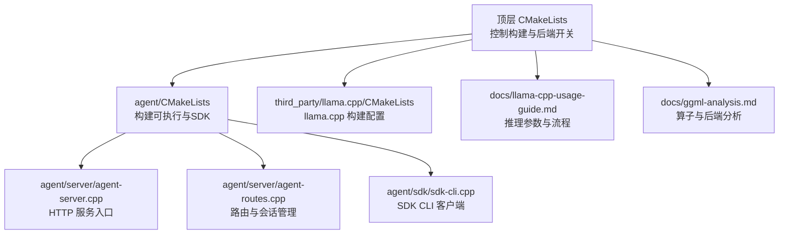
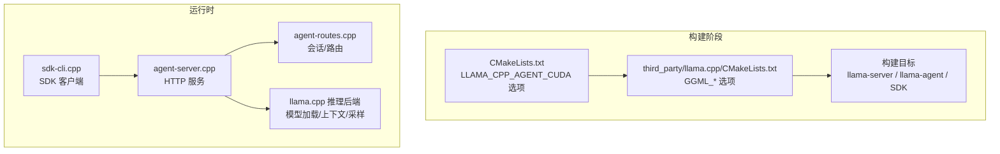
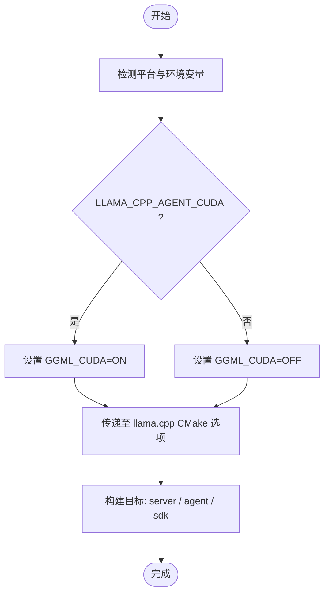
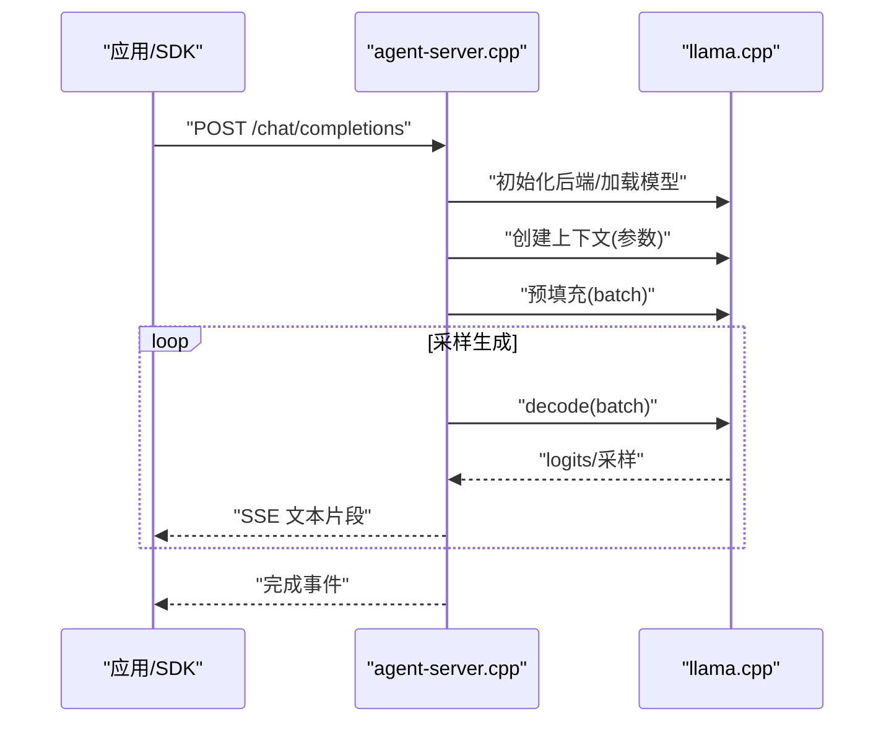
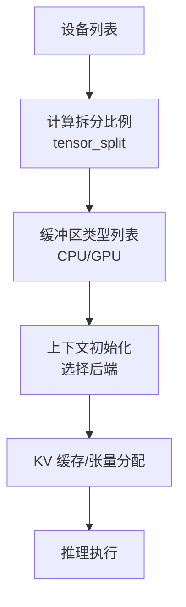
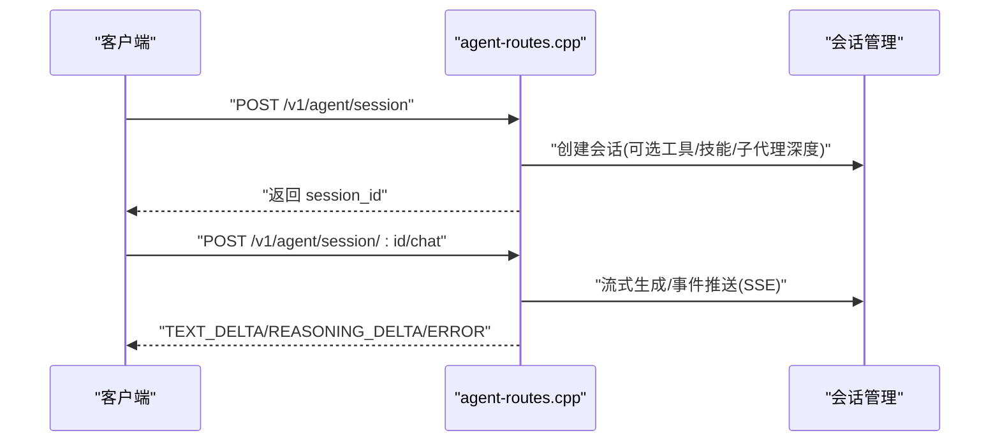
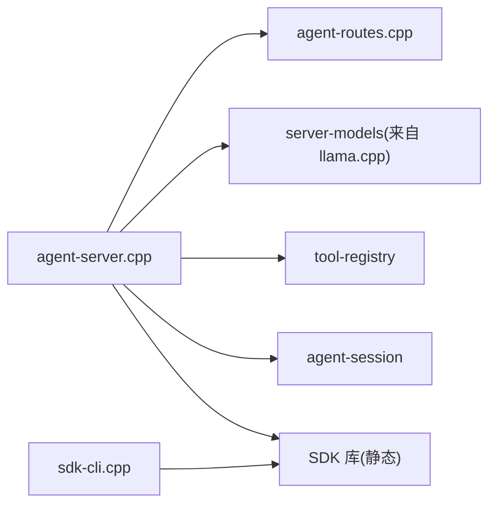

# 部署配置

<cite>
**本文引用的文件**
- [CMakeLists.txt](file://CMakeLists.txt)
- [agent/CMakeLists.txt](file://agent/CMakeLists.txt)
- [third_party/llama.cpp/CMakeLists.txt](file://third_party/llama.cpp/CMakeLists.txt)
- [docs/llama-cpp-usage-guide.md](file://docs/llama-cpp-usage-guide.md)
- [docs/ggml-analysis.md](file://docs/ggml-analysis.md)
- [agent/server/agent-server.cpp](file://agent/server/agent-server.cpp)
- [agent/server/agent-routes.cpp](file://agent/server/agent-routes.cpp)
- [agent/sdk/sdk-cli.cpp](file://agent/sdk/sdk-cli.cpp)
- [agent/mcp/mcp-server-manager.cpp](file://agent/mcp/mcp-server-manager.cpp)
- [third_party/llama.cpp/common/common.h](file://third_party/llama.cpp/common/common.h)
- [third_party/llama.cpp/common/preset.cpp](file://third_party/llama.cpp/common/preset.cpp)
- [third_party/llama.cpp/ci/run.sh](file://third_party/llama.cpp/ci/run.sh)
- [third_party/llama.cpp/ggml/src/ggml-cuda/ggml-cuda.cu](file://third_party/llama.cpp/ggml/src/ggml-cuda/ggml-cuda.cu)
- [third_party/llama.cpp/ggml/src/ggml-cpu/ggml-cpu.c](file://third_party/llama.cpp/ggml/src/ggml-cpu/ggml-cpu.c)
- [third_party/llama.cpp/src/llama-model.cpp](file://third_party/llama.cpp/src/llama-model.cpp)
</cite>

## 目录
1. [简介](#简介)
2. [项目结构](#项目结构)
3. [核心组件](#核心组件)
4. [架构总览](#架构总览)
5. [详细组件分析](#详细组件分析)
6. [依赖分析](#依赖分析)
7. [性能考虑](#性能考虑)
8. [故障排查指南](#故障排查指南)
9. [结论](#结论)
10. [附录](#附录)

## 简介
本指南面向生产环境部署，围绕 llama.cpp-agent 的构建、运行时配置、模型加载参数、GPU/CPU 优化、内存管理、以及不同部署场景（单机、集群、容器化）提供系统化的配置说明与验证方法。内容覆盖 CMake 构建选项、llama.cpp 推理参数、后端选择与优化、环境变量与服务启动脚本，并给出常见问题的定位与修复建议。

## 项目结构
该项目采用 CMake 多模块组织，主工程通过顶层 CMakeLists 控制 llama.cpp 子模块的集成与编译选项；agent 子目录负责可执行程序与 SDK 的构建；docs 提供 llama.cpp 使用与算子分析文档；third_party 包含第三方依赖（如 qwen3-asr/tts）。

**图表来源**
- [CMakeLists.txt:1-44](file://CMakeLists.txt#L1-L44)
- [agent/CMakeLists.txt:1-209](file://agent/CMakeLists.txt#L1-L209)
- [third_party/llama.cpp/CMakeLists.txt:1-286](file://third_party/llama.cpp/CMakeLists.txt#L1-L286)

**章节来源**
- [CMakeLists.txt:1-44](file://CMakeLists.txt#L1-L44)
- [agent/CMakeLists.txt:1-209](file://agent/CMakeLists.txt#L1-L209)
- [third_party/llama.cpp/CMakeLists.txt:1-286](file://third_party/llama.cpp/CMakeLists.txt#L1-L286)

## 核心组件
- 构建系统与后端开关
  - 顶层 CMakeLists 通过选项控制是否启用 CUDA 后端，并传递给 llama.cpp 子模块。
  - agent/CMakeLists 决定目标产物（可执行、静态库、SDK CLI），并链接 server-context、common 等依赖。
- 服务端
  - agent-server.cpp 提供 HTTP API、健康检查、会话管理、代理路由、ASR/TTS 端点，支持 MCP 工具集成。
  - agent-routes.cpp 实现 SSE 流式响应、会话生命周期管理、权限控制等。
- SDK 客户端
  - sdk-cli.cpp 提供命令行交互，支持流式/非流式输出、工具开关、工作目录等。
- 文档与参考
  - llama-cpp-usage-guide.md 与 ggml-analysis.md 提供模型加载参数、上下文参数、算子映射与后端架构等关键信息。

**章节来源**
- [CMakeLists.txt:11-28](file://CMakeLists.txt#L11-L28)
- [agent/CMakeLists.txt:52-61](file://agent/CMakeLists.txt#L52-L61)
- [agent/server/agent-server.cpp:105-731](file://agent/server/agent-server.cpp#L105-L731)
- [agent/server/agent-routes.cpp:104-200](file://agent/server/agent-routes.cpp#L104-L200)
- [agent/sdk/sdk-cli.cpp:62-157](file://agent/sdk/sdk-cli.cpp#L62-L157)
- [docs/llama-cpp-usage-guide.md:14-76](file://docs/llama-cpp-usage-guide.md#L14-L76)
- [docs/ggml-analysis.md:537-596](file://docs/ggml-analysis.md#L537-L596)

## 架构总览
下图展示从构建到运行的关键路径：CMake 选项驱动后端选择，llama.cpp 提供推理后端与模型加载能力，agent-server 提供 HTTP API 与会话管理，SDK 客户端通过 HTTP 与服务交互。

**图表来源**
- [CMakeLists.txt:11-28](file://CMakeLists.txt#L11-L28)
- [third_party/llama.cpp/CMakeLists.txt:90-112](file://third_party/llama.cpp/CMakeLists.txt#L90-L112)
- [agent/server/agent-server.cpp:234-253](file://agent/server/agent-server.cpp#L234-L253)
- [agent/server/agent-routes.cpp:104-200](file://agent/server/agent-routes.cpp#L104-L200)
- [agent/sdk/sdk-cli.cpp:90-102](file://agent/sdk/sdk-cli.cpp#L90-L102)

## 详细组件分析

### 构建与编译选项
- CUDA 后端控制
  - 顶层 CMakeLists 提供 LLAMA_CPP_AGENT_CUDA 选项，默认根据平台自动判定；可通过环境变量强制开启。
  - 该选项会同步影响 GGML 的 CUDA 开关，决定是否启用 CUDA 后端。
- llama.cpp 子模块
  - 通过 LLAMA_BUILD_SERVER、LLAMA_BUILD_TOOLS、LLAMA_HTTPLIB 等选项控制工具与服务器示例的构建。
  - 第三方 qwen3-asr/tts 源码作为可选组件被集成到服务端目标中。
- 平台与工具链
  - CI 脚本展示了如何在不同后端（CUDA/Metal/ROCm）下设置 CMake 参数与 GPU 架构。

**图表来源**
- [CMakeLists.txt:11-28](file://CMakeLists.txt#L11-L28)
- [third_party/llama.cpp/CMakeLists.txt:104-112](file://third_party/llama.cpp/CMakeLists.txt#L104-L112)
- [third_party/llama.cpp/ci/run.sh:60-97](file://third_party/llama.cpp/ci/run.sh#L60-L97)

**章节来源**
- [CMakeLists.txt:11-28](file://CMakeLists.txt#L11-L28)
- [agent/CMakeLists.txt:63-148](file://agent/CMakeLists.txt#L63-L148)
- [third_party/llama.cpp/CMakeLists.txt:104-112](file://third_party/llama.cpp/CMakeLists.txt#L104-L112)
- [third_party/llama.cpp/ci/run.sh:60-97](file://third_party/llama.cpp/ci/run.sh#L60-L97)

### 模型加载与推理参数
- 模型加载参数
  - 关键字段包括 n_gpu_layers、split_mode、main_gpu、tensor_split、use_mmap/use_mlock、check_tensors 等。
- 上下文参数
  - n_ctx、n_batch、n_ubatch、n_seq_max、n_threads/n_threads_batch、rope_scaling_type、pooling_type、attention_type、flash_attn_type、embeddings、offload_kqv 等。
- 推理流程
  - 初始化后端、加载模型、创建上下文、分词、预填充、采样循环、生成文本、清理资源。

**图表来源**
- [docs/llama-cpp-usage-guide.md:39-76](file://docs/llama-cpp-usage-guide.md#L39-L76)
- [docs/llama-cpp-usage-guide.md:80-184](file://docs/llama-cpp-usage-guide.md#L80-L184)
- [agent/server/agent-server.cpp:234-253](file://agent/server/agent-server.cpp#L234-L253)

**章节来源**
- [docs/llama-cpp-usage-guide.md:39-76](file://docs/llama-cpp-usage-guide.md#L39-L76)
- [docs/llama-cpp-usage-guide.md:80-184](file://docs/llama-cpp-usage-guide.md#L80-L184)

### GPU/CPU 优化与内存配置
- 后端选择
  - CUDA：通过 GGML_CUDA=ON 启用；支持多卡张量拆分与主 GPU 设置。
  - CPU：默认后端，支持 NUMA 亲和与线程亲和设置。
- 张量拆分与缓冲区
  - 多 GPU 场景下，tensor_split 与 split_mode 决定张量在设备间的分配策略。
- 线程与 NUMA
  - CPU 线程亲和与 NUMA 绑定有助于降低跨 NUMA 带来的性能损耗。

**图表来源**
- [third_party/llama.cpp/src/llama-model.cpp:2599-2622](file://third_party/llama.cpp/src/llama-model.cpp#L2599-L2622)
- [third_party/llama.cpp/ggml/src/ggml-cuda/ggml-cuda.cu:1083-1113](file://third_party/llama.cpp/ggml/src/ggml-cuda/ggml-cuda.cu#L1083-L1113)
- [third_party/llama.cpp/ggml/src/ggml-cpu/ggml-cpu.c:2140-2182](file://third_party/llama.cpp/ggml/src/ggml-cpu/ggml-cpu.c#L2140-L2182)

**章节来源**
- [third_party/llama.cpp/src/llama-model.cpp:2599-2622](file://third_party/llama.cpp/src/llama-model.cpp#L2599-L2622)
- [third_party/llama.cpp/ggml/src/ggml-cuda/ggml-cuda.cu:1083-1113](file://third_party/llama.cpp/ggml/src/ggml-cuda/ggml-cuda.cu#L1083-L1113)
- [third_party/llama.cpp/ggml/src/ggml-cpu/ggml-cpu.c:2140-2182](file://third_party/llama.cpp/ggml/src/ggml-cpu/ggml-cpu.c#L2140-L2182)

### 服务端配置与路由
- HTTP 服务
  - 支持健康检查、OpenAI 兼容端点、代理路由、会话管理、工具列表、音频服务（ASR/TTS）等。
- SSE 流式响应
  - 使用队列与条件变量实现事件流推送，确保客户端持续接收增量输出。
- MCP 工具集成
  - 支持从本地或用户目录加载 mcp.json，解析环境变量占位符并注册工具。

**图表来源**
- [agent/server/agent-routes.cpp:104-200](file://agent/server/agent-routes.cpp#L104-L200)
- [agent/server/agent-routes.cpp:36-102](file://agent/server/agent-routes.cpp#L36-L102)
- [agent/mcp/mcp-server-manager.cpp:209-244](file://agent/mcp/mcp-server-manager.cpp#L209-L244)

**章节来源**
- [agent/server/agent-server.cpp:303-426](file://agent/server/agent-server.cpp#L303-L426)
- [agent/server/agent-routes.cpp:104-200](file://agent/server/agent-routes.cpp#L104-L200)
- [agent/mcp/mcp-server-manager.cpp:209-244](file://agent/mcp/mcp-server-manager.cpp#L209-L244)

### SDK 客户端配置
- 命令行参数
  - --url、--model、--prompt、--working-dir、--yolo、--no-stream、--no-skills、--no-agents-md、--no-mcp。
- 交互行为
  - 支持权限请求确认、错误事件处理、流式/非流式输出。

**章节来源**
- [agent/sdk/sdk-cli.cpp:57-157](file://agent/sdk/sdk-cli.cpp#L57-L157)

## 依赖分析
- 组件耦合
  - agent-server 依赖 server-http、server-models、agent-session、tool-registry、agent-loop 等模块。
  - agent/CMakeLists 将 server-context 与 common 链接到可执行与 SDK 库。
- 外部依赖
  - llama.cpp 作为核心推理引擎；ASR/TTS 作为可选增强模块；MCP 工具通过配置文件动态加载。

**图表来源**
- [agent/CMakeLists.txt:129-148](file://agent/CMakeLists.txt#L129-L148)
- [agent/server/agent-server.cpp:1-16](file://agent/server/agent-server.cpp#L1-L16)

**章节来源**
- [agent/CMakeLists.txt:129-148](file://agent/CMakeLists.txt#L129-L148)
- [agent/server/agent-server.cpp:1-16](file://agent/server/agent-server.cpp#L1-L16)

## 性能考虑
- 线程与批处理
  - n_threads 与 n_threads_batch 的合理设置可提升吞吐；n_batch 与 n_ubatch 需结合显存与延迟目标调整。
- 后端选择
  - CUDA 后端在具备合适 GPU 与驱动时可显著加速；CPU 后端需关注 NUMA 与线程亲和。
- KV 缓存与 offload
  - 合理设置 offload_kqv 与 embeddings 可平衡显存占用与计算开销。
- 量化与内存映射
  - use_mmap/use_mlock 可减少内存压力与页错误；量化类型影响显存占用与精度。

[本节为通用指导，无需列出具体文件来源]

## 故障排查指南
- 构建失败
  - 检查 LLAMA_CPP_AGENT_CUDA 与 GGML_CUDA 的一致性；确认平台与工具链满足要求。
  - 参考 CI 脚本中的后端参数设置与 GPU 架构指定。
- 运行时错误
  - 查看 agent-server 的异常包装与错误响应格式，定位请求参数、模型加载、会话状态等问题。
  - 检查 MCP 配置文件路径与环境变量展开是否正确。
- 性能问题
  - 调整 n_ctx、n_batch、n_threads、n_gpu_layers；评估 offload_kqv 与 embeddings 开关的影响。
  - 核对 CUDA 架构与驱动兼容性。

**章节来源**
- [third_party/llama.cpp/ci/run.sh:60-97](file://third_party/llama.cpp/ci/run.sh#L60-L97)
- [agent/server/agent-server.cpp:70-103](file://agent/server/agent-server.cpp#L70-L103)
- [agent/mcp/mcp-server-manager.cpp:228-244](file://agent/mcp/mcp-server-manager.cpp#L228-L244)

## 结论
通过合理的 CMake 选项、llama.cpp 推理参数与后端优化，结合会话与路由的生产级实现，llama.cpp-agent 可在多场景下稳定运行。建议在部署前完成构建验证、模型加载验证与性能基线测试，并建立完善的日志与监控体系以支撑运维。

[本节为总结性内容，无需列出具体文件来源]

## 附录

### 生产部署清单
- 硬件要求
  - CPU：多核、NUMA 架构建议启用 NUMA 亲和；线程数与批处理需与内存带宽匹配。
  - GPU：NVIDIA/AMD/Apple Metal 等，确保驱动与架构兼容。
- 软件依赖
  - CMake、编译器、平台后端（CUDA/Metal/ROCm）、可选 OpenSSL、线程库。
- 编译选项
  - LLAMA_CPP_AGENT_CUDA、GGML_CUDA、GGML_METAL、GGML_HIP 等；CI 脚本提供参考。
- 运行时配置
  - n_ctx、n_batch、n_threads、n_gpu_layers、tensor_split、use_mmap/use_mlock、embeddings/offload_kqv。
- 环境变量
  - 通过 common_preset 机制支持环境变量注入与覆盖；MCP 配置中支持 ${VAR} 占位符展开。
- 服务启动
  - 启动 agent-server，先启动 HTTP 服务再加载模型；支持健康检查与 /health 端点。
- 验证方法
  - 健康检查、OpenAI 兼容端点调用、SSE 流式输出校验、权限与工具列表验证。
- 不同部署场景
  - 单机：直接运行可执行；容器：打包运行时依赖与模型文件；集群：通过代理路由或多实例部署。

**章节来源**
- [CMakeLists.txt:11-28](file://CMakeLists.txt#L11-L28)
- [third_party/llama.cpp/CMakeLists.txt:104-112](file://third_party/llama.cpp/CMakeLists.txt#L104-L112)
- [docs/llama-cpp-usage-guide.md:39-76](file://docs/llama-cpp-usage-guide.md#L39-L76)
- [third_party/llama.cpp/common/preset.cpp:120-164](file://third_party/llama.cpp/common/preset.cpp#L120-L164)
- [agent/server/agent-server.cpp:512-517](file://agent/server/agent-server.cpp#L512-L517)
- [agent/server/agent-server.cpp:303-426](file://agent/server/agent-server.cpp#L303-L426)