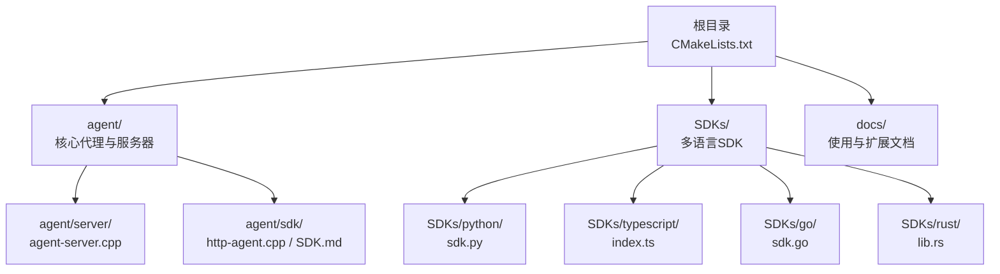
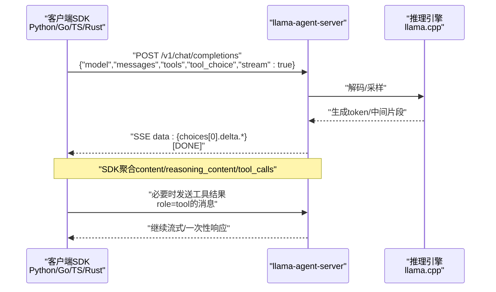
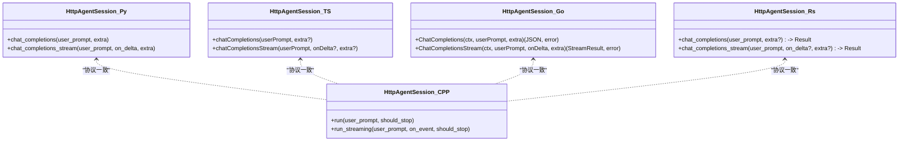

# 快速开始

<cite>
**本文引用的文件**   
- [CMakeLists.txt](file://CMakeLists.txt)
- [agent/CMakeLists.txt](file://agent/CMakeLists.txt)
- [agent/server/agent-server.cpp](file://agent/server/agent-server.cpp)
- [agent/sdk/SDK.md](file://agent/sdk/SDK.md)
- [agent/sdk/http-agent.cpp](file://agent/sdk/http-agent.cpp)
- [SDKs/python/src/llama_agent_sdk/sdk.py](file://SDKs/python/src/llama_agent_sdk/sdk.py)
- [SDKs/go/llamaagentsdk/sdk.go](file://SDKs/go/llamaagentsdk/sdk.go)
- [SDKs/typescript/src/index.ts](file://SDKs/typescript/src/index.ts)
- [SDKs/rust/src/lib.rs](file://SDKs/rust/src/lib.rs)
- [SDKs/python/pyproject.toml](file://SDKs/python/pyproject.toml)
- [SDKs/go/go.mod](file://SDKs/go/go.mod)
- [SDKs/typescript/package.json](file://SDKs/typescript/package.json)
- [SDKs/rust/Cargo.toml](file://SDKs/rust/Cargo.toml)
- [docs/llama-cpp-usage-guide.md](file://docs/llama-cpp-usage-guide.md)
</cite>

## 目录
1. [简介](#简介)
2. [项目结构](#项目结构)
3. [核心组件](#核心组件)
4. [架构总览](#架构总览)
5. [详细组件分析](#详细组件分析)
6. [依赖分析](#依赖分析)
7. [性能考虑](#性能考虑)
8. [故障排除指南](#故障排除指南)
9. [结论](#结论)
10. [附录](#附录)

## 简介
本指南面向首次接触 llama.cpp-agent 的用户，帮助你在最短时间内完成环境准备、编译构建、运行服务端与客户端 SDK，并通过 HTTP API 进行基本交互。你将学会：
- 如何准备系统与依赖
- 如何从源码编译项目
- 如何启动 llama-agent-server 并进行推理
- 如何使用多语言 SDK（Python/TypeScript/Go/Rust）发起聊天与流式对话
- 常见配置项与参数说明
- 基础故障排除方法

## 项目结构
该项目采用 CMake 构建，主体由以下部分组成：
- 根级 CMakeLists.txt：控制整体构建、CUDA 选项、llama.cpp 子模块接入
- agent/：核心代理与服务器代码，包含 HTTP 路由、会话管理、工具与权限系统
- SDKs/：多语言 SDK（Python/TypeScript/Go/Rust）的基础封装
- docs/：相关使用与扩展文档（如 llama.cpp 使用指南）

**图表来源**
- [CMakeLists.txt](file://CMakeLists.txt)
- [agent/CMakeLists.txt](file://agent/CMakeLists.txt)
- [agent/server/agent-server.cpp](file://agent/server/agent-server.cpp)
- [agent/sdk/SDK.md](file://agent/sdk/SDK.md)
- [agent/sdk/http-agent.cpp](file://agent/sdk/http-agent.cpp)
- [SDKs/python/src/llama_agent_sdk/sdk.py](file://SDKs/python/src/llama_agent_sdk/sdk.py)
- [SDKs/go/llamaagentsdk/sdk.go](file://SDKs/go/llamaagentsdk/sdk.go)
- [SDKs/typescript/src/index.ts](file://SDKs/typescript/src/index.ts)
- [SDKs/rust/src/lib.rs](file://SDKs/rust/src/lib.rs)

**章节来源**
- [CMakeLists.txt](file://CMakeLists.txt)
- [agent/CMakeLists.txt](file://agent/CMakeLists.txt)

## 核心组件
- llama-agent-server：提供 OpenAI 兼容的 /v1/chat/completions 推理接口，支持 SSE 流式响应；可作为单模型模式或路由模式运行。
- SDK（多语言）：在客户端维护会话、工具与权限，实现“HTTP 版 agent loop”，支持流式事件、工具调用与权限交互。
- 工具与权限：内置文件读写、编辑、任务等工具，结合工作目录沙箱与权限策略，保障安全可控。

**章节来源**
- [agent/server/agent-server.cpp](file://agent/server/agent-server.cpp)
- [agent/sdk/SDK.md](file://agent/sdk/SDK.md)
- [agent/sdk/http-agent.cpp](file://agent/sdk/http-agent.cpp)

## 架构总览
下图展示了从客户端 SDK 到服务端的典型交互流程，以及多语言 SDK 的共性设计。

**图表来源**
- [agent/server/agent-server.cpp](file://agent/server/agent-server.cpp)
- [agent/sdk/SDK.md](file://agent/sdk/SDK.md)
- [SDKs/python/src/llama_agent_sdk/sdk.py](file://SDKs/python/src/llama_agent_sdk/sdk.py)
- [SDKs/go/llamaagentsdk/sdk.go](file://SDKs/go/llamaagentsdk/sdk.go)
- [SDKs/typescript/src/index.ts](file://SDKs/typescript/src/index.ts)
- [SDKs/rust/src/lib.rs](file://SDKs/rust/src/lib.rs)

## 详细组件分析

### 环境与依赖准备
- 系统要求
  - Linux/macOS/Windows（Windows 下部分特性受限）
  - CMake 3.20+，编译器支持 C++17
- 依赖
  - CMake、Git、编译工具链
  - 可选：CUDA（需设置 LLAMA_CPP_AGENT_CUDA）
  - 第三方子模块：llama.cpp、qwen3-asr/tts（随项目自动拉取）
- Python/TypeScript/Go/Rust SDK
  - Python：>=3.10
  - Go：>=1.22
  - TypeScript：Node + TypeScript
  - Rust：Cargo

提示
- 若使用 WSL 或 macOS，CUDA 默认关闭；可在构建时显式开启或遵循默认策略。
- 项目通过 CMake 子目录引入 third_party/llama.cpp，无需手动安装。

**章节来源**
- [CMakeLists.txt](file://CMakeLists.txt)
- [SDKs/python/pyproject.toml](file://SDKs/python/pyproject.toml)
- [SDKs/go/go.mod](file://SDKs/go/go.mod)
- [SDKs/typescript/package.json](file://SDKs/typescript/package.json)
- [SDKs/rust/Cargo.toml](file://SDKs/rust/Cargo.toml)

### 编译与安装
- 克隆仓库并初始化子模块
  - git clone https://github.com/your-repo/llama.cpp-agent.git
  - cd llama.cpp-agent && git submodule update --init --recursive
- 配置与构建
  - mkdir build && cd build
  - cmake .. [-DLLAMA_CPP_AGENT_CUDA=ON/OFF]
  - cmake --build . --target llama-agent-server llama-agent-sdk-lib llama-agent-sdk
- 产物
  - llama-agent-server：服务端可执行文件
  - llama-agent-sdk：CLI 客户端
  - llama-agent-sdk-lib：静态库（供其他语言 SDK 使用）

注意
- 若未指定 -DLLAMA_CPP_AGENT_CUDA，默认在非 Apple/WSL 环境尝试启用 CUDA。
- Windows 下链接 ws2_32，Linux/macOS 无需额外处理。

**章节来源**
- [CMakeLists.txt](file://CMakeLists.txt)
- [agent/CMakeLists.txt](file://agent/CMakeLists.txt)

### 运行 llama-agent-server
- 单模型模式（MODEL mode）
  - ./build/agent/llama-agent-server --host 127.0.0.1 --port 8080 -m /path/to/model.gguf
- 路由模式（ROUTER mode）
  - ./build/agent/llama-agent-server --host 127.0.0.1 --port 8080 --models-dir /path/to/gguf_dir
  - 模型管理：/models、/models/load、/models/unload
  - 切换模型：在请求体或查询参数中指定 model

健康检查与端点
- GET /health、/v1/health
- GET /metrics、/v1/models
- POST /v1/chat/completions（支持 SSE）
- /v1/agent/*（会话、工具、权限等）

音频能力（可选）
- ASR：POST /v1/audio/transcriptions
- TTS：POST /v1/audio/speech

**章节来源**
- [agent/server/agent-server.cpp](file://agent/server/agent-server.cpp)

### 使用 HTTP API 进行基本交互
- 基本请求
  - POST /v1/chat/completions
  - Body：{"model": "...", "messages": [...], "tools": [...], "tool_choice": "auto", "stream": true/false}
- 流式响应（SSE）
  - data: {"choices":[{ "delta": { "content"/"reasoning_content"/"tool_calls" } }]}
  - 结束：data: [DONE]
- 工具调用
  - assistant 返回 tool_calls，SDK 执行本地工具并将结果以 role=tool 回填，继续下一轮推理

**章节来源**
- [agent/sdk/SDK.md](file://agent/sdk/SDK.md)

### 多语言 SDK 使用示例

#### Python
- 安装
  - pip install -e SDKs/python
- 基本用法
  - 创建 HttpServerConfig、HttpAgentConfig、HttpAgentSession
  - 调用 chat_completions 或 chat_completions_stream
- 示例要点
  - 支持 system_prompt、request_timeout_s
  - SSE 解析与事件聚合（content/reasoning/tool_calls/usage）

**章节来源**
- [SDKs/python/src/llama_agent_sdk/sdk.py](file://SDKs/python/src/llama_agent_sdk/sdk.py)
- [SDKs/python/pyproject.toml](file://SDKs/python/pyproject.toml)

#### TypeScript
- 安装与构建
  - cd SDKs/typescript && npm install && npm run build
- 基本用法
  - new HttpAgentSession({ baseUrl, apiKey? }, { model, systemPrompt?, requestTimeoutMs? })
  - chatCompletions / chatCompletionsStream
- 示例要点
  - 流式事件通过异步迭代器消费
  - 支持 usage、toolCallsByIndex 聚合

**章节来源**
- [SDKs/typescript/src/index.ts](file://SDKs/typescript/src/index.ts)
- [SDKs/typescript/package.json](file://SDKs/typescript/package.json)

#### Go
- 安装
  - cd SDKs/go && go mod tidy
- 基本用法
  - NewHttpAgentSession(HttpServerConfig, HttpAgentConfig)
  - ChatCompletions / ChatCompletionsStream
- 示例要点
  - 支持 Authorization Bearer、User-Agent
  - SSE 行解析与增量聚合

**章节来源**
- [SDKs/go/llamaagentsdk/sdk.go](file://SDKs/go/llamaagentsdk/sdk.go)
- [SDKs/go/go.mod](file://SDKs/go/go.mod)

#### Rust
- 安装
  - cd SDKs/rust && cargo build
- 基本用法
  - HttpAgentSession::new(...)
  - chat_completions / chat_completions_stream
- 示例要点
  - reqwest 客户端、SSE 解析、BTreeMap 聚合工具调用

**章节来源**
- [SDKs/rust/src/lib.rs](file://SDKs/rust/src/lib.rs)
- [SDKs/rust/Cargo.toml](file://SDKs/rust/Cargo.toml)

### 配置选项与参数说明
- 构建期
  - LLAMA_CPP_AGENT_CUDA：是否启用 CUDA 后端（默认根据平台自动）
  - LLAMA_CPP_SOURCE_DIR_OVERRIDE：覆盖 llama.cpp 源码目录
- 运行期（服务端）
  - --host / --port：监听地址
  - -m/--model：单模型模式加载的 GGUF 路径
  - --models-dir：路由模式下的模型目录
  - --subagent / --no-subagents / --max-subagent-depth：子代理深度控制
  - --asr-model / --tts-model / --tts-tokenizer-model / --tts-ref-audio：音频能力开关与模型路径
- SDK 通用
  - baseUrl/base_url：服务端地址
  - model：推理模型标识
  - system_prompt：系统提示词
  - request_timeout_s/request_timeout/request_timeout_ms：请求超时
  - stream：是否流式
  - tools/tool_choice：函数工具与选择策略

**章节来源**
- [CMakeLists.txt](file://CMakeLists.txt)
- [agent/server/agent-server.cpp](file://agent/server/agent-server.cpp)
- [agent/sdk/SDK.md](file://agent/sdk/SDK.md)
- [SDKs/python/src/llama_agent_sdk/sdk.py](file://SDKs/python/src/llama_agent_sdk/sdk.py)
- [SDKs/go/llamaagentsdk/sdk.go](file://SDKs/go/llamaagentsdk/sdk.go)
- [SDKs/typescript/src/index.ts](file://SDKs/typescript/src/index.ts)
- [SDKs/rust/src/lib.rs](file://SDKs/rust/src/lib.rs)

### 代码级组件关系（类图）

**图表来源**
- [SDKs/python/src/llama_agent_sdk/sdk.py](file://SDKs/python/src/llama_agent_sdk/sdk.py)
- [SDKs/go/llamaagentsdk/sdk.go](file://SDKs/go/llamaagentsdk/sdk.go)
- [SDKs/typescript/src/index.ts](file://SDKs/typescript/src/index.ts)
- [SDKs/rust/src/lib.rs](file://SDKs/rust/src/lib.rs)
- [agent/sdk/http-agent.cpp](file://agent/sdk/http-agent.cpp)

## 依赖分析
- 构建依赖
  - CMake、Git、编译器（C/C++17）
  - 可选：CUDA 工具链（启用 LLAMA_CPP_AGENT_CUDA）
- 运行依赖
  - GGUF 模型文件
  - 可选：音频模型（ASR/TTS）
- 多语言 SDK 依赖
  - Python：urllib、ssl、json
  - Go：net/http、bufio、bytes
  - TypeScript：fetch、ReadableStream
  - Rust：reqwest、serde、serde_json

**章节来源**
- [CMakeLists.txt](file://CMakeLists.txt)
- [SDKs/python/src/llama_agent_sdk/sdk.py](file://SDKs/python/src/llama_agent_sdk/sdk.py)
- [SDKs/go/llamaagentsdk/sdk.go](file://SDKs/go/llamaagentsdk/sdk.go)
- [SDKs/typescript/src/index.ts](file://SDKs/typescript/src/index.ts)
- [SDKs/rust/src/lib.rs](file://SDKs/rust/src/lib.rs)

## 性能考虑
- 线程与批处理
  - 服务端默认 n_parallel、kv_unified 等参数，可根据硬件调整
- CUDA 后端
  - 在支持 CUDA 的平台上启用 LLAMA_CPP_AGENT_CUDA 可显著提升吞吐
- 流式传输
  - 使用 SSE 流式响应减少首字节延迟，适合实时对话
- 工具调用
  - 文件/编辑等工具受工作目录沙箱与权限策略影响，合理配置可避免阻塞

[本节为通用指导，不涉及特定文件分析]

## 故障排除指南
- 无法启动服务端
  - 检查模型路径与权限；确认 -m 或 --models-dir 配置正确
  - 查看 /health 与日志输出
- SSE 流异常
  - 确认请求头 Accept: text/event-stream；检查服务端是否启用流式
- 工具调用被拒
  - 检查 working_dir 与权限策略；必要时通过 PERMISSION_REQUIRED/PERMISSION_RESOLVED 流程授权
- 多模型切换失败
  - 路由模式下需确保目标模型已通过 /models/load 加载
- Python/Go/TS/Rust SDK 报错
  - 核对 baseUrl/base_url、model、system_prompt、request_timeout
  - 确保服务端已启用 --jinja（SDK 需要 tools/tool_choice）

**章节来源**
- [agent/server/agent-server.cpp](file://agent/server/agent-server.cpp)
- [agent/sdk/SDK.md](file://agent/sdk/SDK.md)
- [agent/sdk/http-agent.cpp](file://agent/sdk/http-agent.cpp)

## 结论
通过本快速开始，你已经完成了环境准备、编译构建、服务端运行与多语言 SDK 的基本使用。建议进一步阅读 SDK 协议与 llama.cpp 使用指南，以掌握更高级的工具注入、权限策略与模型扩展能力。

[本节为总结性内容，不涉及特定文件分析]

## 附录

### 常用命令速查
- 构建
  - cmake .. [-DLLAMA_CPP_AGENT_CUDA=ON/OFF]
  - cmake --build . --target llama-agent-server llama-agent-sdk
- 启动服务端
  - 单模型：--host 127.0.0.1 --port 8080 -m model.gguf
  - 路由：--host 127.0.0.1 --port 8080 --models-dir ./models
- 切换模型
  - 先 /models/load，再在 /v1/chat/completions 中指定 model
- SDK 示例
  - Python/Go/TS/Rust 均支持 chat_completions 与 chat_completions_stream

**章节来源**
- [agent/server/agent-server.cpp](file://agent/server/agent-server.cpp)
- [agent/sdk/SDK.md](file://agent/sdk/SDK.md)