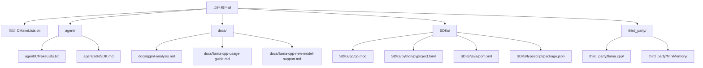
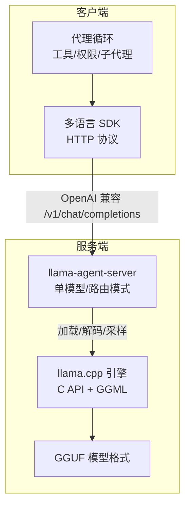
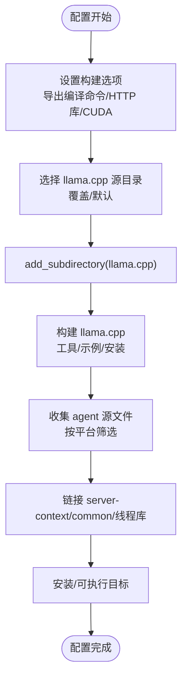
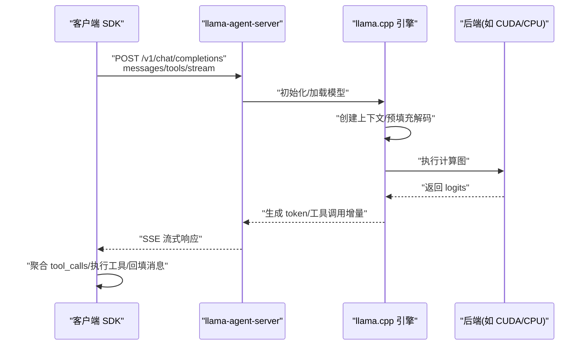
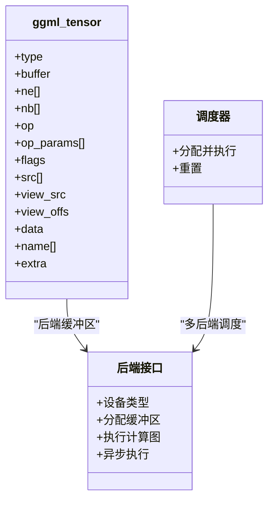
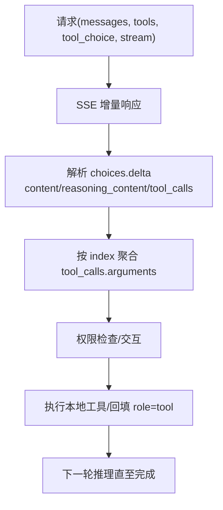
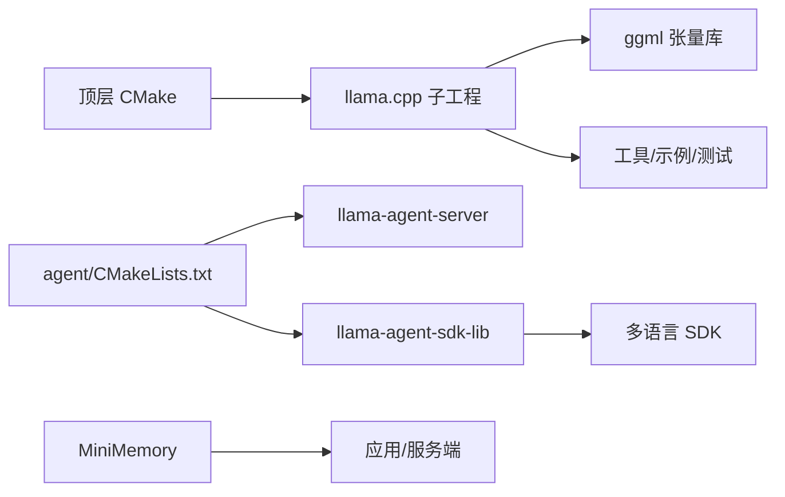

# 技术栈概览

<cite>
**本文引用的文件**
- [CMakeLists.txt](file://CMakeLists.txt)
- [third_party/llama.cpp/CMakeLists.txt](file://third_party/llama.cpp/CMakeLists.txt)
- [agent/CMakeLists.txt](file://agent/CMakeLists.txt)
- [docs/ggml-analysis.md](file://docs/ggml-analysis.md)
- [docs/llama-cpp-usage-guide.md](file://docs/llama-cpp-usage-guide.md)
- [docs/llama-cpp-new-model-support.md](file://docs/llama-cpp-new-model-support.md)
- [SDKs/go/go.mod](file://SDKs/go/go.mod)
- [SDKs/python/pyproject.toml](file://SDKs/python/pyproject.toml)
- [SDKs/java/pom.xml](file://SDKs/java/pom.xml)
- [SDKs/typescript/package.json](file://SDKs/typescript/package.json)
- [agent/sdk/SDK.md](file://agent/sdk/SDK.md)
- [third_party/MiniMemory/README.md](file://third_party/MiniMemory/README.md)
</cite>

## 目录
1. [简介](#简介)
2. [项目结构](#项目结构)
3. [核心组件](#核心组件)
4. [架构总览](#架构总览)
5. [详细组件分析](#详细组件分析)
6. [依赖关系分析](#依赖关系分析)
7. [性能考量](#性能考量)
8. [故障排查指南](#故障排查指南)
9. [结论](#结论)
10. [附录](#附录)

## 简介
本项目围绕 llama.cpp-Agent 构建，采用 C++ 作为主语言，结合 llama.cpp 推理引擎与 GGML 张量计算库，提供多语言 SDK（Go/Java/Python/TypeScript/Rust）与本地 HTTP 服务端，实现“无状态服务 + 客户端智能代理”的架构。技术栈强调高性能推理、可移植构建、跨语言一致性以及可扩展的模型与算子支持。

## 项目结构
项目采用分层与模块化组织：
- 顶层 CMake 控制整体构建与选项，统一拉取并编译 third_party/llama.cpp。
- agent/ 子目录包含代理核心逻辑、工具、权限、子代理、HTTP 服务端与 SDK。
- docs/ 提供 GGML 与 llama.cpp 使用与扩展指南。
- SDKs/ 提供多语言 SDK 的基础包与示例。
- third_party/ 包含 llama.cpp、MiniMemory 等第三方组件。

图表来源
- [CMakeLists.txt](file://CMakeLists.txt)
- [agent/CMakeLists.txt](file://agent/CMakeLists.txt)
- [docs/ggml-analysis.md](file://docs/ggml-analysis.md)
- [docs/llama-cpp-usage-guide.md](file://docs/llama-cpp-usage-guide.md)
- [docs/llama-cpp-new-model-support.md](file://docs/llama-cpp-new-model-support.md)
- [SDKs/go/go.mod](file://SDKs/go/go.mod)
- [SDKs/python/pyproject.toml](file://SDKs/python/pyproject.toml)
- [SDKs/java/pom.xml](file://SDKs/java/pom.xml)
- [SDKs/typescript/package.json](file://SDKs/typescript/package.json)
- [agent/sdk/SDK.md](file://agent/sdk/SDK.md)
- [third_party/MiniMemory/README.md](file://third_party/MiniMemory/README.md)

章节来源
- [CMakeLists.txt](file://CMakeLists.txt)
- [agent/CMakeLists.txt](file://agent/CMakeLists.txt)

## 核心组件
- C++ 与 CMake 构建体系
  - 顶层 CMake 控制构建类型、导出编译命令、CUDA 后端开关、llama.cpp 子目录与二进制目录。
  - llama.cpp 子工程通过 add_subdirectory 引入，统一管理 GGML、工具、示例与安装。
  - agent/CMakeLists.txt 定义可执行目标与静态库，链接 server-context、common 与线程库。
- llama.cpp 推理引擎
  - 提供 C API（llama.h、ggml.h、ggml-backend.h、gguf.h），支持多后端（CPU/CUDA/Metal/Vulkan/SYCL）。
  - 常用流程：初始化后端 → 加载模型 → 创建上下文 → tokenize → 预填充解码 → 生成循环 → 采样 → 输出 → 清理。
- GGML 张量计算库
  - 支持 100+ 算子，涵盖基础数学、归一化、矩阵乘、注意力、卷积、池化、状态空间模型等。
  - 后端调度器支持多后端分配与异步执行，支持量化类型与重要性矩阵量化。
- 多语言 SDK
  - Go/Java/Python/TypeScript/Rust SDK 基于统一 HTTP 协议（OpenAI 兼容），实现流式响应、工具调用聚合与权限交互。
- 本地 HTTP 服务端与代理循环
  - llama-agent-server 提供单模型或路由模式，支持动态加载/卸载模型。
  - SDK 侧维护会话、工具、权限与子代理，形成“HTTP 版 agent loop”。

章节来源
- [CMakeLists.txt](file://CMakeLists.txt)
- [third_party/llama.cpp/CMakeLists.txt](file://third_party/llama.cpp/CMakeLists.txt)
- [agent/CMakeLists.txt](file://agent/CMakeLists.txt)
- [docs/llama-cpp-usage-guide.md](file://docs/llama-cpp-usage-guide.md)
- [docs/ggml-analysis.md](file://docs/ggml-analysis.md)
- [SDKs/go/go.mod](file://SDKs/go/go.mod)
- [SDKs/python/pyproject.toml](file://SDKs/python/pyproject.toml)
- [SDKs/java/pom.xml](file://SDKs/java/pom.xml)
- [SDKs/typescript/package.json](file://SDKs/typescript/package.json)
- [agent/sdk/SDK.md](file://agent/sdk/SDK.md)

## 架构总览
整体架构分为三层：
- 服务层：llama.cpp 提供推理能力，HTTP 服务端负责路由与模型生命周期管理。
- 代理层：SDK 在客户端维护会话、工具与权限，执行工具并将结果回填至消息流。
- 扩展层：GGML 算子与后端实现，支持量化与多硬件加速。

图表来源
- [agent/sdk/SDK.md](file://agent/sdk/SDK.md)
- [docs/llama-cpp-usage-guide.md](file://docs/llama-cpp-usage-guide.md)
- [third_party/llama.cpp/CMakeLists.txt](file://third_party/llama.cpp/CMakeLists.txt)

## 详细组件分析

### CMake 构建系统与配置管理
- 顶层 CMake
  - 设置最低版本、导出编译命令、启用 llama.cpp 工具与服务端、HTTP 库选项。
  - 通过 LLAMA_CPP_AGENT_CUDA 选项控制 GGML_CUDA 开关，适配不同平台（Apple/WSL 等）。
  - 支持覆盖 llama.cpp 源码目录，便于本地定制或替换。
- llama.cpp 子工程
  - 统一管理构建类型、共享库开关、编译器警告与 Sanitizer 选项。
  - 通过 LLAMA_USE_SYSTEM_GGML 选择系统 ggml 或内建 ggml。
  - 条件编译工具、示例、测试与安装目标。
- agent 子工程
  - 动态决定所需源文件（Windows 与非 Windows 差异）。
  - 链接 server-context、common 与线程库，包含 llama.cpp server 与 MTMD 头文件。
  - 可选集成 ASR/TTS 源码与 cpp-httplib。

图表来源
- [CMakeLists.txt](file://CMakeLists.txt)
- [third_party/llama.cpp/CMakeLists.txt](file://third_party/llama.cpp/CMakeLists.txt)
- [agent/CMakeLists.txt](file://agent/CMakeLists.txt)

章节来源
- [CMakeLists.txt](file://CMakeLists.txt)
- [third_party/llama.cpp/CMakeLists.txt](file://third_party/llama.cpp/CMakeLists.txt)
- [agent/CMakeLists.txt](file://agent/CMakeLists.txt)

### llama.cpp 推理引擎与 API 使用
- API 概览
  - 核心头文件：llama.h、ggml.h、ggml-backend.h、gguf.h。
  - 核心结构：llama_model、llama_context、llama_vocab、llama_batch、llama_sampler。
  - 参数结构：llama_model_params、llama_context_params。
- 核心调用流程
  - 初始化后端 → 加载模型（支持 n_gpu_layers 等参数）→ 创建上下文（n_ctx/n_batch/n_threads 等）→ tokenize → 预填充解码 → 生成循环（采样/解码/输出）→ 清理资源。
- 算子映射
  - Transformer 层：Token Embedding、RoPE、RMS Norm、Q/K/V 投影、注意力分数、FFN（SwiGLU）、残差连接。
  - 后端映射：GGML_OP_MUL_MAT、GGML_OP_FLASH_ATTN_EXT 等在不同后端有实现差异。

图表来源
- [docs/llama-cpp-usage-guide.md](file://docs/llama-cpp-usage-guide.md)
- [agent/sdk/SDK.md](file://agent/sdk/SDK.md)

章节来源
- [docs/llama-cpp-usage-guide.md](file://docs/llama-cpp-usage-guide.md)
- [docs/ggml-analysis.md](file://docs/ggml-analysis.md)

### GGML 张量计算库与后端架构
- 核心数据结构与算子
  - ggml_tensor、张量标志、100+ 算子分类（基础数学、激活函数、归一化、矩阵运算、注意力、形状操作、卷积/池化、SSM/RWKV、GLU、优化器、损失函数等）。
- 后端架构
  - 支持 CPU、CUDA、Metal、Vulkan、SYCL、OpenCL、RPC 等后端。
  - 后端接口：设备类型、缓冲区分配、同步/异步计算。
  - 调度器：多后端分配、图分配、并行与算子卸载。
- 量化类型
  - F32/F16/BF16、整数类型、Q-quants、K-quants、I-quants、新型量化（Tiny/MXFP/NVFP）。
  - 量化 API：初始化量化表、量化数据、检查是否需要重要性矩阵。

图表来源
- [docs/ggml-analysis.md](file://docs/ggml-analysis.md)

章节来源
- [docs/ggml-analysis.md](file://docs/ggml-analysis.md)

### 多语言 SDK 与 HTTP 协议
- 协议设计
  - 服务端：OpenAI 兼容 /v1/chat/completions，支持 SSE 流式响应。
  - 客户端：统一事件流（TEXT_DELTA/REASONING_DELTA/TOOL_START/TOOL_RESULT/PERMISSION_REQUIRED 等）。
  - 工具调用：按 index 聚合 arguments，支持工具过滤与权限策略。
- 各语言 SDK
  - Go/Java/Python/TypeScript/Rust 基于相同协议，提供最小可用包与示例。
  - Go：go 1.22；Java：Jackson 依赖；Python：setuptools；TypeScript：TypeScript + Node 类型。
- 会话与状态
  - SDK 维护 messages、权限覆盖与统计信息，支持序列化以便跨进程/跨语言复用。

图表来源
- [agent/sdk/SDK.md](file://agent/sdk/SDK.md)
- [SDKs/go/go.mod](file://SDKs/go/go.mod)
- [SDKs/python/pyproject.toml](file://SDKs/python/pyproject.toml)
- [SDKs/java/pom.xml](file://SDKs/java/pom.xml)
- [SDKs/typescript/package.json](file://SDKs/typescript/package.json)

章节来源
- [agent/sdk/SDK.md](file://agent/sdk/SDK.md)
- [SDKs/go/go.mod](file://SDKs/go/go.mod)
- [SDKs/python/pyproject.toml](file://SDKs/python/pyproject.toml)
- [SDKs/java/pom.xml](file://SDKs/java/pom.xml)
- [SDKs/typescript/package.json](file://SDKs/typescript/package.json)

### 本地 HTTP 服务端与模型管理
- 单模型模式
  - 启动时绑定单一 GGUF 模型，行为接近 llama-server -m ...。
- 路由模式
  - 不指定模型时作为 router 运行，按请求中的 model 字段路由到子实例。
  - 支持 /models/load 与 /models/unload 动态管理模型。
- 与 SDK 的协作
  - SDK 通过不同 model 值实现“运行中切换模型”，无需重启服务端。

章节来源
- [agent/sdk/SDK.md](file://agent/sdk/SDK.md)

### MiniMemory（MiniCache）与嵌入检索
- 轻量级类 Redis 内存 KV 服务端，支持 RESP 协议、基础 KV、数据库选择、事务、过期时间、AOF 与快照持久化。
- 提供图谱与证据检索命令，支持结构化邻居查询与向量检索（结合 llama.cpp embedding）。
- 可作为独立服务或被其他 C++ 项目复用（CMake 目标：data_store/command_handler/resp_parser 等）。

章节来源
- [third_party/MiniMemory/README.md](file://third_party/MiniMemory/README.md)

## 依赖关系分析
- 构建依赖
  - 顶层 CMake → llama.cpp 子工程 → agent 子工程。
  - agent 子工程链接 server-context、common、线程库，可选链接 cpp-httplib。
- 运行时依赖
  - llama.cpp 依赖 ggml 与后端库（CPU/CUDA/Metal/Vulkan/SYCL）。
  - SDKs 依赖各自语言生态（Jackson、setuptools、TypeScript 等）。
- 第三方组件
  - llama.cpp：模型加载、推理、量化、服务端工具。
  - MiniMemory：KV 存储与检索增强。

图表来源
- [CMakeLists.txt](file://CMakeLists.txt)
- [third_party/llama.cpp/CMakeLists.txt](file://third_party/llama.cpp/CMakeLists.txt)
- [agent/CMakeLists.txt](file://agent/CMakeLists.txt)
- [third_party/MiniMemory/README.md](file://third_party/MiniMemory/README.md)

章节来源
- [CMakeLists.txt](file://CMakeLists.txt)
- [third_party/llama.cpp/CMakeLists.txt](file://third_party/llama.cpp/CMakeLists.txt)
- [agent/CMakeLists.txt](file://agent/CMakeLists.txt)

## 性能考量
- 后端选择
  - CUDA：适用于 NVIDIA GPU，需开启 LLAMA_CPP_AGENT_CUDA 与 GGML_CUDA。
  - Metal：Apple 平台首选。
  - Vulkan/SYCL/OpenCL：跨平台 GPU 后端，需根据环境检测与配置。
- 量化策略
  - 使用 K-quants/I-quants 等量化格式降低显存占用与提高吞吐。
  - 量化 API 支持重要性矩阵，提升低比特精度下的质量。
- 线程与批处理
  - 通过 llama_context_params 的 n_threads/n_batch/n_ubatch 调优。
- 算子与后端映射
  - Flash Attention 等高性能算子在 CUDA/Metal 后端有专门实现，优先启用。

## 故障排查指南
- CUDA 相关
  - 平台适配：Apple/WSL 环境默认关闭 CUDA，可通过环境变量或选项强制开启。
  - 后端检测：部分后端（如 SYCL/Vulkan）通过检测脚本查找依赖，失败时会提示兼容性问题。
- 模型加载与量化
  - 张量形状不匹配：确认权重是否需要转置（线性层权重）。
  - KV Cache 分配失败：尝试减小上下文长度或切换后端。
  - 位置编码问题：核对 RoPE 类型与频率基。
- 权限与沙箱
  - 工作目录越界：触发 EXTERNAL_DIR 权限请求，需在策略中明确允许。
  - 工具重复调用：启用防环检测，超过阈值自动拒绝。
- SSE 流式解析
  - 确保服务端启用 --jinja，否则 tools/tool_choice 会被拒绝。
  - SDK 侧按 index 聚合 tool_calls.arguments，注意跨 chunk 拼接与最终完成信号。

章节来源
- [CMakeLists.txt](file://CMakeLists.txt)
- [docs/llama-cpp-new-model-support.md](file://docs/llama-cpp-new-model-support.md)
- [docs/llama-cpp-usage-guide.md](file://docs/llama-cpp-usage-guide.md)
- [agent/sdk/SDK.md](file://agent/sdk/SDK.md)

## 结论
本项目以 C++ 为核心，依托 llama.cpp 与 GGML 实现高性能推理，配合多语言 SDK 与 HTTP 服务端，形成“无状态服务 + 客户端智能代理”的灵活架构。通过 CMake 统一构建与模块化设计，项目具备良好的可移植性与扩展性；借助 GGML 的丰富算子与多后端支持，能够满足从桌面到云端的多样化部署需求。

## 附录

### 技术选型与权衡
- C++ 与 CMake
  - 优势：高性能、跨平台、可移植、与 llama.cpp 生态无缝衔接。
  - 权衡：开发门槛较高，多语言绑定与生态相对复杂。
- llama.cpp 与 GGML
  - 优势：成熟的推理引擎、丰富的后端与量化支持、可扩展算子与模型。
  - 权衡：算子与后端实现依赖平台，部分后端需额外依赖与配置。
- 多语言 SDK
  - 优势：统一协议、快速复用、生态丰富。
  - 权衡：需持续对齐协议细节（SSE、工具调用聚合、权限交互）。

### 学习路径与前置知识
- 前置知识
  - C/C++ 基础、CMake 使用、HTTP 协议、JSON/RESP 协议。
  - 机器学习基础（张量、注意力、量化）。
- 学习路径
  - 从 CMake 与 llama.cpp 构建入手，理解 add_subdirectory 与选项控制。
  - 阅读 GGML 算子与后端文档，掌握常用算子与量化类型。
  - 研究 SDK 协议与事件流，理解工具调用与权限交互。
  - 实践：本地编译、切换模型、扩展工具与算子。

### 第三方依赖与版本要求
- Go：go 1.22
- Java：Jackson 2.17.2
- Python：setuptools、wheel、构建后端
- TypeScript：TypeScript 5.6+、Node 类型

章节来源
- [SDKs/go/go.mod](file://SDKs/go/go.mod)
- [SDKs/python/pyproject.toml](file://SDKs/python/pyproject.toml)
- [SDKs/java/pom.xml](file://SDKs/java/pom.xml)
- [SDKs/typescript/package.json](file://SDKs/typescript/package.json)