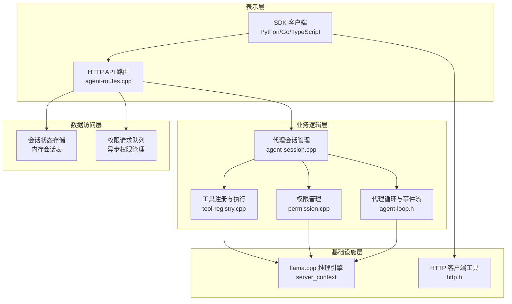
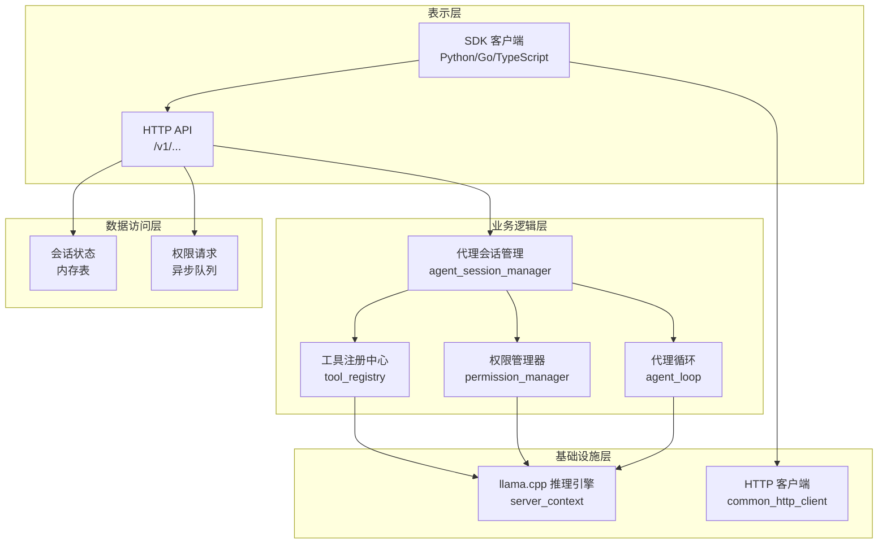
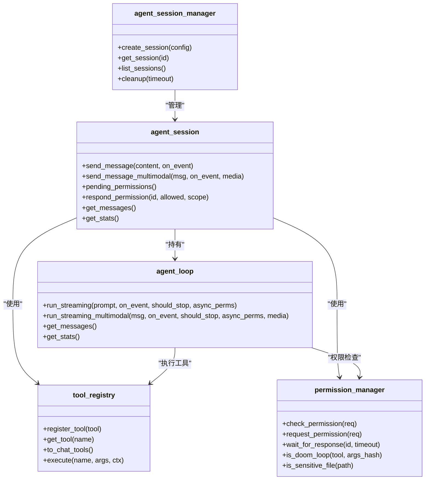
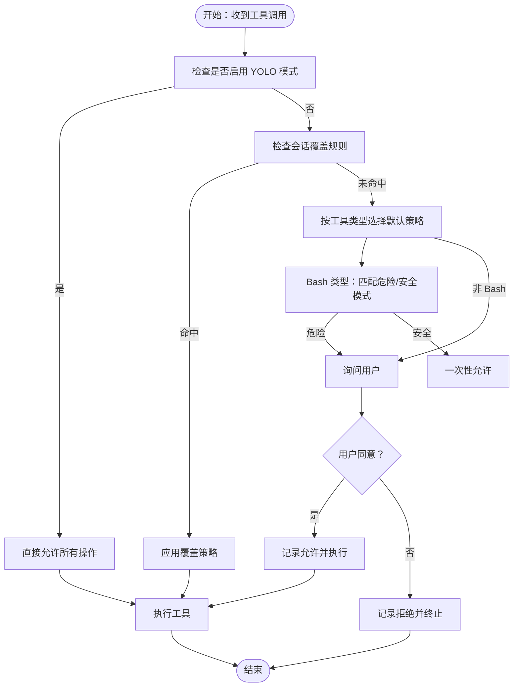
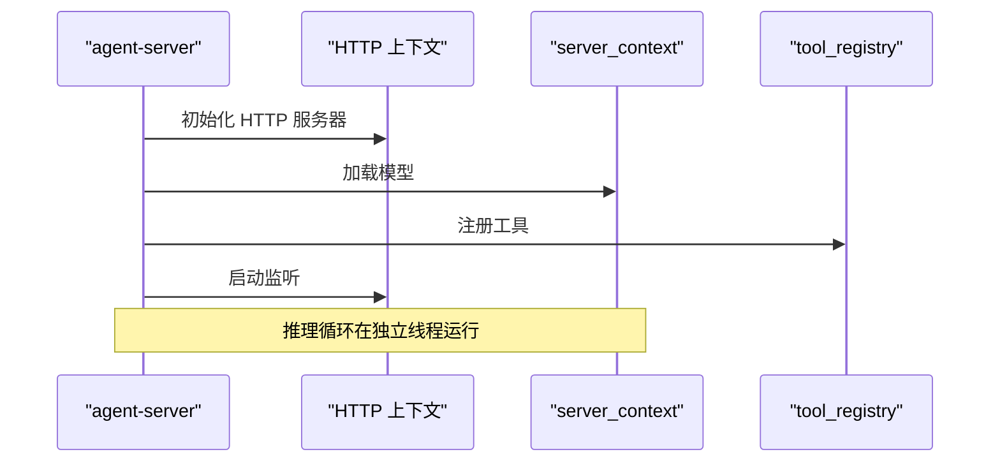
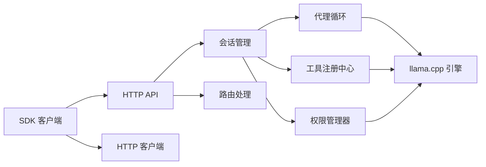

# 分层架构设计

<cite>
**本文档引用的文件**
- [agent-server.cpp](file://agent/server/agent-server.cpp)
- [agent-routes.cpp](file://agent/server/agent-routes.cpp)
- [agent-session.cpp](file://agent/server/agent-session.cpp)
- [http-agent.cpp](file://agent/sdk/http-agent.cpp)
- [sdk.py](file://SDKs/python/src/llama_agent_sdk/sdk.py)
- [sdk.go](file://SDKs/go/llamaagentsdk/sdk.go)
- [index.ts](file://SDKs/typescript/src/index.ts)
- [tool-registry.cpp](file://agent/tool-registry.cpp)
- [permission.cpp](file://agent/permission.cpp)
- [agent-loop.h](file://agent/agent-loop.h)
- [tool-bash.cpp](file://agent/tools/tool-bash.cpp)
- [tool-read.cpp](file://agent/tools/tool-read.cpp)
- [http.h](file://third_party/llama.cpp/common/http.h)
- [CMakeLists.txt](file://CMakeLists.txt)
</cite>

## 目录
1. [引言](#引言)
2. [项目结构](#项目结构)
3. [核心组件](#核心组件)
4. [架构总览](#架构总览)
5. [详细组件分析](#详细组件分析)
6. [依赖关系分析](#依赖关系分析)
7. [性能考虑](#性能考虑)
8. [故障排除指南](#故障排除指南)
9. [结论](#结论)

## 引言
本文件为 llama.cpp-agent 项目的分层架构设计文档，基于代码库的实际实现，构建了从表示层到基础设施层的四层架构视图。该架构旨在清晰划分职责边界，确保层间依赖关系明确、数据流顺畅，并提供统一的错误处理与通信机制。文档面向架构师与开发者，既提供高层概览，也包含代码级细节与可视化图表，帮助快速理解与实施。

## 项目结构
项目采用模块化组织，围绕“代理内核”为核心，向上提供 HTTP API 与多语言 SDK，向下集成工具管理与权限控制，并通过 llama.cpp 推理引擎完成实际的模型推理任务。整体结构如下：



**图表来源**
- [agent-routes.cpp:104-494](file://agent/server/agent-routes.cpp#L104-L494)
- [agent-session.cpp:37-348](file://agent/server/agent-session.cpp#L37-L348)
- [tool-registry.cpp:1-86](file://agent/tool-registry.cpp#L1-L86)
- [permission.cpp:1-310](file://agent/permission.cpp#L1-L310)
- [agent-loop.h:167-276](file://agent/agent-loop.h#L167-L276)
- [http.h:1-100](file://third_party/llama.cpp/common/http.h#L1-L100)

**章节来源**
- [CMakeLists.txt:1-44](file://CMakeLists.txt#L1-L44)

## 核心组件
- 表示层组件
  - HTTP API 路由：负责接收客户端请求，解析参数，调用业务逻辑层，并以 SSE 或 JSON 响应返回结果。
  - 多语言 SDK：提供 Python/Go/TypeScript 的会话封装，支持同步与流式对话，内部通过 HTTP 客户端调用后端 API。
- 业务逻辑层组件
  - 代理会话管理：维护会话生命周期、消息历史、统计信息；支持文本与多模态消息处理。
  - 工具注册与执行：集中管理工具定义、参数校验与执行，支持过滤模式（只读）与 Bash 模式。
  - 权限管理：提供默认策略、交互式确认、会话覆盖、危险命令识别与敏感文件保护。
  - 代理循环与事件流：驱动推理循环，生成文本与思考内容，处理工具调用与权限请求，支持事件回调。
- 数据访问层组件
  - 会话状态存储：内存中的会话表与统计信息，支持清理与查询。
  - 权限请求队列：异步权限管理，避免阻塞主线程。
- 基础设施层组件
  - llama.cpp 推理引擎：加载模型、执行推理、管理上下文与任务。
  - HTTP 客户端工具：统一的 URL 解析与客户端初始化，支持 HTTPS（可选）。

**章节来源**
- [agent-routes.cpp:104-494](file://agent/server/agent-routes.cpp#L104-L494)
- [agent-session.cpp:37-348](file://agent/server/agent-session.cpp#L37-L348)
- [tool-registry.cpp:1-86](file://agent/tool-registry.cpp#L1-L86)
- [permission.cpp:1-310](file://agent/permission.cpp#L1-L310)
- [agent-loop.h:167-276](file://agent/agent-loop.h#L167-L276)
- [http.h:1-100](file://third_party/llama.cpp/common/http.h#L1-L100)

## 架构总览
llama.cpp-agent 的四层架构如下：



**图表来源**
- [agent-server.cpp:256-426](file://agent/server/agent-server.cpp#L256-L426)
- [agent-routes.cpp:104-494](file://agent/server/agent-routes.cpp#L104-L494)
- [agent-session.cpp:259-348](file://agent/server/agent-session.cpp#L259-L348)
- [tool-registry.cpp:1-86](file://agent/tool-registry.cpp#L1-L86)
- [permission.cpp:1-310](file://agent/permission.cpp#L1-L310)
- [http.h:68-95](file://third_party/llama.cpp/common/http.h#L68-L95)

## 详细组件分析

### 表示层：HTTP API 与 SDK
- HTTP API 路由
  - 提供健康检查、模型列表、聊天补全、SSE 流式响应等端点。
  - 支持代理会话的创建、查询、删除、聊天、权限处理与工具列表。
  - 使用异常包装器统一处理业务异常与未知错误，保证稳定的错误响应格式。
- SDK 客户端
  - Python/Go/TypeScript SDK 封装了会话对象，支持同步与流式聊天补全。
  - 内部使用标准 HTTP 客户端或浏览器 fetch，解析 SSE 数据流，聚合工具调用与用量信息。
  - 提供消息历史管理与系统提示注入能力。

```mermaid
sequenceDiagram
participant Client as "SDK 客户端"
participant API as "HTTP API 路由"
participant Routes as "agent_routes"
participant Session as "agent_session"
participant Loop as "agent_loop"
participant Engine as "llama.cpp 推理引擎"
Client->>API : POST /v1/agent/session/ : id/chat
API->>Routes : 匹配路由并解析请求
Routes->>Session : send_message_multimodal(...)
Session->>Loop : run_streaming_multimodal(...)
Loop->>Engine : 生成文本/工具调用
Engine-->>Loop : 文本增量/工具调用
Loop-->>Session : 事件回调
Session-->>Routes : SSE 事件流
Routes-->>API : 返回 SSE 响应
API-->>Client : 流式数据块
```

**图表来源**
- [agent-routes.cpp:199-348](file://agent/server/agent-routes.cpp#L199-L348)
- [agent-session.cpp:158-211](file://agent/server/agent-session.cpp#L158-L211)
- [agent-loop.h:198-211](file://agent/agent-loop.h#L198-L211)

**章节来源**
- [agent-routes.cpp:104-494](file://agent/server/agent-routes.cpp#L104-L494)
- [sdk.py:102-224](file://SDKs/python/src/llama_agent_sdk/sdk.py#L102-L224)
- [sdk.go:38-267](file://SDKs/go/llamaagentsdk/sdk.go#L38-L267)
- [index.ts:83-221](file://SDKs/typescript/src/index.ts#L83-L221)

### 业务逻辑层：代理核心与工具管理
- 代理会话管理
  - 维护会话 ID、状态、消息历史与统计信息。
  - 支持多线程运行与中断控制，提供权限请求查询与响应。
- 工具注册与执行
  - 集中注册工具定义，提供 JSON Schema 参数校验与执行。
  - 支持 Bash 模式下的命令白名单过滤，防止危险操作。
- 权限管理
  - 默认策略针对不同工具类型设定允许/询问/拒绝。
  - 危险命令识别与敏感文件保护，支持会话级覆盖与重复调用防护。
- 代理循环与事件流
  - 驱动多轮对话，生成文本增量与推理内容，处理工具调用与权限事件。
  - 支持多模态输入（图片/音频），并进行媒体标记注入。



**图表来源**
- [agent-session.cpp:259-348](file://agent/server/agent-session.cpp#L259-L348)
- [tool-registry.cpp:1-86](file://agent/tool-registry.cpp#L1-L86)
- [permission.cpp:1-310](file://agent/permission.cpp#L1-L310)
- [agent-loop.h:167-276](file://agent/agent-loop.h#L167-L276)

**章节来源**
- [agent-session.cpp:37-348](file://agent/server/agent-session.cpp#L37-L348)
- [tool-registry.cpp:1-86](file://agent/tool-registry.cpp#L1-L86)
- [permission.cpp:1-310](file://agent/permission.cpp#L1-L310)
- [agent-loop.h:167-276](file://agent/agent-loop.h#L167-L276)

### 数据访问层：权限控制与会话管理
- 会话状态存储
  - 内存中的会话表，支持按空闲时间清理与查询。
  - 维护会话统计信息，包括输入/输出令牌数与预测耗时。
- 权限请求队列
  - 异步权限管理，避免阻塞推理线程。
  - 支持一次性/会话级/永久级授权范围，以及危险操作警告。



**图表来源**
- [permission.cpp:108-140](file://agent/permission.cpp#L108-L140)
- [permission.cpp:142-197](file://agent/permission.cpp#L142-L197)

**章节来源**
- [agent-session.cpp:220-231](file://agent/server/agent-session.cpp#L220-L231)
- [permission.cpp:1-310](file://agent/permission.cpp#L1-L310)

### 基础设施层：llama.cpp 推理引擎
- 推理引擎
  - 加载模型、启动推理循环、管理上下文与任务。
  - 支持多并发与 NUMA 优化，提供系统信息与资源占用统计。
- HTTP 客户端工具
  - 统一的 URL 解析与客户端初始化，支持基本认证与重定向跟随。
  - 在 HTTPS 不可用时提供明确的编译期错误提示。



**图表来源**
- [agent-server.cpp:234-235](file://agent/server/agent-server.cpp#L234-L235)
- [agent-server.cpp:602-612](file://agent/server/agent-server.cpp#L602-L612)
- [http.h:68-95](file://third_party/llama.cpp/common/http.h#L68-L95)

**章节来源**
- [agent-server.cpp:105-731](file://agent/server/agent-server.cpp#L105-L731)
- [http.h:1-100](file://third_party/llama.cpp/common/http.h#L1-L100)

## 依赖关系分析
- 层间依赖
  - 表示层依赖业务逻辑层提供的会话与工具能力。
  - 业务逻辑层依赖数据访问层的状态与权限管理。
  - 业务逻辑层依赖基础设施层的推理引擎与 HTTP 客户端。
- 内聚性与耦合性
  - 代理会话管理与工具注册相对内聚，通过统一接口与事件回调解耦。
  - 权限管理器与代理循环通过异步接口解耦，避免阻塞。
- 外部依赖
  - 第三方 llama.cpp 提供推理能力，SDK 通过 common_http_client 进行 HTTP 通信。



**图表来源**
- [agent-routes.cpp:104-494](file://agent/server/agent-routes.cpp#L104-L494)
- [agent-session.cpp:259-348](file://agent/server/agent-session.cpp#L259-L348)
- [tool-registry.cpp:1-86](file://agent/tool-registry.cpp#L1-L86)
- [permission.cpp:1-310](file://agent/permission.cpp#L1-L310)
- [http.h:68-95](file://third_party/llama.cpp/common/http.h#L68-L95)

**章节来源**
- [agent-server.cpp:256-426](file://agent/server/agent-server.cpp#L256-L426)
- [agent-loop.h:167-276](file://agent/agent-loop.h#L167-L276)

## 性能考虑
- 并发与线程
  - 推理循环在独立线程运行，避免阻塞 HTTP 服务。
  - 会话级别的后台线程处理消息发送，支持中断控制。
- 流式传输
  - SSE 流式响应减少延迟，提升用户体验；SDK 对流式数据进行聚合与事件分发。
- 工具执行
  - Bash 工具支持超时与中断，防止长时间阻塞；输出截断避免过大响应。
- 缓存与统计
  - 会话统计包含输入/输出令牌与缓存命中，便于性能监控与优化。

[本节为通用性能讨论，不直接分析具体文件]

## 故障排除指南
- HTTP 错误处理
  - 异常包装器捕获无效请求与服务器异常，统一返回 JSON 错误体与状态码。
- SDK 与服务端一致性
  - SDK 对 SSE 数据进行严格解析，遇到无效 JSON 或非 2xx 状态码抛出明确错误。
- 权限相关问题
  - 危险命令与敏感文件会被拦截；重复调用检测可阻止潜在死循环。
- 推理引擎问题
  - 模型加载失败、HTTP 客户端初始化错误等会在启动阶段暴露，便于定位。

**章节来源**
- [agent-server.cpp:70-103](file://agent/server/agent-server.cpp#L70-L103)
- [sdk.py:126-144](file://SDKs/python/src/llama_agent_sdk/sdk.py#L126-L144)
- [permission.cpp:217-223](file://agent/permission.cpp#L217-L223)

## 结论
llama.cpp-agent 的四层架构清晰地分离了表示、业务、数据与基础设施职责，通过事件驱动与异步权限管理实现了高内聚低耦合的设计。HTTP API 与多语言 SDK 提供一致的对外接口，代理循环与工具系统支撑灵活的智能体行为，llama.cpp 推理引擎保障高性能的模型执行。该架构为扩展新工具、增强权限策略与优化性能提供了良好的基础。