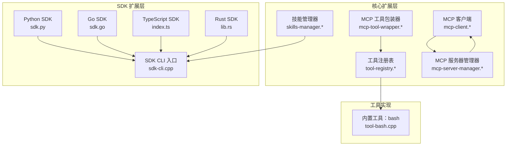
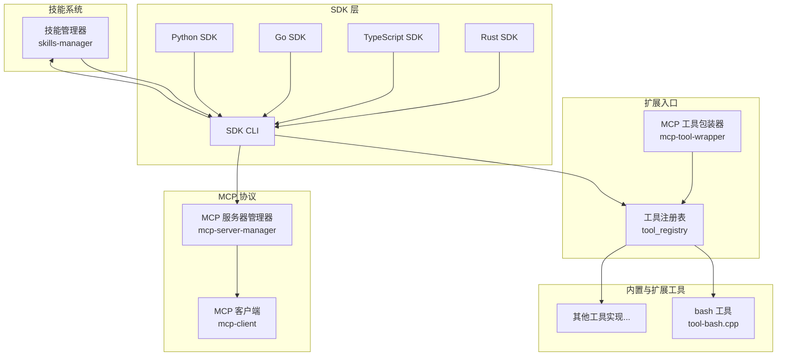
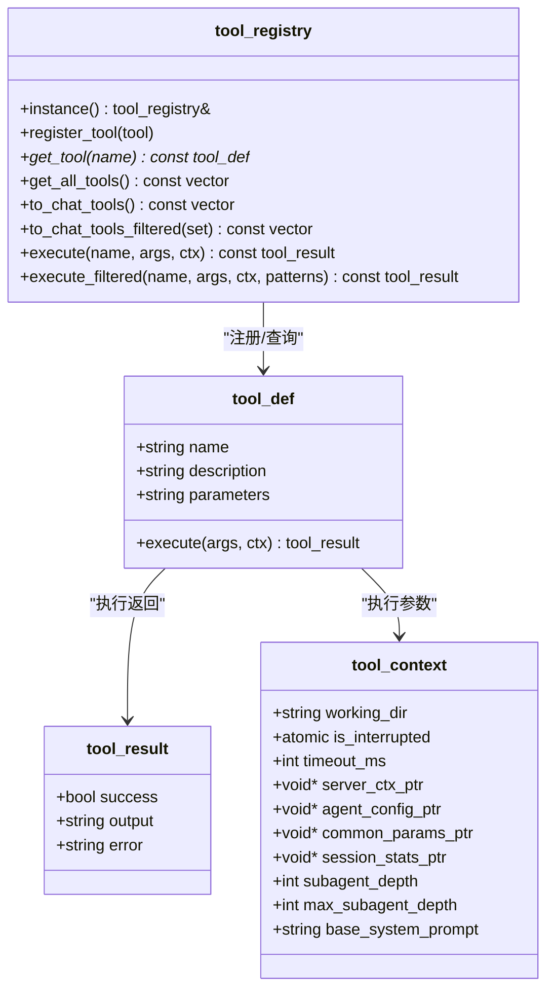
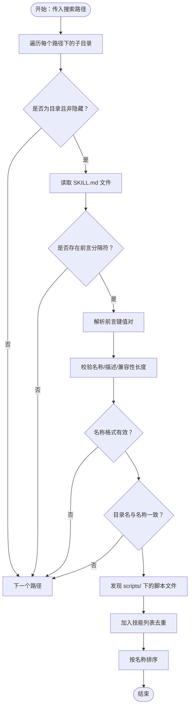
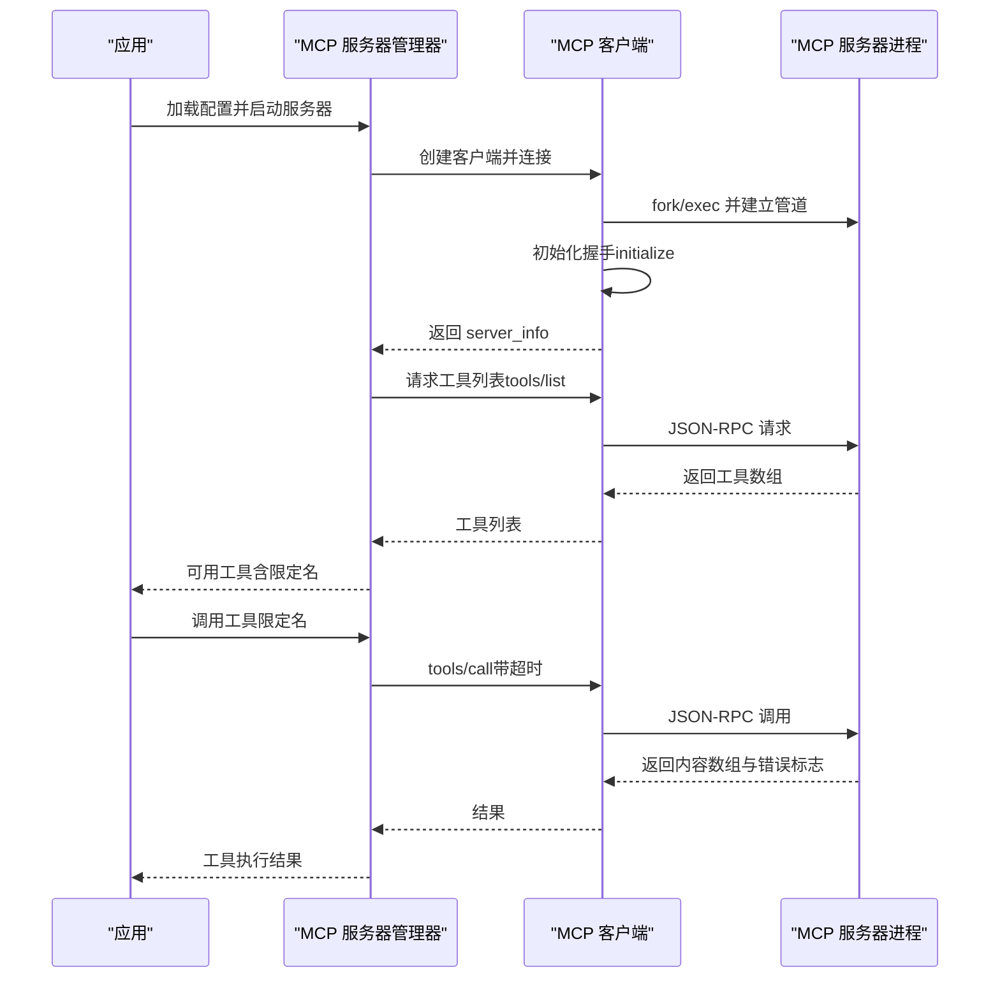
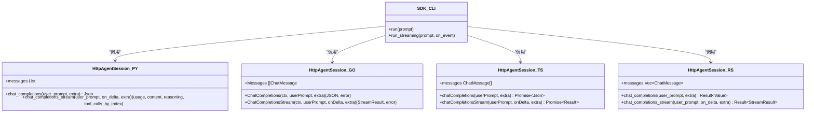
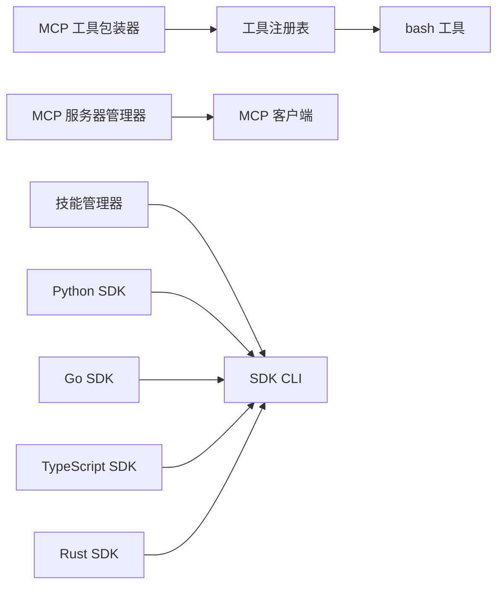

# 扩展机制设计

<cite>
**本文引用的文件**
- [tool-registry.h](file://agent/tool-registry.h)
- [tool-registry.cpp](file://agent/tool-registry.cpp)
- [skills-manager.h](file://agent/skills/skills-manager.h)
- [skills-manager.cpp](file://agent/skills/skills-manager.cpp)
- [mcp-client.h](file://agent/mcp/mcp-client.h)
- [mcp-client.cpp](file://agent/mcp/mcp-client.cpp)
- [mcp-server-manager.h](file://agent/mcp/mcp-server-manager.h)
- [mcp-server-manager.cpp](file://agent/mcp/mcp-server-manager.cpp)
- [mcp-tool-wrapper.h](file://agent/mcp/mcp-tool-wrapper.h)
- [mcp-tool-wrapper.cpp](file://agent/mcp/mcp-tool-wrapper.cpp)
- [tool-bash.cpp](file://agent/tools/tool-bash.cpp)
- [sdk.py](file://SDKs/python/src/llama_agent_sdk/sdk.py)
- [sdk.go](file://SDKs/go/llamaagentsdk/sdk.go)
- [index.ts](file://SDKs/typescript/src/index.ts)
- [lib.rs](file://SDKs/rust/src/lib.rs)
- [sdk-cli.cpp](file://agent/sdk/sdk-cli.cpp)
- [mcp-manager.h](file://agent/sdk/mcp-manager.h)
</cite>

## 目录
1. [引言](#引言)
2. [项目结构](#项目结构)
3. [核心组件](#核心组件)
4. [架构总览](#架构总览)
5. [详细组件分析](#详细组件分析)
6. [依赖分析](#依赖分析)
7. [性能考量](#性能考量)
8. [故障排查指南](#故障排查指南)
9. [结论](#结论)
10. [附录](#附录)

## 引言
本设计文档聚焦于 llama.cpp-agent 的扩展机制，系统化阐述插件化架构与扩展点设计，包括：
- 工具扩展机制（通过工具注册表与注册宏）
- 技能扩展机制（基于 SKILL.md 规范的发现与注入）
- MCP 协议扩展（通过 MCP 客户端与服务器管理器桥接外部工具）
- SDK 扩展支持（多语言 SDK 对 HTTP 接口的封装）

文档同时解释扩展点的接口规范、注册流程与生命周期管理，并提供扩展开发指南、最佳实践、性能考虑与向后兼容性保障。

## 项目结构
从扩展视角看，项目采用“核心能力 + 多语言 SDK + MCP 协议桥接”的分层组织：
- 核心扩展基础设施位于 agent 目录，包含工具注册表、技能管理器、MCP 客户端与服务器管理器、工具包装器等
- SDKs 目录提供 Python/Go/TypeScript/Rust 四种语言的 HTTP 客户端封装
- CLI 层通过 SDK 封装提供命令行交互入口

**图表来源**
- [tool-registry.h:58-97](file://agent/tool-registry.h#L58-L97)
- [tool-registry.cpp:11-85](file://agent/tool-registry.cpp#L11-L85)
- [skills-manager.h:28-63](file://agent/skills/skills-manager.h#L28-L63)
- [skills-manager.cpp:240-330](file://agent/skills/skills-manager.cpp#L240-L330)
- [mcp-client.h:34-96](file://agent/mcp/mcp-client.h#L34-L96)
- [mcp-client.cpp:21-122](file://agent/mcp/mcp-client.cpp#L21-L122)
- [mcp-server-manager.h:21-67](file://agent/mcp/mcp-server-manager.h#L21-L67)
- [mcp-server-manager.cpp:21-98](file://agent/mcp/mcp-server-manager.cpp#L21-L98)
- [mcp-tool-wrapper.h:1-8](file://agent/mcp/mcp-tool-wrapper.h#L1-L8)
- [mcp-tool-wrapper.cpp:7-63](file://agent/mcp/mcp-tool-wrapper.cpp#L7-L63)
- [tool-bash.cpp:260-281](file://agent/tools/tool-bash.cpp#L260-L281)
- [sdk.py:102-224](file://SDKs/python/src/llama_agent_sdk/sdk.py#L102-L224)
- [sdk-cli.cpp:62-157](file://agent/sdk/sdk-cli.cpp#L62-L157)

**章节来源**
- [tool-registry.h:1-103](file://agent/tool-registry.h#L1-L103)
- [tool-registry.cpp:1-86](file://agent/tool-registry.cpp#L1-L86)
- [skills-manager.h:1-63](file://agent/skills/skills-manager.h#L1-L63)
- [skills-manager.cpp:1-330](file://agent/skills/skills-manager.cpp#L1-L330)
- [mcp-client.h:1-97](file://agent/mcp/mcp-client.h#L1-L97)
- [mcp-client.cpp:1-364](file://agent/mcp/mcp-client.cpp#L1-L364)
- [mcp-server-manager.h:1-71](file://agent/mcp/mcp-server-manager.h#L1-L71)
- [mcp-server-manager.cpp:1-245](file://agent/mcp/mcp-server-manager.cpp#L1-L245)
- [mcp-tool-wrapper.h:1-8](file://agent/mcp/mcp-tool-wrapper.h#L1-L8)
- [mcp-tool-wrapper.cpp:1-64](file://agent/mcp/mcp-tool-wrapper.cpp#L1-L64)
- [tool-bash.cpp:1-281](file://agent/tools/tool-bash.cpp#L1-L281)
- [sdk.py:1-224](file://SDKs/python/src/llama_agent_sdk/sdk.py#L1-L224)
- [sdk-cli.cpp:1-157](file://agent/sdk/sdk-cli.cpp#L1-L157)

## 核心组件
本节概述三大扩展核心组件及其职责与交互方式。

- 工具注册表（tool_registry）
  - 负责工具的注册、查询、执行与转换
  - 提供工具上下文与过滤执行能力
  - 支持通过宏进行自动注册

- 技能管理器（skills_manager）
  - 发现并解析 SKILL.md 前言元数据
  - 生成可用于系统提示注入的 XML 片段
  - 验证技能名称与描述长度等规范

- MCP 管理链路
  - MCP 客户端：通过 stdio 传输 JSON-RPC，完成初始化握手与工具调用
  - MCP 服务器管理器：加载配置、启动多个 MCP 服务、统一命名空间与超时控制
  - MCP 工具包装器：将 MCP 工具适配为工具注册表中的标准工具

**章节来源**
- [tool-registry.h:58-97](file://agent/tool-registry.h#L58-L97)
- [tool-registry.cpp:11-85](file://agent/tool-registry.cpp#L11-L85)
- [skills-manager.h:28-63](file://agent/skills/skills-manager.h#L28-L63)
- [skills-manager.cpp:240-330](file://agent/skills/skills-manager.cpp#L240-L330)
- [mcp-client.h:34-96](file://agent/mcp/mcp-client.h#L34-L96)
- [mcp-client.cpp:21-122](file://agent/mcp/mcp-client.cpp#L21-L122)
- [mcp-server-manager.h:21-67](file://agent/mcp/mcp-server-manager.h#L21-L67)
- [mcp-server-manager.cpp:21-158](file://agent/mcp/mcp-server-manager.cpp#L21-L158)
- [mcp-tool-wrapper.h:1-8](file://agent/mcp/mcp-tool-wrapper.h#L1-L8)
- [mcp-tool-wrapper.cpp:7-63](file://agent/mcp/mcp-tool-wrapper.cpp#L7-L63)

## 架构总览
下图展示扩展机制的整体架构：工具注册表作为统一入口；技能管理器负责系统提示注入；MCP 管理器桥接外部工具；SDK 层提供多语言客户端封装。

**图表来源**
- [tool-registry.h:58-97](file://agent/tool-registry.h#L58-L97)
- [tool-registry.cpp:11-85](file://agent/tool-registry.cpp#L11-L85)
- [tool-bash.cpp:260-281](file://agent/tools/tool-bash.cpp#L260-L281)
- [skills-manager.cpp:240-330](file://agent/skills/skills-manager.cpp#L240-L330)
- [mcp-server-manager.cpp:21-158](file://agent/mcp/mcp-server-manager.cpp#L21-L158)
- [mcp-client.cpp:21-122](file://agent/mcp/mcp-client.cpp#L21-L122)
- [mcp-tool-wrapper.cpp:7-63](file://agent/mcp/mcp-tool-wrapper.cpp#L7-L63)
- [sdk.py:102-224](file://SDKs/python/src/llama_agent_sdk/sdk.py#L102-L224)
- [sdk-cli.cpp:62-157](file://agent/sdk/sdk-cli.cpp#L62-L157)

## 详细组件分析

### 工具扩展机制（工具注册表与注册宏）
- 接口规范
  - 工具定义包含名称、描述、参数模式（JSON Schema 字符串）与执行函数指针
  - 工具上下文包含工作目录、中断原子标志、超时、子代理深度与缓存前缀等
  - 工具结果包含成功标志、输出文本与错误信息
  - 工具注册表提供单例、注册、查询、全量导出、过滤导出与执行方法

- 注册流程
  - 使用注册宏在编译期构造工具登记对象，借助静态变量的构造函数自动注册到全局注册表
  - 内置 bash 工具展示了典型实现：定义工具元数据与执行函数，使用宏完成注册

- 生命周期管理
  - 工具注册发生在静态初始化阶段，随进程生命周期存在
  - 工具执行可受上下文中断标志与超时控制

**图表来源**
- [tool-registry.h:18-56](file://agent/tool-registry.h#L18-L56)
- [tool-registry.h:58-97](file://agent/tool-registry.h#L58-L97)
- [tool-registry.cpp:11-85](file://agent/tool-registry.cpp#L11-L85)

**章节来源**
- [tool-registry.h:18-56](file://agent/tool-registry.h#L18-L56)
- [tool-registry.h:92-103](file://agent/tool-registry.h#L92-L103)
- [tool-registry.cpp:11-85](file://agent/tool-registry.cpp#L11-L85)
- [tool-bash.cpp:260-281](file://agent/tools/tool-bash.cpp#L260-L281)

### 技能扩展机制（SKILL.md 规范）
- 接口规范
  - 技能元数据包含名称、描述、路径、目录、许可证、兼容性、附加元数据、脚本列表与允许使用的工具列表
  - 技能管理器负责发现、解析、验证与生成系统提示注入片段

- 解析与校验
  - 识别 SKILL.md 前言（三短横线分隔），提取键值对，支持缩进的 metadata 子段
  - 校验技能名称格式（小写字母、数字、连字符，不以连字符开头或结尾，无连续连字符）
  - 校验描述与兼容性长度上限
  - 校验技能目录名与名称一致

- 注入策略
  - 生成 XML 片段，转义特殊字符，包含技能信息、脚本列表与允许工具列表
  - 作为系统提示的一部分注入，供模型推理时参考

**图表来源**
- [skills-manager.cpp:240-330](file://agent/skills/skills-manager.cpp#L240-L330)
- [skills-manager.cpp:96-186](file://agent/skills/skills-manager.cpp#L96-L186)
- [skills-manager.cpp:188-238](file://agent/skills/skills-manager.cpp#L188-L238)

**章节来源**
- [skills-manager.h:11-24](file://agent/skills/skills-manager.h#L11-L24)
- [skills-manager.h:28-63](file://agent/skills/skills-manager.h#L28-L63)
- [skills-manager.cpp:45-78](file://agent/skills/skills-manager.cpp#L45-L78)
- [skills-manager.cpp:96-186](file://agent/skills/skills-manager.cpp#L96-L186)
- [skills-manager.cpp:188-238](file://agent/skills/skills-manager.cpp#L188-L238)
- [skills-manager.cpp:240-330](file://agent/skills/skills-manager.cpp#L240-L330)

### MCP 协议扩展
- MCP 客户端
  - 通过管道连接外部 MCP 服务器进程，执行 JSON-RPC 2.0 协议
  - 实现初始化握手、工具列表查询与工具调用，支持超时与错误处理
  - 提供连接状态检查与优雅关闭

- MCP 服务器管理器
  - 从 JSON 配置加载多个服务器，支持环境变量替换
  - 统一启动所有启用的服务器，维护连接状态
  - 提供工具名限定与解析（mcp__server__tool），按配置超时调用

- MCP 工具包装器
  - 将 MCP 工具转换为工具注册表中的标准工具
  - 将 MCP 返回的内容项（文本/图片/资源）拼接为输出字符串
  - 错误状态映射为工具执行失败

**图表来源**
- [mcp-client.cpp:21-122](file://agent/mcp/mcp-client.cpp#L21-L122)
- [mcp-client.cpp:134-192](file://agent/mcp/mcp-client.cpp#L134-L192)
- [mcp-server-manager.cpp:21-98](file://agent/mcp/mcp-server-manager.cpp#L21-L98)
- [mcp-server-manager.cpp:110-158](file://agent/mcp/mcp-server-manager.cpp#L110-L158)
- [mcp-tool-wrapper.cpp:7-63](file://agent/mcp/mcp-tool-wrapper.cpp#L7-L63)

**章节来源**
- [mcp-client.h:34-96](file://agent/mcp/mcp-client.h#L34-L96)
- [mcp-client.cpp:21-122](file://agent/mcp/mcp-client.cpp#L21-L122)
- [mcp-client.cpp:134-192](file://agent/mcp/mcp-client.cpp#L134-L192)
- [mcp-server-manager.h:21-67](file://agent/mcp/mcp-server-manager.h#L21-L67)
- [mcp-server-manager.cpp:21-158](file://agent/mcp/mcp-server-manager.cpp#L21-L158)
- [mcp-tool-wrapper.h:1-8](file://agent/mcp/mcp-tool-wrapper.h#L1-L8)
- [mcp-tool-wrapper.cpp:7-63](file://agent/mcp/mcp-tool-wrapper.cpp#L7-L63)

### SDK 扩展支持（多语言客户端）
- Python SDK
  - 提供 HttpAgentSession，支持非流式与流式对话，聚合 SSE 数据，累积 tool_calls
  - 支持系统提示注入、消息历史管理与请求头设置

- Go SDK
  - 类似 Python 的会话封装，支持 SSE 流式解析与 tool_calls 聚合
  - 提供默认 User-Agent 设置与超时控制

- TypeScript SDK
  - 基于 Fetch 的异步实现，支持 AbortSignal 超时
  - SSE 解析与 tool_calls 聚合逻辑与其它 SDK 保持一致

- Rust SDK
  - 基于 reqwest 的阻塞实现，支持 SSE 行级解析与 tool_calls 聚合
  - 提供 BTreeMap 有序索引存储工具调用

- SDK CLI
  - 命令行入口，支持开关控制是否启用技能、Agents-MD、MCP
  - 提供权限请求交互与最终响应输出

**图表来源**
- [sdk.py:102-224](file://SDKs/python/src/llama_agent_sdk/sdk.py#L102-L224)
- [sdk.go:38-267](file://SDKs/go/llamaagentsdk/sdk.go#L38-L267)
- [index.ts:83-221](file://SDKs/typescript/src/index.ts#L83-L221)
- [lib.rs:58-274](file://SDKs/rust/src/lib.rs#L58-L274)
- [sdk-cli.cpp:62-157](file://agent/sdk/sdk-cli.cpp#L62-L157)

**章节来源**
- [sdk.py:102-224](file://SDKs/python/src/llama_agent_sdk/sdk.py#L102-L224)
- [sdk.go:38-267](file://SDKs/go/llamaagentsdk/sdk.go#L38-L267)
- [index.ts:83-221](file://SDKs/typescript/src/index.ts#L83-L221)
- [lib.rs:58-274](file://SDKs/rust/src/lib.rs#L58-L274)
- [sdk-cli.cpp:62-157](file://agent/sdk/sdk-cli.cpp#L62-L157)

## 依赖分析
- 组件耦合
  - 工具注册表与工具实现强内聚，通过宏解耦注册与实现
  - MCP 工具包装器依赖 MCP 服务器管理器，管理器持有客户端实例
  - 技能管理器与 SDK CLI 之间通过系统提示注入间接耦合

- 外部依赖
  - MCP 客户端依赖系统进程与管道通信（fork/exec/poll/pipe）
  - SDK 依赖 HTTP 客户端库与 SSE 流解析
  - 工具执行可能依赖操作系统命令与文件系统

**图表来源**
- [tool-registry.cpp:11-85](file://agent/tool-registry.cpp#L11-L85)
- [tool-bash.cpp:260-281](file://agent/tools/tool-bash.cpp#L260-L281)
- [mcp-tool-wrapper.cpp:7-63](file://agent/mcp/mcp-tool-wrapper.cpp#L7-L63)
- [mcp-server-manager.cpp:21-158](file://agent/mcp/mcp-server-manager.cpp#L21-L158)
- [mcp-client.cpp:21-122](file://agent/mcp/mcp-client.cpp#L21-L122)
- [skills-manager.cpp:240-330](file://agent/skills/skills-manager.cpp#L240-L330)
- [sdk-cli.cpp:62-157](file://agent/sdk/sdk-cli.cpp#L62-L157)
- [sdk.py:102-224](file://SDKs/python/src/llama_agent_sdk/sdk.py#L102-L224)
- [sdk.go:38-267](file://SDKs/go/llamaagentsdk/sdk.go#L38-L267)
- [index.ts:83-221](file://SDKs/typescript/src/index.ts#L83-L221)
- [lib.rs:58-274](file://SDKs/rust/src/lib.rs#L58-L274)

**章节来源**
- [tool-registry.cpp:11-85](file://agent/tool-registry.cpp#L11-L85)
- [mcp-tool-wrapper.cpp:7-63](file://agent/mcp/mcp-tool-wrapper.cpp#L7-L63)
- [mcp-server-manager.cpp:21-158](file://agent/mcp/mcp-server-manager.cpp#L21-L158)
- [mcp-client.cpp:21-122](file://agent/mcp/mcp-client.cpp#L21-L122)
- [skills-manager.cpp:240-330](file://agent/skills/skills-manager.cpp#L240-L330)
- [sdk-cli.cpp:62-157](file://agent/sdk/sdk-cli.cpp#L62-L157)

## 性能考量
- 工具执行
  - bash 工具实现中对输出长度与行数进行截断，避免过长输出影响性能与内存占用
  - 超时与中断标志确保长时间运行命令可被及时终止

- MCP 通信
  - 客户端使用非阻塞读与 poll 机制，结合超时控制，提升响应性
  - 服务器管理器按配置设置工具调用超时，避免阻塞

- SDK 流式处理
  - 各语言 SDK 对 SSE 流进行增量解析，减少一次性内存压力
  - tool_calls 聚合采用索引映射，便于后续处理

- 技能注入
  - 技能发现与排序在启动阶段完成，系统提示注入为常量开销

**章节来源**
- [tool-bash.cpp:25-48](file://agent/tools/tool-bash.cpp#L25-L48)
- [tool-bash.cpp:174-236](file://agent/tools/tool-bash.cpp#L174-L236)
- [mcp-client.cpp:277-347](file://agent/mcp/mcp-client.cpp#L277-L347)
- [mcp-server-manager.cpp:151-157](file://agent/mcp/mcp-server-manager.cpp#L151-L157)
- [sdk.py:62-99](file://SDKs/python/src/llama_agent_sdk/sdk.py#L62-L99)
- [sdk.go:150-265](file://SDKs/go/llamaagentsdk/sdk.go#L150-L265)
- [index.ts:157-217](file://SDKs/typescript/src/index.ts#L157-L217)
- [lib.rs:146-271](file://SDKs/rust/src/lib.rs#L146-L271)
- [skills-manager.cpp:282-287](file://agent/skills/skills-manager.cpp#L282-L287)

## 故障排查指南
- 工具执行错误
  - 工具不存在：返回未知工具错误
  - 工具抛异常：捕获异常并返回错误信息
  - bash 工具：检查命令参数、工作目录、超时与中断标志

- MCP 连接问题
  - 进程启动失败：检查命令、参数与环境变量
  - 握手失败：确认协议版本与初始化响应
  - 工具调用超时：调整服务器配置超时或优化服务器性能
  - 服务器断开：检查进程存活与日志

- 技能解析失败
  - 缺少前言分隔符或格式不正确
  - 名称格式非法或与目录名不一致
  - 描述/兼容性超出长度限制

- SDK 使用问题
  - HTTP 请求失败：检查 URL、鉴权头与网络连通性
  - SSE 解析异常：确认服务端输出格式与编码
  - tool_calls 聚合异常：检查索引与增量拼接逻辑

**章节来源**
- [tool-registry.cpp:49-60](file://agent/tool-registry.cpp#L49-L60)
- [tool-registry.cpp:62-85](file://agent/tool-registry.cpp#L62-L85)
- [tool-bash.cpp:50-56](file://agent/tools/tool-bash.cpp#L50-L56)
- [mcp-client.cpp:21-122](file://agent/mcp/mcp-client.cpp#L21-L122)
- [mcp-client.cpp:169-192](file://agent/mcp/mcp-client.cpp#L169-L192)
- [mcp-server-manager.cpp:126-158](file://agent/mcp/mcp-server-manager.cpp#L126-L158)
- [skills-manager.cpp:96-186](file://agent/skills/skills-manager.cpp#L96-L186)
- [sdk.py:126-131](file://SDKs/python/src/llama_agent_sdk/sdk.py#L126-L131)
- [sdk.go:110-140](file://SDKs/go/llamaagentsdk/sdk.go#L110-L140)
- [index.ts:142-155](file://SDKs/typescript/src/index.ts#L142-L155)
- [lib.rs:130-144](file://SDKs/rust/src/lib.rs#L130-L144)

## 结论
llama.cpp-agent 的扩展机制以工具注册表为核心，辅以技能管理与 MCP 协议桥接，并通过多语言 SDK 提供统一的外部访问入口。该设计具备良好的模块化、可扩展性与跨平台特性，既满足本地工具的快速集成，也支持外部 MCP 服务器的灵活接入。通过明确的接口规范、注册流程与生命周期管理，开发者可以高效地构建自定义工具、技能与插件，同时获得稳定的性能与可观测性。

## 附录

### 扩展开发指南（工具）
- 定义工具元数据
  - 准备名称、描述与参数 JSON Schema 字符串
  - 实现执行函数，接收参数与工具上下文，返回工具结果

- 注册工具
  - 在实现文件中定义工具对象
  - 使用注册宏将其自动注册到工具注册表

- 最佳实践
  - 参数 Schema 应完整描述必填字段与类型
  - 执行函数应处理超时与中断，避免阻塞
  - 输出进行长度与行数限制，必要时提供摘要

**章节来源**
- [tool-registry.h:44-56](file://agent/tool-registry.h#L44-L56)
- [tool-registry.h:92-103](file://agent/tool-registry.h#L92-L103)
- [tool-registry.cpp:11-85](file://agent/tool-registry.cpp#L11-L85)
- [tool-bash.cpp:260-281](file://agent/tools/tool-bash.cpp#L260-L281)

### 扩展开发指南（技能）
- 目录结构
  - 每个技能一个独立目录，目录名即技能名称
  - 目录内包含 SKILL.md，采用 YAML 风格前言

- 前言字段
  - 必填：name、description
  - 可选：license、compatibility、metadata、allowed-tools
  - scripts/ 子目录存放脚本文件（可选）

- 注入与使用
  - 技能管理器扫描路径并解析技能
  - 生成 XML 片段注入系统提示
  - 模型在推理时参考可用技能与脚本

**章节来源**
- [skills-manager.h:11-24](file://agent/skills/skills-manager.h#L11-L24)
- [skills-manager.cpp:96-186](file://agent/skills/skills-manager.cpp#L96-L186)
- [skills-manager.cpp:240-330](file://agent/skills/skills-manager.cpp#L240-L330)

### 扩展开发指南（MCP）
- 配置文件
  - JSON 格式，servers 对象包含多个服务器配置
  - 字段：command、args（可选）、env（可选）、enabled（可选）、timeout_ms（可选）

- 工具命名
  - 限定名为 mcp__<server>__<tool>，包装器自动转换
  - 服务器与工具名中的双下划线将被替换为单下划线

- 调用流程
  - 服务器管理器加载配置并启动客户端
  - 列出工具并注册到工具注册表
  - 通过限定名调用工具，按配置超时

**章节来源**
- [mcp-server-manager.h:11-18](file://agent/mcp/mcp-server-manager.h#L11-L18)
- [mcp-server-manager.cpp:21-98](file://agent/mcp/mcp-server-manager.cpp#L21-L98)
- [mcp-server-manager.cpp:173-208](file://agent/mcp/mcp-server-manager.cpp#L173-L208)
- [mcp-tool-wrapper.cpp:7-63](file://agent/mcp/mcp-tool-wrapper.cpp#L7-L63)

### 扩展开发指南（SDK）
- 选择语言
  - Python/Go/TypeScript/Rust SDK 提供一致的 API 语义
  - 通过 HttpAgentSession 进行聊天补全与流式处理

- 关键点
  - 设置 base_url 与鉴权头（如需）
  - 控制请求超时与系统提示
  - 处理 tool_calls 聚合与 usage 统计

**章节来源**
- [sdk.py:102-224](file://SDKs/python/src/llama_agent_sdk/sdk.py#L102-L224)
- [sdk.go:38-267](file://SDKs/go/llamaagentsdk/sdk.go#L38-L267)
- [index.ts:83-221](file://SDKs/typescript/src/index.ts#L83-L221)
- [lib.rs:58-274](file://SDKs/rust/src/lib.rs#L58-L274)

### 向后兼容性保证机制
- 接口稳定性
  - 工具注册表与技能管理器的公共接口保持稳定，新增能力以可选参数或新方法形式提供

- MCP 协议
  - 严格遵循 JSON-RPC 2.0 与 MCP 协议版本号，避免破坏性变更
  - 服务器管理器支持环境变量替换与超时配置，增强可移植性

- SDK 兼容
  - 各语言 SDK 保持相同的 API 语义与行为约定
  - 流式处理与 tool_calls 聚合逻辑一致，便于跨语言迁移

**章节来源**
- [tool-registry.h:58-97](file://agent/tool-registry.h#L58-L97)
- [skills-manager.h:28-63](file://agent/skills/skills-manager.h#L28-L63)
- [mcp-client.cpp:94-121](file://agent/mcp/mcp-client.cpp#L94-L121)
- [mcp-server-manager.cpp:210-226](file://agent/mcp/mcp-server-manager.cpp#L210-L226)
- [sdk.py:102-224](file://SDKs/python/src/llama_agent_sdk/sdk.py#L102-L224)
- [sdk.go:38-267](file://SDKs/go/llamaagentsdk/sdk.go#L38-L267)
- [index.ts:83-221](file://SDKs/typescript/src/index.ts#L83-L221)
- [lib.rs:58-274](file://SDKs/rust/src/lib.rs#L58-L274)