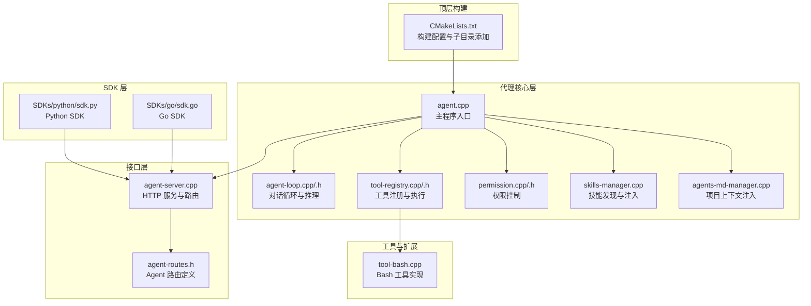
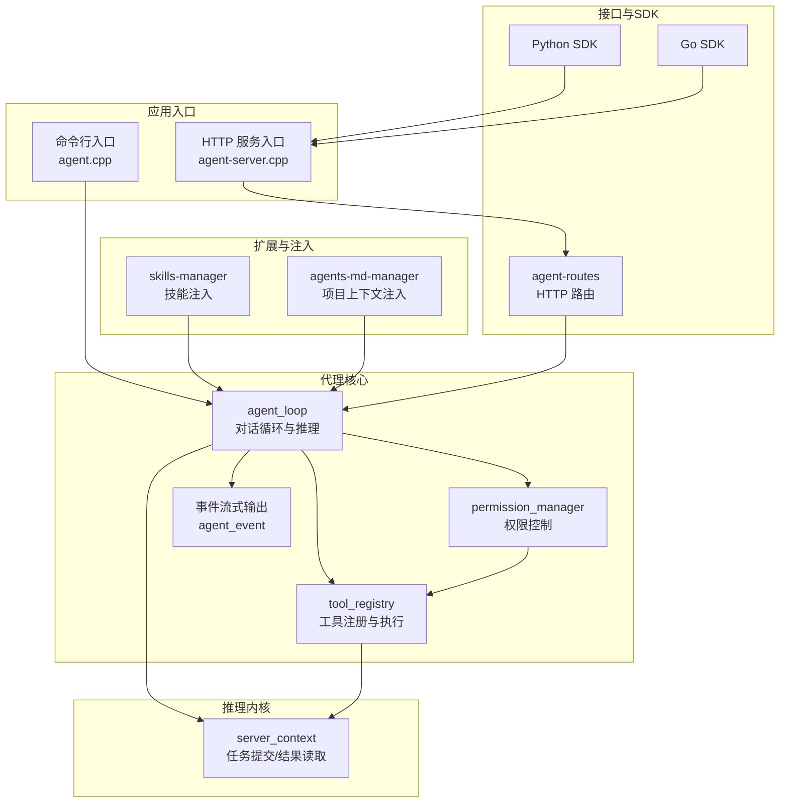
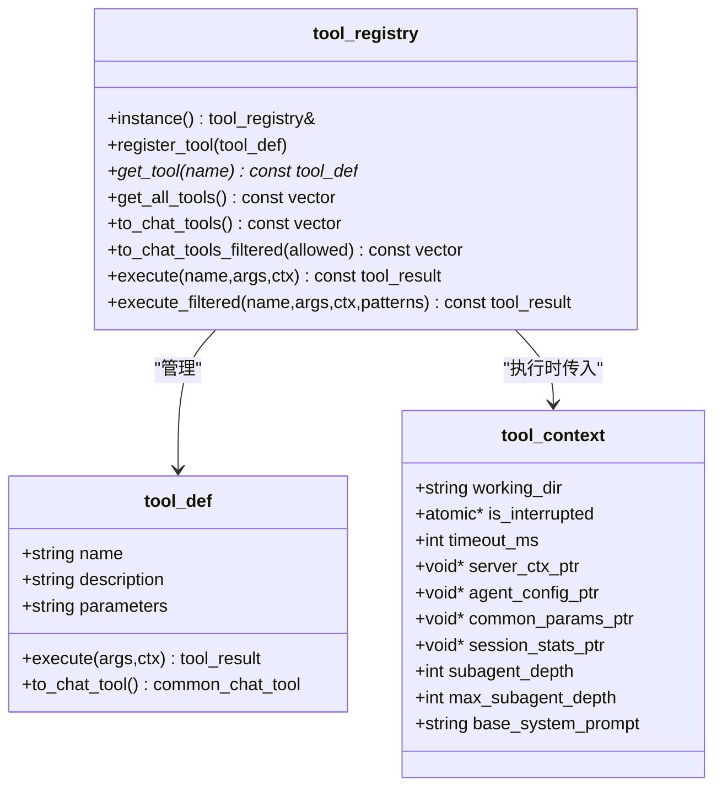
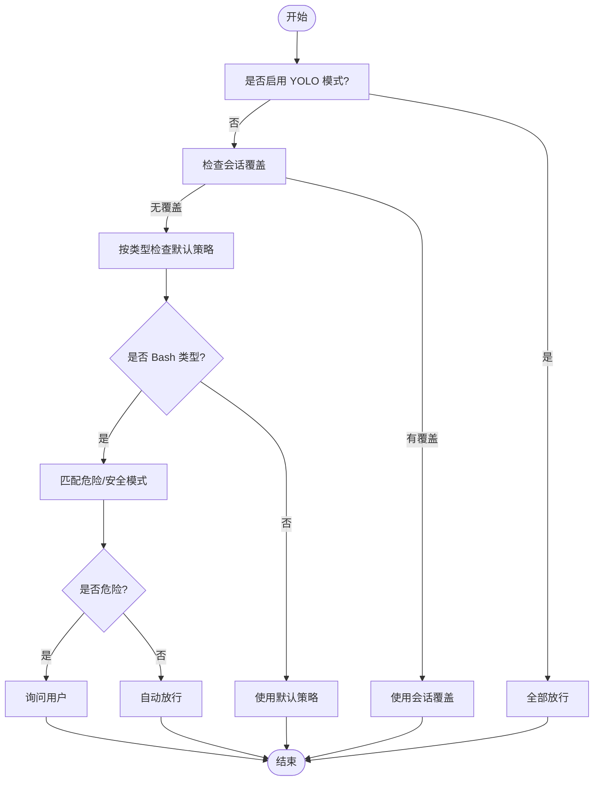
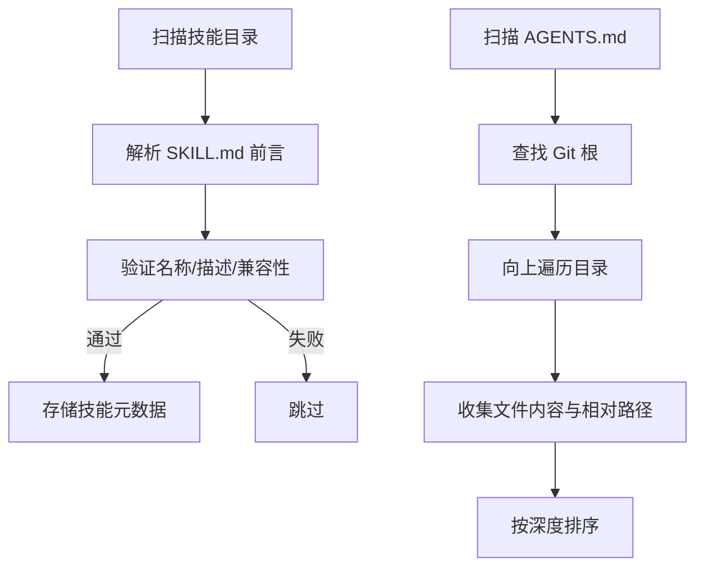
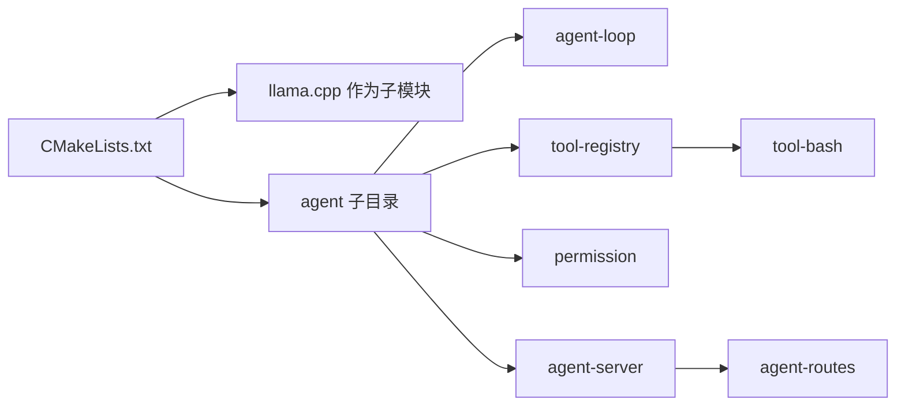

# 架构设计概览

<cite>
**本文档引用的文件**
- [CMakeLists.txt](file://CMakeLists.txt)
- [agent.cpp](file://agent/agent.cpp)
- [agent-loop.cpp](file://agent/agent-loop.cpp)
- [agent-loop.h](file://agent/agent-loop.h)
- [tool-registry.cpp](file://agent/tool-registry.cpp)
- [tool-registry.h](file://agent/tool-registry.h)
- [permission.cpp](file://agent/permission.cpp)
- [permission.h](file://agent/permission.h)
- [agent-server.cpp](file://agent/server/agent-server.cpp)
- [agent-routes.h](file://agent/server/agent-routes.h)
- [tool-bash.cpp](file://agent/tools/tool-bash.cpp)
- [skills-manager.cpp](file://agent/skills/skills-manager.cpp)
- [agents-md-manager.cpp](file://agent/agents-md/agents-md-manager.cpp)
- [sdk.py](file://SDKs/python/src/llama_agent_sdk/sdk.py)
- [sdk.go](file://SDKs/go/llamaagentsdk/sdk.go)
</cite>

## 目录
1. [引言](#引言)
2. [项目结构](#项目结构)
3. [核心组件](#核心组件)
4. [架构总览](#架构总览)
5. [详细组件分析](#详细组件分析)
6. [依赖关系分析](#依赖关系分析)
7. [性能考虑](#性能考虑)
8. [故障排除指南](#故障排除指南)
9. [结论](#结论)

## 引言
本项目为 llama.cpp-agent，是一个基于本地大模型推理引擎的智能体系统，支持命令行交互与 HTTP 接口两种运行形态，并通过工具注册机制扩展能力。系统采用分层架构设计，包含代理核心层、工具管理层、权限控制层、接口层以及多语言 SDK 层，形成从底层推理到上层应用的完整闭环。

## 项目结构
项目采用模块化布局，核心逻辑集中在 agent 目录，服务端入口位于 agent/server，工具与技能管理分别在 tools 与 skills 子目录，SDKs 提供多语言客户端封装。



**图表来源**
- [CMakeLists.txt:1-44](file://CMakeLists.txt#L1-L44)
- [agent.cpp:101-588](file://agent/agent.cpp#L101-L588)
- [agent-loop.cpp:1-800](file://agent/agent-loop.cpp#L1-L800)
- [tool-registry.cpp:1-86](file://agent/tool-registry.cpp#L1-L86)
- [permission.cpp:1-310](file://agent/permission.cpp#L1-L310)
- [skills-manager.cpp:1-330](file://agent/skills/skills-manager.cpp#L1-L330)
- [agents-md-manager.cpp:1-179](file://agent/agents-md/agents-md-manager.cpp#L1-L179)
- [agent-server.cpp:105-731](file://agent/server/agent-server.cpp#L105-L731)
- [agent-routes.h:14-68](file://agent/server/agent-routes.h#L14-L68)
- [tool-bash.cpp:50-281](file://agent/tools/tool-bash.cpp#L50-L281)
- [sdk.py:102-224](file://SDKs/python/src/llama_agent_sdk/sdk.py#L102-L224)
- [sdk.go:38-267](file://SDKs/go/llamaagentsdk/sdk.go#L38-L267)

**章节来源**
- [CMakeLists.txt:1-44](file://CMakeLists.txt#L1-L44)
- [agent.cpp:101-588](file://agent/agent.cpp#L101-L588)

## 核心组件
- 代理核心层：负责对话循环、推理调度、工具调用与权限检查，提供事件流式输出能力。
- 工具管理层：统一注册与执行工具，支持过滤执行与 Bash 模式限制。
- 权限控制层：基于类型与会话状态的权限判定，支持危险操作检测与用户确认。
- 接口层：提供 HTTP 服务与 OpenAI 兼容路由，支持会话管理、权限响应与统计查询。
- 扩展与注入：技能（agentskills.io）与项目上下文（agents.md）的自动发现与提示词注入。
- 多语言 SDK：Python 与 Go SDK 提供一致的会话与流式接口。

**章节来源**
- [agent-loop.h:167-276](file://agent/agent-loop.h#L167-L276)
- [tool-registry.h:58-103](file://agent/tool-registry.h#L58-L103)
- [permission.h:40-102](file://agent/permission.h#L40-L102)
- [agent-routes.h:14-68](file://agent/server/agent-routes.h#L14-L68)
- [skills-manager.cpp:240-330](file://agent/skills/skills-manager.cpp#L240-L330)
- [agents-md-manager.cpp:75-179](file://agent/agents-md/agents-md-manager.cpp#L75-L179)

## 架构总览
系统采用“推理内核 + 可插拔工具 + 权限控制 + 多接口”的分层设计。推理内核来自 llama.cpp，通过 server_context 提供统一的任务提交与结果读取；代理核心层封装对话循环与工具调用；权限控制层贯穿工具执行路径；接口层提供 CLI 与 HTTP 两种入口；SDK 层为外部应用提供一致的交互体验。



**图表来源**
- [agent.cpp:101-588](file://agent/agent.cpp#L101-L588)
- [agent-server.cpp:105-731](file://agent/server/agent-server.cpp#L105-L731)
- [agent-loop.cpp:1-800](file://agent/agent-loop.cpp#L1-L800)
- [tool-registry.cpp:1-86](file://agent/tool-registry.cpp#L1-L86)
- [permission.cpp:1-310](file://agent/permission.cpp#L1-L310)
- [agent-routes.h:14-68](file://agent/server/agent-routes.h#L14-L68)
- [skills-manager.cpp:1-330](file://agent/skills/skills-manager.cpp#L1-L330)
- [agents-md-manager.cpp:1-179](file://agent/agents-md/agents-md-manager.cpp#L1-L179)
- [sdk.py:102-224](file://SDKs/python/src/llama_agent_sdk/sdk.py#L102-L224)
- [sdk.go:38-267](file://SDKs/go/llamaagentsdk/sdk.go#L38-L267)

## 详细组件分析

### 代理核心层（agent_loop）
- 职责：维护消息历史、生成补全、解析工具调用、执行工具、记录统计、支持子代理与多模态输入。
- 关键流程：格式化聊天参数 → 提交任务 → 流式接收结果 → 解析工具调用 → 权限校验 → 工具执行 → 追加工具结果 → 继续迭代或结束。
- 设计要点：使用互斥锁保护格式化与任务提交路径；支持子代理深度控制与回调报告；提供事件流式输出便于前端展示。

```mermaid
sequenceDiagram
participant User as "用户"
participant Loop as "agent_loop"
participant Reg as "tool_registry"
participant Perm as "permission_manager"
participant LLM as "server_context"
User->>Loop : "用户输入/工具调用"
Loop->>LLM : "提交聊天任务"
LLM-->>Loop : "流式返回内容/工具调用"
alt 需要工具调用
Loop->>Perm : "权限检查/危险检测"
Perm-->>Loop : "允许/拒绝/询问"
alt 允许
Loop->>Reg : "执行工具"
Reg-->>Loop : "工具结果"
Loop->>LLM : "追加工具结果并继续"
else 拒绝
Loop-->>User : "提示被阻止"
end
else 无需工具调用
Loop-->>User : "最终回复"
end
```

**图表来源**
- [agent-loop.cpp:333-788](file://agent/agent-loop.cpp#L333-L788)
- [tool-registry.cpp:49-86](file://agent/tool-registry.cpp#L49-L86)
- [permission.cpp:108-197](file://agent/permission.cpp#L108-L197)

**章节来源**
- [agent-loop.cpp:1-800](file://agent/agent-loop.cpp#L1-L800)
- [agent-loop.h:167-276](file://agent/agent-loop.h#L167-L276)

### 工具管理层（tool_registry）
- 职责：集中注册工具、按需转换为聊天工具规范、执行工具并支持过滤执行（如只读子代理）。
- 设计模式：单例模式（instance），工具注册采用静态注册器（REGISTER_TOOL 宏）实现自动注册。
- 扩展点：新增工具只需定义 tool_def 并通过宏注册，即可被代理核心识别与调用。



**图表来源**
- [tool-registry.h:58-103](file://agent/tool-registry.h#L58-L103)
- [tool-registry.cpp:1-86](file://agent/tool-registry.cpp#L1-L86)

**章节来源**
- [tool-registry.h:17-103](file://agent/tool-registry.h#L17-L103)
- [tool-registry.cpp:1-86](file://agent/tool-registry.cpp#L1-L86)

### 权限控制层（permission_manager）
- 职责：基于类型与会话状态进行权限判定；内置危险/安全命令模式匹配；支持外部目录访问检测与重复调用检测（doom loop）。
- 设计要点：YOLO 模式跳过所有权限提示；会话覆盖（ALLOW_SESSION/DENY_SESSION）；敏感文件识别；路径归属判断。



**图表来源**
- [permission.cpp:108-197](file://agent/permission.cpp#L108-L197)
- [permission.h:40-102](file://agent/permission.h#L40-L102)

**章节来源**
- [permission.cpp:1-310](file://agent/permission.cpp#L1-L310)
- [permission.h:1-102](file://agent/permission.h#L1-L102)

### 接口层（HTTP 服务与路由）
- 职责：提供健康检查、模型列表、聊天完成、会话管理、权限响应、工具列表与统计查询等接口；支持 SSE 流式输出。
- 设计要点：OpenAI 兼容路由；会话管理器与 Agent 路由解耦；异常包装统一错误响应；支持音频服务（TTS/ASR）扩展端点。

```mermaid
sequenceDiagram
participant Client as "客户端"
participant HTTP as "HTTP 服务"
participant Routes as "Agent 路由"
participant Session as "会话管理"
participant Loop as "agent_loop"
Client->>HTTP : "POST /v1/chat/completions"
HTTP->>Routes : "路由分发"
Routes->>Session : "获取/创建会话"
Session->>Loop : "run_streaming(...)"
Loop-->>Session : "事件流式输出"
Session-->>HTTP : "SSE 数据帧"
HTTP-->>Client : "流式响应"
```

**图表来源**
- [agent-server.cpp:303-426](file://agent/server/agent-server.cpp#L303-L426)
- [agent-routes.h:14-68](file://agent/server/agent-routes.h#L14-L68)
- [agent-loop.h:198-211](file://agent/agent-loop.h#L198-L211)

**章节来源**
- [agent-server.cpp:105-731](file://agent/server/agent-server.cpp#L105-L731)
- [agent-routes.h:14-68](file://agent/server/agent-routes.h#L14-L68)

### 扩展与注入（技能与项目上下文）
- 技能（agentskills.io）：扫描目录结构，解析 SKILL.md 前言元数据，生成 XML 注入提示词，支持脚本发现与工具白名单。
- 项目上下文（agents.md）：向上遍历工作目录至 Git 根，收集 AGENTS.md 文件，按深度排序并生成 XML 注入提示词。



**图表来源**
- [skills-manager.cpp:240-330](file://agent/skills/skills-manager.cpp#L240-L330)
- [agents-md-manager.cpp:75-179](file://agent/agents-md/agents-md-manager.cpp#L75-L179)

**章节来源**
- [skills-manager.cpp:1-330](file://agent/skills/skills-manager.cpp#L1-L330)
- [agents-md-manager.cpp:1-179](file://agent/agents-md/agents-md-manager.cpp#L1-L179)

### 多语言 SDK（Python/Go）
- 职责：提供会话管理、非流式与流式聊天完成、消息历史维护、权限响应等能力。
- 设计要点：统一的 SSE 行解析与事件聚合；工具调用索引聚合；可选的超时与认证头设置。

**章节来源**
- [sdk.py:102-224](file://SDKs/python/src/llama_agent_sdk/sdk.py#L102-L224)
- [sdk.go:38-267](file://SDKs/go/llamaagentsdk/sdk.go#L38-L267)

## 依赖关系分析
- 构建依赖：CMake 将 llama.cpp 作为子模块引入，并添加 agent 子目录，确保推理内核与代理核心共同编译。
- 运行时依赖：CLI 与 HTTP 两种入口共享 agent_loop、tool_registry、permission_manager 等核心组件；HTTP 服务依赖 server_context 与路由层。
- 工具依赖：Bash 工具通过进程/管道执行命令，具备跨平台实现与超时控制；工具执行受权限控制层约束。



**图表来源**
- [CMakeLists.txt:30-43](file://CMakeLists.txt#L30-L43)
- [agent.cpp:101-588](file://agent/agent.cpp#L101-L588)
- [agent-server.cpp:105-731](file://agent/server/agent-server.cpp#L105-L731)

**章节来源**
- [CMakeLists.txt:1-44](file://CMakeLists.txt#L1-L44)
- [agent.cpp:101-588](file://agent/agent.cpp#L101-L588)
- [agent-server.cpp:105-731](file://agent/server/agent-server.cpp#L105-L731)

## 性能考虑
- KV 缓存前缀共享：子代理与父代理共享基础系统提示前缀，最大化 KV 缓存命中率，降低重复计算开销。
- 流式输出与事件驱动：通过互斥锁保护格式化路径，避免阻塞完整生成回路；事件流式输出减少内存峰值。
- 工具执行超时与中断：工具执行具备超时与中断标志，防止长时间阻塞影响整体性能。
- 多模态支持：媒体文件以向量形式传递，避免重复编码开销；仅在需要时启用多模态处理。
- 并行与线程：HTTP 服务与推理内核分离，支持并发请求与后台任务；CUDA 后端可按平台条件启用。

[本节为通用性能建议，不直接分析具体文件]

## 故障排除指南
- 权限相关
  - 症状：工具调用被阻止或反复弹出确认。
  - 排查：检查危险命令模式匹配与外部目录访问检测；确认会话覆盖状态；必要时启用 YOLO 模式快速定位问题。
- 工具执行
  - 症状：命令执行超时或无输出。
  - 排查：检查工具超时配置与中断标志；查看 Bash 工具实现中的跨平台管道读取与进程等待逻辑。
- HTTP 服务
  - 症状：路由无法访问或异常。
  - 排查：确认路由注册与异常包装；检查 SSE 流式响应与 JSON 序列化；验证模型加载状态与监听地址。
- 会话与统计
  - 症状：会话历史丢失或统计不准确。
  - 排查：确认 clear() 与消息追加逻辑；检查子代理统计合并规则。

**章节来源**
- [permission.cpp:108-197](file://agent/permission.cpp#L108-L197)
- [tool-bash.cpp:50-281](file://agent/tools/tool-bash.cpp#L50-L281)
- [agent-server.cpp:303-426](file://agent/server/agent-server.cpp#L303-L426)
- [agent-loop.cpp:298-310](file://agent/agent-loop.cpp#L298-L310)

## 结论
llama.cpp-agent 通过清晰的分层架构实现了从本地推理到工具执行再到接口暴露的完整链路。代理核心层以 agent_loop 为核心，结合工具注册与权限控制，形成可扩展、可审计的智能体执行框架；接口层提供 CLI 与 HTTP 两种入口，满足不同场景需求；SDK 层进一步降低了集成门槛。该设计在保证安全性的同时，兼顾了性能与可扩展性，适合在本地环境中构建复杂工程辅助智能体。