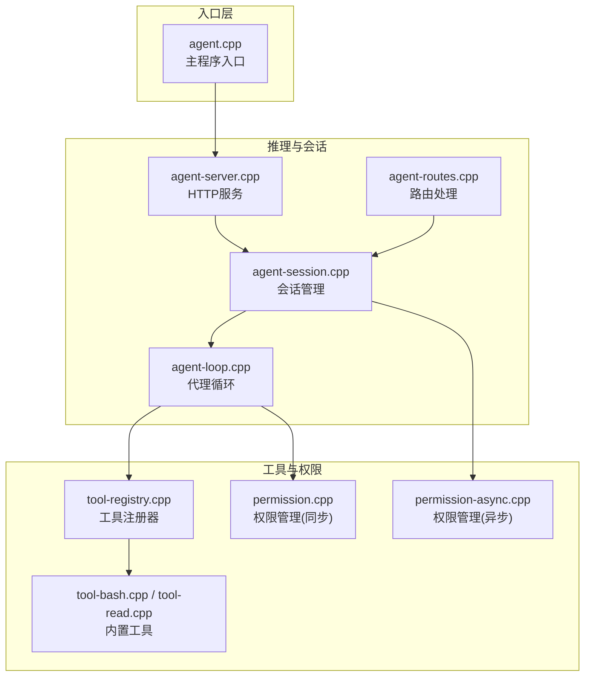
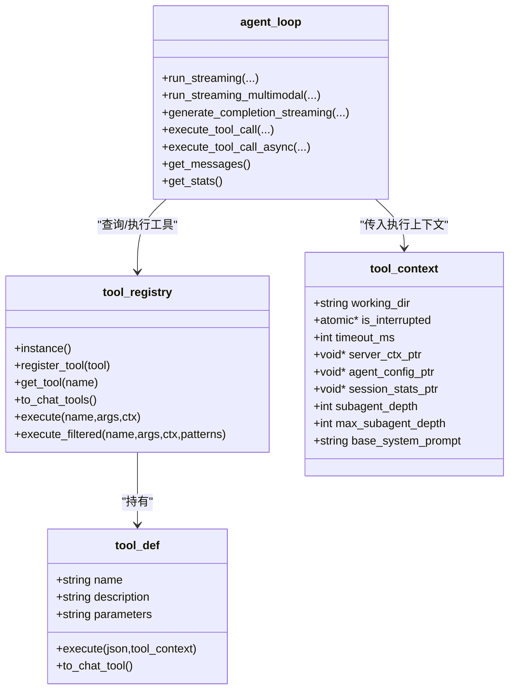
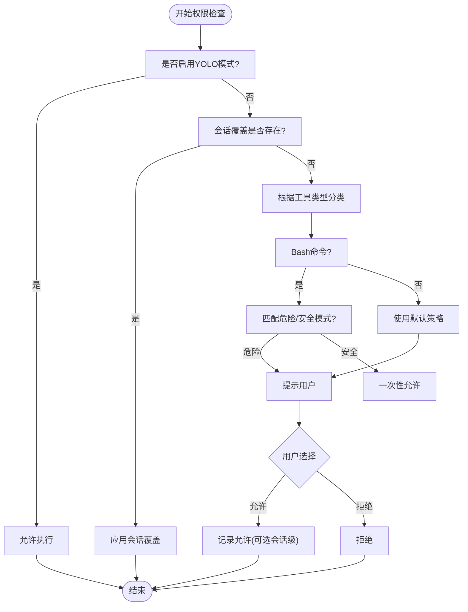
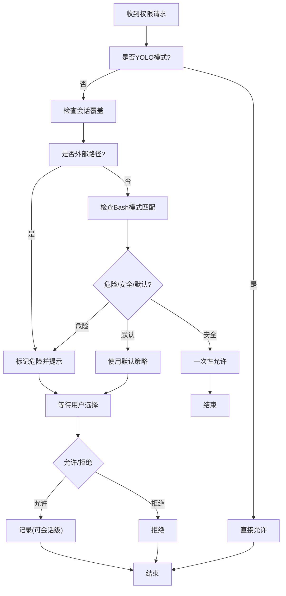
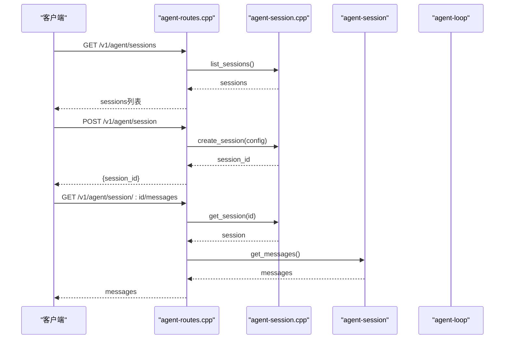
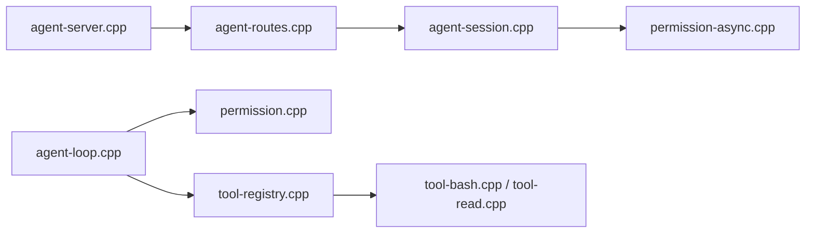

# 组件交互关系

<cite>
**本文档引用的文件**
- [agent.cpp](file://agent/agent.cpp)
- [tool-registry.cpp](file://agent/tool-registry.cpp)
- [tool-registry.h](file://agent/tool-registry.h)
- [permission.cpp](file://agent/permission.cpp)
- [permission.h](file://agent/permission.h)
- [permission-async.cpp](file://agent/permission-async.cpp)
- [agent-loop.cpp](file://agent/agent-loop.cpp)
- [agent-loop.h](file://agent/agent-loop.h)
- [agent-server.cpp](file://agent/server/agent-server.cpp)
- [agent-routes.cpp](file://agent/server/agent-routes.cpp)
- [agent-session.cpp](file://agent/server/agent-session.cpp)
- [tool-bash.cpp](file://agent/tools/tool-bash.cpp)
- [tool-read.cpp](file://agent/tools/tool-read.cpp)
</cite>

## 目录
1. [简介](#简介)
2. [项目结构](#项目结构)
3. [核心组件](#核心组件)
4. [架构总览](#架构总览)
5. [详细组件分析](#详细组件分析)
6. [依赖关系分析](#依赖关系分析)
7. [性能考量](#性能考量)
8. [故障排查指南](#故障排查指南)
9. [结论](#结论)

## 简介
本文件聚焦于 llama.cpp-agent 的组件交互关系，系统性阐述代理核心、工具注册器、权限管理器、HTTP 服务器等核心模块之间的协作模式与通信协议。文档覆盖以下要点：
- 组件间的依赖关系与调用时序
- 工具调用、权限检查、会话管理的典型工作流
- 异步通信与事件驱动机制
- 组件解耦与接口抽象设计原则

## 项目结构
项目采用“功能域+层次”的组织方式：
- 顶层入口负责模型加载、推理线程启动与命令行参数解析
- 代理核心负责对话历史管理、工具调用与权限决策
- 工具注册器提供统一工具注册与执行接口
- 权限管理器支持同步与异步两种模式，保障安全边界
- HTTP 服务器提供 OpenAI 兼容 API，管理会话生命周期并以 SSE 流式返回事件



图表来源
- [agent.cpp:101-584](file://agent/agent.cpp#L101-L584)
- [agent-server.cpp:105-730](file://agent/server/agent-server.cpp#L105-L730)
- [agent-session.cpp:37-348](file://agent/server/agent-session.cpp#L37-L348)
- [agent-routes.cpp:104-494](file://agent/server/agent-routes.cpp#L104-L494)
- [agent-loop.cpp:49-251](file://agent/agent-loop.cpp#L49-L251)
- [tool-registry.cpp:11-86](file://agent/tool-registry.cpp#L11-L86)
- [permission.cpp:35-310](file://agent/permission.cpp#L35-L310)
- [permission-async.cpp:10-283](file://agent/permission-async.cpp#L10-L283)
- [tool-bash.cpp:50-281](file://agent/tools/tool-bash.cpp#L50-L281)
- [tool-read.cpp:17-120](file://agent/tools/tool-read.cpp#L17-L120)

章节来源
- [agent.cpp:101-584](file://agent/agent.cpp#L101-L584)
- [agent-server.cpp:105-730](file://agent/server/agent-server.cpp#L105-L730)

## 核心组件
- 代理核心（agent-loop）
  - 负责构建对话消息、生成补全、解析工具调用、执行工具、统计会话指标
  - 支持同步与异步两种运行模式，异步模式通过事件回调与权限管理器配合
- 工具注册器（tool-registry）
  - 单例注册工具，提供按名查找、过滤执行、转换为聊天工具格式的能力
- 权限管理器（同步/异步）
  - 同步模式阻塞等待用户确认；异步模式通过请求ID与回调实现非阻塞
  - 内置危险/安全命令模式匹配、外部路径检测、重复调用防护
- HTTP 服务器（agent-server + agent-routes + agent-session）
  - 提供 /v1/agent/* 接口，管理会话生命周期，以 SSE 流式推送事件
  - 支持多模态输入（文本、图片、音频），并可代理到上游模型

章节来源
- [agent-loop.h:167-276](file://agent/agent-loop.h#L167-L276)
- [agent-loop.cpp:49-251](file://agent/agent-loop.cpp#L49-L251)
- [tool-registry.h:58-103](file://agent/tool-registry.h#L58-L103)
- [tool-registry.cpp:11-86](file://agent/tool-registry.cpp#L11-L86)
- [permission.h:40-102](file://agent/permission.h#L40-L102)
- [permission.cpp:35-310](file://agent/permission.cpp#L35-L310)
- [permission-async.cpp:10-283](file://agent/permission-async.cpp#L10-L283)
- [agent-server.cpp:105-730](file://agent/server/agent-server.cpp#L105-L730)
- [agent-routes.cpp:104-494](file://agent/server/agent-routes.cpp#L104-L494)
- [agent-session.cpp:37-348](file://agent/server/agent-session.cpp#L37-L348)

## 架构总览
下图展示了从 HTTP 请求到推理与工具执行的端到端交互：

```mermaid
sequenceDiagram
participant Client as "客户端"
participant Routes as "agent-routes.cpp"
participant Session as "agent-session.cpp"
participant Loop as "agent-loop.cpp"
participant Registry as "tool-registry.cpp"
participant PermAsync as "permission-async.cpp"
participant Server as "agent-server.cpp"
Client->>Routes : POST /v1/agent/session/ : id/chat
Routes->>Session : send_message_multimodal(...)
Session->>Loop : run_streaming_multimodal(...)
Loop->>Loop : generate_completion_streaming(...)
Loop-->>Routes : TEXT_DELTA/REASONING_DELTA
Routes-->>Client : SSE 事件流
alt 需要工具调用
Loop->>Registry : 查找工具
Loop->>PermAsync : request_permission(...)
PermAsync-->>Loop : 返回请求ID
Loop-->>Routes : PERMISSION_REQUIRED
Routes-->>Client : permission_required 事件
Client->>Routes : POST /v1/agent/permission/ : id
Routes->>Session : respond_permission(...)
Session->>PermAsync : respond(...)
PermAsync-->>Loop : wait_for_response(...)
Loop->>Registry : execute(...)
Registry-->>Loop : tool_result
Loop-->>Routes : TOOL_RESULT
Routes-->>Client : TOOL_RESULT 事件
end
Loop-->>Routes : COMPLETED/ERROR
Routes-->>Client : 结束事件
```

图表来源
- [agent-routes.cpp:200-348](file://agent/server/agent-routes.cpp#L200-L348)
- [agent-session.cpp:159-211](file://agent/server/agent-session.cpp#L159-L211)
- [agent-loop.cpp:229-243](file://agent/agent-loop.cpp#L229-L243)
- [tool-registry.cpp:49-86](file://agent/tool-registry.cpp#L49-L86)
- [permission-async.cpp:124-178](file://agent/permission-async.cpp#L124-L178)
- [agent-server.cpp:338-426](file://agent/server/agent-server.cpp#L338-L426)

## 详细组件分析

### 代理核心（agent-loop）与工具注册器（tool-registry）
- 代理核心在每次迭代中：
  - 将当前消息历史与工具列表打包为聊天模板参数
  - 调用推理后端生成补全，解析出文本与工具调用
  - 对每个工具调用进行权限检查与执行，并将结果注入消息历史
- 工具注册器提供统一入口：
  - 按名称检索工具定义
  - 过滤子代理可用工具集
  - 执行工具并返回结果



图表来源
- [agent-loop.h:167-276](file://agent/agent-loop.h#L167-L276)
- [agent-loop.cpp:482-666](file://agent/agent-loop.cpp#L482-L666)
- [tool-registry.h:58-103](file://agent/tool-registry.h#L58-L103)
- [tool-registry.cpp:44-86](file://agent/tool-registry.cpp#L44-L86)

章节来源
- [agent-loop.cpp:311-480](file://agent/agent-loop.cpp#L311-L480)
- [tool-registry.cpp:11-86](file://agent/tool-registry.cpp#L11-L86)

### 权限管理器（同步与异步）
- 同步权限管理器（permission.cpp）
  - 在 CLI/单线程场景中阻塞等待用户确认
  - 支持危险命令模式匹配、外部目录访问检测、重复调用防护
- 异步权限管理器（permission-async.cpp）
  - 通过请求ID与回调实现非阻塞权限审批
  - 支持超时等待、取消、会话级覆盖



图表来源
- [permission.cpp:108-140](file://agent/permission.cpp#L108-L140)
- [permission-async.cpp:89-122](file://agent/permission-async.cpp#L89-L122)

章节来源
- [permission.cpp:35-310](file://agent/permission.cpp#L35-L310)
- [permission-async.cpp:10-283](file://agent/permission-async.cpp#L10-L283)

### HTTP 服务器与会话管理
- agent-server.cpp
  - 初始化 HTTP 上下文与路由，加载模型后启动推理循环
  - 提供 /v1/agent/* 接口与 SSE 流式响应
- agent-routes.cpp
  - 实现会话创建、消息发送、权限查询与响应、工具列表、统计信息等
  - 使用共享包装器确保 SSE 生命周期与工作线程一致
- agent-session.cpp
  - 管理会话状态、消息历史、统计信息
  - 在异步模式下与 permission_manager_async 协作，支持权限审批与取消

```mermaid
sequenceDiagram
participant Client as "客户端"
participant Server as "agent-server.cpp"
participant Routes as "agent-routes.cpp"
participant SessionMgr as "agent-session.cpp"
participant Session as "agent-session"
participant Loop as "agent-loop"
Client->>Server : 启动HTTP服务
Server->>Routes : 注册/v1/agent/*路由
Client->>Routes : POST /v1/agent/session
Routes->>SessionMgr : create_session(config)
SessionMgr-->>Routes : session_id
Routes-->>Client : {session_id}
Client->>Routes : POST /v1/agent/session/ : id/chat
Routes->>SessionMgr : get_session(id)
SessionMgr-->>Routes : session
Routes->>Session : send_message_multimodal(...)
Session->>Loop : run_streaming_multimodal(...)
Loop-->>Routes : 事件回调
Routes-->>Client : SSE事件流
```

图表来源
- [agent-server.cpp:256-426](file://agent/server/agent-server.cpp#L256-L426)
- [agent-routes.cpp:111-158](file://agent/server/agent-routes.cpp#L111-L158)
- [agent-session.cpp:275-309](file://agent/server/agent-session.cpp#L275-L309)

章节来源
- [agent-server.cpp:105-730](file://agent/server/agent-server.cpp#L105-L730)
- [agent-routes.cpp:104-494](file://agent/server/agent-routes.cpp#L104-L494)
- [agent-session.cpp:37-348](file://agent/server/agent-session.cpp#L37-L348)

### 典型工作流：工具调用流程
- 解析工具调用 → 权限检查（同步或异步）→ 执行工具 → 注入结果 → 继续推理
- 子代理支持：受限工具集与只读 Bash 前缀白名单

```mermaid
sequenceDiagram
participant Loop as "agent-loop.cpp"
participant Registry as "tool-registry.cpp"
participant Perm as "permission.cpp/permission-async.cpp"
participant Tool as "tool-bash.cpp/tool-read.cpp"
Loop->>Registry : get_tool(name)
Registry-->>Loop : tool_def
Loop->>Perm : check_permission(request)
alt 同步模式
Perm-->>Loop : ALLOW/DENY/ASK
Loop->>Perm : prompt_user(request)
Perm-->>Loop : 用户选择
else 异步模式
Perm-->>Loop : 返回请求ID
Loop-->>Client : PERMISSION_REQUIRED
Client->>Routes : POST /v1/agent/permission/ : id
Routes->>Session : respond_permission(...)
Session->>Perm : respond(...)
Perm-->>Loop : wait_for_response(...)
end
Loop->>Registry : execute(name,args,ctx)
Registry->>Tool : 执行具体工具
Tool-->>Registry : tool_result
Registry-->>Loop : tool_result
Loop->>Loop : add_tool_result_message(...)
```

图表来源
- [agent-loop.cpp:482-666](file://agent/agent-loop.cpp#L482-L666)
- [tool-registry.cpp:49-86](file://agent/tool-registry.cpp#L49-L86)
- [permission.cpp:108-140](file://agent/permission.cpp#L108-L140)
- [permission-async.cpp:124-178](file://agent/permission-async.cpp#L124-L178)
- [tool-bash.cpp:50-281](file://agent/tools/tool-bash.cpp#L50-L281)
- [tool-read.cpp:17-120](file://agent/tools/tool-read.cpp#L17-L120)

章节来源
- [agent-loop.cpp:482-666](file://agent/agent-loop.cpp#L482-L666)
- [tool-registry.cpp:11-86](file://agent/tool-registry.cpp#L11-L86)
- [permission.cpp:108-140](file://agent/permission.cpp#L108-L140)
- [permission-async.cpp:124-178](file://agent/permission-async.cpp#L124-L178)
- [tool-bash.cpp:50-281](file://agent/tools/tool-bash.cpp#L50-L281)
- [tool-read.cpp:17-120](file://agent/tools/tool-read.cpp#L17-L120)

### 典型工作流：权限检查流程
- 外部路径检测、敏感文件识别、重复调用防护
- YOLO 模式跳过所有提示



图表来源
- [permission.cpp:108-140](file://agent/permission.cpp#L108-L140)
- [permission.cpp:230-304](file://agent/permission.cpp#L230-L304)

章节来源
- [permission.cpp:108-140](file://agent/permission.cpp#L108-L140)
- [permission.cpp:230-304](file://agent/permission.cpp#L230-L304)

### 典型工作流：会话管理流程
- 创建会话 → 发送消息（多模态）→ 流式事件 → 权限审批 → 清理/统计



图表来源
- [agent-routes.cpp:187-198](file://agent/server/agent-routes.cpp#L187-L198)
- [agent-routes.cpp:111-158](file://agent/server/agent-routes.cpp#L111-L158)
- [agent-routes.cpp:350-362](file://agent/server/agent-routes.cpp#L350-L362)
- [agent-session.cpp:301-314](file://agent/server/agent-session.cpp#L301-L314)
- [agent-session.cpp:275-309](file://agent/server/agent-session.cpp#L275-L309)
- [agent-session.cpp:233-238](file://agent/server/agent-session.cpp#L233-L238)

章节来源
- [agent-routes.cpp:187-198](file://agent/server/agent-routes.cpp#L187-L198)
- [agent-routes.cpp:111-158](file://agent/server/agent-routes.cpp#L111-L158)
- [agent-routes.cpp:350-362](file://agent/server/agent-routes.cpp#L350-L362)
- [agent-session.cpp:275-309](file://agent/server/agent-session.cpp#L275-L309)
- [agent-session.cpp:301-314](file://agent/server/agent-session.cpp#L301-L314)
- [agent-session.cpp:233-238](file://agent/server/agent-session.cpp#L233-L238)

## 依赖关系分析
- 组件内聚与耦合
  - agent-loop 与 tool-registry 高内聚，通过统一接口解耦工具实现
  - 权限管理器与 agent-loop 通过回调/事件解耦，支持同步/异步切换
  - HTTP 层仅依赖会话管理器与路由，不直接操作底层推理
- 外部依赖
  - 第三方推理后端（llama.cpp）通过 server_context 抽象接入
  - 多模态输入依赖 base64 解码与媒体缓冲



图表来源
- [agent-loop.cpp:49-251](file://agent/agent-loop.cpp#L49-L251)
- [tool-registry.cpp:11-86](file://agent/tool-registry.cpp#L11-L86)
- [permission.cpp:35-310](file://agent/permission.cpp#L35-L310)
- [agent-session.cpp:37-348](file://agent/server/agent-session.cpp#L37-L348)
- [permission-async.cpp:10-283](file://agent/permission-async.cpp#L10-L283)
- [agent-routes.cpp:104-494](file://agent/server/agent-routes.cpp#L104-L494)
- [agent-server.cpp:105-730](file://agent/server/agent-server.cpp#L105-L730)
- [tool-bash.cpp:50-281](file://agent/tools/tool-bash.cpp#L50-L281)
- [tool-read.cpp:17-120](file://agent/tools/tool-read.cpp#L17-L120)

章节来源
- [agent-loop.cpp:49-251](file://agent/agent-loop.cpp#L49-L251)
- [agent-session.cpp:37-348](file://agent/server/agent-session.cpp#L37-L348)
- [agent-routes.cpp:104-494](file://agent/server/agent-routes.cpp#L104-L494)
- [agent-server.cpp:105-730](file://agent/server/agent-server.cpp#L105-L730)

## 性能考量
- 推理与工具执行分离：工具执行受超时限制，避免阻塞推理
- SSE 流式事件：前端可逐步接收文本/思考/工具结果，降低首字延迟感知
- KV 缓存前缀共享：子代理复用父代理系统提示前缀，提升缓存命中率
- 输出截断与行数限制：防止大输出导致内存与带宽压力

## 故障排查指南
- 权限相关
  - 若频繁弹出权限提示，检查危险/安全模式匹配规则与会话覆盖
  - 使用 /v1/agent/session/:id/permissions 查询待决请求，必要时取消
- 工具执行
  - Bash 超时：调整工具参数中的 timeout 或在配置中提高 tool_timeout_ms
  - 文件读取失败：确认路径是否相对工作目录，是否为敏感文件
- 会话状态
  - 使用 /v1/agent/sessions 列表查看空闲会话，必要时清理闲置会话
  - 使用 /v1/agent/session/:id/stats 获取令牌用量与耗时统计

章节来源
- [agent-routes.cpp:364-424](file://agent/server/agent-routes.cpp#L364-L424)
- [agent-session.cpp:333-347](file://agent/server/agent-session.cpp#L333-L347)
- [agent-loop.cpp:695-788](file://agent/agent-loop.cpp#L695-L788)

## 结论
llama.cpp-agent 通过清晰的分层与接口抽象实现了高内聚低耦合的组件体系：
- 代理核心专注于对话与工具编排
- 工具注册器屏蔽工具实现差异
- 权限管理器提供灵活的安全策略
- HTTP 服务器以事件驱动与 SSE 流式输出提升用户体验
该设计既保证了安全性与可扩展性，又兼顾了性能与易用性。