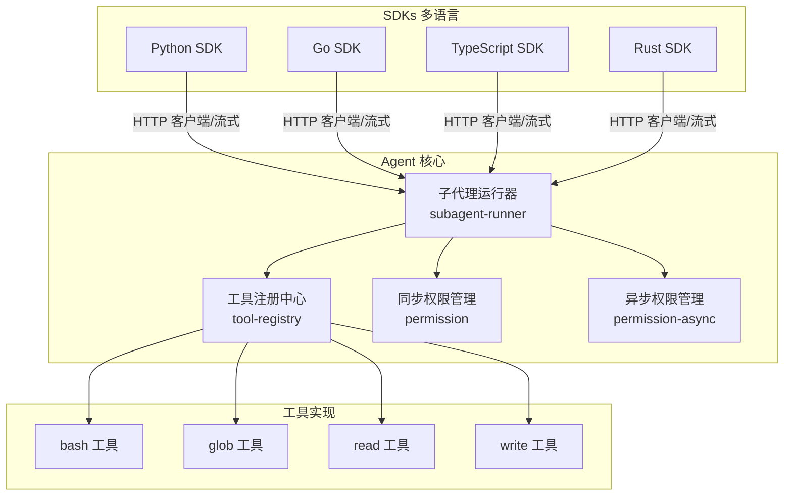
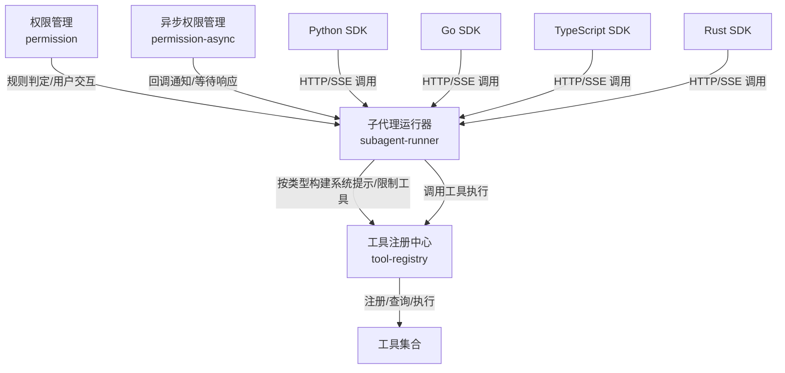
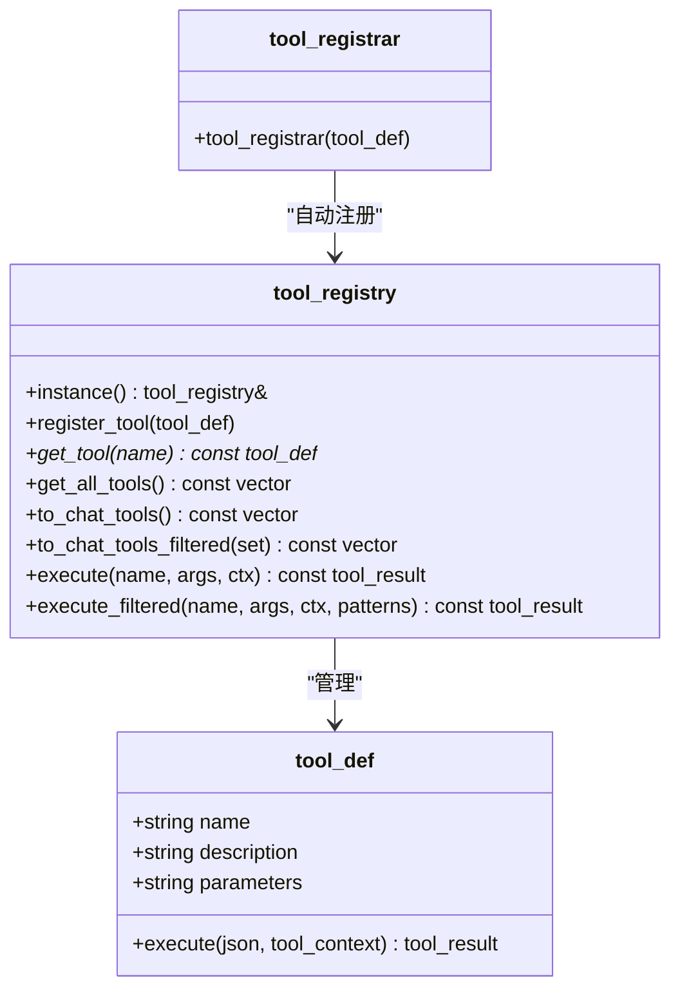
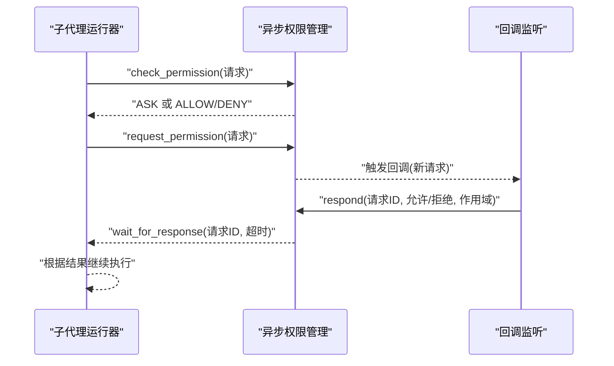
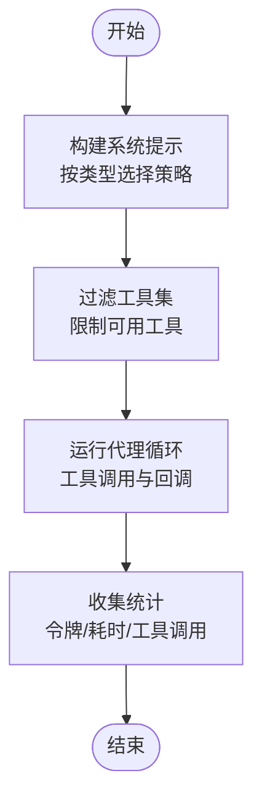
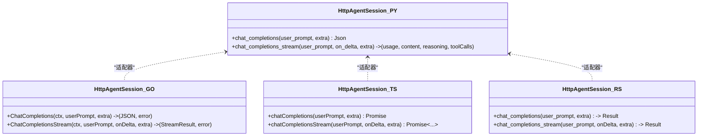
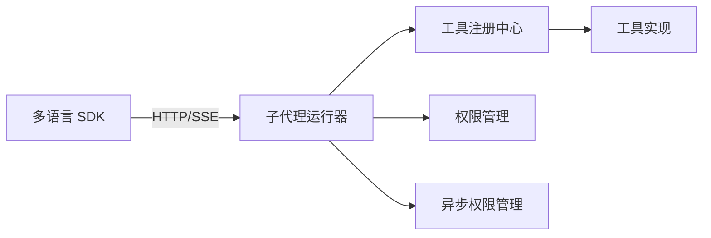

# 设计模式应用

<cite>
**本文引用的文件**
- [tool-registry.h](file://agent/tool-registry.h)
- [tool-registry.cpp](file://agent/tool-registry.cpp)
- [permission.h](file://agent/permission.h)
- [permission.cpp](file://agent/permission.cpp)
- [permission-async.h](file://agent/permission-async.h)
- [permission-async.cpp](file://agent/permission-async.cpp)
- [subagent-runner.h](file://agent/subagent/subagent-runner.h)
- [subagent-runner.cpp](file://agent/subagent/subagent-runner.cpp)
- [tool-bash.cpp](file://agent/tools/tool-bash.cpp)
- [tool-glob.cpp](file://agent/tools/tool-glob.cpp)
- [tool-read.cpp](file://agent/tools/tool-read.cpp)
- [tool-write.cpp](file://agent/tools/tool-write.cpp)
- [sdk.py](file://SDKs/python/src/llama_agent_sdk/sdk.py)
- [sdk.go](file://SDKs/go/llamaagentsdk/sdk.go)
- [index.ts](file://SDKs/typescript/src/index.ts)
- [lib.rs](file://SDKs/rust/src/lib.rs)
</cite>

## 目录
1. [引言](#引言)
2. [项目结构](#项目结构)
3. [核心组件](#核心组件)
4. [架构总览](#架构总览)
5. [详细组件分析](#详细组件分析)
6. [依赖分析](#依赖分析)
7. [性能考虑](#性能考虑)
8. [故障排查指南](#故障排查指南)
9. [结论](#结论)
10. [附录](#附录)

## 引言
本文件聚焦于 llama.cpp-agent 项目中设计模式的应用与实践，围绕以下四种模式展开：
- 工厂模式：在工具注册中的应用（通过单例注册中心集中管理工具）
- 观察者模式：在权限交互中的实现（异步权限请求的回调通知）
- 策略模式：在子代理执行中的运用（按类型切换不同的系统提示与工具限制）
- 适配器模式：在 SDK 接口中的体现（统一不同语言 SDK 的 HTTP 客户端行为）

我们将从实现细节、优缺点、选择理由、代码示例路径与模式组合带来的架构优势等方面进行系统阐述，并给出面向开发者的实践建议。

## 项目结构
该项目采用分层与功能域结合的组织方式：
- agent 层：核心智能体逻辑、工具注册、权限控制、子代理执行等
- SDKs 层：多语言 SDK（Python/Go/TypeScript/Rust）封装统一的 HTTP 客户端与流式处理能力
- tools 层：具体工具实现，通过统一的注册机制接入

图表来源
- [tool-registry.h:58-90](file://agent/tool-registry.h#L58-L90)
- [tool-registry.cpp:11-13](file://agent/tool-registry.cpp#L11-L13)
- [permission.h:40-101](file://agent/permission.h#L40-L101)
- [permission-async.h:43-141](file://agent/permission-async.h#L43-L141)
- [subagent-runner.h:64-113](file://agent/subagent/subagent-runner.h#L64-L113)
- [tool-bash.cpp:260-280](file://agent/tools/tool-bash.cpp#L260-L280)
- [tool-glob.cpp:158-179](file://agent/tools/tool-glob.cpp#L158-L179)
- [tool-read.cpp:95-119](file://agent/tools/tool-read.cpp#L95-L119)
- [tool-write.cpp:59-79](file://agent/tools/tool-write.cpp#L59-L79)
- [sdk.py:102-223](file://SDKs/python/src/llama_agent_sdk/sdk.py#L102-L223)
- [sdk.go:38-265](file://SDKs/go/llamaagentsdk/sdk.go#L38-L265)
- [index.ts:83-218](file://SDKs/typescript/src/index.ts#L83-L218)
- [lib.rs:58-271](file://SDKs/rust/src/lib.rs#L58-L271)

章节来源
- [tool-registry.h:1-103](file://agent/tool-registry.h#L1-L103)
- [tool-registry.cpp:1-86](file://agent/tool-registry.cpp#L1-L86)
- [permission.h:1-102](file://agent/permission.h#L1-L102)
- [permission.cpp:1-310](file://agent/permission.cpp#L1-L310)
- [permission-async.h:1-142](file://agent/permission-async.h#L1-L142)
- [permission-async.cpp:1-283](file://agent/permission-async.cpp#L1-L283)
- [subagent-runner.h:1-114](file://agent/subagent/subagent-runner.h#L1-L114)
- [subagent-runner.cpp:1-388](file://agent/subagent/subagent-runner.cpp#L1-L388)
- [tool-bash.cpp:1-281](file://agent/tools/tool-bash.cpp#L1-L281)
- [tool-glob.cpp:1-181](file://agent/tools/tool-glob.cpp#L1-L181)
- [tool-read.cpp:1-120](file://agent/tools/tool-read.cpp#L1-L120)
- [tool-write.cpp:1-80](file://agent/tools/tool-write.cpp#L1-L80)
- [sdk.py:1-224](file://SDKs/python/src/llama_agent_sdk/sdk.py#L1-L224)
- [sdk.go:1-267](file://SDKs/go/llamaagentsdk/sdk.go#L1-L267)
- [index.ts:1-221](file://SDKs/typescript/src/index.ts#L1-L221)
- [lib.rs:1-274](file://SDKs/rust/src/lib.rs#L1-L274)

## 核心组件
- 工具注册中心（单例 + 工厂）：集中注册、查询、过滤与执行工具，支持自动注册宏
- 权限管理（同步/异步）：规则驱动的权限判定、用户交互、会话覆盖与循环检测
- 子代理运行器：按类型构建受限系统提示、限制工具集、并发任务管理
- 多语言 SDK：统一 HTTP 请求、SSE 流解析与消息累积

章节来源
- [tool-registry.h:58-103](file://agent/tool-registry.h#L58-L103)
- [tool-registry.cpp:6-86](file://agent/tool-registry.cpp#L6-L86)
- [permission.h:40-101](file://agent/permission.h#L40-L101)
- [permission.cpp:35-140](file://agent/permission.cpp#L35-L140)
- [permission-async.h:43-141](file://agent/permission-async.h#L43-L141)
- [permission-async.cpp:10-122](file://agent/permission-async.cpp#L10-L122)
- [subagent-runner.h:64-113](file://agent/subagent/subagent-runner.h#L64-L113)
- [subagent-runner.cpp:29-118](file://agent/subagent/subagent-runner.cpp#L29-L118)
- [sdk.py:102-223](file://SDKs/python/src/llama_agent_sdk/sdk.py#L102-L223)
- [sdk.go:38-265](file://SDKs/go/llamaagentsdk/sdk.go#L38-L265)
- [index.ts:83-218](file://SDKs/typescript/src/index.ts#L83-L218)
- [lib.rs:58-271](file://SDKs/rust/src/lib.rs#L58-L271)

## 架构总览
下图展示了“工具注册中心”作为工厂、“权限管理”作为策略与观察者、“子代理运行器”作为策略执行器，以及“SDKs”作为适配器的交互关系。

图表来源
- [tool-registry.h:58-90](file://agent/tool-registry.h#L58-L90)
- [tool-registry.cpp:49-85](file://agent/tool-registry.cpp#L49-L85)
- [permission.h:40-101](file://agent/permission.h#L40-L101)
- [permission-async.h:43-141](file://agent/permission-async.h#L43-L141)
- [subagent-runner.h:64-113](file://agent/subagent/subagent-runner.h#L64-L113)
- [subagent-runner.cpp:133-244](file://agent/subagent/subagent-runner.cpp#L133-L244)
- [sdk.py:102-223](file://SDKs/python/src/llama_agent_sdk/sdk.py#L102-L223)
- [sdk.go:38-265](file://SDKs/go/llamaagentsdk/sdk.go#L38-L265)
- [index.ts:83-218](file://SDKs/typescript/src/index.ts#L83-L218)
- [lib.rs:58-271](file://SDKs/rust/src/lib.rs#L58-L271)

## 详细组件分析

### 工厂模式：工具注册中心
- 实现要点
  - 单例注册中心：提供全局唯一访问点，集中维护工具字典
  - 工具定义与执行：工具以结构体描述，包含名称、描述、参数模式与可调用执行函数
  - 自动注册宏：通过构造器自动将工具注册到注册中心，减少显式注册代码
  - 过滤执行：支持基于允许工具集与 Bash 模式的过滤执行
- 优点
  - 解耦工具实现与调用方；统一入口便于扩展与统计
  - 自动注册降低遗漏风险，提升可维护性
- 缺点
  - 工具数量增长时需注意命名冲突与内存占用
  - 执行异常需统一捕获与返回
- 选择理由
  - 工具种类多且动态扩展，需要集中管理与快速发现
- 代码示例路径
  - 工具注册中心声明与方法：[tool-registry.h:58-90](file://agent/tool-registry.h#L58-L90)
  - 工具注册与执行实现：[tool-registry.cpp:11-85](file://agent/tool-registry.cpp#L11-L85)
  - 工具自动注册宏与 bash 工具注册：[tool-registry.h:92-103](file://agent/tool-registry.h#L92-L103)、[tool-bash.cpp:260-280](file://agent/tools/tool-bash.cpp#L260-L280)
  - 其他工具注册示例：[tool-glob.cpp:158-179](file://agent/tools/tool-glob.cpp#L158-L179)、[tool-read.cpp:95-119](file://agent/tools/tool-read.cpp#L95-L119)、[tool-write.cpp:59-79](file://agent/tools/tool-write.cpp#L59-L79)

图表来源
- [tool-registry.h:44-103](file://agent/tool-registry.h#L44-L103)
- [tool-registry.cpp:6-85](file://agent/tool-registry.cpp#L6-L85)

章节来源
- [tool-registry.h:58-103](file://agent/tool-registry.h#L58-L103)
- [tool-registry.cpp:11-85](file://agent/tool-registry.cpp#L11-L85)
- [tool-bash.cpp:260-280](file://agent/tools/tool-bash.cpp#L260-L280)
- [tool-glob.cpp:158-179](file://agent/tools/tool-glob.cpp#L158-L179)
- [tool-read.cpp:95-119](file://agent/tools/tool-read.cpp#L95-L119)
- [tool-write.cpp:59-79](file://agent/tools/tool-write.cpp#L59-L79)

### 观察者模式：权限交互（异步）
- 实现要点
  - 异步权限请求队列：请求被分配唯一 ID 并入队，等待外部响应
  - 回调通知：设置回调后，新请求到来时触发通知（如 SSE 事件）
  - 等待与取消：支持超时等待响应或取消未决请求
  - 会话覆盖：支持一次性或会话级决策
- 优点
  - 非阻塞交互，适合 API 场景与 UI 通知
  - 易于扩展新的通知通道（WebSocket/SSE/HTTP 轮询）
- 缺点
  - 状态一致性与锁竞争需要谨慎处理
  - 超时与取消策略需明确
- 选择理由
  - 传统阻塞 stdin 不适用于服务端 API，异步回调更贴合多语言 SDK
- 代码示例路径
  - 异步权限管理类与方法：[permission-async.h:43-141](file://agent/permission-async.h#L43-L141)
  - 请求入队与回调触发：[permission-async.cpp:124-144](file://agent/permission-async.cpp#L124-L144)
  - 等待响应与超时：[permission-async.cpp:180-209](file://agent/permission-async.cpp#L180-L209)
  - 取消与清理：[permission-async.cpp:226-235](file://agent/permission-async.cpp#L226-L235)
  - 同步权限管理（对比参考）：[permission.h:40-101](file://agent/permission.h#L40-L101)、[permission.cpp:108-197](file://agent/permission.cpp#L108-L197)

图表来源
- [permission-async.h:53-98](file://agent/permission-async.h#L53-L98)
- [permission-async.cpp:124-209](file://agent/permission-async.cpp#L124-L209)
- [subagent-runner.cpp:190-202](file://agent/subagent/subagent-runner.cpp#L190-L202)

章节来源
- [permission-async.h:43-141](file://agent/permission-async.h#L43-L141)
- [permission-async.cpp:124-209](file://agent/permission-async.cpp#L124-L209)
- [permission.h:40-101](file://agent/permission.h#L40-L101)
- [permission.cpp:108-197](file://agent/permission.cpp#L108-L197)
- [subagent-runner.cpp:190-202](file://agent/subagent/subagent-runner.cpp#L190-L202)

### 策略模式：子代理执行
- 实现要点
  - 类型策略：不同子代理类型（探索、规划、通用、命令）对应不同的系统提示与工具限制
  - 过滤工具集：运行时传入允许工具集合与 Bash 模式，限制工具调用范围
  - 会话统计与显示：记录工具调用、令牌用量与耗时，统一输出
  - 并发与任务管理：后台任务支持异步启动、状态查询与结果回收
- 优点
  - 将“如何执行”的策略与“何时执行”的流程解耦，易于扩展新类型
  - 通过系统提示前缀共享 KV 缓存，提升推理效率
- 缺点
  - 策略配置与提示工程需要持续优化
  - 并发任务生命周期管理复杂度上升
- 选择理由
  - 需要针对不同场景（只读探索、计划、执行）定制行为与安全边界
- 代码示例路径
  - 子代理运行器类与方法：[subagent-runner.h:64-113](file://agent/subagent/subagent-runner.h#L64-L113)
  - 系统提示构建与策略分支：[subagent-runner.cpp:29-118](file://agent/subagent/subagent-runner.cpp#L29-L118)
  - 过滤工具执行与回调：[subagent-runner.cpp:190-202](file://agent/subagent/subagent-runner.cpp#L190-L202)
  - 后台任务管理与结果回收：[subagent-runner.cpp:246-348](file://agent/subagent/subagent-runner.cpp#L246-L348)

图表来源
- [subagent-runner.cpp:29-118](file://agent/subagent/subagent-runner.cpp#L29-L118)
- [subagent-runner.cpp:190-244](file://agent/subagent/subagent-runner.cpp#L190-L244)

章节来源
- [subagent-runner.h:64-113](file://agent/subagent/subagent-runner.h#L64-L113)
- [subagent-runner.cpp:29-118](file://agent/subagent/subagent-runner.cpp#L29-L118)
- [subagent-runner.cpp:190-244](file://agent/subagent/subagent-runner.cpp#L190-L244)
- [subagent-runner.cpp:246-348](file://agent/subagent/subagent-runner.cpp#L246-L348)

### 适配器模式：SDK 接口
- 实现要点
  - 统一 HTTP 客户端：各语言 SDK 内部封装 HTTP 请求、认证头、超时控制
  - SSE 流适配：统一解析 data: 行，累积 content/reasoning/tool_calls，输出标准化结构
  - 消息历史：维护对话消息列表，支持清空与追加
- 优点
  - 对上层屏蔽底层差异，提供一致的编程体验
  - 便于扩展新的语言或传输协议
- 缺点
  - 需要持续维护多语言的一致性与兼容性
- 代码示例路径
  - Python SDK 适配器：[sdk.py:102-223](file://SDKs/python/src/llama_agent_sdk/sdk.py#L102-L223)
  - Go SDK 适配器：[sdk.go:38-265](file://SDKs/go/llamaagentsdk/sdk.go#L38-L265)
  - TypeScript SDK 适配器：[index.ts:83-218](file://SDKs/typescript/src/index.ts#L83-L218)
  - Rust SDK 适配器：[lib.rs:58-271](file://SDKs/rust/src/lib.rs#L58-L271)

图表来源
- [sdk.py:102-223](file://SDKs/python/src/llama_agent_sdk/sdk.py#L102-L223)
- [sdk.go:38-265](file://SDKs/go/llamaagentsdk/sdk.go#L38-L265)
- [index.ts:83-218](file://SDKs/typescript/src/index.ts#L83-L218)
- [lib.rs:58-271](file://SDKs/rust/src/lib.rs#L58-L271)

章节来源
- [sdk.py:102-223](file://SDKs/python/src/llama_agent_sdk/sdk.py#L102-L223)
- [sdk.go:38-265](file://SDKs/go/llamaagentsdk/sdk.go#L38-L265)
- [index.ts:83-218](file://SDKs/typescript/src/index.ts#L83-L218)
- [lib.rs:58-271](file://SDKs/rust/src/lib.rs#L58-L271)

## 依赖分析
- 组件内聚与耦合
  - 工具注册中心高内聚、低耦合：工具实现仅依赖注册中心接口
  - 子代理运行器依赖注册中心与权限管理，策略通过参数注入，避免硬编码
  - SDKs 与 Agent 通过 HTTP 接口解耦，便于独立演进
- 外部依赖
  - 多语言 SDK 依赖各自生态的 HTTP 客户端与流式解析库
- 循环依赖
  - 当前结构未见直接循环依赖，但需注意工具实现与权限模块之间的间接耦合（敏感文件检查）

图表来源
- [tool-registry.h:58-90](file://agent/tool-registry.h#L58-L90)
- [subagent-runner.h:64-113](file://agent/subagent/subagent-runner.h#L64-L113)
- [permission.h:40-101](file://agent/permission.h#L40-L101)
- [permission-async.h:43-141](file://agent/permission-async.h#L43-L141)
- [sdk.py:102-223](file://SDKs/python/src/llama_agent_sdk/sdk.py#L102-L223)

章节来源
- [tool-registry.h:58-90](file://agent/tool-registry.h#L58-L90)
- [subagent-runner.h:64-113](file://agent/subagent/subagent-runner.h#L64-L113)
- [permission.h:40-101](file://agent/permission.h#L40-L101)
- [permission-async.h:43-141](file://agent/permission-async.h#L43-L141)
- [sdk.py:102-223](file://SDKs/python/src/llama_agent_sdk/sdk.py#L102-L223)

## 性能考虑
- 工具执行
  - 输出截断与超时控制：避免大输出导致内存与网络压力
  - 参考：[tool-bash.cpp:25-258](file://agent/tools/tool-bash.cpp#L25-L258)
- 子代理缓存复用
  - 系统提示前缀共享 KV 缓存，减少重复计算
  - 参考：[subagent-runner.cpp:34-43](file://agent/subagent/subagent-runner.cpp#L34-L43)
- 并发与资源
  - 后台任务线程池与结果回收，避免僵尸线程与内存泄漏
  - 参考：[subagent-runner.cpp:246-348](file://agent/subagent/subagent-runner.cpp#L246-L348)
- SDK 流式解析
  - SSE 行解析与增量累积，降低首字节延迟
  - 参考：[sdk.py:41-99](file://SDKs/python/src/llama_agent_sdk/sdk.py#L41-L99)、[sdk.go:150-265](file://SDKs/go/llamaagentsdk/sdk.go#L150-L265)、[index.ts:61-218](file://SDKs/typescript/src/index.ts#L61-L218)、[lib.rs:146-271](file://SDKs/rust/src/lib.rs#L146-L271)

## 故障排查指南
- 工具执行失败
  - 检查工具是否正确注册与过滤：[tool-registry.cpp:49-85](file://agent/tool-registry.cpp#L49-L85)
  - 查看 bash 工具超时与退出码：[tool-bash.cpp:250-258](file://agent/tools/tool-bash.cpp#L250-L258)
- 权限问题
  - 同步模式阻塞输入：[permission.cpp:142-197](file://agent/permission.cpp#L142-L197)
  - 异步模式回调未触发：确认回调设置与请求 ID：[permission-async.cpp:124-144](file://agent/permission-async.cpp#L124-L144)
- 子代理异常
  - 最大迭代次数 Reached 或用户取消：[subagent-runner.cpp:223-242](file://agent/subagent/subagent-runner.cpp#L223-L242)
  - 后台任务未完成：检查 is_complete 与 get_result 流程：[subagent-runner.cpp:289-348](file://agent/subagent/subagent-runner.cpp#L289-L348)
- SDK 连接错误
  - HTTP 状态码与超时：[sdk.py:126-131](file://SDKs/python/src/llama_agent_sdk/sdk.py#L126-L131)、[sdk.go:110-125](file://SDKs/go/llamaagentsdk/sdk.go#L110-L125)、[index.ts:122-137](file://SDKs/typescript/src/index.ts#L122-L137)、[lib.rs:108-143](file://SDKs/rust/src/lib.rs#L108-L143)

章节来源
- [tool-registry.cpp:49-85](file://agent/tool-registry.cpp#L49-L85)
- [tool-bash.cpp:250-258](file://agent/tools/tool-bash.cpp#L250-L258)
- [permission.cpp:142-197](file://agent/permission.cpp#L142-L197)
- [permission-async.cpp:124-144](file://agent/permission-async.cpp#L124-L144)
- [subagent-runner.cpp:223-242](file://agent/subagent/subagent-runner.cpp#L223-L242)
- [subagent-runner.cpp:289-348](file://agent/subagent/subagent-runner.cpp#L289-L348)
- [sdk.py:126-131](file://SDKs/python/src/llama_agent_sdk/sdk.py#L126-L131)
- [sdk.go:110-125](file://SDKs/go/llamaagentsdk/sdk.go#L110-L125)
- [index.ts:122-137](file://SDKs/typescript/src/index.ts#L122-L137)
- [lib.rs:108-143](file://SDKs/rust/src/lib.rs#L108-L143)

## 结论
llama.cpp-agent 在工具管理、权限控制、子代理执行与多语言 SDK 适配方面，系统性地应用了工厂、观察者、策略与适配器模式：
- 工厂模式确保工具注册与执行的集中化与可扩展性
- 观察者模式使权限交互从阻塞走向非阻塞，契合 API 与 UI 场景
- 策略模式将“如何执行”的行为抽象为可插拔策略，提升灵活性与安全性
- 适配器模式统一多语言 SDK 的接口与流式处理，降低集成成本

这些模式的协同使用，形成了高内聚、低耦合、易扩展的架构基础，为后续功能演进提供了良好支撑。

## 附录
- 开发者实践建议
  - 新增工具：遵循工具定义结构与自动注册宏，确保参数模式与执行函数完整
  - 新增子代理类型：在系统提示构建处新增策略分支，补充工具限制与 Bash 模式
  - 权限扩展：在异步权限管理中增加新的回调通道或持久化存储
  - SDK 新语言：参照现有 SDK 的 HTTP/SSE 适配器模式，保持一致的消息累积与错误处理