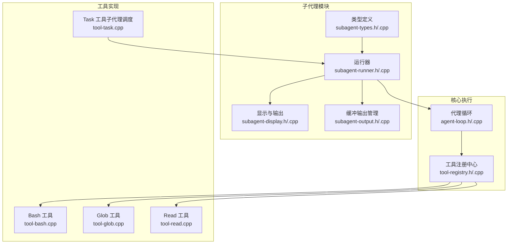
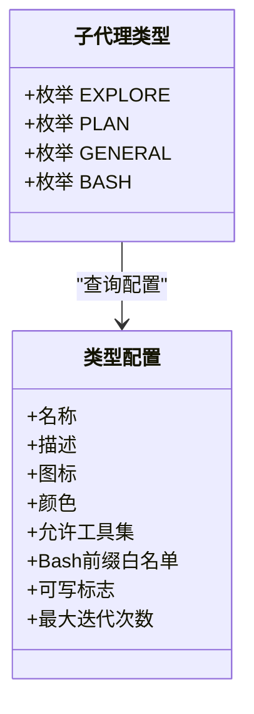
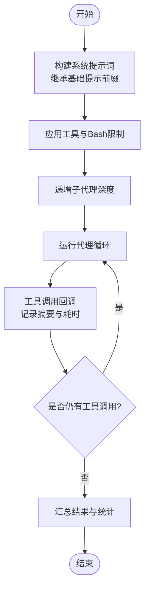
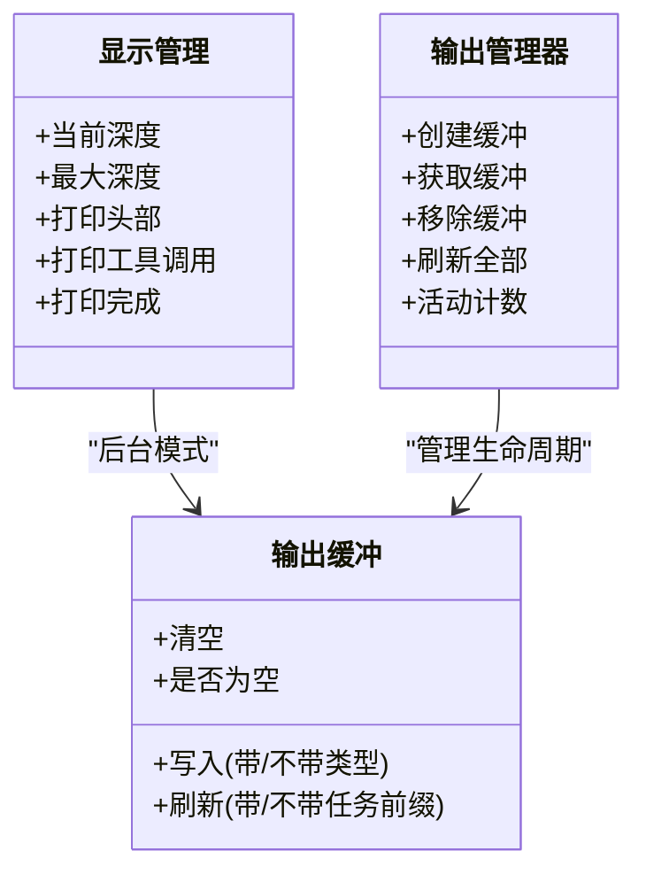
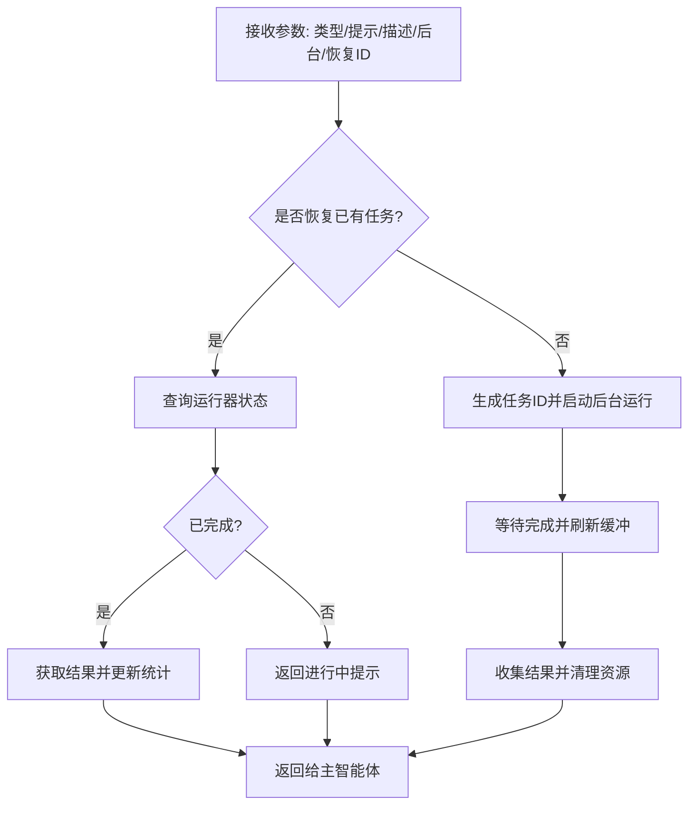
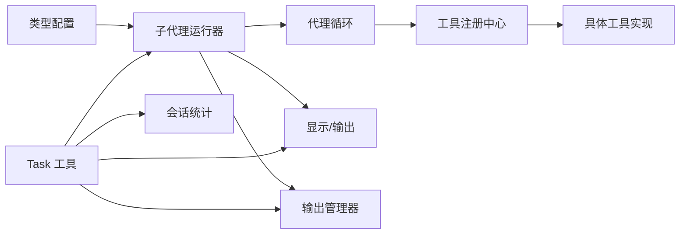

# 子代理架构

<cite>
**本文引用的文件**
- [agent/subagent/subagent-types.h](file://agent/subagent/subagent-types.h)
- [agent/subagent/subagent-types.cpp](file://agent/subagent/subagent-types.cpp)
- [agent/subagent/subagent-runner.h](file://agent/subagent/subagent-runner.h)
- [agent/subagent/subagent-runner.cpp](file://agent/subagent/subagent-runner.cpp)
- [agent/subagent/subagent-output.h](file://agent/subagent/subagent-output.h)
- [agent/subagent/subagent-output.cpp](file://agent/subagent/subagent-output.cpp)
- [agent/subagent/subagent-display.h](file://agent/subagent/subagent-display.h)
- [agent/subagent/subagent-display.cpp](file://agent/subagent/subagent-display.cpp)
- [agent/agent-loop.h](file://agent/agent-loop.h)
- [agent/agent-loop.cpp](file://agent/agent-loop.cpp)
- [agent/tool-registry.h](file://agent/tool-registry.h)
- [agent/tool-registry.cpp](file://agent/tool-registry.cpp)
- [agent/tools/tool-bash.cpp](file://agent/tools/tool-bash.cpp)
- [agent/tools/tool-read.cpp](file://agent/tools/tool-read.cpp)
- [agent/tools/tool-glob.cpp](file://agent/tools/tool-glob.cpp)
- [agent/tools/tool-task.cpp](file://agent/tools/tool-task.cpp)
</cite>

## 目录
1. [引言](#引言)
2. [项目结构](#项目结构)
3. [核心组件](#核心组件)
4. [架构总览](#架构总览)
5. [详细组件分析](#详细组件分析)
6. [依赖关系分析](#依赖关系分析)
7. [性能考虑](#性能考虑)
8. [故障排查指南](#故障排查指南)
9. [结论](#结论)
10. [附录](#附录)

## 引言
本设计文档围绕“子代理”（Subagent）架构展开，系统阐述其概念模型、执行策略与任务分解机制。子代理是主智能体在受限工具集与特定行为约束下运行的轻量级执行单元，用于完成探索、规划、通用任务或命令执行等专项工作。本文将从类型定义、配置与限制、执行流程、通信与状态管理、结果聚合、扩展与调试等方面进行深入解析，并提供面向开发者的最佳实践与优化建议。

## 项目结构
子代理相关代码集中在 agent/subagent 目录，配合 agent-loop 的嵌套执行、工具注册中心与具体工具实现，形成完整的子代理生命周期管理闭环。



**图表来源**
- [agent/subagent/subagent-types.h:1-36](file://agent/subagent/subagent-types.h#L1-L36)
- [agent/subagent/subagent-types.cpp:1-99](file://agent/subagent/subagent-types.cpp#L1-L99)
- [agent/subagent/subagent-runner.h:1-114](file://agent/subagent/subagent-runner.h#L1-L114)
- [agent/subagent/subagent-runner.cpp:1-388](file://agent/subagent/subagent-runner.cpp#L1-L388)
- [agent/subagent/subagent-display.h:1-88](file://agent/subagent/subagent-display.h#L1-L88)
- [agent/subagent/subagent-display.cpp:1-246](file://agent/subagent/subagent-display.cpp#L1-L246)
- [agent/subagent/subagent-output.h:1-107](file://agent/subagent/subagent-output.h#L1-L107)
- [agent/subagent/subagent-output.cpp:1-207](file://agent/subagent/subagent-output.cpp#L1-L207)
- [agent/agent-loop.h:1-276](file://agent/agent-loop.h#L1-L276)
- [agent/agent-loop.cpp:1-800](file://agent/agent-loop.cpp#L1-L800)
- [agent/tool-registry.h:1-103](file://agent/tool-registry.h#L1-L103)
- [agent/tool-registry.cpp:1-86](file://agent/tool-registry.cpp#L1-L86)
- [agent/tools/tool-bash.cpp:1-281](file://agent/tools/tool-bash.cpp#L1-L281)
- [agent/tools/tool-glob.cpp:1-181](file://agent/tools/tool-glob.cpp#L1-L181)
- [agent/tools/tool-read.cpp:1-120](file://agent/tools/tool-read.cpp#L1-L120)
- [agent/tools/tool-task.cpp:1-120](file://agent/tools/tool-task.cpp#L1-L120)

**章节来源**
- [agent/subagent/subagent-types.h:1-36](file://agent/subagent/subagent-types.h#L1-L36)
- [agent/subagent/subagent-types.cpp:1-99](file://agent/subagent/subagent-types.cpp#L1-L99)
- [agent/subagent/subagent-runner.h:1-114](file://agent/subagent/subagent-runner.h#L1-L114)
- [agent/subagent/subagent-runner.cpp:1-388](file://agent/subagent/subagent-runner.cpp#L1-L388)
- [agent/subagent/subagent-display.h:1-88](file://agent/subagent/subagent-display.h#L1-L88)
- [agent/subagent/subagent-display.cpp:1-246](file://agent/subagent/subagent-display.cpp#L1-L246)
- [agent/subagent/subagent-output.h:1-107](file://agent/subagent/subagent-output.h#L1-L107)
- [agent/subagent/subagent-output.cpp:1-207](file://agent/subagent/subagent-output.cpp#L1-L207)
- [agent/agent-loop.h:1-276](file://agent/agent-loop.h#L1-L276)
- [agent/agent-loop.cpp:1-800](file://agent/agent-loop.cpp#L1-L800)
- [agent/tool-registry.h:1-103](file://agent/tool-registry.h#L1-L103)
- [agent/tool-registry.cpp:1-86](file://agent/tool-registry.cpp#L1-L86)
- [agent/tools/tool-bash.cpp:1-281](file://agent/tools/tool-bash.cpp#L1-L281)
- [agent/tools/tool-glob.cpp:1-181](file://agent/tools/tool-glob.cpp#L1-L181)
- [agent/tools/tool-read.cpp:1-120](file://agent/tools/tool-read.cpp#L1-L120)
- [agent/tools/tool-task.cpp:1-120](file://agent/tools/tool-task.cpp#L1-L120)

## 核心组件
- 类型与配置：定义四类子代理（探索型、规划型、通用型、Bash专用型），并提供名称、描述、图标、颜色、允许工具集、Bash前缀白名单、是否可写、最大迭代次数等配置。
- 运行器：负责构建系统提示词、限制工具集与Bash命令、控制迭代深度、报告工具调用、统计令牌用量、支持同步与后台运行、任务生命周期管理。
- 显示与输出：统一管理子代理执行树形可视化、工具调用展示、完成状态输出；支持直接输出与缓冲输出两种模式。
- 工具注册与执行：提供工具注册、过滤执行（含Bash前缀白名单）、权限检查、超时控制、跨平台命令执行。
- 任务调度工具：作为主智能体与子代理之间的桥梁，负责深度检查、任务启动/恢复、结果聚合与统计上报。

**章节来源**
- [agent/subagent/subagent-types.h:8-36](file://agent/subagent/subagent-types.h#L8-L36)
- [agent/subagent/subagent-types.cpp:12-99](file://agent/subagent/subagent-types.cpp#L12-L99)
- [agent/subagent/subagent-runner.h:24-114](file://agent/subagent/subagent-runner.h#L24-L114)
- [agent/subagent/subagent-runner.cpp:29-244](file://agent/subagent/subagent-runner.cpp#L29-L244)
- [agent/subagent/subagent-display.h:15-88](file://agent/subagent/subagent-display.h#L15-L88)
- [agent/subagent/subagent-display.cpp:38-246](file://agent/subagent/subagent-display.cpp#L38-L246)
- [agent/subagent/subagent-output.h:14-107](file://agent/subagent/subagent-output.h#L14-L107)
- [agent/subagent/subagent-output.cpp:50-207](file://agent/subagent/subagent-output.cpp#L50-L207)
- [agent/tool-registry.h:18-103](file://agent/tool-registry.h#L18-L103)
- [agent/tool-registry.cpp:11-86](file://agent/tool-registry.cpp#L11-L86)
- [agent/tools/tool-task.cpp:71-120](file://agent/tools/tool-task.cpp#L71-L120)

## 架构总览
子代理通过“运行器-代理循环-工具注册中心-具体工具”的分层协作实现任务分解与执行。运行器根据类型配置生成定制化系统提示词与工具白名单，创建嵌套的代理循环以隔离工具访问与行为约束；显示与输出模块负责可视化与缓冲输出；工具注册中心提供过滤执行能力与权限校验；任务工具负责深度控制与结果聚合。

```mermaid
sequenceDiagram
participant Main as "主智能体"
participant Task as "Task 工具"
participant Runner as "子代理运行器"
participant Loop as "子代理代理循环"
participant Reg as "工具注册中心"
participant Bash as "Bash 工具"
Main->>Task : 调用 task 工具(类型/提示/描述)
Task->>Runner : 创建/复用子代理运行器
Runner->>Loop : 构建系统提示词与工具白名单
Loop->>Reg : 请求可用工具集合(过滤后)
Reg-->>Loop : 返回过滤后的工具列表
Loop->>Bash : 执行受控命令(按Bash前缀白名单)
Bash-->>Loop : 返回执行结果
Loop-->>Runner : 返回子代理结果(成功/失败/迭代耗尽)
Runner-->>Task : 汇总令牌统计与最终响应
Task-->>Main : 返回任务结果
```

**图表来源**
- [agent/tools/tool-task.cpp:71-120](file://agent/tools/tool-task.cpp#L71-L120)
- [agent/subagent/subagent-runner.cpp:138-244](file://agent/subagent/subagent-runner.cpp#L138-L244)
- [agent/agent-loop.cpp:346-366](file://agent/agent-loop.cpp#L346-L366)
- [agent/tool-registry.cpp:39-86](file://agent/tool-registry.cpp#L39-L86)
- [agent/tools/tool-bash.cpp:50-258](file://agent/tools/tool-bash.cpp#L50-L258)

**章节来源**
- [agent/tools/tool-task.cpp:71-120](file://agent/tools/tool-task.cpp#L71-L120)
- [agent/subagent/subagent-runner.cpp:138-244](file://agent/subagent/subagent-runner.cpp#L138-L244)
- [agent/agent-loop.cpp:346-366](file://agent/agent-loop.cpp#L346-L366)
- [agent/tool-registry.cpp:39-86](file://agent/tool-registry.cpp#L39-L86)
- [agent/tools/tool-bash.cpp:50-258](file://agent/tools/tool-bash.cpp#L50-L258)

## 详细组件分析

### 子代理类型与配置
- 类型枚举：EXPLORE（只读探索）、PLAN（架构规划）、GENERAL（多步任务）、BASH（仅命令执行）。
- 配置字段：名称、描述、图标、颜色、允许工具集、Bash前缀白名单、是否可写、最大迭代次数。
- 解析与查询：字符串到类型的解析、类型到配置的查询、类型名称映射。



**图表来源**
- [agent/subagent/subagent-types.h:8-36](file://agent/subagent/subagent-types.h#L8-L36)
- [agent/subagent/subagent-types.cpp:12-99](file://agent/subagent/subagent-types.cpp#L12-L99)

**章节来源**
- [agent/subagent/subagent-types.h:8-36](file://agent/subagent/subagent-types.h#L8-L36)
- [agent/subagent/subagent-types.cpp:12-99](file://agent/subagent/subagent-types.cpp#L12-L99)

### 子代理运行器与执行策略
- 系统提示词构建：继承父代理的基础提示前缀以共享KV缓存，注入类型描述与工具白名单，附加行为准则。
- 工具与Bash限制：通过代理循环构造函数传入允许工具集与Bash前缀白名单，确保只读探索等场景下的安全执行。
- 迭代深度控制：递增子代理深度，防止无限递归；结合会话级最大深度配置。
- 同步与后台运行：同步阻塞等待；后台运行使用线程与Promise收集结果，支持任务状态查询与取消。
- 统计与报告：记录工具调用摘要、令牌用量、耗时；通过显示模块报告工具调用与完成状态。



**图表来源**
- [agent/subagent/subagent-runner.cpp:29-244](file://agent/subagent/subagent-runner.cpp#L29-L244)
- [agent/agent-loop.cpp:695-788](file://agent/agent-loop.cpp#L695-L788)

**章节来源**
- [agent/subagent/subagent-runner.cpp:29-244](file://agent/subagent/subagent-runner.cpp#L29-L244)
- [agent/agent-loop.cpp:695-788](file://agent/agent-loop.cpp#L695-L788)

### 显示与输出管理
- 可视化树形结构：使用UTF-8绘制树形字符，按深度缩进，区分头部、工具调用、完成节点。
- 输出缓冲与原子刷新：后台任务使用缓冲输出，统一前缀与颜色，避免并发输出交错；直接模式使用输出守卫保证原子性。
- 任务标识与清理：生成唯一任务ID，支持清理已完成任务与缓冲区。



**图表来源**
- [agent/subagent/subagent-display.h:15-88](file://agent/subagent/subagent-display.h#L15-L88)
- [agent/subagent/subagent-display.cpp:38-246](file://agent/subagent/subagent-display.cpp#L38-L246)
- [agent/subagent/subagent-output.h:27-107](file://agent/subagent/subagent-output.h#L27-L107)
- [agent/subagent/subagent-output.cpp:50-207](file://agent/subagent/subagent-output.cpp#L50-L207)

**章节来源**
- [agent/subagent/subagent-display.h:15-88](file://agent/subagent/subagent-display.h#L15-L88)
- [agent/subagent/subagent-display.cpp:38-246](file://agent/subagent/subagent-display.cpp#L38-L246)
- [agent/subagent/subagent-output.h:27-107](file://agent/subagent/subagent-output.h#L27-L107)
- [agent/subagent/subagent-output.cpp:50-207](file://agent/subagent/subagent-output.cpp#L50-L207)

### 工具注册与执行
- 工具注册：集中注册工具定义，提供按名获取、全量导出、过滤导出、执行入口。
- 过滤执行：Bash工具在非空前缀白名单时，仅允许命令以指定前缀开头或包含在命令中，否则拒绝执行。
- 权限与安全：对文件操作、外部路径、危险命令、重复调用等进行检查与拦截；支持超时与中断。

```mermaid
sequenceDiagram
participant Loop as "代理循环"
participant Reg as "工具注册中心"
participant Tool as "目标工具"
Loop->>Reg : execute_filtered(名称, 参数, 上下文, 前缀白名单)
alt 名称为 bash 且白名单非空
Reg->>Reg : 检查命令前缀匹配
Reg-->>Loop : 允许/拒绝
end
Reg->>Tool : 执行工具
Tool-->>Reg : 返回结果
Reg-->>Loop : 返回结果
```

**图表来源**
- [agent/tool-registry.cpp:62-86](file://agent/tool-registry.cpp#L62-L86)
- [agent/agent-loop.cpp:608-666](file://agent/agent-loop.cpp#L608-L666)

**章节来源**
- [agent/tool-registry.h:18-103](file://agent/tool-registry.h#L18-L103)
- [agent/tool-registry.cpp:62-86](file://agent/tool-registry.cpp#L62-L86)
- [agent/agent-loop.cpp:608-666](file://agent/agent-loop.cpp#L608-L666)

### 任务调度与结果聚合
- 深度控制：基于上下文中的子代理深度与会话最大深度，判断是否允许继续派生子代理。
- 后台任务：Task 工具封装子代理运行器，支持异步启动、轮询完成、获取结果、更新父会话统计。
- 结果格式：包含成功标志、输出文本、错误信息、迭代次数、工具调用摘要、令牌用量等。



**图表来源**
- [agent/tools/tool-task.cpp:71-120](file://agent/tools/tool-task.cpp#L71-L120)
- [agent/subagent/subagent-runner.cpp:246-348](file://agent/subagent/subagent-runner.cpp#L246-L348)

**章节来源**
- [agent/tools/tool-task.cpp:71-120](file://agent/tools/tool-task.cpp#L71-L120)
- [agent/subagent/subagent-runner.cpp:246-348](file://agent/subagent/subagent-runner.cpp#L246-L348)

## 依赖关系分析
- 运行器依赖：类型配置、代理循环、显示/输出模块、工具注册中心。
- 代理循环依赖：服务器上下文、工具注册中心、权限管理、消息历史与统计。
- 工具注册中心依赖：工具定义、执行上下文、过滤执行逻辑。
- 任务工具依赖：运行器单例、显示/输出管理、会话统计。



**图表来源**
- [agent/subagent/subagent-runner.h:64-114](file://agent/subagent/subagent-runner.h#L64-L114)
- [agent/agent-loop.h:167-276](file://agent/agent-loop.h#L167-L276)
- [agent/tool-registry.h:58-103](file://agent/tool-registry.h#L58-L103)
- [agent/tools/tool-task.cpp:43-120](file://agent/tools/tool-task.cpp#L43-L120)

**章节来源**
- [agent/subagent/subagent-runner.h:64-114](file://agent/subagent/subagent-runner.h#L64-L114)
- [agent/agent-loop.h:167-276](file://agent/agent-loop.h#L167-L276)
- [agent/tool-registry.h:58-103](file://agent/tool-registry.h#L58-L103)
- [agent/tools/tool-task.cpp:43-120](file://agent/tools/tool-task.cpp#L43-L120)

## 性能考虑
- KV缓存前缀共享：子代理系统提示词以父代理基础提示为前缀，最大化KV缓存命中率，降低重复计算成本。
- 过滤工具与白名单：通过工具白名单与Bash前缀白名单减少不必要的工具暴露，降低推理开销与安全检查成本。
- 后台执行与缓冲：后台任务使用独立输出缓冲与原子刷新，避免频繁I/O竞争；定期清理已完成任务与缓冲，释放内存。
- 令牌统计与拆分：子代理令牌用量单独统计并在父会话中累加，便于成本拆分与优化。
- 平台命令执行：跨平台命令执行具备超时与中断控制，避免长时间阻塞；输出截断与行数限制降低大输出带来的渲染与传输压力。

**章节来源**
- [agent/subagent/subagent-runner.cpp:29-118](file://agent/subagent/subagent-runner.cpp#L29-L118)
- [agent/agent-loop.cpp:333-480](file://agent/agent-loop.cpp#L333-L480)
- [agent/subagent/subagent-output.cpp:111-155](file://agent/subagent/subagent-output.cpp#L111-L155)
- [agent/tools/tool-bash.cpp:50-258](file://agent/tools/tool-bash.cpp#L50-L258)

## 故障排查指南
- 子代理未启动或立即失败
  - 检查最大子代理深度配置与当前深度，确认未达到上限。
  - 查看类型配置的工具白名单与Bash前缀是否正确。
  - 关注运行器返回的错误信息（如达到最大迭代、用户取消、代理错误）。
- 工具调用被拒绝
  - 对于Bash工具，确认命令是否在前缀白名单中；对于文件类工具，检查外部路径与敏感文件保护。
  - 检查权限管理器的拦截日志与用户确认流程。
- 输出错乱或缺失
  - 后台任务需使用缓冲输出并统一刷新；确认任务ID与短ID前缀映射。
  - 直接模式使用输出守卫保证原子性。
- 资源泄漏或内存增长
  - 定期调用运行器的清理接口移除已完成任务与缓冲。
  - 检查线程join与Promise取值是否正确处理异常。

**章节来源**
- [agent/subagent/subagent-runner.cpp:289-348](file://agent/subagent/subagent-runner.cpp#L289-L348)
- [agent/subagent/subagent-output.cpp:111-155](file://agent/subagent/subagent-output.cpp#L111-L155)
- [agent/agent-loop.cpp:542-580](file://agent/agent-loop.cpp#L542-L580)

## 结论
子代理架构通过“类型-配置-运行器-显示/输出-工具注册中心”的协同，实现了在受限工具集与行为约束下的任务分解与执行。其核心优势在于：
- 明确的类型边界与安全限制（工具白名单、Bash前缀白名单）
- 清晰的执行与可视化反馈（树形输出、工具调用摘要、令牌统计）
- 灵活的任务生命周期管理（同步/后台、状态查询、取消、清理）
- 可扩展的工具生态与权限安全体系

该架构既满足探索、规划、通用任务与命令执行等多样化场景，也为后续扩展新的子代理类型与工具提供了清晰的接口与最佳实践。

## 附录

### 子代理类型与适用场景
- 探索型（EXPLORE）
  - 特点：只读探索，允许有限Bash命令（如列出、查看、搜索、版本控制等），不可写文件。
  - 适用：代码库探索、依赖发现、变更审计。
- 规划型（PLAN）
  - 特点：专注架构与设计规划，仅允许文件浏览与概览，无写入能力。
  - 适用：方案设计、技术选型、重构计划。
- 通用型（GENERAL）
  - 特点：多步任务执行，允许读写与编辑，但禁用task工具自身，避免递归。
  - 适用：代码修改、测试验证、文档生成。
- Bash专用型（BASH）
  - 特点：仅限命令执行，无文件操作能力。
  - 适用：环境探测、构建与测试、运维脚本。

**章节来源**
- [agent/subagent/subagent-types.cpp:12-62](file://agent/subagent/subagent-types.cpp#L12-L62)

### 配置选项与深度限制
- 类型配置项：名称、描述、图标、颜色、允许工具集、Bash前缀白名单、是否可写、最大迭代次数。
- 会话级深度限制：通过代理配置中的最大子代理深度控制，避免过深嵌套。
- 运行器内部深度：每次创建子代理时递增，结合会话上限共同生效。

**章节来源**
- [agent/subagent/subagent-types.cpp:12-62](file://agent/subagent/subagent-types.cpp#L12-L62)
- [agent/agent-loop.h:40-58](file://agent/agent-loop.h#L40-L58)
- [agent/tools/tool-task.cpp:72-82](file://agent/tools/tool-task.cpp#L72-L82)

### 通信机制与状态管理
- 事件与回调：代理循环支持流式事件回调，便于上层UI或服务端实时展示。
- 工具调用回调：子代理通过回调向父显示模块报告工具调用与耗时。
- 任务状态：运行器维护任务字典、完成结果缓存、清理策略，支持查询与取消。

**章节来源**
- [agent/agent-loop.h:25-166](file://agent/agent-loop.h#L25-L166)
- [agent/subagent/subagent-runner.h:45-92](file://agent/subagent/subagent-runner.h#L45-L92)
- [agent/subagent/subagent-runner.cpp:289-348](file://agent/subagent/subagent-runner.cpp#L289-L348)

### 结果聚合策略
- 令牌统计：子代理输入/输出/缓存令牌分别累加至子代理统计与会话总计，便于成本拆分。
- 工具调用摘要：记录工具名称与耗时，辅助性能分析与审计。
- 最终响应：根据停止原因（完成/迭代耗尽/用户取消/错误）返回相应结果与错误信息。

**章节来源**
- [agent/subagent/subagent-runner.cpp:209-244](file://agent/subagent/subagent-runner.cpp#L209-L244)
- [agent/tools/tool-task.cpp:50-69](file://agent/tools/tool-task.cpp#L50-L69)

### 开发者扩展指南
- 新增子代理类型
  - 在类型定义中添加新枚举值，在配置表中补充名称、描述、图标、颜色、工具集、Bash前缀、可写标志与最大迭代次数。
  - 在运行器中扩展系统提示词构建逻辑，确保行为准则与工具白名单一致。
- 新增工具
  - 定义工具执行函数与JSON模式，使用注册宏自动注册。
  - 若涉及Bash命令，建议在过滤执行中加入前缀白名单或参数校验。
- 新增显示样式
  - 在显示模块中扩展输出类型与颜色映射，保持与输出缓冲的类型一致。
- 调试建议
  - 使用同步运行模式快速定位问题；后台模式下关注缓冲刷新与任务ID映射。
  - 利用工具调用摘要与令牌统计定位热点工具与高开销路径。
  - 合理设置最大迭代次数与超时时间，避免长时间阻塞。

**章节来源**
- [agent/subagent/subagent-types.cpp:12-99](file://agent/subagent/subagent-types.cpp#L12-L99)
- [agent/tool-registry.h:44-103](file://agent/tool-registry.h#L44-L103)
- [agent/tool-registry.cpp:11-86](file://agent/tool-registry.cpp#L11-L86)
- [agent/subagent/subagent-display.cpp:12-19](file://agent/subagent/subagent-display.cpp#L12-L19)
- [agent/subagent/subagent-output.cpp:12-18](file://agent/subagent/subagent-output.cpp#L12-L18)