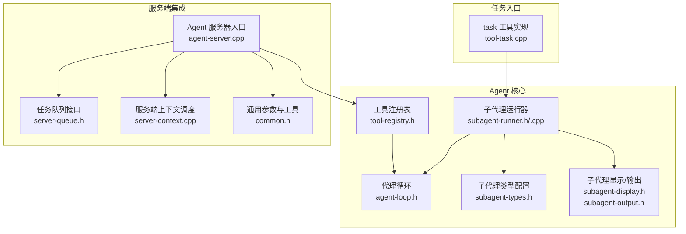
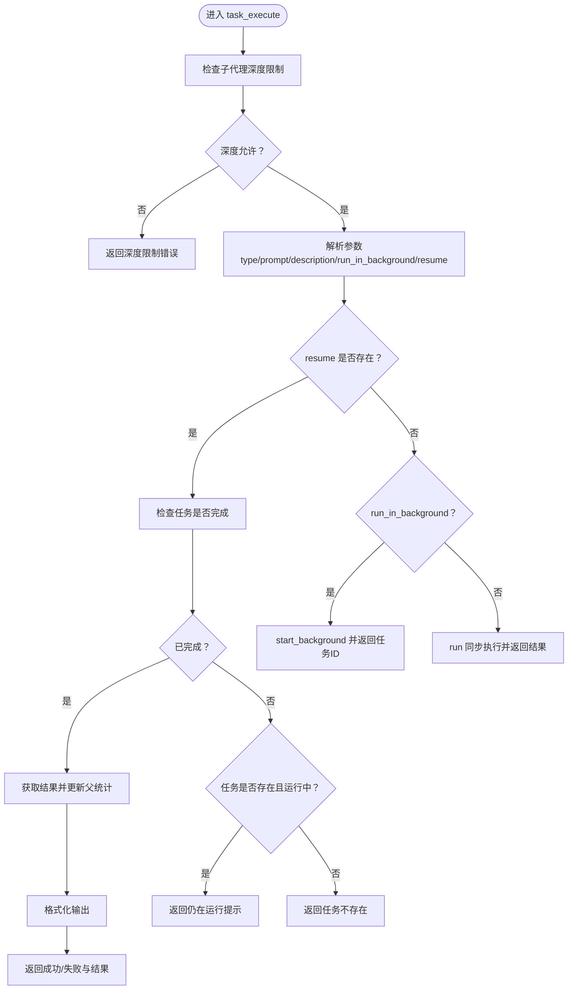
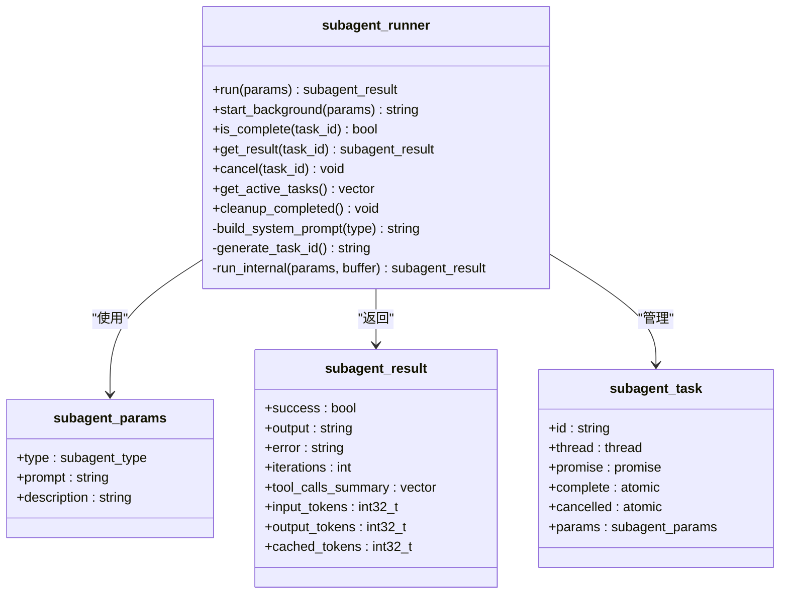
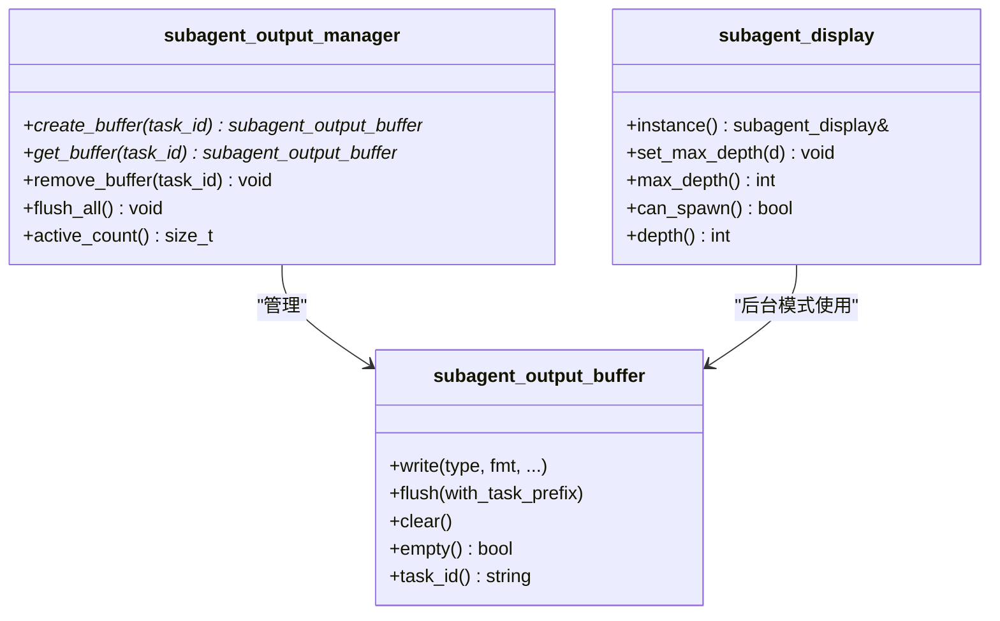
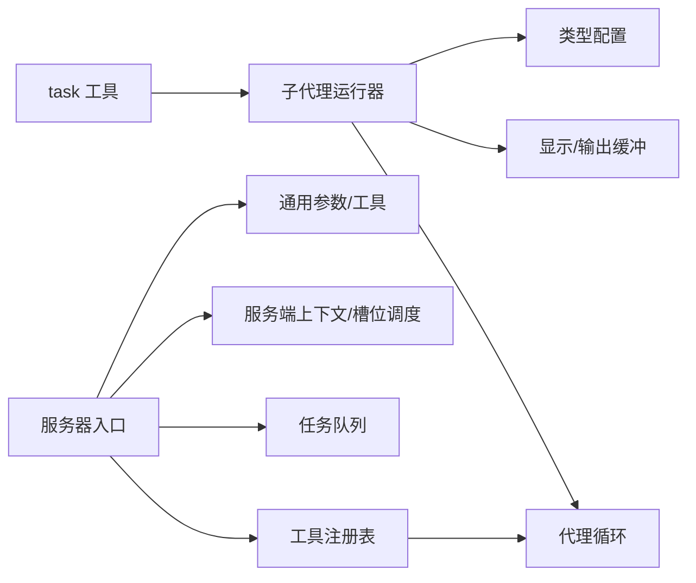

# 任务管理工具

<cite>
**本文引用的文件**
- [agent/tools/tool-task.cpp](file://agent/tools/tool-task.cpp)
- [agent/subagent/subagent-runner.cpp](file://agent/subagent/subagent-runner.cpp)
- [agent/subagent/subagent-runner.h](file://agent/subagent/subagent-runner.h)
- [agent/subagent/subagent-types.h](file://agent/subagent/subagent-types.h)
- [agent/subagent/subagent-display.h](file://agent/subagent/subagent-display.h)
- [agent/subagent/subagent-output.h](file://agent/subagent/subagent-output.h)
- [agent/agent-loop.h](file://agent/agent-loop.h)
- [agent/tool-registry.h](file://agent/tool-registry.h)
- [agent/CMakeLists.txt](file://agent/CMakeLists.txt)
- [agent/server/agent-server.cpp](file://agent/server/agent-server.cpp)
- [third_party/llama.cpp/common/common.h](file://third_party/llama.cpp/common/common.h)
- [third_party/llama.cpp/tools/server/server-queue.h](file://third_party/llama.cpp/tools/server/server-queue.h)
- [third_party/llama.cpp/tools/server/server-context.cpp](file://third_party/llama.cpp/tools/server/server-context.cpp)
- [SDKs/typescript/src/project-assistant.ts](file://SDKs/typescript/src/project-assistant.ts)
</cite>

## 目录
1. [简介](#简介)
2. [项目结构](#项目结构)
3. [核心组件](#核心组件)
4. [架构总览](#架构总览)
5. [详细组件分析](#详细组件分析)
6. [依赖分析](#依赖分析)
7. [性能考虑](#性能考虑)
8. [故障排查指南](#故障排查指南)
9. [结论](#结论)
10. [附录](#附录)

## 简介
本文件为任务管理工具的功能文档，聚焦于“task”工具的任务调度机制、状态跟踪与结果管理，涵盖任务定义格式、依赖关系处理、并发控制、执行配置（如迭代次数、超时、子代理深度限制）、优先级与资源管理、最佳实践、监控与故障恢复策略。该工具通过“子代理（subagent）”模式，在受限工具集下自动执行复杂任务，并支持同步与后台两种运行方式，具备任务状态查询、结果回传与统计汇总能力。

## 项目结构
任务管理工具位于 agent 子模块中，围绕“工具注册表”“代理循环”“子代理运行器”“显示与输出缓冲”等核心模块协作完成任务编排与执行。构建脚本将 agent 的源码与第三方 llama.cpp 的服务端组件整合，形成可运行的服务端二进制。



图表来源
- [agent/CMakeLists.txt:11-28](file://agent/CMakeLists.txt#L11-L28)
- [agent/tools/tool-task.cpp:1-257](file://agent/tools/tool-task.cpp#L1-L257)
- [agent/subagent/subagent-runner.h:64-114](file://agent/subagent/subagent-runner.h#L64-L114)
- [agent/agent-loop.h:167-276](file://agent/agent-loop.h#L167-L276)
- [agent/subagent/subagent-display.h:14-88](file://agent/subagent/subagent-display.h#L14-L88)
- [agent/subagent/subagent-output.h:25-107](file://agent/subagent/subagent-output.h#L25-L107)
- [agent/server/agent-server.cpp:105-128](file://agent/server/agent-server.cpp#L105-L128)
- [third_party/llama.cpp/tools/server/server-queue.h:13-48](file://third_party/llama.cpp/tools/server/server-queue.h#L13-L48)
- [third_party/llama.cpp/tools/server/server-context.cpp:1667-1715](file://third_party/llama.cpp/tools/server/server-context.cpp#L1667-L1715)
- [third_party/llama.cpp/common/common.h:82-107](file://third_party/llama.cpp/common/common.h#L82-L107)

章节来源
- [agent/CMakeLists.txt:11-28](file://agent/CMakeLists.txt#L11-L28)
- [agent/CMakeLists.txt:82-148](file://agent/CMakeLists.txt#L82-L148)
- [agent/CMakeLists.txt:150-207](file://agent/CMakeLists.txt#L150-L207)

## 核心组件
- 任务入口与参数解析：task 工具负责接收用户请求，解析参数（类型、提示词、描述、后台运行、恢复 ID），并调用子代理运行器执行或查询状态。
- 子代理运行器：封装代理循环，按类型构建受限工具集与系统提示，执行同步或后台任务，维护任务生命周期与结果缓存。
- 代理循环：承载一次完整的对话/推理/工具调用循环，支持事件流式回调、权限管理、多模态输入、统计信息收集。
- 显示与输出缓冲：在同步与后台模式下分别输出到控制台或缓冲区，保证并发安全与原子刷新。
- 工具注册表：统一管理工具定义、过滤工具集、执行工具调用。
- 服务器集成：将工具与代理循环接入 HTTP 服务端，提供健康检查、异常包装与线程池配置。

章节来源
- [agent/tools/tool-task.cpp:71-208](file://agent/tools/tool-task.cpp#L71-L208)
- [agent/subagent/subagent-runner.h:64-114](file://agent/subagent/subagent-runner.h#L64-L114)
- [agent/agent-loop.h:167-276](file://agent/agent-loop.h#L167-L276)
- [agent/subagent/subagent-display.h:14-88](file://agent/subagent/subagent-display.h#L14-L88)
- [agent/subagent/subagent-output.h:25-107](file://agent/subagent/subagent-output.h#L25-L107)
- [agent/tool-registry.h:58-103](file://agent/tool-registry.h#L58-L103)
- [agent/server/agent-server.cpp:105-128](file://agent/server/agent-server.cpp#L105-L128)

## 架构总览
任务从 HTTP 入口进入，经由工具注册表分发到 task 工具；task 工具根据参数选择同步或后台模式，委托子代理运行器；运行器内部创建受限代理循环，按类型注入工具白名单与系统提示；完成后返回结果并更新父会话统计；后台任务通过任务 ID 支持轮询查询。

```mermaid
sequenceDiagram
participant Client as "客户端"
participant Server as "Agent 服务器<br/>agent-server.cpp"
participant Registry as "工具注册表<br/>tool-registry.h"
participant Task as "task 工具<br/>tool-task.cpp"
participant Runner as "子代理运行器<br/>subagent-runner.h/.cpp"
participant Loop as "代理循环<br/>agent-loop.h"
participant Display as "显示/输出缓冲<br/>subagent-display.h<br/>subagent-output.h"
Client->>Server : "POST /api/... 调用 task 工具"
Server->>Registry : "查找并校验工具定义"
Registry-->>Server : "返回工具定义"
Server->>Task : "执行工具函数"
alt 后台模式
Task->>Runner : "start_background(params)"
Runner->>Display : "创建输出缓冲"
Runner->>Loop : "run_internal(params, buffer)"
Loop-->>Runner : "subagent_result"
Runner-->>Task : "返回任务ID"
Task-->>Server : "返回任务ID"
Client->>Task : "轮询 resume=<task_id>"
Task->>Runner : "is_complete/get_result"
Runner-->>Task : "返回结果"
Task-->>Client : "返回最终结果"
else 同步模式
Task->>Runner : "run(params)"
Runner->>Loop : "run(params.prompt)"
Loop-->>Runner : "subagent_result"
Runner-->>Task : "返回结果"
Task-->>Server : "返回结果"
Server-->>Client : "返回结果"
end
```

图表来源
- [agent/server/agent-server.cpp:105-128](file://agent/server/agent-server.cpp#L105-L128)
- [agent/tool-registry.h:78-86](file://agent/tool-registry.h#L78-L86)
- [agent/tools/tool-task.cpp:71-208](file://agent/tools/tool-task.cpp#L71-L208)
- [agent/subagent/subagent-runner.cpp:133-244](file://agent/subagent/subagent-runner.cpp#L133-L244)
- [agent/agent-loop.h:167-276](file://agent/agent-loop.h#L167-L276)
- [agent/subagent/subagent-output.h:27-55](file://agent/subagent/subagent-output.h#L27-L55)

## 详细组件分析

### 组件一：task 工具（任务入口）
- 功能要点
  - 参数解析：支持 subagent_type、prompt、description、run_in_background、resume。
  - 深度限制：基于会话最大子代理深度与显示层最大深度，防止无限递归。
  - 恢复模式：通过 resume 参数查询后台任务状态或结果。
  - 同步/后台切换：后台启动后立即返回任务 ID，供后续轮询。
  - 结果格式化：汇总工具调用摘要、迭代次数、输出内容与错误信息。
  - 统计更新：将子代理令牌用量合并到父会话统计。
- 关键流程
  - 解析参数与类型校验
  - 获取/创建子代理运行器实例（按服务器上下文键）
  - 后台模式：生成任务 ID，启动线程执行，返回任务 ID
  - 恢复模式：检查完成状态，若未完成则提示重试，否则返回结果
  - 同步模式：直接执行并返回结果



图表来源
- [agent/tools/tool-task.cpp:71-208](file://agent/tools/tool-task.cpp#L71-L208)

章节来源
- [agent/tools/tool-task.cpp:15-48](file://agent/tools/tool-task.cpp#L15-L48)
- [agent/tools/tool-task.cpp:71-208](file://agent/tools/tool-task.cpp#L71-L208)
- [agent/tool-registry.h:18-41](file://agent/tool-registry.h#L18-L41)

### 组件二：子代理运行器（并发与生命周期）
- 功能要点
  - 任务生命周期：创建任务、后台执行、完成标记、结果获取、清理。
  - 并发模型：每个任务独立线程，使用 promise/future 获取结果，使用互斥锁保护任务映射。
  - 输出缓冲：后台模式下将输出写入缓冲，统一原子刷新，避免竞态。
  - 结果聚合：记录成功/失败、迭代次数、工具调用摘要、令牌统计。
  - 取消机制：提供取消标记（当前依赖父中断标志协同）。
- 数据结构
  - subagent_params：类型、提示词、描述
  - subagent_result：成功与否、输出、错误、迭代次数、工具调用摘要、令牌统计
  - subagent_task：线程、promise、完成/取消原子标志、参数副本



图表来源
- [agent/subagent/subagent-runner.h:24-114](file://agent/subagent/subagent-runner.h#L24-L114)

章节来源
- [agent/subagent/subagent-runner.cpp:133-244](file://agent/subagent/subagent-runner.cpp#L133-L244)
- [agent/subagent/subagent-runner.cpp:246-388](file://agent/subagent/subagent-runner.cpp#L246-L388)
- [agent/subagent/subagent-runner.h:24-114](file://agent/subagent/subagent-runner.h#L24-L114)

### 组件三：代理循环（受限工具与系统提示）
- 功能要点
  - 受限工具集：通过 allowed_tools 白名单与 bash_patterns 限制命令前缀。
  - 自定义系统提示：按子代理类型注入行为准则与工具可用性说明。
  - 迭代控制：受类型配置的最大迭代次数限制。
  - 事件与统计：支持流式事件回调、权限请求、统计信息收集。
- 配置项
  - agent_config：最大迭代次数、工具超时、工作目录、技能/agents.md 开关、子代理最大深度。
  - session_stats：主会话与子代理的令牌用量与生成时间统计。

```mermaid
sequenceDiagram
participant Runner as "subagent_runner"
participant Loop as "agent_loop"
participant Tools as "工具注册表"
participant Display as "显示/输出"
Runner->>Loop : "构造受限 agent_loop<br/>allowed_tools/bash_patterns/system_prompt"
Loop->>Tools : "过滤工具集"
Loop->>Loop : "初始化系统提示与配置"
Loop->>Loop : "run(prompt) 主循环"
Loop->>Display : "报告工具调用/完成"
Loop-->>Runner : "agent_loop_result"
```

图表来源
- [agent/agent-loop.h:167-276](file://agent/agent-loop.h#L167-L276)
- [agent/tool-registry.h:74-86](file://agent/tool-registry.h#L74-L86)
- [agent/subagent/subagent-runner.cpp:164-244](file://agent/subagent/subagent-runner.cpp#L164-L244)

章节来源
- [agent/agent-loop.h:40-81](file://agent/agent-loop.h#L40-L81)
- [agent/agent-loop.h:167-276](file://agent/agent-loop.h#L167-L276)
- [agent/subagent/subagent-runner.cpp:29-118](file://agent/subagent/subagent-runner.cpp#L29-L118)

### 组件四：显示与输出缓冲（并发安全）
- 功能要点
  - 同步模式：直接输出到控制台，即时可见。
  - 后台模式：输出写入缓冲，统一原子刷新，避免交错。
  - 作用域管理：RAII scope 在构造/析构时打印头部、工具调用与完成信息。
- 关键类
  - subagent_output_buffer：缓冲段、互斥锁、flush/clear 接口。
  - subagent_output_manager：全局单例，创建/销毁缓冲。
  - subagent_display：嵌套深度管理、最大深度限制、打印树形结构。



图表来源
- [agent/subagent/subagent-output.h:27-107](file://agent/subagent/subagent-output.h#L27-L107)
- [agent/subagent/subagent-display.h:15-88](file://agent/subagent/subagent-display.h#L15-L88)

章节来源
- [agent/subagent/subagent-output.h:27-107](file://agent/subagent/subagent-output.h#L27-L107)
- [agent/subagent/subagent-display.h:15-88](file://agent/subagent/subagent-display.h#L15-L88)

### 组件五：类型与配置（子代理类型）
- 类型定义：EXPLORE（只读探索）、PLAN（设计规划）、GENERAL（通用任务）、BASH（仅命令执行）。
- 配置字段：名称、描述、图标、颜色、允许工具集合、bash 命令前缀、是否可写、最大迭代次数。
- 解析与名称：字符串解析、名称映射。

章节来源
- [agent/subagent/subagent-types.h:8-36](file://agent/subagent/subagent-types.h#L8-L36)

## 依赖分析
- 组件耦合
  - task 工具依赖子代理运行器与显示/输出模块；运行器依赖代理循环与类型配置。
  - 工具注册表贯穿工具定义、过滤与执行。
  - 服务器入口依赖工具注册表与任务队列/槽位调度。
- 外部依赖
  - 第三方 llama.cpp 提供服务端上下文、任务队列与调度逻辑。
  - 线程池与 HTTP 服务端线程数配置影响并发吞吐。



图表来源
- [agent/tools/tool-task.cpp:1-257](file://agent/tools/tool-task.cpp#L1-L257)
- [agent/subagent/subagent-runner.cpp:1-388](file://agent/subagent/subagent-runner.cpp#L1-L388)
- [agent/agent-loop.h:167-276](file://agent/agent-loop.h#L167-L276)
- [agent/subagent/subagent-display.h:14-88](file://agent/subagent/subagent-display.h#L14-L88)
- [agent/subagent/subagent-output.h:25-107](file://agent/subagent/subagent-output.h#L25-L107)
- [agent/tool-registry.h:58-103](file://agent/tool-registry.h#L58-L103)
- [agent/server/agent-server.cpp:105-128](file://agent/server/agent-server.cpp#L105-L128)
- [third_party/llama.cpp/tools/server/server-queue.h:13-48](file://third_party/llama.cpp/tools/server/server-queue.h#L13-L48)
- [third_party/llama.cpp/tools/server/server-context.cpp:1667-1715](file://third_party/llama.cpp/tools/server/server-context.cpp#L1667-L1715)
- [third_party/llama.cpp/common/common.h:82-107](file://third_party/llama.cpp/common/common.h#L82-L107)

章节来源
- [agent/CMakeLists.txt:11-28](file://agent/CMakeLists.txt#L11-L28)
- [agent/CMakeLists.txt:82-148](file://agent/CMakeLists.txt#L82-L148)
- [agent/CMakeLists.txt:150-207](file://agent/CMakeLists.txt#L150-L207)

## 性能考虑
- 并发与线程
  - 后台任务采用独立线程与 promise/future，避免阻塞主线程；建议定期调用清理接口回收已完成任务。
  - 服务器线程池大小与最大动态线程数影响并发请求处理能力。
- 资源与缓存
  - 子代理系统提示以父提示为前缀，最大化 KV 缓存复用，降低重复计算。
  - 输出缓冲原子刷新减少控制台竞争，提升后台模式下的可观测性。
- 迭代与超时
  - 类型级最大迭代次数限制可避免长尾任务占用资源；工具超时与会话中断标志确保可控退出。
- 任务队列与槽位
  - 服务端任务队列与槽位调度在资源紧张时进行延迟与优先级处理，保障稳定性。

章节来源
- [agent/subagent/subagent-runner.cpp:176-244](file://agent/subagent/subagent-runner.cpp#L176-L244)
- [agent/subagent/subagent-output.h:32-40](file://agent/subagent/subagent-output.h#L32-L40)
- [agent/agent-loop.h:40-58](file://agent/agent-loop.h#L40-L58)
- [third_party/llama.cpp/tools/server/server-context.cpp:1667-1715](file://third_party/llama.cpp/tools/server/server-context.cpp#L1667-L1715)
- [third_party/llama.cpp/tools/server/server-queue.h:13-48](file://third_party/llama.cpp/tools/server/server-queue.h#L13-L48)
- [agent/server/agent-server.cpp:228-240](file://agent/server/agent-server.cpp#L228-L240)

## 故障排查指南
- 常见问题与定位
  - 任务未找到/状态未知：检查 resume 任务 ID 是否正确，确认任务是否仍在运行或已清理。
  - 深度限制：当子代理嵌套超过最大深度时，会拒绝创建新子代理，需调整会话配置或简化任务。
  - 后台任务无输出：确认后台模式下使用输出缓冲，必要时调用 flush 或查看缓冲管理器状态。
  - 异常与错误：工具执行异常会被捕获并记录到结果错误字段；服务器异常包装返回标准错误响应。
- 监控与日志
  - 使用会话统计字段观察主会话与子代理的令牌用量与生成耗时。
  - 通过事件流式回调（流式 API）获取工具调用开始/结果、权限请求/解决、迭代开始等事件。
- 恢复策略
  - 对长时间运行的后台任务，采用轮询 resume 查询；对超时或失败任务，结合错误信息重试或降级。
  - 清理已完成任务，释放线程与缓冲资源，避免内存与句柄泄漏。

章节来源
- [agent/tools/tool-task.cpp:96-146](file://agent/tools/tool-task.cpp#L96-L146)
- [agent/subagent/subagent-runner.cpp:289-348](file://agent/subagent/subagent-runner.cpp#L289-L348)
- [agent/agent-loop.h:68-81](file://agent/agent-loop.h#L68-L81)
- [agent/server/agent-server.cpp:83-102](file://agent/server/agent-server.cpp#L83-L102)

## 结论
该任务管理工具通过“task 工具 + 子代理运行器 + 代理循环”的组合，实现了对复杂任务的自动化拆解与执行。其特性包括：
- 明确的任务定义格式与类型约束
- 受限工具集与系统提示，确保安全性与可控性
- 同步/后台双模式，满足不同场景需求
- 完整的状态跟踪、结果管理与统计汇总
- 并发安全的输出与资源管理
配合服务端任务队列与线程池配置，可在高并发场景下保持稳定与可观测性。

## 附录

### 任务定义与参数说明
- 参数
  - subagent_type：explore、plan、general、bash
  - prompt：任务描述（新任务必填）
  - description：简短描述（用于输出展示）
  - run_in_background：是否后台运行
  - resume：任务 ID，用于查询状态或获取结果
- 返回
  - 成功/失败标志、格式化输出、错误信息

章节来源
- [agent/tools/tool-task.cpp:226-256](file://agent/tools/tool-task.cpp#L226-L256)

### 执行配置与资源管理
- 代理配置（agent_config）
  - 最大迭代次数、工具超时、工作目录、技能/agents.md 开关、子代理最大深度
- 会话统计（session_stats）
  - 主会话与子代理的输入/输出/缓存令牌用量、提示与生成耗时
- 服务器线程池
  - 固定线程数与最大动态线程数，依据硬件并发能力与负载动态调整

章节来源
- [agent/agent-loop.h:40-81](file://agent/agent-loop.h#L40-L81)
- [agent/agent-loop.h:68-81](file://agent/agent-loop.h#L68-L81)
- [agent/server/agent-server.cpp:228-240](file://agent/server/agent-server.cpp#L228-L240)

### 最佳实践
- 任务拆分：将复杂任务拆分为多个子任务，避免超过类型最大迭代限制
- 后台任务：长耗时任务使用后台模式，定期轮询 resume 获取进度
- 安全约束：优先使用只读类型（explore）进行探索，再逐步升级到 general
- 资源控制：合理设置工具超时与会话最大子代理深度，避免资源耗尽
- 观测性：启用事件流式回调与统计信息，便于监控与排障

### SDK 与健康检查
- TypeScript SDK 在预检阶段访问 /health 端点，确保服务可达
- 服务端异常统一包装为标准错误响应，便于客户端处理

章节来源
- [SDKs/typescript/src/project-assistant.ts:161-172](file://SDKs/typescript/src/project-assistant.ts#L161-L172)
- [agent/server/agent-server.cpp:83-102](file://agent/server/agent-server.cpp#L83-L102)