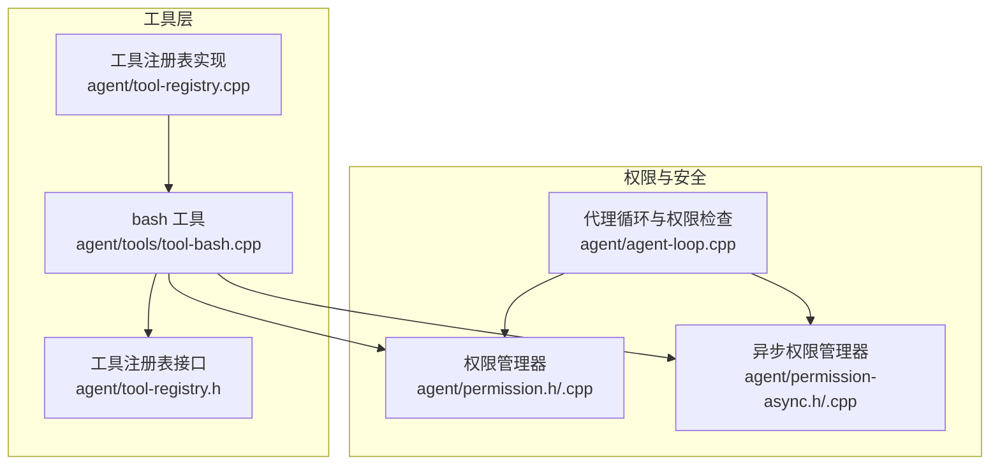
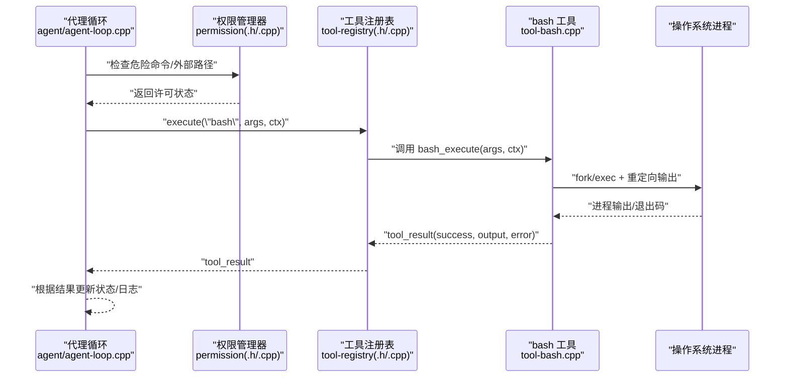
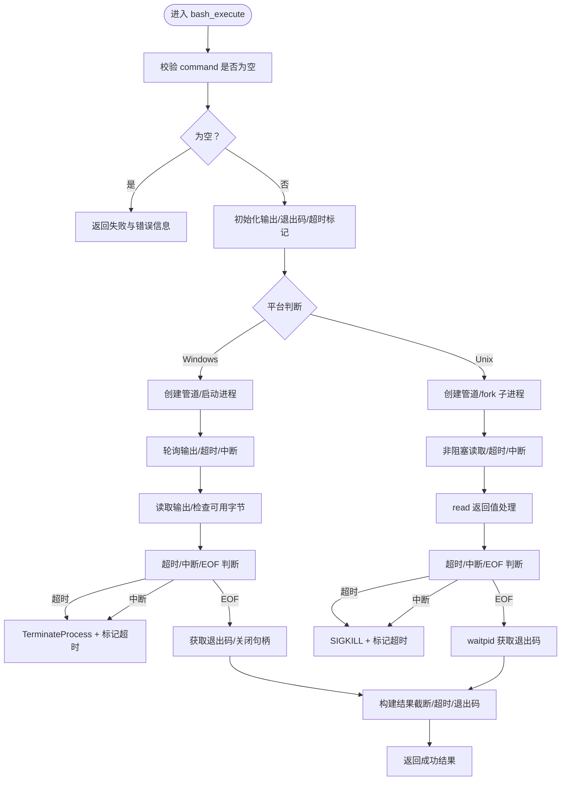
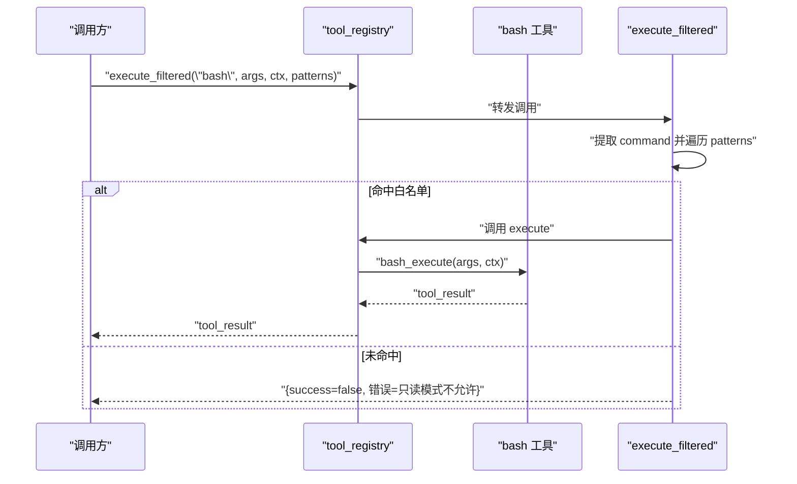
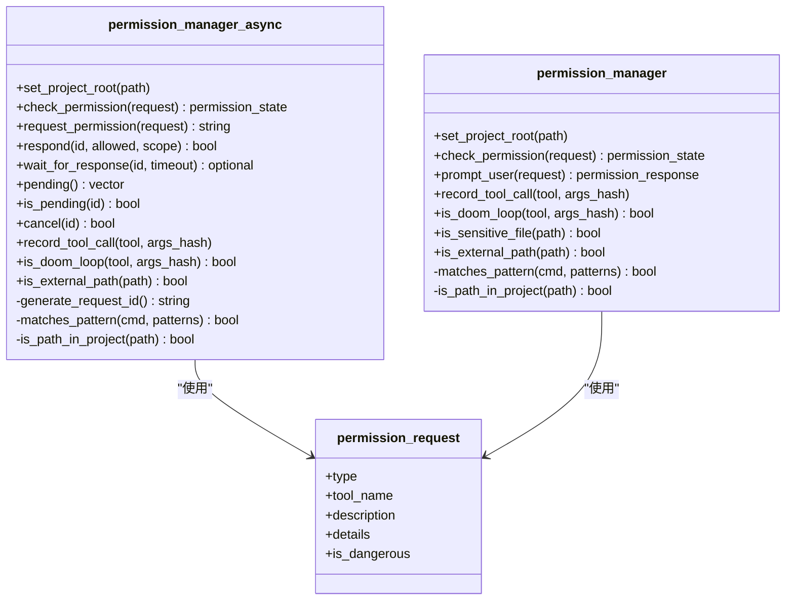
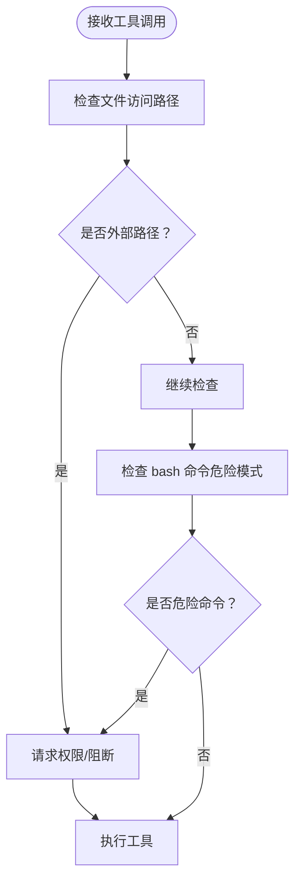
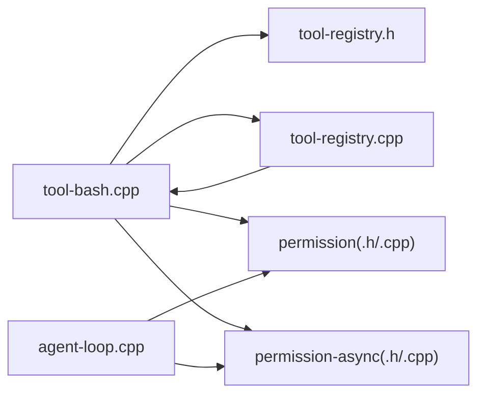

# 命令执行工具

<cite>
**本文档引用的文件**
- [tool-bash.cpp](file://agent/tools/tool-bash.cpp)
- [tool-registry.h](file://agent/tool-registry.h)
- [tool-registry.cpp](file://agent/tool-registry.cpp)
- [permission.h](file://agent/permission.h)
- [permission.cpp](file://agent/permission.cpp)
- [permission-async.h](file://agent/permission-async.h)
- [permission-async.cpp](file://agent/permission-async.cpp)
- [agent-loop.cpp](file://agent/agent-loop.cpp)
</cite>

## 目录
1. [简介](#简介)
2. [项目结构](#项目结构)
3. [核心组件](#核心组件)
4. [架构总览](#架构总览)
5. [详细组件分析](#详细组件分析)
6. [依赖关系分析](#依赖关系分析)
7. [性能考量](#性能考量)
8. [故障排查指南](#故障排查指南)
9. [结论](#结论)

## 简介
本文件针对命令执行工具（bash 工具）进行系统化技术文档整理，重点覆盖以下方面：
- 命令执行机制与平台差异（Windows/Unix）
- 参数传递与上下文（工作目录、超时、中断）
- 输出处理与截断策略
- 安全策略、危险命令检测与沙箱限制
- 配置选项、超时设置与错误处理
- 安全最佳实践、性能优化与调试技巧

该工具通过统一的工具注册表对外暴露，支持在不同运行环境下以安全可控的方式执行 shell 命令，并提供权限控制与超时保护。

## 项目结构
命令执行工具位于 agent/tools 子模块中，配合工具注册表、权限管理与代理循环共同构成完整的执行链路。

图表来源
- [tool-bash.cpp:1-281](file://agent/tools/tool-bash.cpp#L1-L281)
- [tool-registry.h:1-103](file://agent/tool-registry.h#L1-L103)
- [tool-registry.cpp:48-85](file://agent/tool-registry.cpp#L48-L85)
- [permission.h:1-102](file://agent/permission.h#L1-L102)
- [permission.cpp:35-140](file://agent/permission.cpp#L35-L140)
- [permission-async.h:1-142](file://agent/permission-async.h#L1-L142)
- [permission-async.cpp:10-122](file://agent/permission-async.cpp#L10-L122)
- [agent-loop.cpp:526-560](file://agent/agent-loop.cpp#L526-L560)

章节来源
- [tool-bash.cpp:1-281](file://agent/tools/tool-bash.cpp#L1-L281)
- [tool-registry.h:1-103](file://agent/tool-registry.h#L1-L103)
- [tool-registry.cpp:48-85](file://agent/tool-registry.cpp#L48-L85)
- [permission.h:1-102](file://agent/permission.h#L1-L102)
- [permission.cpp:35-140](file://agent/permission.cpp#L35-L140)
- [permission-async.h:1-142](file://agent/permission-async.h#L1-L142)
- [permission-async.cpp:10-122](file://agent/permission-async.cpp#L10-L122)
- [agent-loop.cpp:526-560](file://agent/agent-loop.cpp#L526-L560)

## 核心组件
- bash 工具：负责解析参数、执行命令、读取输出、处理超时与中断、构建结果。
- 工具注册表：提供工具注册、查询与执行入口，支持过滤模式下的 bash 模式匹配。
- 权限管理器：定义危险/安全命令模式，执行外部路径检查、会话覆盖与环路检测。
- 代理循环：在工具调用前进行权限请求与危险命令检测，必要时阻塞等待用户确认。

章节来源
- [tool-bash.cpp:50-281](file://agent/tools/tool-bash.cpp#L50-L281)
- [tool-registry.h:58-103](file://agent/tool-registry.h#L58-L103)
- [tool-registry.cpp:48-85](file://agent/tool-registry.cpp#L48-L85)
- [permission.h:40-102](file://agent/permission.h#L40-L102)
- [permission.cpp:35-140](file://agent/permission.cpp#L35-L140)
- [agent-loop.cpp:526-560](file://agent/agent-loop.cpp#L526-L560)

## 架构总览
下图展示从代理循环到工具执行的完整流程，包括权限检查、危险命令识别与跨平台命令执行。

图表来源
- [agent-loop.cpp:526-560](file://agent/agent-loop.cpp#L526-L560)
- [permission.cpp:108-140](file://agent/permission.cpp#L108-L140)
- [tool-registry.cpp:49-60](file://agent/tool-registry.cpp#L49-L60)
- [tool-bash.cpp:50-258](file://agent/tools/tool-bash.cpp#L50-L258)

## 详细组件分析

### bash 工具执行机制
- 参数与上下文
  - 必需参数：command（字符串）
  - 可选参数：timeout（毫秒，默认使用上下文中的 timeout_ms）
  - 上下文字段：working_dir（工作目录）、is_interrupted（原子标志）、timeout_ms（默认超时）
- 平台差异
  - Windows：使用 CreatePipe/PeekNamedPipe/ReadFile/WaitForSingleObject/TerminateProcess
  - Unix：使用 pipe/fork/dup2/chdir/execl/waitpid/kill(SIGKILL)
- 超时与中断
  - 使用 steady_clock 计时；超过 timeout_ms 或收到 is_interrupted 置位则终止子进程
- 输出处理
  - 读取标准输出与标准错误，累计至最大长度（字符数与行数）
  - 行数超过阈值时进行截断并提示“更多行”
  - 输出长度超过阈值时追加截断提示
- 结果封装
  - success 字段：仅当退出码为 0 且未超时
  - output 包含截断后的文本与附加信息（超时/退出码等）
  - error 为空（错误通过 success 与 output 的附加信息体现）

图表来源
- [tool-bash.cpp:50-258](file://agent/tools/tool-bash.cpp#L50-L258)

章节来源
- [tool-bash.cpp:50-258](file://agent/tools/tool-bash.cpp#L50-L258)
- [tool-registry.h:18-41](file://agent/tool-registry.h#L18-L41)

### 工具注册表与过滤执行
- 工具注册表提供 execute 与 execute_filtered 两个入口
  - execute：直接调用对应工具的执行函数
  - execute_filtered：对 bash 工具进行模式匹配过滤，仅允许白名单模式的命令执行
- 过滤逻辑
  - 若传入的 bash_patterns 非空，则检查命令是否以任一模式开头或出现在分隔符后
  - 不匹配则返回“只读模式下不允许该命令”的错误

图表来源
- [tool-registry.cpp:62-85](file://agent/tool-registry.cpp#L62-L85)
- [tool-bash.cpp:260-281](file://agent/tools/tool-bash.cpp#L260-L281)

章节来源
- [tool-registry.cpp:48-85](file://agent/tool-registry.cpp#L48-L85)
- [tool-bash.cpp:260-281](file://agent/tools/tool-bash.cpp#L260-L281)

### 权限与安全策略
- 危险命令检测
  - 默认危险模式列表：破坏性命令、提权、危险权限、远程执行、系统破坏、包管理器、Git 破坏性操作、进程控制等
  - 安全模式列表：基础文件与版本控制命令等
  - 检测方式：前缀匹配或空格/分隔符后匹配
- 外部路径检查
  - 将绝对路径与项目根路径比较，确保访问仅限于工作目录范围内
- 会话覆盖与环路检测
  - 支持一次性/会话级允许/拒绝覆盖
  - 记录最近若干次工具调用，检测重复相同调用（环路）
- 交互与异步权限
  - 同步版本：直接读取用户输入
  - 异步版本：生成唯一请求 ID，通过回调通知外部系统，支持超时等待与取消

图表来源
- [permission.h:25-102](file://agent/permission.h#L25-L102)
- [permission.cpp:35-140](file://agent/permission.cpp#L35-L140)
- [permission-async.h:15-142](file://agent/permission-async.h#L15-L142)
- [permission-async.cpp:10-122](file://agent/permission-async.cpp#L10-L122)

章节来源
- [permission.h:16-38](file://agent/permission.h#L16-L38)
- [permission.cpp:44-71](file://agent/permission.cpp#L44-L71)
- [permission-async.cpp:19-45](file://agent/permission-async.cpp#L19-L45)
- [agent-loop.cpp:542-553](file://agent/agent-loop.cpp#L542-L553)

### 代理循环中的权限检查与危险命令识别
- 在工具调用前，代理循环对文件访问与 bash 命令进行检查
- 对于 bash 命令，扫描危险模式并标记为危险
- 对于外部路径访问，提示用户确认或直接阻断

图表来源
- [agent-loop.cpp:526-560](file://agent/agent-loop.cpp#L526-L560)
- [agent-loop.cpp:1315-1325](file://agent/agent-loop.cpp#L1315-L1325)

章节来源
- [agent-loop.cpp:526-560](file://agent/agent-loop.cpp#L526-L560)
- [agent-loop.cpp:1315-1325](file://agent/agent-loop.cpp#L1315-L1325)

## 依赖关系分析
- bash 工具依赖工具注册表接口与实现，通过统一的工具定义与执行接口完成调用
- 权限管理器与异步权限管理器共享相同的危险/安全模式列表，但前者同步阻塞，后者异步非阻塞
- 代理循环在工具调用前后进行权限与安全检查，形成“前置防护”机制

图表来源
- [tool-bash.cpp:1-281](file://agent/tools/tool-bash.cpp#L1-L281)
- [tool-registry.h:1-103](file://agent/tool-registry.h#L1-L103)
- [tool-registry.cpp:48-85](file://agent/tool-registry.cpp#L48-L85)
- [permission.h:1-102](file://agent/permission.h#L1-L102)
- [permission.cpp:35-140](file://agent/permission.cpp#L35-L140)
- [permission-async.h:1-142](file://agent/permission-async.h#L1-L142)
- [permission-async.cpp:10-122](file://agent/permission-async.cpp#L10-L122)
- [agent-loop.cpp:526-560](file://agent/agent-loop.cpp#L526-L560)

章节来源
- [tool-bash.cpp:1-281](file://agent/tools/tool-bash.cpp#L1-L281)
- [tool-registry.cpp:48-85](file://agent/tool-registry.cpp#L48-L85)
- [permission.cpp:35-140](file://agent/permission.cpp#L35-L140)
- [permission-async.cpp:10-122](file://agent/permission-async.cpp#L10-L122)
- [agent-loop.cpp:526-560](file://agent/agent-loop.cpp#L526-L560)

## 性能考量
- 输出缓冲与截断
  - 使用固定大小缓冲区循环读取，避免阻塞等待
  - 截断策略：按行数与字符数双重限制，减少内存占用与传输开销
- 超时与中断
  - 使用高精度计时器与平台特定的终止信号/函数，及时清理子进程
  - 中断标志采用原子变量，降低竞态风险
- 非阻塞 I/O
  - Unix 实现设置非阻塞读取，结合短睡眠避免忙等
- 资源回收
  - 显式关闭管道/句柄，等待子进程结束，防止僵尸进程

[本节为通用性能讨论，不直接分析具体文件]

## 故障排查指南
- 常见错误与定位
  - 命令为空：检查调用参数，确保 command 字段存在
  - 创建管道/进程失败：检查平台 API 返回值与权限
  - 超时：调整 timeout 参数或优化命令执行时间
  - 中断：确认 is_interrupted 标志正确传递
- 安全相关
  - 危险命令被阻断：查看危险模式列表，确认命令是否属于白名单
  - 外部路径访问被阻断：确认工作目录与项目根路径设置
- 调试建议
  - 启用详细日志，观察权限请求与工具调用链
  - 使用较小超时与简单命令验证执行路径
  - 在异步权限场景中，检查请求 ID 与回调通知是否正常

章节来源
- [tool-bash.cpp:54-56](file://agent/tools/tool-bash.cpp#L54-L56)
- [tool-bash.cpp:145-154](file://agent/tools/tool-bash.cpp#L145-L154)
- [tool-bash.cpp:186-195](file://agent/tools/tool-bash.cpp#L186-L195)
- [permission.cpp:108-140](file://agent/permission.cpp#L108-L140)
- [agent-loop.cpp:542-553](file://agent/agent-loop.cpp#L542-L553)

## 结论
该命令执行工具通过统一的工具注册表与严格的权限控制，实现了跨平台、可配置、可监控的命令执行能力。其核心特性包括：
- 平台无关的命令执行与输出收集
- 可配置的超时与中断机制
- 基于模式匹配的危险命令检测与外部路径限制
- 同步与异步两种权限管理模式，满足不同部署需求

建议在生产环境中：
- 明确设置工作目录与超时参数
- 维护白名单模式，谨慎放行 bash 命令
- 结合异步权限管理器实现 API 驱动的授权流程
- 关注输出截断与超时提示，便于问题定位