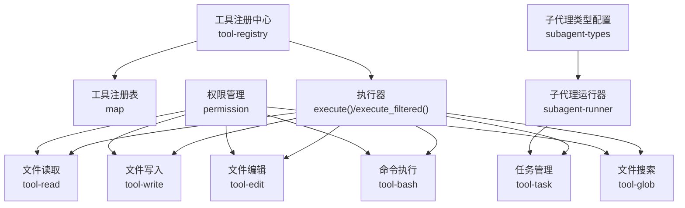
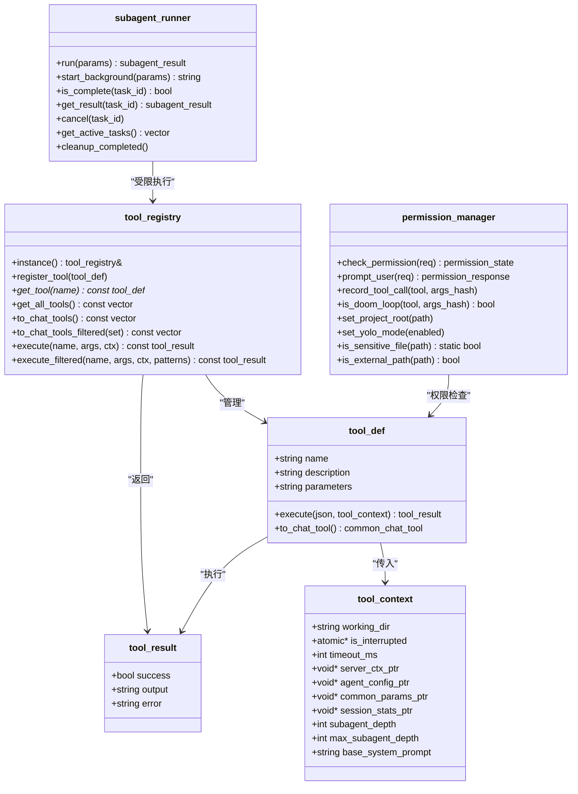
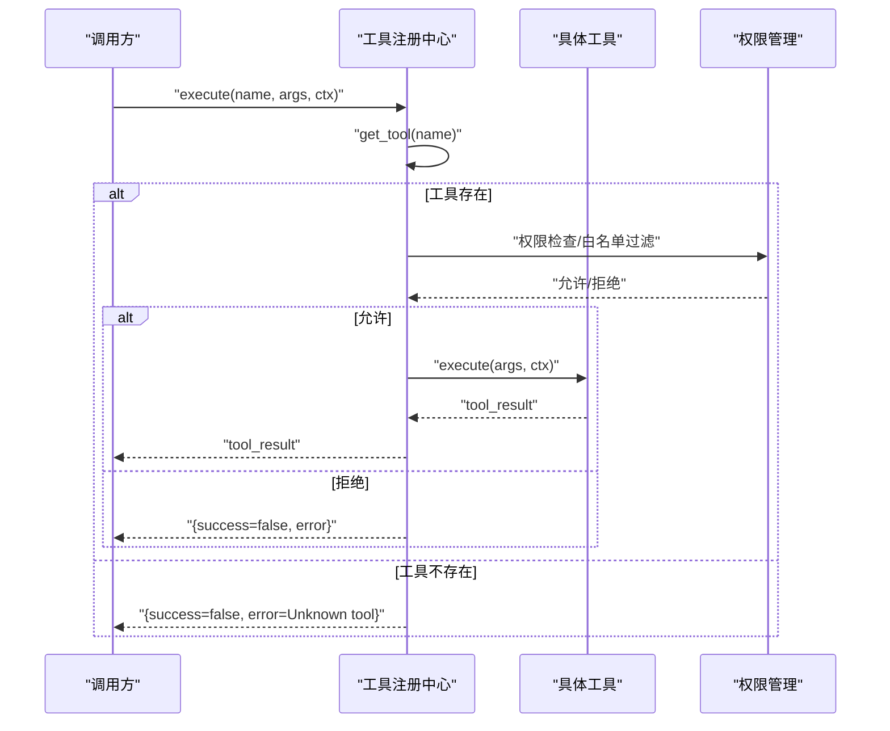
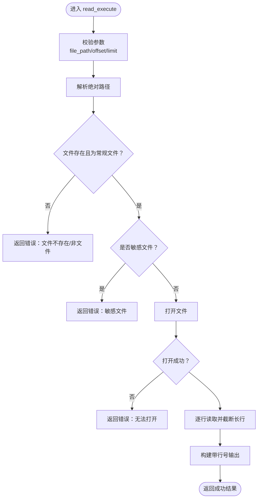
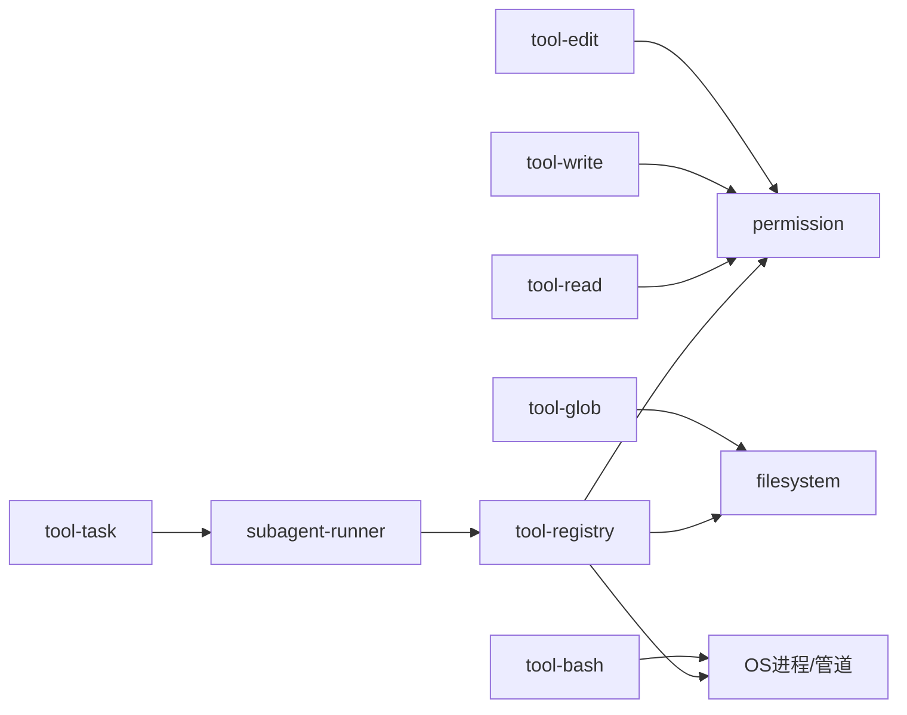

# 工具执行系统

<cite>
**本文引用的文件**
- [tool-registry.h](file://agent/tool-registry.h)
- [tool-registry.cpp](file://agent/tool-registry.cpp)
- [tool-read.cpp](file://agent/tools/tool-read.cpp)
- [tool-write.cpp](file://agent/tools/tool-write.cpp)
- [tool-edit.cpp](file://agent/tools/tool-edit.cpp)
- [tool-bash.cpp](file://agent/tools/tool-bash.cpp)
- [tool-task.cpp](file://agent/tools/tool-task.cpp)
- [tool-glob.cpp](file://agent/tools/tool-glob.cpp)
- [permission.h](file://agent/permission.h)
- [permission.cpp](file://agent/permission.cpp)
- [subagent-types.h](file://agent/subagent/subagent-types.h)
- [subagent-runner.h](file://agent/subagent/subagent-runner.h)
</cite>

## 目录
1. [简介](#简介)
2. [项目结构](#项目结构)
3. [核心组件](#核心组件)
4. [架构总览](#架构总览)
5. [详细组件分析](#详细组件分析)
6. [依赖关系分析](#依赖关系分析)
7. [性能考量](#性能考量)
8. [故障排查指南](#故障排查指南)
9. [结论](#结论)
10. [附录](#附录)

## 简介
本技术文档面向“工具执行系统”，系统以统一的工具注册与执行框架为核心，提供文件读取、写入、编辑、命令执行、任务管理（子代理）、以及文件搜索等内置工具，并通过权限管理与上下文控制保障安全与可控性。本文将从架构、数据流、处理逻辑、错误处理、结果格式化、自定义工具开发、工具包装器与工具链组合策略、安全性、性能优化与调试技巧等方面进行深入说明。

## 项目结构
工具执行系统主要由以下部分组成：
- 工具注册中心：集中注册、查询与执行工具，支持过滤与只读模式下的命令白名单校验。
- 内置工具：文件读取、写入、编辑、命令执行、任务管理（子代理）、文件搜索。
- 权限管理：对敏感文件、外部路径、危险命令进行识别与交互式授权。
- 子代理运行器：受限工具集的子代理执行器，支持同步与后台任务。
- 上下文与结果：统一的工具上下文与结果结构，便于跨工具传递状态与统计。

**图表来源**
- [tool-registry.h:58-90](file://agent/tool-registry.h#L58-L90)
- [tool-registry.cpp:11-85](file://agent/tool-registry.cpp#L11-L85)
- [tool-read.cpp:95-119](file://agent/tools/tool-read.cpp#L95-L119)
- [tool-write.cpp:59-79](file://agent/tools/tool-write.cpp#L59-L79)
- [tool-edit.cpp:166-195](file://agent/tools/tool-edit.cpp#L166-L195)
- [tool-bash.cpp:260-280](file://agent/tools/tool-bash.cpp#L260-L280)
- [tool-task.cpp:210-256](file://agent/tools/tool-task.cpp#L210-L256)
- [tool-glob.cpp:158-180](file://agent/tools/tool-glob.cpp#L158-L180)
- [permission.h:40-101](file://agent/permission.h#L40-L101)
- [permission.cpp:34-140](file://agent/permission.cpp#L34-L140)
- [subagent-runner.h:64-113](file://agent/subagent/subagent-runner.h#L64-L113)
- [subagent-types.h:8-35](file://agent/subagent/subagent-types.h#L8-L35)

**章节来源**
- [tool-registry.h:1-103](file://agent/tool-registry.h#L1-L103)
- [tool-registry.cpp:1-86](file://agent/tool-registry.cpp#L1-L86)
- [tool-read.cpp:1-120](file://agent/tools/tool-read.cpp#L1-L120)
- [tool-write.cpp:1-80](file://agent/tools/tool-write.cpp#L1-L80)
- [tool-edit.cpp:1-196](file://agent/tools/tool-edit.cpp#L1-L196)
- [tool-bash.cpp:1-281](file://agent/tools/tool-bash.cpp#L1-L281)
- [tool-task.cpp:1-257](file://agent/tools/tool-task.cpp#L1-L257)
- [tool-glob.cpp:1-181](file://agent/tools/tool-glob.cpp#L1-L181)
- [permission.h:1-102](file://agent/permission.h#L1-L102)
- [permission.cpp:1-310](file://agent/permission.cpp#L1-L310)
- [subagent-types.h:1-36](file://agent/subagent/subagent-types.h#L1-L36)
- [subagent-runner.h:1-114](file://agent/subagent/subagent-runner.h#L1-L114)

## 核心组件
- 工具注册中心
  - 单例模式，提供注册、查询、全量导出、执行与带过滤执行能力。
  - 支持将工具转换为通用聊天工具描述，便于与模型交互。
  - 提供宏用于工具自动注册，降低重复样板代码。
- 工具定义与上下文
  - 工具定义包含名称、描述、JSON Schema 参数、执行函数指针。
  - 工具上下文包含工作目录、中断信号、超时、子代理深度限制、会话统计指针等。
  - 工具结果包含成功标志、输出文本、错误信息。
- 权限管理
  - 定义权限类型与状态，支持默认策略、会话覆盖、危险/安全命令模式匹配。
  - 对敏感文件名/扩展名、外部路径、循环调用进行检测与阻断。
- 子代理运行器
  - 按类型配置受限工具集与 Bash 前缀白名单。
  - 支持同步运行与后台任务管理，聚合子代理令牌用量到父会话统计。

**章节来源**
- [tool-registry.h:17-56](file://agent/tool-registry.h#L17-L56)
- [tool-registry.cpp:6-85](file://agent/tool-registry.cpp#L6-L85)
- [permission.h:8-38](file://agent/permission.h#L8-L38)
- [permission.cpp:34-140](file://agent/permission.cpp#L34-L140)
- [subagent-types.h:8-26](file://agent/subagent/subagent-types.h#L8-L26)
- [subagent-runner.h:24-43](file://agent/subagent/subagent-runner.h#L24-L43)

## 架构总览
系统采用“注册中心 + 工具实现 + 权限与上下文”的分层设计。工具通过统一注册接口暴露给执行器；执行器负责参数解析、上下文注入、权限检查与结果封装；内置工具实现各自业务逻辑；子代理运行器在受限工具集上复用主服务上下文，实现多层级任务编排。

**图表来源**
- [tool-registry.h:58-90](file://agent/tool-registry.h#L58-L90)
- [tool-registry.cpp:11-85](file://agent/tool-registry.cpp#L11-L85)
- [tool-registry.h:44-56](file://agent/tool-registry.h#L44-L56)
- [tool-registry.h:18-34](file://agent/tool-registry.h#L18-L34)
- [tool-registry.h:37-41](file://agent/tool-registry.h#L37-L41)
- [permission.h:40-101](file://agent/permission.h#L40-L101)
- [subagent-runner.h:64-113](file://agent/subagent/subagent-runner.h#L64-L113)

## 详细组件分析

### 工具注册机制与执行流程
- 注册机制
  - 工具通过静态定义与宏完成自动注册，避免手动维护注册列表。
  - 注册中心提供单例访问、线程安全的工具表存储与查询。
- 执行流程
  - 执行器根据名称查找工具，不存在则返回错误。
  - 执行前可进行只读模式过滤（bash 命令白名单）。
  - 执行过程中捕获异常并封装为工具结果。
  - 结果包含成功标志、输出与错误信息，便于上层处理。

**图表来源**
- [tool-registry.cpp:49-85](file://agent/tool-registry.cpp#L49-L85)
- [permission.cpp:108-140](file://agent/permission.cpp#L108-L140)

**章节来源**
- [tool-registry.h:92-103](file://agent/tool-registry.h#L92-L103)
- [tool-registry.cpp:11-85](file://agent/tool-registry.cpp#L11-L85)
- [permission.cpp:108-140](file://agent/permission.cpp#L108-L140)

### 文件读取工具（read）
- 功能特性
  - 支持相对路径解析至工作目录，绝对路径直接使用。
  - 限制最大行数与行长，避免大文件导致内存压力。
  - 输出带行号与范围提示，支持分页读取。
  - 敏感文件拦截，防止泄露凭据类文件。
- 参数与结果
  - 参数：文件路径、偏移行、限制行数（JSON Schema）。
  - 结果：成功标志、格式化输出文本、错误信息。
- 错误处理
  - 缺少必要参数、文件不存在、非常规文件、打开失败、敏感文件等均返回错误。

**图表来源**
- [tool-read.cpp:17-93](file://agent/tools/tool-read.cpp#L17-L93)

**章节来源**
- [tool-read.cpp:17-93](file://agent/tools/tool-read.cpp#L17-L93)

### 文件写入工具（write）
- 功能特性
  - 自动创建父目录，确保目标路径可写。
  - 覆盖或新建文件，返回字节数统计。
  - 敏感文件拦截，避免写入凭据类文件。
- 参数与结果
  - 参数：文件路径、内容（JSON Schema）。
  - 结果：成功标志、操作消息（含字节长度）、错误信息。
- 错误处理
  - 缺少参数、创建目录失败、打开/写入失败、失败标记等均返回错误。

**章节来源**
- [tool-write.cpp:10-57](file://agent/tools/tool-write.cpp#L10-L57)

### 文件编辑工具（edit）
- 功能特性
  - 精确替换指定文本，支持单次或全部替换。
  - 多处出现时要求提供更明确上下文或启用全部替换。
  - 生成简单彩色 diff 输出，便于审阅变更。
  - 敏感文件拦截。
- 参数与结果
  - 参数：文件路径、旧字符串、新字符串、是否全部替换（JSON Schema）。
  - 结果：成功标志、变更摘要与 diff、错误信息。
- 错误处理
  - 缺少参数、文件不存在、不可读、未找到旧字符串、替换前后相同、写入失败等均返回错误。

**章节来源**
- [tool-edit.cpp:69-164](file://agent/tools/tool-edit.cpp#L69-L164)

### 命令执行工具（bash）
- 功能特性
  - 跨平台执行 shell 命令，支持 Windows 与 Unix。
  - 输出截断与超时控制，避免长时间阻塞与输出过大。
  - 中断信号支持，可响应外部取消。
  - 返回退出码、超时标记与截断提示。
- 参数与结果
  - 参数：命令、超时（毫秒，默认继承上下文）（JSON Schema）。
  - 结果：成功标志（结合退出码与超时）、截断后的输出、错误信息。
- 错误处理
  - 缺少命令、管道/进程创建失败、fork/管道错误、读取失败、超时等均返回错误。

**章节来源**
- [tool-bash.cpp:50-258](file://agent/tools/tool-bash.cpp#L50-L258)

### 任务管理工具（task）
- 功能特性
  - 启动子代理执行受限任务，支持同步与后台两种模式。
  - 后台任务返回任务 ID，可通过 resume 参数轮询结果。
  - 限制最大嵌套深度，防止无限递归。
  - 将子代理的令牌用量汇总到父会话统计中。
- 参数与结果
  - 参数：子代理类型、提示词、描述、后台运行开关、恢复 ID（JSON Schema）。
  - 结果：成功标志、任务摘要与工具调用清单、最终输出或错误信息。
- 错误处理
  - 上下文指针缺失、类型解析失败、深度超限、任务不存在/仍在运行等均返回错误。

**章节来源**
- [tool-task.cpp:71-208](file://agent/tools/tool-task.cpp#L71-L208)
- [subagent-types.h:8-26](file://agent/subagent/subagent-types.h#L8-L26)
- [subagent-runner.h:64-113](file://agent/subagent/subagent-runner.h#L64-L113)

### 文件搜索工具（glob）
- 功能特性
  - 支持通配符与递归匹配，排序按最近修改时间。
  - 限制返回数量，避免过多结果影响性能。
  - 支持相对路径解析至工作目录。
- 参数与结果
  - 参数：模式、搜索路径（默认工作目录）（JSON Schema）。
  - 结果：成功标志、匹配文件列表（相对路径）、统计提示。
- 错误处理
  - 缺少模式、路径不存在/非目录、正则无效、遍历异常等均返回错误。

**章节来源**
- [tool-glob.cpp:72-155](file://agent/tools/tool-glob.cpp#L72-L155)

### 权限管理与安全控制
- 敏感文件识别
  - 基于文件名与扩展名规则识别凭据/密钥类文件。
  - 包含常见云服务与数据库凭证命名模式。
- 外部路径检测
  - 限定仅在项目根目录内操作，防止越权访问。
- 危险命令白/黑名单
  - 危险命令一律需要确认；安全命令可自动放行。
  - 支持会话级“总是允许/禁止”覆盖。
- 循环调用防护
  - 记录最近若干次工具调用，若同一工具与参数重复多次，判定为循环并阻断。

**章节来源**
- [permission.h:8-38](file://agent/permission.h#L8-L38)
- [permission.cpp:34-140](file://agent/permission.cpp#L34-L140)
- [permission.cpp:230-304](file://agent/permission.cpp#L230-L304)
- [permission.cpp:199-223](file://agent/permission.cpp#L199-L223)

## 依赖关系分析
- 组件耦合
  - 工具注册中心与工具实现松耦合，通过统一接口与 JSON Schema 解析参数。
  - 工具实现依赖权限管理与文件系统，部分工具（task）依赖子代理运行器。
  - 子代理运行器复用主服务上下文，但通过工具白名单与 Bash 前缀限制实现隔离。
- 外部依赖
  - 使用标准文件系统与跨平台进程/管道接口。
  - 使用 JSON 库进行参数与描述的序列化/反序列化。

**图表来源**
- [tool-registry.cpp:11-85](file://agent/tool-registry.cpp#L11-L85)
- [tool-read.cpp:1-120](file://agent/tools/tool-read.cpp#L1-L120)
- [tool-write.cpp:1-80](file://agent/tools/tool-write.cpp#L1-L80)
- [tool-edit.cpp:1-196](file://agent/tools/tool-edit.cpp#L1-L196)
- [tool-bash.cpp:1-281](file://agent/tools/tool-bash.cpp#L1-L281)
- [tool-glob.cpp:1-181](file://agent/tools/tool-glob.cpp#L1-L181)
- [tool-task.cpp:1-257](file://agent/tools/tool-task.cpp#L1-L257)
- [subagent-runner.h:64-113](file://agent/subagent/subagent-runner.h#L64-L113)

**章节来源**
- [tool-registry.cpp:11-85](file://agent/tool-registry.cpp#L11-L85)
- [tool-task.cpp:32-48](file://agent/tools/tool-task.cpp#L32-L48)

## 性能考量
- 输出截断与行数限制
  - 命令执行与文件读取均设置最大输出长度与行数，避免内存与显示压力。
- 递归搜索限制
  - 文件搜索限制返回数量，建议使用更精确的模式以减少遍历开销。
- 超时与中断
  - 命令执行支持超时与中断信号，防止长时间阻塞。
- 子代理令牌统计
  - 后台任务完成后将子代理的令牌用量合并到父会话统计，便于整体性能监控。

**章节来源**
- [tool-bash.cpp:25-48](file://agent/tools/tool-bash.cpp#L25-L48)
- [tool-read.cpp:14-15](file://agent/tools/tool-read.cpp#L14-L15)
- [tool-glob.cpp:105-105](file://agent/tools/tool-glob.cpp#L105-L105)
- [tool-task.cpp:50-69](file://agent/tools/tool-task.cpp#L50-L69)

## 故障排查指南
- 工具未找到
  - 检查工具名称大小写与拼写，确认已通过宏注册。
- 权限被拒绝
  - 查看是否命中危险命令白/黑名单，或为敏感文件/外部路径。
  - 可临时启用“YOLO 模式”（谨慎使用）或在会话中选择“总是允许/禁止”。
- 文件相关错误
  - 文件不存在/非常规文件：确认路径与权限。
  - 打不开/写入失败：检查磁盘空间、权限与父目录创建。
  - 敏感文件：避免对凭据类文件进行读写编辑。
- 命令执行问题
  - 超时：增大超时或优化命令。
  - 无输出：确认命令是否正确、工作目录是否正确。
  - 中断：检查中断信号是否被正确传递。
- 任务管理问题
  - 深度超限：检查嵌套层级，合理拆分任务。
  - 后台任务未完成：使用 resume 参数轮询，或等待任务完成。

**章节来源**
- [tool-registry.cpp:55-60](file://agent/tool-registry.cpp#L55-L60)
- [permission.cpp:108-140](file://agent/permission.cpp#L108-L140)
- [tool-read.cpp:33-51](file://agent/tools/tool-read.cpp#L33-L51)
- [tool-write.cpp:34-51](file://agent/tools/tool-write.cpp#L34-L51)
- [tool-bash.cpp:186-236](file://agent/tools/tool-bash.cpp#L186-L236)
- [tool-task.cpp:77-82](file://agent/tools/tool-task.cpp#L77-L82)

## 结论
该工具执行系统通过统一的注册与执行框架、严格的权限控制与上下文管理，实现了安全、可控且可扩展的工具生态。内置工具覆盖了文件操作、命令执行、任务编排与文件搜索等核心场景；配合子代理运行器与会话统计，能够支撑复杂任务的自动化执行与可观测性。建议在生产环境中启用权限确认与外部路径限制，并结合超时与输出截断策略提升稳定性。

## 附录

### 工具参数验证与结果格式化
- 参数验证
  - 使用 JSON Schema 描述参数结构与必填项，执行前由上层解析。
  - 工具内部进一步校验路径、文件状态与敏感性。
- 结果格式化
  - 成功输出采用统一结构，便于前端渲染与日志记录。
  - 错误信息包含明确原因，便于定位问题。

**章节来源**
- [tool-read.cpp:99-116](file://agent/tools/tool-read.cpp#L99-L116)
- [tool-write.cpp:62-75](file://agent/tools/tool-write.cpp#L62-L75)
- [tool-edit.cpp:171-192](file://agent/tools/tool-edit.cpp#L171-L192)
- [tool-bash.cpp:264-277](file://agent/tools/tool-bash.cpp#L264-L277)
- [tool-task.cpp:226-254](file://agent/tools/tool-task.cpp#L226-L254)
- [tool-glob.cpp:163-176](file://agent/tools/tool-glob.cpp#L163-L176)

### 自定义工具开发指南
- 定义工具
  - 实现执行函数，接收 JSON 参数与工具上下文，返回工具结果。
  - 编写 JSON Schema 描述参数，声明必填字段与类型。
- 注册工具
  - 使用注册宏将工具静态注册到注册中心。
- 集成权限
  - 在工具内部调用权限管理接口，对敏感文件/外部路径/危险命令进行检查。
- 测试与验证
  - 编写边界测试（空参数、超长行、大文件、越权路径等），确保健壮性。

**章节来源**
- [tool-registry.h:92-103](file://agent/tool-registry.h#L92-L103)
- [tool-registry.h:44-56](file://agent/tool-registry.h#L44-L56)
- [permission.h:40-101](file://agent/permission.h#L40-L101)

### 工具包装器与工具链组合策略
- 工具包装器
  - 子代理运行器可作为工具包装器，基于类型配置限制工具集与 Bash 前缀，实现“沙箱化”执行。
- 工具链组合
  - 使用任务工具启动子代理，由子代理在受限工具集上串联多个工具完成复杂任务。
  - 通过后台任务模式实现异步编排，使用恢复 ID 查询进度与结果。

**章节来源**
- [subagent-runner.h:64-113](file://agent/subagent/subagent-runner.h#L64-L113)
- [subagent-types.h:8-26](file://agent/subagent/subagent-types.h#L8-L26)
- [tool-task.cpp:173-207](file://agent/tools/tool-task.cpp#L173-L207)