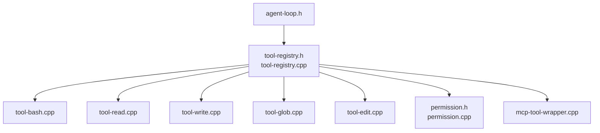
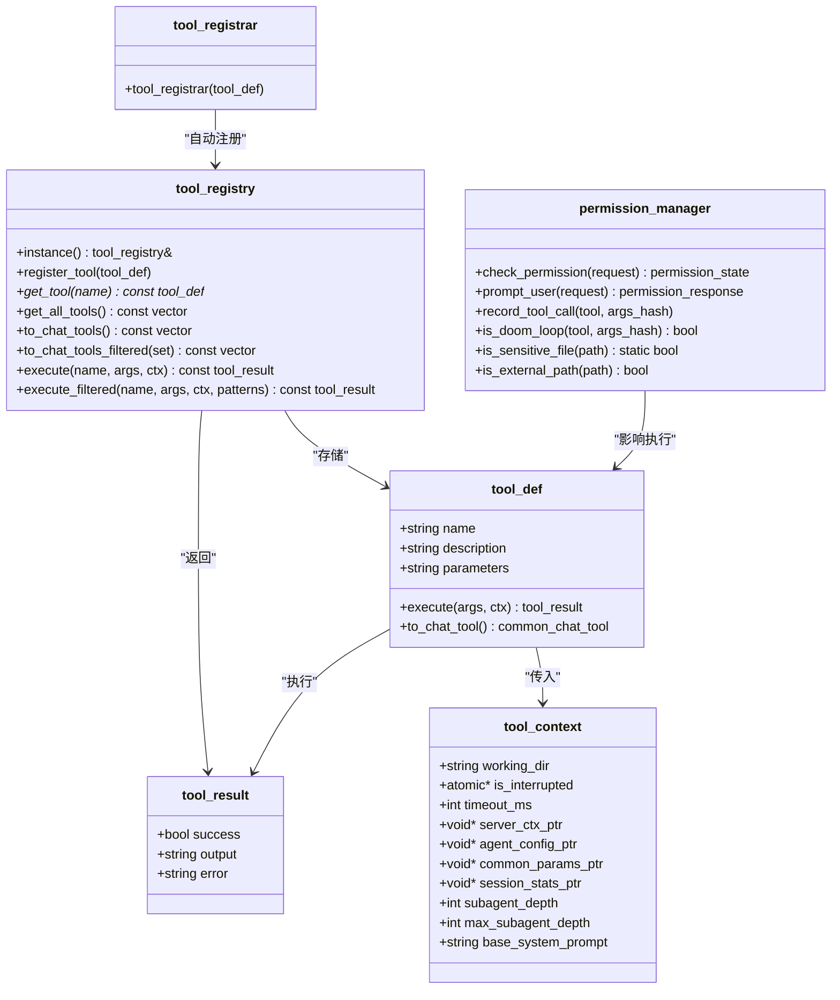
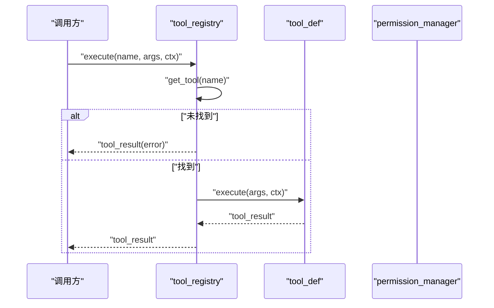
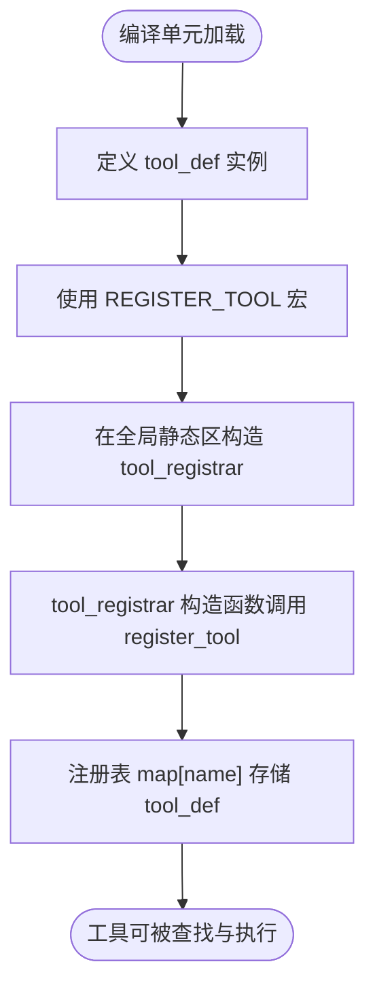
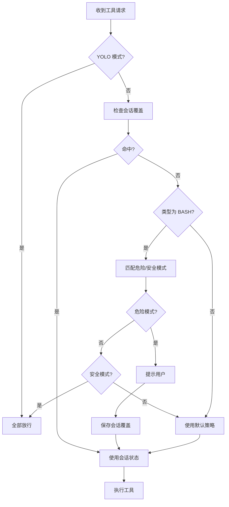
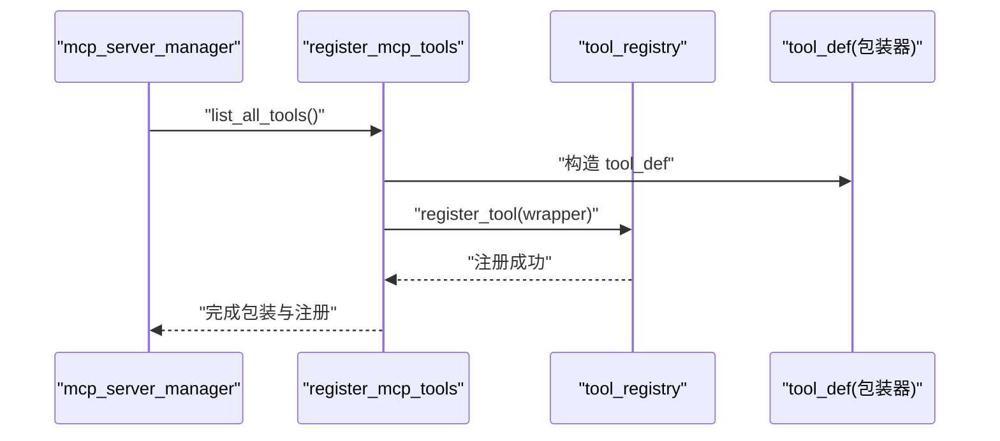
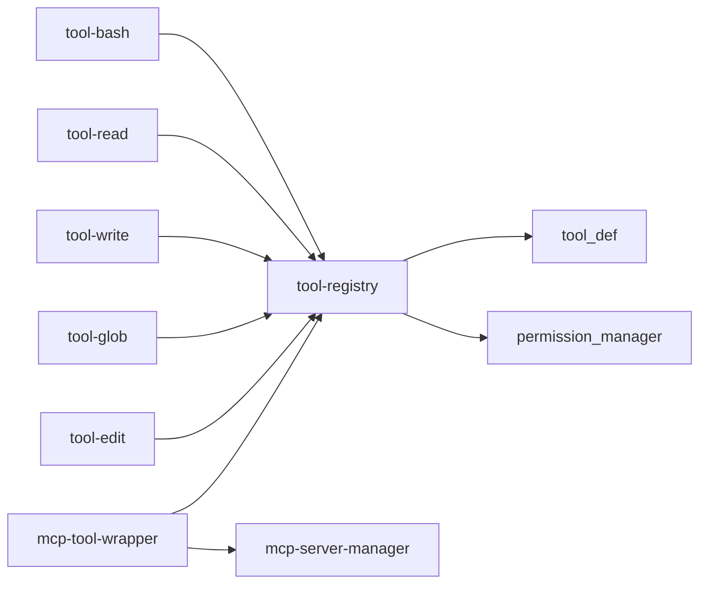

# 工具注册机制

<cite>
**本文引用的文件**
- [tool-registry.h](file://agent/tool-registry.h)
- [tool-registry.cpp](file://agent/tool-registry.cpp)
- [tool-bash.cpp](file://agent/tools/tool-bash.cpp)
- [tool-read.cpp](file://agent/tools/tool-read.cpp)
- [tool-write.cpp](file://agent/tools/tool-write.cpp)
- [tool-glob.cpp](file://agent/tools/tool-glob.cpp)
- [tool-edit.cpp](file://agent/tools/tool-edit.cpp)
- [permission.h](file://agent/permission.h)
- [permission.cpp](file://agent/permission.cpp)
- [mcp-tool-wrapper.cpp](file://agent/mcp/mcp-tool-wrapper.cpp)
- [mcp-tool-wrapper.h](file://agent/mcp/mcp-tool-wrapper.h)
- [agent-loop.h](file://agent/agent-loop.h)
</cite>

## 目录
1. [引言](#引言)
2. [项目结构](#项目结构)
3. [核心组件](#核心组件)
4. [架构总览](#架构总览)
5. [详细组件分析](#详细组件分析)
6. [依赖关系分析](#依赖关系分析)
7. [性能考虑](#性能考虑)
8. [故障排查指南](#故障排查指南)
9. [结论](#结论)
10. [附录](#附录)

## 引言
本技术文档围绕工具注册机制展开，系统性阐述 tool_registry 的设计与实现、工具定义结构 tool_def 的字段语义、参数校验与执行函数绑定方式；详解 REGISTER_TOOL 宏的自动注册原理与手动注册路径；覆盖工具查找算法、过滤与权限控制集成、错误处理流程、性能优化与内存管理策略，并给出关键流程的时序与类图，帮助读者快速理解并正确扩展工具生态。

## 项目结构
工具注册机制位于 agent 子模块中，核心由注册表、工具定义与宏、具体工具实现、权限管理以及 MCP 工具包装器组成。下图展示与工具注册直接相关的文件与职责：

图表来源
- [tool-registry.h:58-90](file://agent/tool-registry.h#L58-L90)
- [tool-registry.cpp:11-13](file://agent/tool-registry.cpp#L11-L13)
- [tool-bash.cpp:260-280](file://agent/tools/tool-bash.cpp#L260-L280)
- [tool-read.cpp:95-119](file://agent/tools/tool-read.cpp#L95-L119)
- [tool-write.cpp:59-79](file://agent/tools/tool-write.cpp#L59-L79)
- [tool-glob.cpp:158-180](file://agent/tools/tool-glob.cpp#L158-L180)
- [tool-edit.cpp:166-195](file://agent/tools/tool-edit.cpp#L166-L195)
- [permission.h:40-101](file://agent/permission.h#L40-L101)
- [permission.cpp:34-71](file://agent/permission.cpp#L34-L71)
- [mcp-tool-wrapper.cpp:7-63](file://agent/mcp/mcp-tool-wrapper.cpp#L7-L63)
- [agent-loop.h:40-49](file://agent/agent-loop.h#L40-L49)

章节来源
- [tool-registry.h:1-103](file://agent/tool-registry.h#L1-L103)
- [tool-registry.cpp:1-86](file://agent/tool-registry.cpp#L1-L86)

## 核心组件
- tool_registry 单例：负责工具的注册、查询、批量导出与执行（含只读模式下的 bash 过滤）。
- tool_def 工具定义：包含名称、描述、JSON Schema 参数定义、执行函数指针。
- tool_context 执行上下文：工作目录、中断标记、超时、子代理支持等。
- tool_result 执行结果：成功标志、输出文本、错误信息。
- tool_registrar 自动注册器：通过构造函数触发注册。
- REGISTER_TOOL 宏：在全局静态区构造 tool_registrar 实例，实现自动注册。
- permission_manager 权限管理：提供默认策略、交互式许可、危险模式识别、循环检测等。

章节来源
- [tool-registry.h:18-56](file://agent/tool-registry.h#L18-L56)
- [tool-registry.h:58-90](file://agent/tool-registry.h#L58-L90)
- [tool-registry.h:92-102](file://agent/tool-registry.h#L92-L102)
- [permission.h:40-101](file://agent/permission.h#L40-L101)

## 架构总览
工具注册机制采用“单例注册表 + 工具定义 + 执行函数”的轻量架构。工具通过宏或手动注册进入注册表；运行时按名称检索并调用对应执行函数；对 bash 工具提供基于模式集合的只读过滤；权限管理贯穿工具调用前后的决策与防护。

图表来源
- [tool-registry.h:44-56](file://agent/tool-registry.h#L44-L56)
- [tool-registry.h:58-90](file://agent/tool-registry.h#L58-L90)
- [tool-registry.h:92-102](file://agent/tool-registry.h#L92-L102)
- [permission.h:40-101](file://agent/permission.h#L40-L101)

## 详细组件分析

### tool_registry 设计与生命周期
- 单例模式：通过静态局部变量保证线程安全与唯一实例。
- 注册与查询：以名称为键的有序映射存储工具定义；查询为 O(log N)。
- 导出接口：统一转换为 common_chat_tool 以便上层聊天框架使用；支持白名单过滤导出。
- 执行流程：先按名查找，未找到返回未知工具错误；捕获执行异常并封装为错误结果；对 bash 提供只读模式过滤。
- 生命周期：注册表随进程存在；工具定义作为静态对象在构造阶段完成注册；执行上下文由调用方提供。

图表来源
- [tool-registry.cpp:49-60](file://agent/tool-registry.cpp#L49-L60)

章节来源
- [tool-registry.cpp:6-13](file://agent/tool-registry.cpp#L6-L13)
- [tool-registry.cpp:15-21](file://agent/tool-registry.cpp#L15-L21)
- [tool-registry.cpp:23-29](file://agent/tool-registry.cpp#L23-L29)
- [tool-registry.cpp:31-37](file://agent/tool-registry.cpp#L31-L37)
- [tool-registry.cpp:39-48](file://agent/tool-registry.cpp#L39-L48)
- [tool-registry.cpp:49-60](file://agent/tool-registry.cpp#L49-L60)
- [tool-registry.cpp:62-85](file://agent/tool-registry.cpp#L62-L85)

### tool_def 字段与参数校验
- 字段含义
  - name：工具唯一标识，用于注册与查找。
  - description：工具用途说明，便于 UI 展示与提示。
  - parameters：JSON Schema 字符串，描述参数结构与必填项。
  - execute：执行函数指针，接收 JSON 参数与执行上下文，返回 tool_result。
- 参数校验机制
  - 工具内部自行校验：如 bash/read/write/glob/edit 等工具在执行前检查必要参数是否存在、路径合法性、敏感文件阻断等。
  - JSON Schema：通过 parameters 字段提供结构约束，便于上层解析与校验。
- 执行函数绑定
  - 每个工具实现一个静态执行函数，填充 tool_def 的 execute 字段。
  - 通过 REGISTER_TOOL 或手动调用 register_tool 完成绑定。

章节来源
- [tool-registry.h:44-56](file://agent/tool-registry.h#L44-L56)
- [tool-bash.cpp:50-56](file://agent/tools/tool-bash.cpp#L50-L56)
- [tool-read.cpp:17-24](file://agent/tools/tool-read.cpp#L17-L24)
- [tool-write.cpp:10-16](file://agent/tools/tool-write.cpp#L10-L16)
- [tool-glob.cpp:72-78](file://agent/tools/tool-glob.cpp#L72-L78)
- [tool-edit.cpp:69-74](file://agent/tools/tool-edit.cpp#L69-L74)

### REGISTER_TOOL 宏与自动注册原理
- 自动注册原理
  - 在全局静态区构造 tool_registrar 实例，其构造函数会调用 tool_registry::instance().register_tool(tool)。
  - 因为静态对象在程序启动时初始化，工具在任何地方被使用前即完成注册。
- 使用方法
  - 在工具源文件末尾使用 REGISTER_TOOL(别名, tool_instance) 宏，确保编译单元内存在已初始化的 tool_def 实例。
- 手动注册方式
  - 也可在任意位置调用 tool_registry::instance().register_tool(tool_def) 进行显式注册（例如动态加载场景）。

图表来源
- [tool-registry.h:92-102](file://agent/tool-registry.h#L92-L102)
- [tool-registry.cpp:11-13](file://agent/tool-registry.cpp#L11-L13)

章节来源
- [tool-registry.h:92-102](file://agent/tool-registry.h#L92-L102)
- [tool-bash.cpp:280-280](file://agent/tools/tool-bash.cpp#L280-L280)
- [tool-read.cpp:119-119](file://agent/tools/tool-read.cpp#L119-L119)
- [tool-write.cpp:79-79](file://agent/tools/tool-write.cpp#L79-L79)
- [tool-glob.cpp:180-180](file://agent/tools/tool-glob.cpp#L180-L180)
- [tool-edit.cpp:195-195](file://agent/tools/tool-edit.cpp#L195-L195)

### 工具查找算法与性能
- 查找算法
  - 基于 std::map 的有序映射，按名称查找，时间复杂度 O(log N)。
- 性能优化建议
  - 名称长度短且稳定，避免频繁字符串拷贝。
  - 若存在高频查询场景，可考虑二级缓存（如最近访问的工具名）。
  - 避免在热路径重复构建工具列表；批量导出时复用已有容器。
- 内存管理
  - 工具定义为值类型存储于 map；执行函数为函数对象，注意闭包捕获的生命周期（如 MCP 包装器中的 manager 指针需确保存活）。

章节来源
- [tool-registry.cpp:15-21](file://agent/tool-registry.cpp#L15-L21)
- [tool-registry.cpp:23-29](file://agent/tool-registry.cpp#L23-L29)
- [mcp-tool-wrapper.cpp:22-30](file://agent/mcp/mcp-tool-wrapper.cpp#L22-L30)

### 工具过滤机制与只读模式
- 过滤机制
  - to_chat_tools_filtered：根据允许集合筛选导出工具清单。
  - execute_filtered：当工具名为 bash 且提供模式集合时，对命令进行前缀匹配过滤；不匹配则拒绝执行。
- 只读模式
  - 通过 bash_patterns 集合限定允许的命令前缀，实现只读能力。
- 典型用法
  - 子代理类型配置中为 EXPLORE 模式指定 bash_patterns 白名单。

章节来源
- [tool-registry.cpp:39-48](file://agent/tool-registry.cpp#L39-L48)
- [tool-registry.cpp:62-85](file://agent/tool-registry.cpp#L62-L85)
- [subagent-types.h:16-26](file://agent/subagent/subagent-types.h#L16-L26)

### 权限控制集成
- 权限类型与状态
  - 支持 BASH、FILE_READ、FILE_WRITE、FILE_EDIT、GLOB、EXTERNAL_DIR 等类型。
  - 状态包括 ALLOW、ASK、DENY、ALLOW_SESSION、DENY_SESSION。
- 默认策略与交互
  - 默认策略在构造函数中初始化；交互式提示用户选择“一次允许/拒绝”、“总是允许/拒绝”。
  - 对 bash 命令根据危险/安全模式列表决定是否拦截或放行。
- 敏感文件与外部路径
  - is_sensitive_file：识别包含密钥/凭证的文件名或扩展名。
  - is_external_path：判断路径是否超出工作目录范围。
- 循环检测
  - 记录最近工具调用序列，防止重复调用导致死循环。

图表来源
- [permission.cpp:108-140](file://agent/permission.cpp#L108-L140)
- [permission.cpp:142-197](file://agent/permission.cpp#L142-L197)
- [permission.cpp:230-304](file://agent/permission.cpp#L230-L304)

章节来源
- [permission.h:8-38](file://agent/permission.h#L8-L38)
- [permission.cpp:34-71](file://agent/permission.cpp#L34-L71)
- [permission.cpp:108-140](file://agent/permission.cpp#L108-L140)
- [permission.cpp:142-197](file://agent/permission.cpp#L142-L197)
- [permission.cpp:199-228](file://agent/permission.cpp#L199-L228)
- [permission.cpp:230-304](file://agent/permission.cpp#L230-L304)

### 错误处理流程
- 注册阶段
  - 工具定义必须完整（名称、描述、Schema、执行函数），否则无法正确注册或调用。
- 执行阶段
  - 未找到工具：返回“未知工具”错误。
  - 执行异常：捕获 std::exception 并封装为错误结果。
  - 工具内部校验失败：返回明确的错误信息（如缺少参数、路径非法、敏感文件等）。
- 权限阶段
  - 用户拒绝或会话禁止：返回拒绝执行的结果。
  - 循环检测命中：阻止继续执行。

章节来源
- [tool-registry.cpp:51-60](file://agent/tool-registry.cpp#L51-L60)
- [tool-bash.cpp:54-56](file://agent/tools/tool-bash.cpp#L54-L56)
- [tool-read.cpp:33-40](file://agent/tools/tool-read.cpp#L33-L40)
- [tool-write.cpp:24-27](file://agent/tools/tool-write.cpp#L24-L27)
- [tool-glob.cpp:86-92](file://agent/tools/tool-glob.cpp#L86-L92)
- [tool-edit.cpp:93-103](file://agent/tools/tool-edit.cpp#L93-L103)

### MCP 工具包装与动态注册
- 动态注册流程
  - 从 mcp_server_manager 列出所有可用工具，逐个转换为 tool_def。
  - 将 manager 指针与工具名以闭包形式捕获，形成执行函数。
  - 调用 tool_registry::instance().register_tool(wrapper) 完成注册。
- 注意事项
  - manager 必须在工具注册后存活，否则执行时会访问已释放指针。

图表来源
- [mcp-tool-wrapper.cpp:7-63](file://agent/mcp/mcp-tool-wrapper.cpp#L7-L63)
- [mcp-tool-wrapper.h:5-8](file://agent/mcp/mcp-tool-wrapper.h#L5-L8)

章节来源
- [mcp-tool-wrapper.cpp:7-63](file://agent/mcp/mcp-tool-wrapper.cpp#L7-L63)

### 典型工具实现要点
- bash 工具
  - 参数校验：要求 command；支持可选 timeout。
  - 跨平台执行：Windows 使用 CreateProcess/管道；Unix 使用 fork/exec + 非阻塞读取。
  - 输出截断与超时处理：限制最大行数与字符数，超时或中断终止进程。
- read 工具
  - 参数校验：file_path 必填；支持 offset/limit。
  - 路径处理：相对路径转绝对路径；限制行宽；分块读取并编号输出。
  - 敏感文件阻断：调用 permission_manager::is_sensitive_file。
- write 工具
  - 参数校验：file_path 和 content 必填。
  - 路径处理：相对路径转绝对路径；自动创建父目录；二进制写入。
  - 敏感文件阻断：同上。
- glob 工具
  - 参数校验：pattern 必填；path 默认工作目录。
  - 模式转换：glob_to_regex；递归遍历目录；限制返回数量；按修改时间排序。
- edit 工具
  - 参数校验：file_path、old_string、new_string 必填；old/new 必须不同。
  - 多处匹配：若未设置 replace_all，则要求唯一匹配；统计替换次数并生成简单 diff。

章节来源
- [tool-bash.cpp:50-258](file://agent/tools/tool-bash.cpp#L50-L258)
- [tool-read.cpp:17-93](file://agent/tools/tool-read.cpp#L17-L93)
- [tool-write.cpp:10-57](file://agent/tools/tool-write.cpp#L10-L57)
- [tool-glob.cpp:72-156](file://agent/tools/tool-glob.cpp#L72-L156)
- [tool-edit.cpp:69-164](file://agent/tools/tool-edit.cpp#L69-L164)

## 依赖关系分析
- 组件耦合
  - tool_registry 与 tool_def 强耦合（存储与查找）；与 permission_manager 解耦（权限在上层决策）。
  - 工具实现与 tool-registry.h 头文件耦合，但彼此独立，便于扩展。
  - MCP 包装器与 mcp_server_manager 强耦合，需关注生命周期。
- 外部依赖
  - JSON 库用于参数与 Schema；文件系统库用于路径与文件操作；跨平台系统调用用于进程与管道。
- 循环依赖
  - 无直接循环；MCP 包装器通过指针持有 manager，需确保 manager 生命周期更长。

图表来源
- [tool-registry.h:44-56](file://agent/tool-registry.h#L44-L56)
- [tool-registry.h:58-90](file://agent/tool-registry.h#L58-L90)
- [mcp-tool-wrapper.cpp:22-30](file://agent/mcp/mcp-tool-wrapper.cpp#L22-L30)

章节来源
- [tool-registry.h:44-90](file://agent/tool-registry.h#L44-L90)
- [mcp-tool-wrapper.cpp:7-63](file://agent/mcp/mcp-tool-wrapper.cpp#L7-L63)

## 性能考虑
- 查找性能：std::map O(log N)，适合中小规模工具集；若工具数量增长显著，可评估哈希表替代方案。
- 执行开销：bash 工具涉及进程创建与管道读写，应合理设置超时与中断信号；输出截断避免内存膨胀。
- 内存管理：tool_def 为值存储；闭包捕获需确保对象生命周期；MCP 包装器闭包持有 manager 指针，避免悬垂引用。
- I/O 限制：read/write/glob 等工具对文件系统有压力，建议配合权限与路径检查减少无效访问。

## 故障排查指南
- 工具未找到
  - 检查工具是否已通过 REGISTER_TOOL 或手动注册；确认名称拼写一致。
- 执行异常
  - 查看 tool_result.error 是否包含异常信息；定位到具体工具实现的异常捕获点。
- 权限被拒
  - 检查 permission_manager 的默认策略与会话覆盖；确认是否命中危险模式或外部路径。
- bash 被拒绝
  - 检查 bash_patterns 白名单；确认命令前缀是否匹配。
- 文件操作失败
  - 检查 file_path 是否为相对路径并正确转绝对路径；确认权限与敏感文件阻断规则。

章节来源
- [tool-registry.cpp:51-60](file://agent/tool-registry.cpp#L51-L60)
- [permission.cpp:108-140](file://agent/permission.cpp#L108-L140)
- [tool-bash.cpp:54-56](file://agent/tools/tool-bash.cpp#L54-L56)
- [tool-read.cpp:33-40](file://agent/tools/tool-read.cpp#L33-L40)
- [tool-write.cpp:24-27](file://agent/tools/tool-write.cpp#L24-L27)
- [tool-glob.cpp:86-92](file://agent/tools/tool-glob.cpp#L86-L92)
- [tool-edit.cpp:93-103](file://agent/tools/tool-edit.cpp#L93-L103)

## 结论
工具注册机制以 tool_registry 为核心，结合 tool_def 与 REGISTER_TOOL 宏，实现了简洁高效的工具生态。通过参数 Schema、内部校验与权限管理，兼顾易用性与安全性。MCP 包装器进一步扩展了外部工具接入能力。在实际使用中，建议严格遵循参数规范、合理设置超时与中断、谨慎配置 bash 白名单，并在需要时引入会话覆盖策略提升用户体验。

## 附录
- 关键接口速览
  - 注册：register_tool
  - 查询：get_tool、get_all_tools
  - 导出：to_chat_tools、to_chat_tools_filtered
  - 执行：execute、execute_filtered
- 常见扩展点
  - 新增工具：定义 tool_def 并使用 REGISTER_TOOL；或在合适时机调用 register_tool。
  - 权限策略：在 permission_manager 中调整默认策略或新增类型。
  - MCP 工具：通过 register_mcp_tools 批量注册。