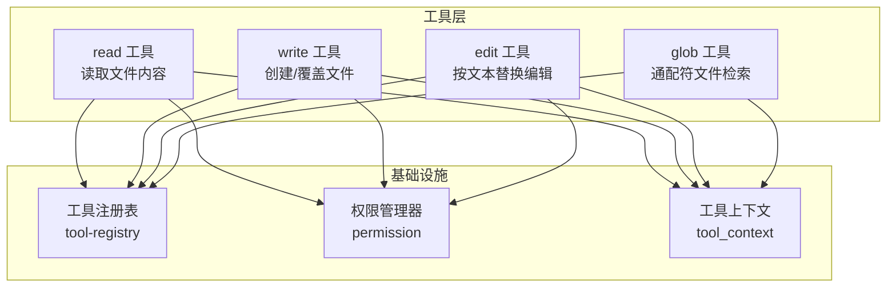
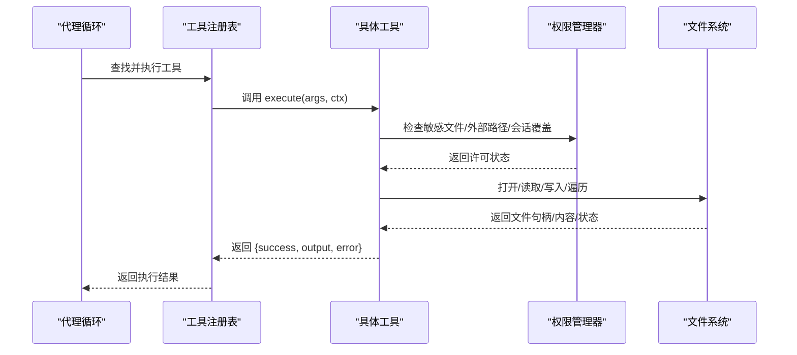
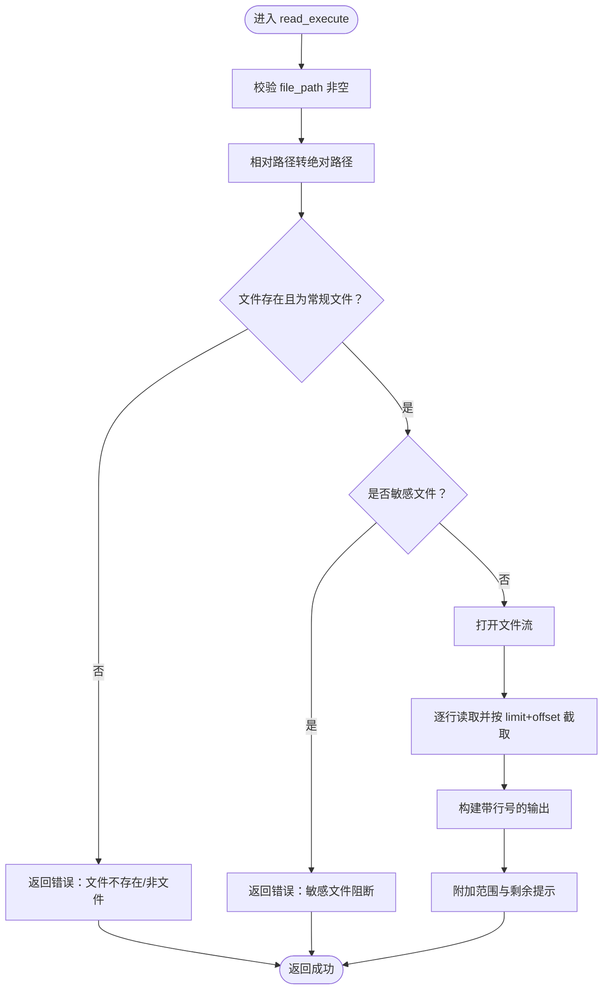
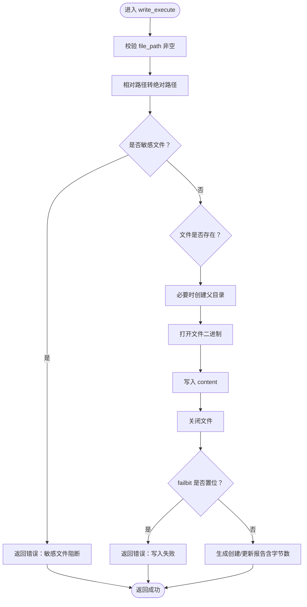
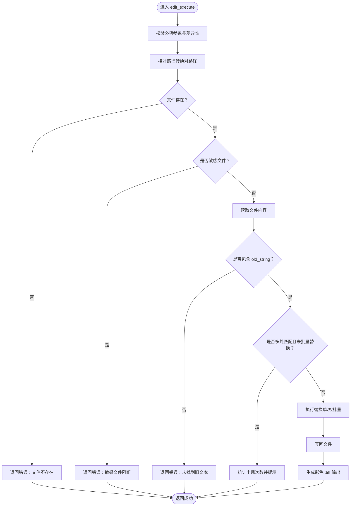
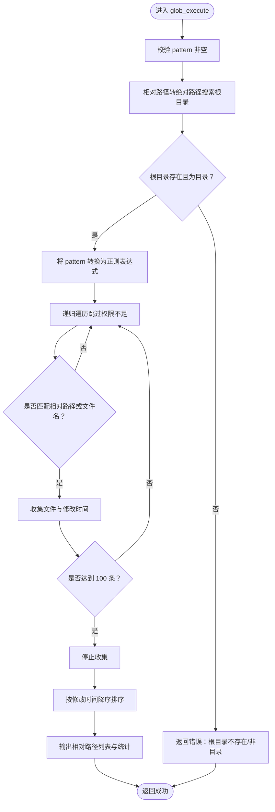
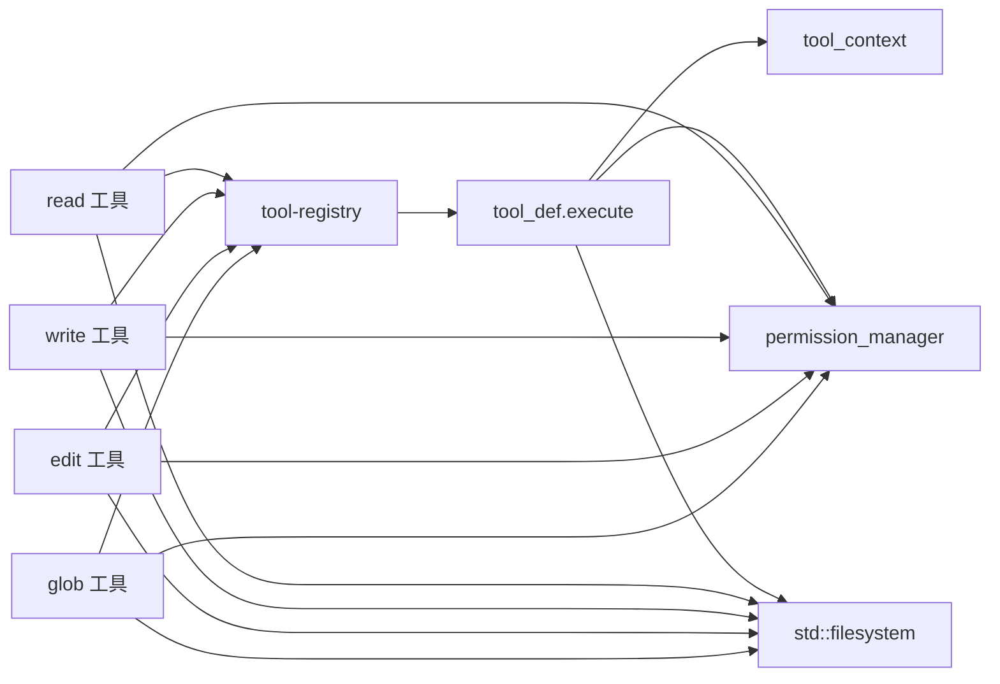

# 文件操作工具

<cite>
**本文引用的文件**
- [tool-read.cpp](file://agent/tools/tool-read.cpp)
- [tool-write.cpp](file://agent/tools/tool-write.cpp)
- [tool-edit.cpp](file://agent/tools/tool-edit.cpp)
- [tool-glob.cpp](file://agent/tools/tool-glob.cpp)
- [tool-registry.h](file://agent/tool-registry.h)
- [tool-registry.cpp](file://agent/tool-registry.cpp)
- [permission.h](file://agent/permission.h)
- [permission.cpp](file://agent/permission.cpp)
- [agent-loop.cpp](file://agent/agent-loop.cpp)
</cite>

## 目录
1. [简介](#简介)
2. [项目结构](#项目结构)
3. [核心组件](#核心组件)
4. [架构总览](#架构总览)
5. [详细组件分析](#详细组件分析)
6. [依赖关系分析](#依赖关系分析)
7. [性能考量](#性能考量)
8. [故障排除指南](#故障排除指南)
9. [结论](#结论)
10. [附录](#附录)

## 简介
本文件操作工具集提供对本地文件系统的安全访问与操作能力，包括读取文件内容、写入或覆盖文件、按文本替换编辑文件以及基于通配符的文件检索。这些工具通过统一的工具注册与执行框架接入代理系统，具备路径解析、权限控制、错误处理与输出截断等机制，确保在受限工作目录内进行安全、可控的操作。

## 项目结构
文件操作工具位于 agent/tools 目录下，每个工具以独立源文件实现，并通过工具注册表统一管理。权限控制由 permission 模块负责，工具执行时会根据策略决定是否允许或需要用户确认。

**图表来源**
- [tool-read.cpp:17-120](file://agent/tools/tool-read.cpp#L17-L120)
- [tool-write.cpp:10-80](file://agent/tools/tool-write.cpp#L10-L80)
- [tool-edit.cpp:69-196](file://agent/tools/tool-edit.cpp#L69-L196)
- [tool-glob.cpp:72-181](file://agent/tools/tool-glob.cpp#L72-L181)
- [tool-registry.h:58-103](file://agent/tool-registry.h#L58-L103)
- [permission.h:40-102](file://agent/permission.h#L40-L102)

**章节来源**
- [tool-read.cpp:1-120](file://agent/tools/tool-read.cpp#L1-L120)
- [tool-write.cpp:1-80](file://agent/tools/tool-write.cpp#L1-L80)
- [tool-edit.cpp:1-196](file://agent/tools/tool-edit.cpp#L1-L196)
- [tool-glob.cpp:1-181](file://agent/tools/tool-glob.cpp#L1-L181)
- [tool-registry.h:1-103](file://agent/tool-registry.h#L1-L103)
- [tool-registry.cpp:1-86](file://agent/tool-registry.cpp#L1-L86)
- [permission.h:1-102](file://agent/permission.h#L1-L102)
- [permission.cpp:1-309](file://agent/permission.cpp#L1-L309)

## 核心组件
- 工具注册表：集中管理工具定义、参数模式与执行函数，提供统一的执行入口与过滤执行（如只读模式下的 bash 命令白名单）。
- 权限管理器：判定文件操作是否敏感、是否越权（超出工作目录）、是否触发危险模式；支持会话级“总是/禁止”覆盖与防环检测。
- 工具上下文：传递工作目录、超时、中断信号与会话统计指针等运行时信息。

**章节来源**
- [tool-registry.h:17-56](file://agent/tool-registry.h#L17-L56)
- [tool-registry.cpp:49-85](file://agent/tool-registry.cpp#L49-L85)
- [permission.h:8-38](file://agent/permission.h#L8-L38)
- [permission.cpp:34-41](file://agent/permission.cpp#L34-L41)

## 架构总览
工具调用链路从代理循环发起，经工具注册表选择具体工具，再结合权限管理器进行安全校验，最后执行文件系统操作并返回结果。

**图表来源**
- [agent-loop.cpp:596-629](file://agent/agent-loop.cpp#L596-L629)
- [tool-registry.cpp:49-60](file://agent/tool-registry.cpp#L49-L60)
- [permission.cpp:50-62](file://agent/permission.cpp#L50-L62)
- [tool-read.cpp:47-51](file://agent/tools/tool-read.cpp#L47-L51)
- [tool-write.cpp:41-47](file://agent/tools/tool-write.cpp#L41-L47)
- [tool-edit.cpp:105-109](file://agent/tools/tool-edit.cpp#L105-L109)
- [tool-glob.cpp:103-132](file://agent/tools/tool-glob.cpp#L103-L132)

## 详细组件分析

### read 工具
功能概述
- 读取文件内容，按行编号输出，支持偏移与限制行数，避免大文件一次性输出导致性能问题。
- 自动将相对路径解析为绝对路径（基于工作目录），并进行存在性与类型检查。
- 对敏感文件进行阻断，防止泄露凭证与密钥。

关键参数
- file_path：目标文件路径（可相对工作目录）
- offset：起始行号（0 基）
- limit：最大读取行数（默认 2000）

行为特征
- 行号从 1 开始显示，超过最大行长会截断并追加省略号。
- 输出末尾包含范围提示与剩余行建议（通过 offset+limit 继续读取）。
- 错误信息明确指出缺失参数、文件不存在、非常规文件、打开失败等情况。

**图表来源**
- [tool-read.cpp:17-93](file://agent/tools/tool-read.cpp#L17-L93)

**章节来源**
- [tool-read.cpp:17-120](file://agent/tools/tool-read.cpp#L17-L120)

### write 工具
功能概述
- 创建新文件或覆盖已有文件，自动创建父目录（若需要）。
- 对敏感文件进行阻断，避免写入凭证与密钥文件。
- 成功后返回创建/更新消息与字节数统计。

关键参数
- file_path：目标文件路径（可相对工作目录）
- content：要写入的完整内容

行为特征
- 使用二进制模式写入，便于处理任意字节内容。
- 写入后检查 failbit 并返回相应错误。
- 若父目录不存在则尝试创建，异常时返回错误信息。

**图表来源**
- [tool-write.cpp:10-57](file://agent/tools/tool-write.cpp#L10-L57)

**章节来源**
- [tool-write.cpp:10-80](file://agent/tools/tool-write.cpp#L10-L80)

### edit 工具
功能概述
- 在文件中查找并替换指定文本，支持单次或全部替换。
- 自动计算差异并以彩色方式展示变更前后对比。
- 对敏感文件进行阻断，防止修改凭证与密钥。

关键参数
- file_path：目标文件路径（可相对工作目录）
- old_string：要被替换的精确文本（包含空白与缩进）
- new_string：替换后的文本
- replace_all：是否替换所有匹配项（默认 false）

行为特征
- 若未找到旧文本，返回错误并提示需包含足够的上下文。
- 若存在多个匹配且未开启 replace_all，统计次数并要求更精确的上下文或启用批量替换。
- 替换完成后生成简洁 diff 输出，便于审阅变更。

**图表来源**
- [tool-edit.cpp:69-164](file://agent/tools/tool-edit.cpp#L69-L164)

**章节来源**
- [tool-edit.cpp:69-196](file://agent/tools/tool-edit.cpp#L69-L196)

### glob 工具
功能概述
- 基于通配符模式检索文件，支持 *、**、?、[] 等语法，转换为正则表达式进行匹配。
- 默认在工作目录下递归搜索，结果按最后修改时间降序排列，最多返回 100 条。
- 支持指定搜索根目录，若模式包含路径分隔符则按相对路径匹配，否则仅按文件名匹配。

关键参数
- pattern：通配符模式（如 *.cpp、src/**/*.ts、test_*.py）
- path：搜索根目录（默认工作目录）

行为特征
- 将 * 视为除 / 外的任意字符，** 匹配任意路径，? 匹配单个字符，[] 匹配字符类。
- 匹配失败时返回无效模式错误；遍历时跳过无权限访问的目录。
- 结果数量达到上限时提示使用更具体的模式。

**图表来源**
- [tool-glob.cpp:72-156](file://agent/tools/tool-glob.cpp#L72-L156)

**章节来源**
- [tool-glob.cpp:72-181](file://agent/tools/tool-glob.cpp#L72-L181)

## 依赖关系分析
- 工具注册表与工具上下文：工具通过统一接口注册，执行时接收上下文（工作目录、超时、中断信号等）。
- 权限模块：read/write/edit/glob 在执行前均调用权限管理器进行敏感文件与外部路径检查。
- 文件系统：各工具直接使用标准库文件系统接口进行路径解析、文件读写与目录遍历。

**图表来源**
- [tool-registry.h:44-56](file://agent/tool-registry.h#L44-L56)
- [tool-registry.cpp:49-60](file://agent/tool-registry.cpp#L49-L60)
- [permission.h:40-102](file://agent/permission.h#L40-L102)
- [tool-read.cpp:26-30](file://agent/tools/tool-read.cpp#L26-L30)
- [tool-write.cpp:18-22](file://agent/tools/tool-write.cpp#L18-L22)
- [tool-edit.cpp:87-91](file://agent/tools/tool-edit.cpp#L87-L91)
- [tool-glob.cpp:80-84](file://agent/tools/tool-glob.cpp#L80-L84)

**章节来源**
- [tool-registry.h:58-103](file://agent/tool-registry.h#L58-L103)
- [tool-registry.cpp:1-86](file://agent/tool-registry.cpp#L1-L86)
- [permission.h:40-102](file://agent/permission.h#L40-L102)

## 性能考量
- 读取大文件：read 工具默认限制行数与行长，避免一次性加载过多内容；建议配合 offset/limit 分段读取。
- 写入大内容：write 工具采用二进制模式写入，适合任意数据；注意磁盘 IO 与空间占用。
- 编辑替换：edit 工具在未启用批量替换时仅做一次替换，避免多次 IO；批量替换会遍历全文，注意大文件耗时。
- 文件检索：glob 工具限制最多 100 条结果并按修改时间排序，建议使用更具体的模式减少遍历成本。
- 超时与中断：工具执行受上下文超时控制，支持中断信号，避免长时间阻塞。

[本节为通用性能建议，不直接分析具体文件，故无章节来源]

## 故障排除指南
常见错误与排查步骤
- 参数缺失
  - read/write/edit/glob 均要求关键参数（如 file_path、pattern 等）。请检查调用参数是否正确传入。
  - 参考：[tool-read.cpp:22-24](file://agent/tools/tool-read.cpp#L22-L24)，[tool-write.cpp:14-16](file://agent/tools/tool-write.cpp#L14-L16)，[tool-edit.cpp:75-81](file://agent/tools/tool-edit.cpp#L75-L81)，[tool-glob.cpp:76-78](file://agent/tools/tool-glob.cpp#L76-L78)

- 文件不存在或类型不符
  - read 会在路径不存在或目标不是常规文件时返回错误。请确认路径与文件类型。
  - 参考：[tool-read.cpp:33-40](file://agent/tools/tool-read.cpp#L33-L40)

- 打不开文件或写入失败
  - read 打开失败、write 写入失败或 failbit 置位时会返回错误。检查权限、磁盘空间与路径。
  - 参考：[tool-read.cpp:48-51](file://agent/tools/tool-read.cpp#L48-L51)，[tool-write.cpp:43-51](file://agent/tools/tool-write.cpp#L43-L51)

- 敏感文件阻断
  - 权限管理器会识别常见敏感文件名与扩展名（如 .env、私钥、证书等），并阻止读取/写入/编辑。
  - 参考：[permission.cpp:230-304](file://agent/permission.cpp#L230-L304)

- 外部路径访问
  - 若路径超出工作目录范围，权限管理器可能阻断。请使用相对路径或在允许范围内操作。
  - 参考：[permission.cpp:306-309](file://agent/permission.cpp#L306-L309)

- glob 模式无效
  - 通配符模式转换为正则表达式时若非法，会返回错误。请检查 pattern 的合法性。
  - 参考：[tool-glob.cpp:97-101](file://agent/tools/tool-glob.cpp#L97-L101)

- glob 结果过多
  - 当匹配结果达到 100 条上限时，工具会提示使用更具体的模式。
  - 参考：[tool-glob.cpp:149-154](file://agent/tools/tool-glob.cpp#L149-L154)

- 工具执行日志
  - 代理循环在执行 read/write/edit 等工具时会打印简要日志，便于定位问题。
  - 参考：[agent-loop.cpp:596-602](file://agent/agent-loop.cpp#L596-L602)

**章节来源**
- [tool-read.cpp:22-51](file://agent/tools/tool-read.cpp#L22-L51)
- [tool-write.cpp:14-51](file://agent/tools/tool-write.cpp#L14-L51)
- [tool-edit.cpp:75-109](file://agent/tools/tool-edit.cpp#L75-L109)
- [tool-glob.cpp:76-101](file://agent/tools/tool-glob.cpp#L76-L101)
- [agent-loop.cpp:596-602](file://agent/agent-loop.cpp#L596-L602)

## 结论
文件操作工具通过严格的参数校验、路径解析与权限控制，提供了安全可靠的文件读取、写入、编辑与检索能力。结合工具注册表与上下文机制，能够在代理系统中稳定地执行各类文件任务。建议在使用时遵循最佳实践（如分段读取、使用更具体的 glob 模式、避免敏感文件操作），并关注错误信息与日志输出以便快速定位问题。

[本节为总结性内容，不直接分析具体文件，故无章节来源]

## 附录

### 最佳实践
- 路径处理
  - 优先使用相对路径（相对于工作目录），避免硬编码绝对路径。
  - glob 搜索时尽量提供更具体的模式，减少遍历范围。
- 权限与安全
  - 避免对敏感文件（如 .env、私钥、证书）进行读取/写入/编辑。
  - 不要在工作目录外进行文件操作，防止越权访问。
- 编码与内容
  - write 工具以二进制模式写入，适合任意字节内容；如需文本编码，请在调用前完成编码转换。
- 错误处理
  - 对返回的错误信息进行记录与告警，必要时重试或回退。
- 性能优化
  - 大文件读取使用 offset/limit 分段处理。
  - 大文件编辑前先预览与 diff 对比，减少不必要的写入。
  - glob 使用更精确的模式，避免全仓库扫描。

[本节为通用指导，不直接分析具体文件，故无章节来源]