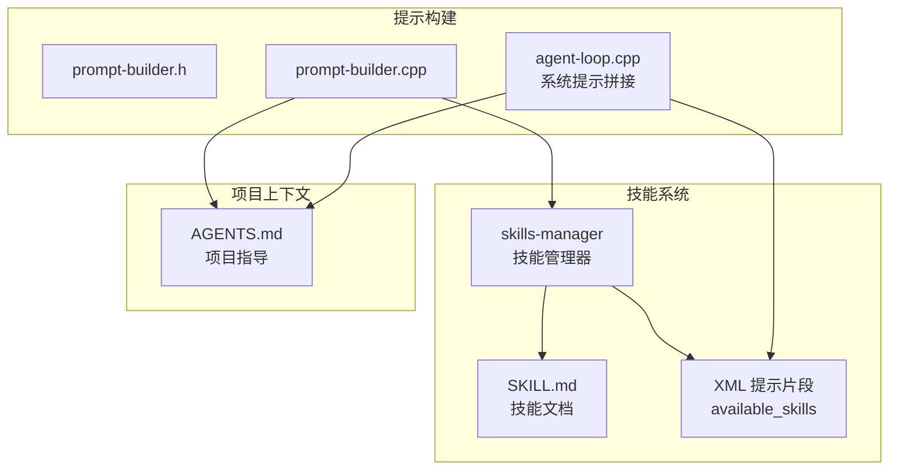
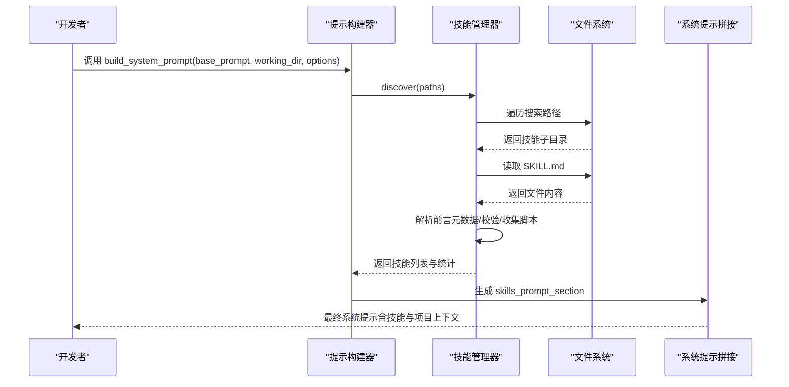
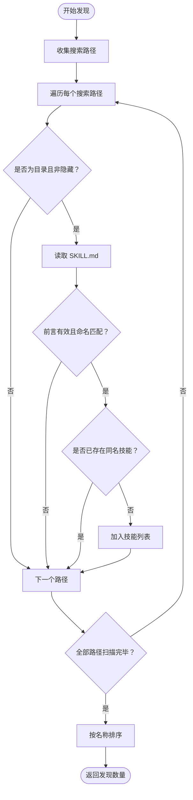
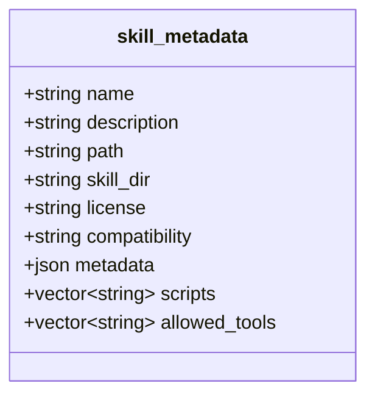
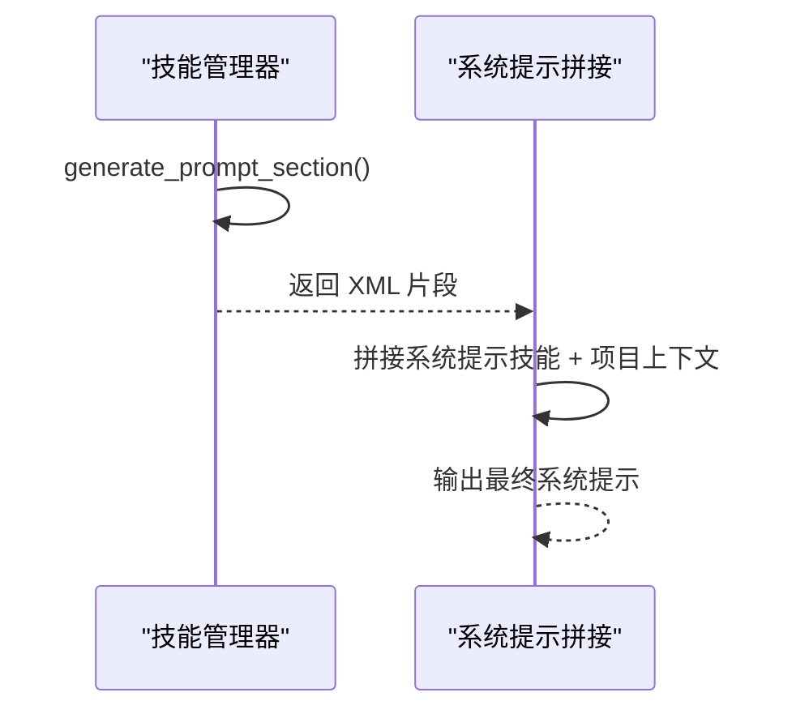
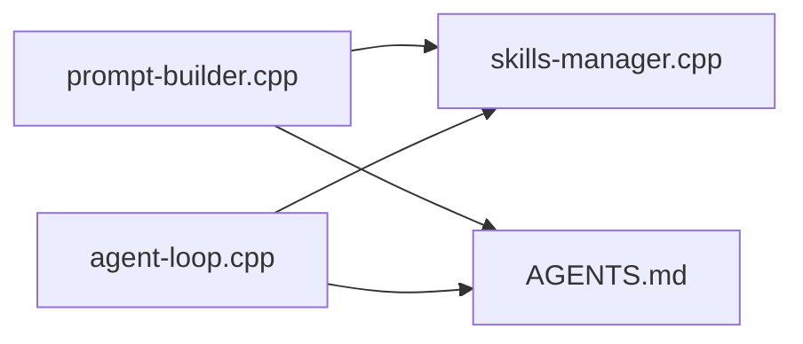

# 技能管理系统

<cite>
**本文档引用的文件**
- [skills-manager.h](file://agent/skills/skills-manager.h)
- [skills-manager.cpp](file://agent/skills/skills-manager.cpp)
- [prompt-builder.h](file://agent/sdk/prompt-builder.h)
- [prompt-builder.cpp](file://agent/sdk/prompt-builder.cpp)
- [agent-loop.cpp](file://agent/agent-loop.cpp)
- [SDK.md](file://agent/sdk/SDK.md)
- [AGENTS.md](file://third_party/llama.cpp/AGENTS.md)
</cite>

## 目录
1. [引言](#引言)
2. [项目结构](#项目结构)
3. [核心组件](#核心组件)
4. [架构总览](#架构总览)
5. [详细组件分析](#详细组件分析)
6. [依赖关系分析](#依赖关系分析)
7. [性能考虑](#性能考虑)
8. [故障排除指南](#故障排除指南)
9. [结论](#结论)
10. [附录](#附录)

## 引言
本文件为技能管理系统的技术架构文档，聚焦以下目标：
- 深入解释技能发现机制、SKILL.md 格式规范与技能加载流程
- 详细说明技能元数据管理、提示注入机制与技能验证过程
- 提供技能开发指南、格式规范与最佳实践
- 包含技能系统的扩展性设计、版本管理与性能优化策略

该系统遵循 agentskills.io 规范，通过扫描工作目录与配置目录中的技能子目录，解析 SKILL.md 前言元数据，生成可用于系统提示注入的 XML 片段，并在推理阶段将可用技能信息传递给大模型。

## 项目结构
技能管理相关的核心代码集中在 agent/skills 与 agent/sdk 子模块中，配合 AGENTS.md 的项目上下文注入，形成完整的提示构建链路。

**图表来源**
- [skills-manager.h:11-24](file://agent/skills/skills-manager.h#L11-L24)
- [skills-manager.cpp:240-288](file://agent/skills/skills-manager.cpp#L240-L288)
- [prompt-builder.h:9-23](file://agent/sdk/prompt-builder.h#L9-L23)
- [prompt-builder.cpp:32-76](file://agent/sdk/prompt-builder.cpp#L32-L76)
- [agent-loop.cpp:206-243](file://agent/agent-loop.cpp#L206-L243)
- [AGENTS.md:1-83](file://third_party/llama.cpp/AGENTS.md#L1-L83)

**章节来源**
- [skills-manager.h:11-24](file://agent/skills/skills-manager.h#L11-L24)
- [prompt-builder.h:9-23](file://agent/sdk/prompt-builder.h#L9-L23)
- [prompt-builder.cpp:32-76](file://agent/sdk/prompt-builder.cpp#L32-L76)
- [agent-loop.cpp:206-243](file://agent/agent-loop.cpp#L206-L243)
- [AGENTS.md:1-83](file://third_party/llama.cpp/AGENTS.md#L1-L83)

## 核心组件
- 技能管理器（skills_manager）
  - 负责扫描技能目录、解析 SKILL.md 前言元数据、生成 XML 提示片段、校验技能名称与长度限制
- 提示构建器（prompt_builder）
  - 负责根据工作目录与配置目录构建系统提示，自动注入技能与 AGENTS.md 内容
- 系统提示拼接（agent-loop）
  - 在推理前将技能与项目上下文注入到系统提示中，形成最终提示

**章节来源**
- [skills-manager.h:28-63](file://agent/skills/skills-manager.h#L28-L63)
- [skills-manager.cpp:45-78](file://agent/skills/skills-manager.cpp#L45-L78)
- [prompt-builder.h:9-23](file://agent/sdk/prompt-builder.h#L9-L23)
- [prompt-builder.cpp:32-76](file://agent/sdk/prompt-builder.cpp#L32-L76)
- [agent-loop.cpp:206-243](file://agent/agent-loop.cpp#L206-L243)

## 架构总览
技能系统采用“发现-解析-注入”的三层架构：
- 发现层：遍历搜索路径，识别技能子目录并定位 SKILL.md
- 解析层：提取前言元数据，校验必填字段与命名规范，收集脚本清单
- 注入层：生成 XML 片段并拼接到系统提示，供推理阶段使用

**图表来源**
- [prompt-builder.cpp:44-62](file://agent/sdk/prompt-builder.cpp#L44-L62)
- [skills-manager.cpp:240-288](file://agent/skills/skills-manager.cpp#L240-L288)
- [agent-loop.cpp:226-243](file://agent/agent-loop.cpp#L226-L243)

## 详细组件分析

### 技能发现机制
- 搜索路径
  - 默认工作目录下的隐藏配置路径
  - 用户配置目录下的技能路径
  - 用户额外提供的搜索路径
- 目录扫描
  - 仅处理目录项，跳过隐藏目录
  - 每个技能目录必须包含 SKILL.md
- 重复检测
  - 以技能名为键进行去重，优先保留首次发现的技能

**图表来源**
- [skills-manager.cpp:240-288](file://agent/skills/skills-manager.cpp#L240-L288)

**章节来源**
- [skills-manager.cpp:240-288](file://agent/skills/skills-manager.cpp#L240-L288)

### SKILL.md 格式规范
- 文件位置与命名
  - 每个技能目录必须包含 SKILL.md
  - 技能名称需与目录名一致
- 前言（YAML 风格）
  - 必填字段：name、description
  - 可选字段：license、compatibility、allowed-tools
  - metadata：缩进键值对，作为附加元数据存储
- 名称与长度限制
  - 1-64 字符，仅允许小写字母、数字与连字符
  - 不能以连字符开头或结尾，不允许连续连字符
  - 不得包含 XML 标签字符
- 描述与兼容性长度限制
  - 描述最大 1024 字符，兼容性最大 500 字符（超出将被截断）

**图表来源**
- [skills-manager.h:11-24](file://agent/skills/skills-manager.h#L11-L24)

**章节来源**
- [skills-manager.cpp:96-186](file://agent/skills/skills-manager.cpp#L96-L186)

### 技能元数据管理
- 元数据结构
  - 基础字段：name、description、path、skill_dir
  - 可选字段：license、compatibility、metadata（JSON 对象）
  - 执行支持：scripts（脚本相对路径列表）、allowed_tools（实验性工具白名单）
- 数据来源
  - 从 SKILL.md 前言解析
  - 从 scripts/ 子目录枚举脚本文件（忽略隐藏文件）

**章节来源**
- [skills-manager.h:11-24](file://agent/skills/skills-manager.h#L11-L24)
- [skills-manager.cpp:188-238](file://agent/skills/skills-manager.cpp#L188-L238)

### 提示注入机制
- XML 片段生成
  - 顶层标签：available_skills
  - 每个技能生成 skill 子节点，包含 name、description、location、skill_dir
  - 可选 scripts 与 allowed_tools 子节点
- XML 转义
  - 对特殊字符进行转义，确保注入安全
- 系统提示拼接
  - 在推理前将技能 XML 与 AGENTS.md 内容拼接到系统提示中

**图表来源**
- [skills-manager.cpp:290-329](file://agent/skills/skills-manager.cpp#L290-L329)
- [agent-loop.cpp:226-243](file://agent/agent-loop.cpp#L226-L243)

**章节来源**
- [skills-manager.cpp:290-329](file://agent/skills/skills-manager.cpp#L290-L329)
- [agent-loop.cpp:206-243](file://agent/agent-loop.cpp#L206-L243)

### 技能验证过程
- 名称验证
  - 长度、字符集、首尾与连字符规则、XML 标签禁止
- 前言解析
  - 定界符检查、键值对提取、metadata 缩进识别
- 元数据裁剪
  - 描述与兼容性长度截断
- 目录一致性
  - 技能名称与目录名必须一致

**章节来源**
- [skills-manager.cpp:45-78](file://agent/skills/skills-manager.cpp#L45-L78)
- [skills-manager.cpp:96-186](file://agent/skills/skills-manager.cpp#L96-L186)
- [skills-manager.cpp:210-214](file://agent/skills/skills-manager.cpp#L210-L214)

### 提示构建 API（SDK）
- 输入参数
  - base_prompt：基础系统提示
  - working_dir：工作目录
  - options：enable_skills、extra_skills_paths、enable_agents_md、config_dir_override
- 输出结果
  - system_prompt：最终系统提示
  - skills_prompt_section：技能 XML 片段
  - agents_md_prompt_section：AGENTS.md 片段
  - skills_search_paths：实际使用的搜索路径
  - skills_count、agents_md_count：注入数量统计

**章节来源**
- [prompt-builder.h:9-23](file://agent/sdk/prompt-builder.h#L9-L23)
- [prompt-builder.cpp:32-76](file://agent/sdk/prompt-builder.cpp#L32-L76)
- [SDK.md:224-240](file://agent/sdk/SDK.md#L224-L240)

## 依赖关系分析
- 组件耦合
  - skills_manager 依赖文件系统扫描与字符串解析
  - prompt_builder 依赖 skills_manager 与 AGENTS.md 管理器
  - agent-loop 依赖 skills_manager 生成的 XML 片段
- 外部依赖
  - nlohmann/json 用于 metadata 的 JSON 存储
  - 标准文件系统库用于目录遍历与文件读取

**图表来源**
- [prompt-builder.cpp:3-4](file://agent/sdk/prompt-builder.cpp#L3-L4)
- [agent-loop.cpp:206-243](file://agent/agent-loop.cpp#L206-L243)

**章节来源**
- [prompt-builder.cpp:3-4](file://agent/sdk/prompt-builder.cpp#L3-L4)
- [agent-loop.cpp:206-243](file://agent/agent-loop.cpp#L206-L243)

## 性能考虑
- I/O 优化
  - 使用二进制模式读取 SKILL.md，减少编码转换开销
  - 目录遍历异常捕获，避免因权限问题导致整体失败
- 内存与字符串处理
  - escape_xml 预分配容量，降低动态扩容成本
  - trim 与 parse_yaml_line 采用就地处理，减少中间对象
- 排序与去重
  - 按名称排序保证输出稳定，去重策略避免重复技能多次处理
- 可扩展性
  - 搜索路径可配置，便于多源技能聚合
  - metadata 字段支持扩展，满足未来需求演进

[本节为通用性能讨论，无需具体文件分析]

## 故障排除指南
- 技能未被发现
  - 检查 SKILL.md 是否存在于技能目录根部
  - 确认技能名称与目录名一致
  - 排查搜索路径是否正确配置
- 前言解析失败
  - 确认前言使用三横线定界符
  - 检查键值对格式与 metadata 缩进
- 名称校验失败
  - 检查是否包含非法字符或连续连字符
  - 确保名称长度在 1-64 范围内
- XML 注入异常
  - 检查转义逻辑是否生效
  - 确认系统提示拼接顺序与分隔符

**章节来源**
- [skills-manager.cpp:96-186](file://agent/skills/skills-manager.cpp#L96-L186)
- [skills-manager.cpp:240-288](file://agent/skills/skills-manager.cpp#L240-L288)
- [skills-manager.cpp:290-329](file://agent/skills/skills-manager.cpp#L290-L329)

## 结论
技能管理系统通过清晰的发现-解析-注入流程，实现了对 SKILL.md 的标准化支持与安全注入。结合 AGENTS.md 的项目上下文，系统能够在推理前提供丰富的任务能力与环境约束信息。通过可配置的搜索路径与严格的元数据校验，系统具备良好的扩展性与稳定性。

[本节为总结性内容，无需具体文件分析]

## 附录

### 技能开发指南与最佳实践
- 目录结构
  - 每个技能独立目录，包含 SKILL.md 与可选的 scripts/ 子目录
- SKILL.md 前言
  - 必填：name（与目录名一致）、description（建议 100-200 字）
  - 可选：license、compatibility（简述环境要求）
  - metadata：使用缩进键值对组织扩展信息
- 命名规范
  - 仅使用小写字母、数字与连字符，避免连字符开头/结尾与连续连字符
- 脚本支持
  - 将可执行脚本放入 scripts/，系统会自动枚举并注入
  - 脚本输出将作为工具结果返回，避免将源码带入上下文
- 安全与合规
  - 遵循 allowed-tools 白名单（实验性）
  - 避免在 description 中包含敏感信息

**章节来源**
- [skills-manager.cpp:148-163](file://agent/skills/skills-manager.cpp#L148-L163)
- [skills-manager.cpp:219-237](file://agent/skills/skills-manager.cpp#L219-L237)
- [agent-loop.cpp:236-243](file://agent/agent-loop.cpp#L236-L243)

### 版本管理与兼容性
- 版本标识
  - 使用 compatibility 字段描述环境要求
- 兼容性检查
  - 系统对 compatibility 长度进行限制，确保提示简洁
- 迁移策略
  - 新增字段建议使用 metadata，保持向后兼容

**章节来源**
- [skills-manager.cpp:154-156](file://agent/skills/skills-manager.cpp#L154-L156)
- [skills-manager.cpp:181-184](file://agent/skills/skills-manager.cpp#L181-L184)

### 提示构建 API 使用要点
- 默认搜索路径
  - 工作目录下的隐藏配置路径与用户配置目录下的 skills 路径
- 可选注入
  - 通过选项控制是否启用技能与 AGENTS.md 注入
- 输出解读
  - skills_search_paths 用于调试与排障
  - skills_count 与 agents_md_count 用于监控

**章节来源**
- [prompt-builder.cpp:44-62](file://agent/sdk/prompt-builder.cpp#L44-L62)
- [prompt-builder.h:9-23](file://agent/sdk/prompt-builder.h#L9-L23)
- [SDK.md:224-240](file://agent/sdk/SDK.md#L224-L240)