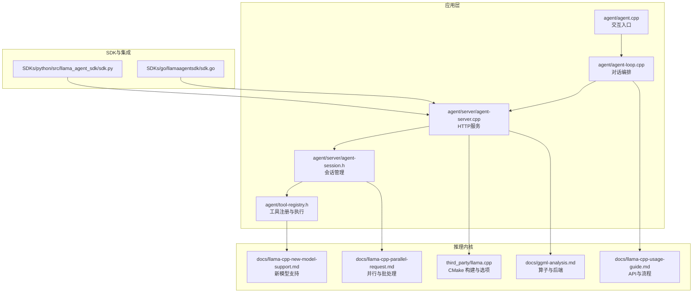
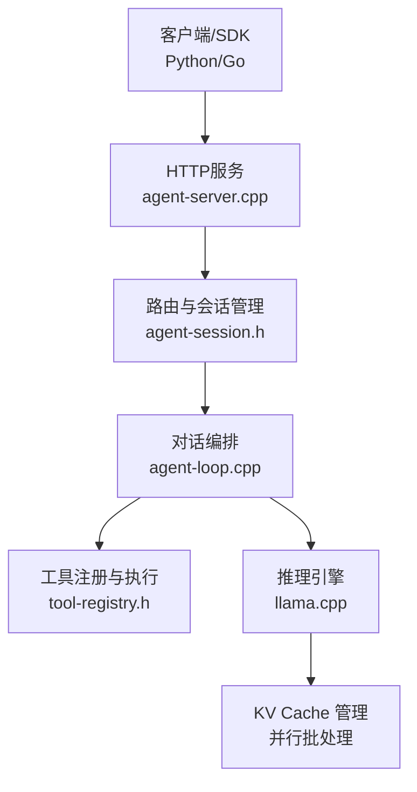
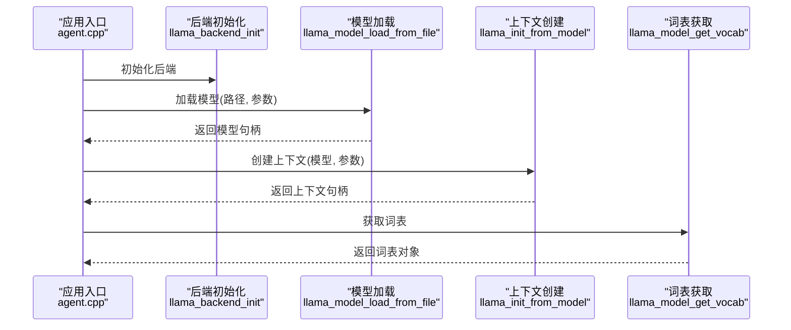
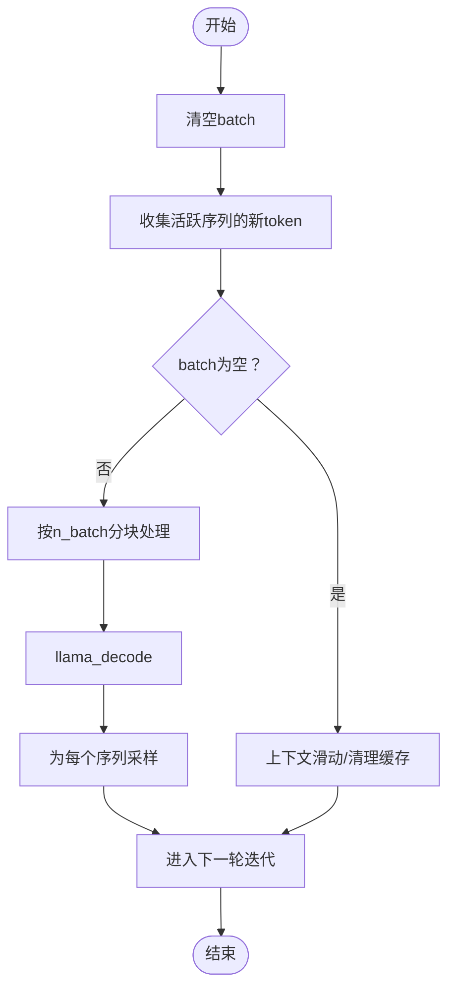
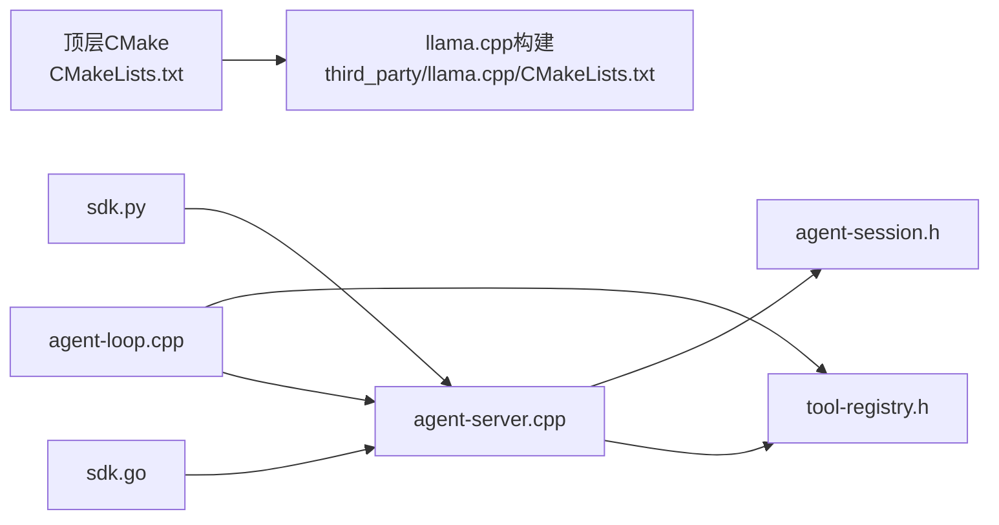

# 本地大语言模型推理引擎

<cite>
**本文引用的文件**
- [CMakeLists.txt](file://CMakeLists.txt)
- [llama-cpp-usage-guide.md](file://docs/llama-cpp-usage-guide.md)
- [ggml-analysis.md](file://docs/ggml-analysis.md)
- [llama-cpp-parallel-request.md](file://docs/llama-cpp-parallel-request.md)
- [llama-cpp-new-model-support.md](file://docs/llama-cpp-new-model-support.md)
- [agent.cpp](file://agent/agent.cpp)
- [agent-loop.cpp](file://agent/agent-loop.cpp)
- [agent-server.cpp](file://agent/server/agent-server.cpp)
- [agent-session.h](file://agent/server/agent-session.h)
- [tool-registry.h](file://agent/tool-registry.h)
- [sdk.py](file://SDKs/python/src/llama_agent_sdk/sdk.py)
- [sdk.go](file://SDKs/go/llamaagentsdk/sdk.go)
- [CMakeLists.txt](file://third_party/llama.cpp/CMakeLists.txt)
</cite>

## 目录
1. [简介](#简介)
2. [项目结构](#项目结构)
3. [核心组件](#核心组件)
4. [架构总览](#架构总览)
5. [详细组件分析](#详细组件分析)
6. [依赖关系分析](#依赖关系分析)
7. [性能考量](#性能考量)
8. [故障排查指南](#故障排查指南)
9. [结论](#结论)
10. [附录](#附录)

## 简介
本文件面向开发者与运维人员，系统化阐述基于 llama.cpp 的本地大语言模型推理引擎。内容涵盖模型加载与初始化、内存与 KV Cache 管理、推理参数与采样策略、并行处理与缓存优化、模型扩展与新架构支持、质量控制与错误处理、以及最佳实践与性能监控方法。文档同时提供面向不同技术背景读者的渐进式理解路径，并辅以代码级图示帮助快速定位实现细节。

## 项目结构
该项目采用模块化组织，核心由三层构成：
- 推理内核：基于 third_party/llama.cpp 的 C/C++ 推理框架，提供模型加载、上下文管理、批处理与并行推理、KV Cache 管理等能力。
- 业务编排：agent 子系统负责对话编排、工具调用、权限控制、会话管理与多模态支持。
- 服务与SDK：提供 HTTP 服务端、会话路由与 OpenAI 兼容接口，以及多语言 SDK（Python/Go）便于集成。



**图表来源**
- [agent.cpp:101-588](file://agent/agent.cpp#L101-L588)
- [agent-loop.cpp:1-800](file://agent/agent-loop.cpp#L1-L800)
- [agent-server.cpp:105-731](file://agent/server/agent-server.cpp#L105-L731)
- [agent-session.h:65-186](file://agent/server/agent-session.h#L65-L186)
- [tool-registry.h:58-103](file://agent/tool-registry.h#L58-L103)
- [CMakeLists.txt:1-44](file://CMakeLists.txt#L1-L44)
- [llama-cpp-usage-guide.md:1-1031](file://docs/llama-cpp-usage-guide.md#L1-L1031)
- [ggml-analysis.md:1-804](file://docs/ggml-analysis.md#L1-L804)
- [llama-cpp-parallel-request.md:1-594](file://docs/llama-cpp-parallel-request.md#L1-L594)
- [llama-cpp-new-model-support.md:1-883](file://docs/llama-cpp-new-model-support.md#L1-L883)
- [sdk.py:1-224](file://SDKs/python/src/llama_agent_sdk/sdk.py#L1-L224)
- [sdk.go:1-267](file://SDKs/go/llamaagentsdk/sdk.go#L1-L267)

**章节来源**
- [CMakeLists.txt:1-44](file://CMakeLists.txt#L1-L44)
- [agent.cpp:101-588](file://agent/agent.cpp#L101-L588)
- [agent-loop.cpp:1-800](file://agent/agent-loop.cpp#L1-L800)
- [agent-server.cpp:105-731](file://agent/server/agent-server.cpp#L105-L731)
- [agent-session.h:65-186](file://agent/server/agent-session.h#L65-L186)
- [tool-registry.h:58-103](file://agent/tool-registry.h#L58-L103)
- [sdk.py:1-224](file://SDKs/python/src/llama_agent_sdk/sdk.py#L1-L224)
- [sdk.go:1-267](file://SDKs/go/llamaagentsdk/sdk.go#L1-L267)

## 核心组件
- 模型加载与上下文初始化：通过 common_params 与 llama_backend_init 完成后端初始化与模型加载；上下文参数控制上下文长度、批大小、线程数、KV Cache 类型等。
- 推理循环与采样：基于 llama_decode 与采样器链路实现生成循环，支持贪心、温度采样等策略。
- 批处理与并行：llama_batch 将多序列 token 合并，结合连续批处理与分块处理提升吞吐。
- KV Cache 管理：统一/分离 buffer、序列复制与共享前缀、上下文滑动等策略降低显存占用。
- 会话与工具：agent_session 管理会话生命周期，tool_registry 统一注册与执行工具，支持权限控制与超时。
- 服务与SDK：提供 OpenAI 兼容接口与 SSE 流式输出，Python/Go SDK 支持会话与流式增量消费。

**章节来源**
- [llama-cpp-usage-guide.md:14-184](file://docs/llama-cpp-usage-guide.md#L14-L184)
- [llama-cpp-parallel-request.md:55-171](file://docs/llama-cpp-parallel-request.md#L55-L171)
- [ggml-analysis.md:537-597](file://docs/ggml-analysis.md#L537-L597)
- [agent-session.h:65-186](file://agent/server/agent-session.h#L65-L186)
- [tool-registry.h:58-103](file://agent/tool-registry.h#L58-L103)
- [agent-server.cpp:255-426](file://agent/server/agent-server.cpp#L255-L426)

## 架构总览
整体架构分为三层：服务层（HTTP 路由与会话）、编排层（对话与工具）、推理层（llama.cpp）。服务层负责接入与路由，编排层负责对话状态与工具调用，推理层负责实际的模型计算与 KV Cache 管理。



**图表来源**
- [agent-server.cpp:255-426](file://agent/server/agent-server.cpp#L255-L426)
- [agent-session.h:65-186](file://agent/server/agent-session.h#L65-L186)
- [agent-loop.cpp:333-480](file://agent/agent-loop.cpp#L333-L480)
- [tool-registry.h:58-103](file://agent/tool-registry.h#L58-L103)
- [llama-cpp-parallel-request.md:247-324](file://docs/llama-cpp-parallel-request.md#L247-L324)

## 详细组件分析

### 组件A：模型加载与上下文初始化
- 关键点
  - 后端初始化：llama_backend_init、llama_numa_init
  - 模型加载：llama_model_load_from_file，支持 n_gpu_layers、use_mmap/use_mlock、kv_overrides 等参数
  - 上下文创建：llama_init_from_model，控制 n_ctx、n_batch、n_threads、n_threads_batch、embeddings、offload_kqv 等
  - 词表与 token 化：llama_model_get_vocab、llama_vocab_tokenize
- 推荐实践
  - 根据硬件启用 CUDA（LLAMA_CPP_AGENT_CUDA）与 GGML_CUDA
  - 合理设置 n_ctx 与 n_batch，避免 OOM
  - 开启 use_mlock 以减少页面抖动



**图表来源**
- [agent.cpp:226-267](file://agent/agent.cpp#L226-L267)
- [llama-cpp-usage-guide.md:89-184](file://docs/llama-cpp-usage-guide.md#L89-L184)

**章节来源**
- [CMakeLists.txt:11-28](file://CMakeLists.txt#L11-L28)
- [llama-cpp-usage-guide.md:37-76](file://docs/llama-cpp-usage-guide.md#L37-L76)
- [agent.cpp:226-267](file://agent/agent.cpp#L226-L267)

### 组件B：推理循环与采样策略
- 关键点
  - 预填充（prefill）：llama_decode 处理 prompt token
  - 生成循环：获取 logits、采样器采样、判断结束符、准备下一个 batch
  - 采样器链：支持贪心、温度采样、Top-p、核采样等组合
- 推荐实践
  - 合理设置 n_predict、antiprompt、n_keep
  - 使用流式输出时注意增量消费与拼接
  - 控制温度与 top-k/top-p 以平衡创造性与稳定性

```mermaid
sequenceDiagram
participant Loop as "生成循环<br/>agent-loop.cpp"
participant Sampler as "采样器链<br/>llama_sampler_*"
participant Infer as "解码<br/>llama_decode"
participant Vocab as "词表<br/>llama_model_get_vocab"
Loop->>Infer : 预填充(prompt batch)
loop 生成迭代
Infer-->>Loop : 获取最后token logits
Loop->>Sampler : 采样(new_token)
Sampler-->>Loop : 返回采样token
Loop->>Vocab : 检查结束符
alt 到达结束符
Loop-->>Loop : 结束
else 继续
Loop->>Infer : 解码(new_token batch)
end
end
```

**图表来源**
- [llama-cpp-usage-guide.md:138-184](file://docs/llama-cpp-usage-guide.md#L138-L184)
- [agent-loop.cpp:333-480](file://agent/agent-loop.cpp#L333-L480)

**章节来源**
- [llama-cpp-usage-guide.md:138-184](file://docs/llama-cpp-usage-guide.md#L138-L184)
- [agent-loop.cpp:333-480](file://agent/agent-loop.cpp#L333-L480)

### 组件C：并行处理与批处理机制
- 关键点
  - llama_batch：聚合多序列 token，支持 seq_id、pos、logits 标记
  - 连续批处理：迭代收集活跃序列的新 token，动态合并与分块处理
  - KV Cache 管理：序列复制共享前缀、上下文滑动、保留/清理策略
- 推荐实践
  - 合理设置 n_batch 与 n_seq_max，避免单次 batch 过大
  - 使用 logits 过滤只计算需要输出的 token
  - 共享系统 prompt 的序列复制可显著提升缓存命中



**图表来源**
- [llama-cpp-parallel-request.md:140-171](file://docs/llama-cpp-parallel-request.md#L140-L171)
- [llama-cpp-parallel-request.md:247-324](file://docs/llama-cpp-parallel-request.md#L247-L324)

**章节来源**
- [llama-cpp-parallel-request.md:55-171](file://docs/llama-cpp-parallel-request.md#L55-L171)
- [llama-cpp-parallel-request.md:247-324](file://docs/llama-cpp-parallel-request.md#L247-L324)

### 组件D：KV Cache 与内存管理
- 关键点
  - 统一/分离 buffer：kv_unified 控制是否共享 buffer
  - 类型选择：type_k/type_v（F16/BF16/Q4_K 等）影响显存与精度
  - 序列操作：复制、保留、删除、位置调整
- 推荐实践
  - 大上下文场景优先考虑量化类型与分离 buffer
  - 对共享前缀的场景启用 kv_unified 并使用序列复制

**章节来源**
- [llama-cpp-parallel-request.md:426-451](file://docs/llama-cpp-parallel-request.md#L426-L451)
- [ggml-analysis.md:600-673](file://docs/ggml-analysis.md#L600-L673)

### 组件E：会话管理与工具执行
- 关键点
  - agent_session：生命周期管理、消息历史、统计信息、权限请求
  - tool_registry：工具注册、过滤、执行与超时控制
  - 权限控制：危险命令检测、外部目录访问限制、重复调用防护
- 推荐实践
  - 为工具设置合理超时与白名单
  - 使用 base_system_prompt 前缀共享 KV 缓存

**章节来源**
- [agent-session.h:65-186](file://agent/server/agent-session.h#L65-L186)
- [tool-registry.h:58-103](file://agent/tool-registry.h#L58-L103)
- [agent-loop.cpp:482-666](file://agent/agent-loop.cpp#L482-L666)

### 组件F：服务端与SDK集成
- 关键点
  - HTTP 路由：/health、/v1/chat/completions、/v1/agent/session 等
  - SSE 流式输出：/v1/chat/completions 支持流式增量
  - Python/Go SDK：封装 SSE 解析、工具调用与权限处理
- 推荐实践
  - 使用 SSE 时注意增量拼接与工具调用解析
  - 通过 API Key 与超时参数保障安全性与稳定性

**章节来源**
- [agent-server.cpp:255-426](file://agent/server/agent-server.cpp#L255-L426)
- [sdk.py:62-224](file://SDKs/python/src/llama_agent_sdk/sdk.py#L62-L224)
- [sdk.go:150-267](file://SDKs/go/llamaagentsdk/sdk.go#L150-L267)

## 依赖关系分析
- 构建与后端
  - 顶层 CMake 通过 add_subdirectory 引入 third_party/llama.cpp，并根据平台与环境变量启用 CUDA
  - llama.cpp CMake 提供丰富的构建选项（工具、示例、服务器、后端等）
- 组件耦合
  - agent-server.cpp 依赖 agent-session.h 与工具注册中心
  - agent-loop.cpp 依赖 server_context（由 server 管理）与工具注册中心
  - SDK 通过 HTTP 与服务端通信，不直接依赖推理内核



**图表来源**
- [CMakeLists.txt:30-43](file://CMakeLists.txt#L30-L43)
- [CMakeLists.txt:104-112](file://third_party/llama.cpp/CMakeLists.txt#L104-L112)
- [agent-server.cpp:1-731](file://agent/server/agent-server.cpp#L1-L731)
- [agent-session.h:65-186](file://agent/server/agent-session.h#L65-L186)
- [tool-registry.h:58-103](file://agent/tool-registry.h#L58-L103)
- [sdk.py:1-224](file://SDKs/python/src/llama_agent_sdk/sdk.py#L1-L224)
- [sdk.go:1-267](file://SDKs/go/llamaagentsdk/sdk.go#L1-L267)

**章节来源**
- [CMakeLists.txt:1-44](file://CMakeLists.txt#L1-L44)
- [CMakeLists.txt:104-112](file://third_party/llama.cpp/CMakeLists.txt#L104-L112)
- [agent-server.cpp:1-731](file://agent/server/agent-server.cpp#L1-L731)
- [agent-session.h:65-186](file://agent/server/agent-session.h#L65-L186)
- [tool-registry.h:58-103](file://agent/tool-registry.h#L58-L103)
- [sdk.py:1-224](file://SDKs/python/src/llama_agent_sdk/sdk.py#L1-L224)
- [sdk.go:1-267](file://SDKs/go/llamaagentsdk/sdk.go#L1-L267)

## 性能考量
- 线程与批大小
  - n_threads/n_threads_batch：CPU 并行度与批处理线程数需与硬件匹配
  - n_batch：单次解码 token 数，过大易 OOM，过小吞吐下降
  - n_seq_max：并发序列数，受 KV Cache 与显存限制
- KV Cache 优化
  - 量化类型（F16/BF16/Q4_K 等）与统一/分离 buffer
  - 共享系统 prompt 的序列复制与上下文滑动
- 后端与加速
  - CUDA 启用与 GPU 层数（n_gpu_layers）对吞吐影响显著
  - Flash Attention 与后端算子实现（CPU/CUDA/Metal/Vulkan/SYCL）

[本节为通用指导，无需特定文件引用]

## 故障排查指南
- 常见错误与定位
  - 模型加载失败：检查模型路径、GGUF 格式与后端可用性
  - OOM：降低 n_ctx、n_batch、启用量化或分离 KV Buffer
  - 采样异常：检查采样器链配置与温度/top-k/top-p 设置
  - 权限拒绝：确认工具白名单、外部目录访问与危险命令检测
- 调试技巧
  - 启用详细日志与性能计时（prompt_ms/predicted_ms）
  - 使用最小化 prompt 与固定 seed 复现问题
  - 逐步缩小问题范围：禁用工具、关闭并行、切换后端

**章节来源**
- [llama-cpp-new-model-support.md:672-722](file://docs/llama-cpp-new-model-support.md#L672-L722)
- [agent-loop.cpp:482-666](file://agent/agent-loop.cpp#L482-L666)

## 结论
本引擎以 llama.cpp 为核心，结合会话编排与工具体系，提供稳定高效的本地推理能力。通过合理的批处理与 KV Cache 策略、采样参数与后端加速，可在不同硬件环境下取得良好性能与质量平衡。建议在生产部署中关注资源监控、权限控制与可观测性，持续优化参数与缓存策略。

[本节为总结性内容，无需特定文件引用]

## 附录

### A. 模型选择与硬件要求
- 模型选择
  - 优先选择 GGUF 格式，支持量化与多后端
  - 新模型需完成架构定义与计算图实现
- 硬件要求
  - CPU：多核、高主频，合理设置 n_threads
  - GPU：NVIDIA 推荐启用 CUDA；显存与 n_ctx/n_batch 成正比
  - 内存：use_mlock 可减少页面抖动，提高稳定性

**章节来源**
- [llama-cpp-new-model-support.md:79-114](file://docs/llama-cpp-new-model-support.md#L79-L114)
- [CMakeLists.txt:11-28](file://CMakeLists.txt#L11-L28)

### B. 推理参数与采样策略对照
- 上下文与批处理
  - n_ctx：上下文长度
  - n_batch：单次解码 token 数
  - n_seq_max：并发序列数
- 采样策略
  - 贪心、温度采样、Top-k、Top-p、核采样
- KV Cache
  - type_k/type_v：K/V 缓存数据类型
  - kv_unified：统一 buffer 模式

**章节来源**
- [llama-cpp-usage-guide.md:37-76](file://docs/llama-cpp-usage-guide.md#L37-L76)
- [llama-cpp-parallel-request.md:426-451](file://docs/llama-cpp-parallel-request.md#L426-L451)

### C. 并行与缓存优化清单
- 批处理
  - 动态批大小、分块处理、logits 过滤
- KV Cache
  - 量化类型、统一/分离 buffer、序列复制与上下文滑动
- 后端
  - CUDA 启用、GPU 层数、Flash Attention

**章节来源**
- [llama-cpp-parallel-request.md:416-451](file://docs/llama-cpp-parallel-request.md#L416-L451)
- [ggml-analysis.md:537-597](file://docs/ggml-analysis.md#L537-L597)

### D. 开发者最佳实践
- 模型集成
  - 使用转换脚本与架构定义，确保张量映射与计算图正确
- 推理优化
  - 合理设置线程与批大小，启用量化与后端加速
  - 利用共享前缀与序列复制提升缓存命中
- 质量控制
  - 采样参数调优、权限控制与工具超时
  - 日志与性能指标采集，建立监控告警

**章节来源**
- [llama-cpp-new-model-support.md:279-373](file://docs/llama-cpp-new-model-support.md#L279-L373)
- [agent-loop.cpp:482-666](file://agent/agent-loop.cpp#L482-L666)