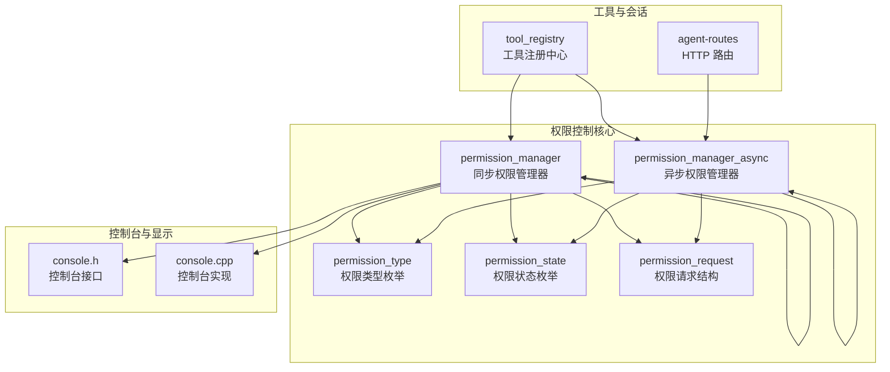
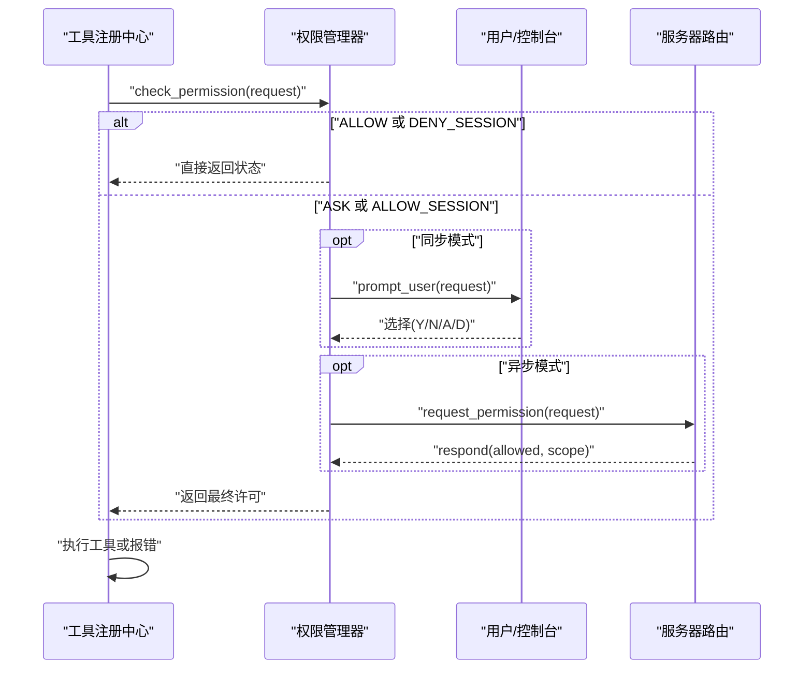
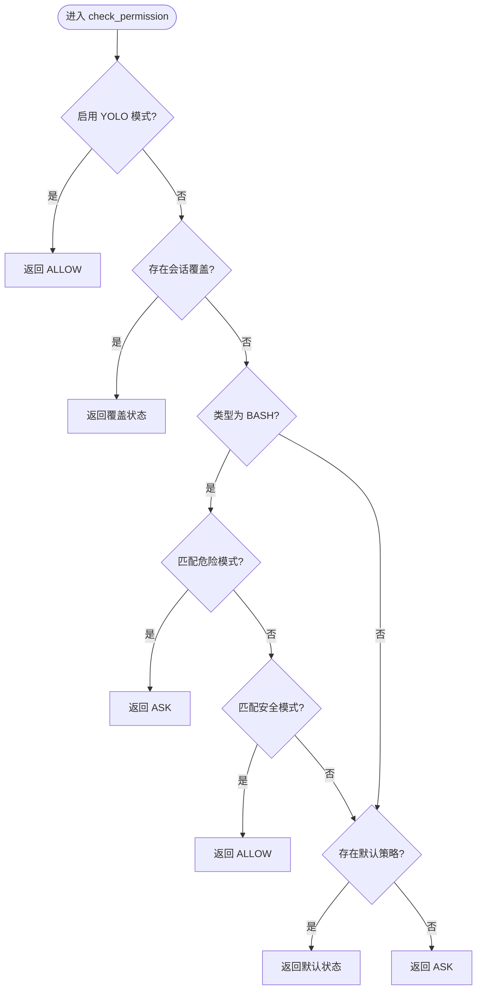
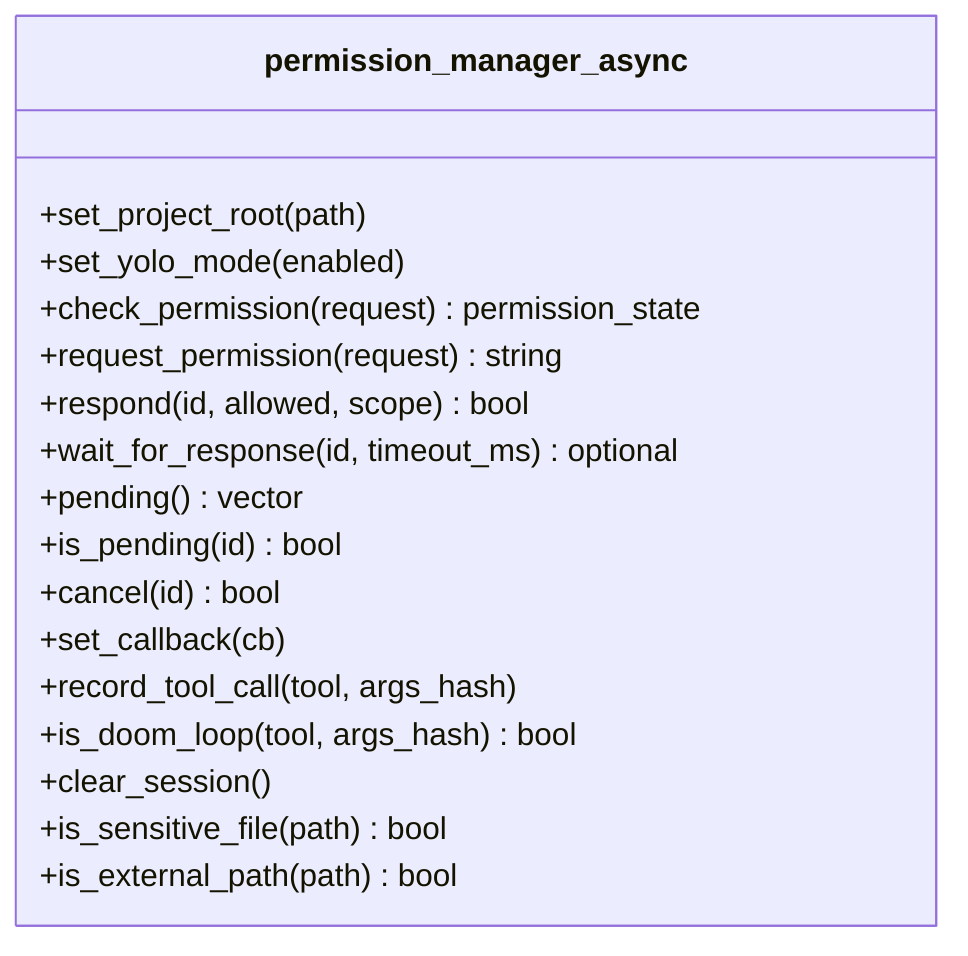
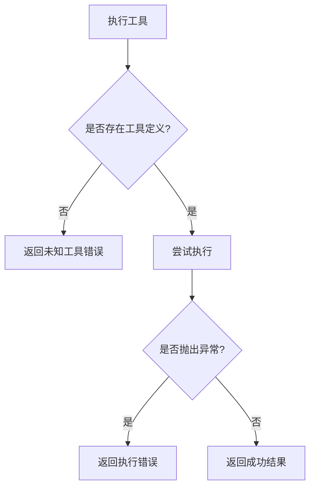
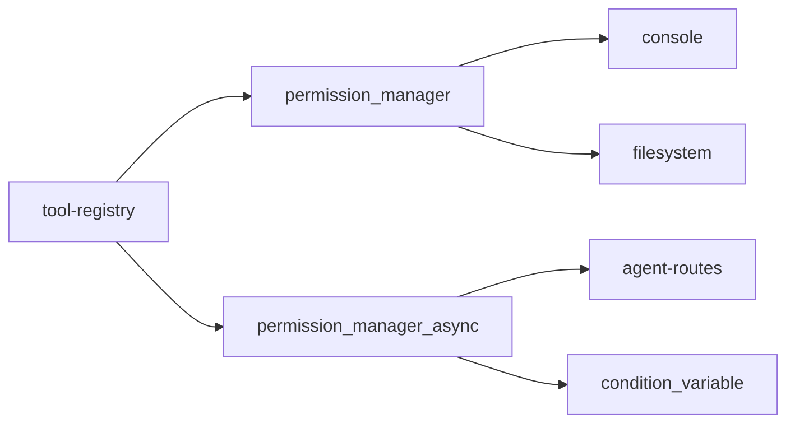

# 权限控制系统

<cite>
**本文档引用的文件**
- [permission.cpp](file://agent/permission.cpp)
- [permission.h](file://agent/permission.h)
- [permission-async.cpp](file://agent/permission-async.cpp)
- [permission-async.h](file://agent/permission-async.h)
- [tool-registry.cpp](file://agent/tool-registry.cpp)
- [tool-registry.h](file://agent/tool-registry.h)
- [agent-routes.cpp](file://agent/server/agent-routes.cpp)
- [console.h](file://third_party/llama.cpp/common/console.h)
- [console.cpp](file://third_party/llama.cpp/common/console.cpp)
</cite>

## 目录
1. [简介](#简介)
2. [项目结构](#项目结构)
3. [核心组件](#核心组件)
4. [架构总览](#架构总览)
5. [详细组件分析](#详细组件分析)
6. [依赖关系分析](#依赖关系分析)
7. [性能考虑](#性能考虑)
8. [故障排除指南](#故障排除指南)
9. [结论](#结论)
10. [附录](#附录)

## 简介
本文件为权限控制系统提供全面安全文档，涵盖权限检查机制、用户确认流程与安全策略实施。内容包括权限类型定义、权限状态管理、循环检测算法、权限配置选项、白名单机制与安全审计能力，并给出威胁模型分析、安全加固建议、扩展指南与最佳实践。目标是帮助开发者在不牺牲易用性的前提下，构建可审计、可扩展且安全可控的权限体系。

## 项目结构
权限控制相关代码主要位于 agent 子模块中，采用同步与异步双实现以适配不同运行场景（CLI 交互与 API 异步审批）。同时，工具注册中心与服务器路由共同构成权限请求的触发与处理闭环。

**图表来源**
- [permission.cpp:35-140](file://agent/permission.cpp#L35-L140)
- [permission-async.cpp:10-122](file://agent/permission-async.cpp#L10-L122)
- [tool-registry.cpp:49-86](file://agent/tool-registry.cpp#L49-L86)
- [agent-routes.cpp:389-424](file://agent/server/agent-routes.cpp#L389-L424)
- [console.h:20-46](file://third_party/llama.cpp/common/console.h#L20-L46)

**章节来源**
- [permission.cpp:1-310](file://agent/permission.cpp#L1-L310)
- [permission-async.cpp:1-283](file://agent/permission-async.cpp#L1-L283)
- [tool-registry.cpp:1-86](file://agent/tool-registry.cpp#L1-L86)
- [agent-routes.cpp:389-424](file://agent/server/agent-routes.cpp#L389-L424)
- [console.h:1-47](file://third_party/llama.cpp/common/console.h#L1-L47)

## 核心组件
- 权限类型与状态
  - 权限类型：BASH、FILE_READ、FILE_WRITE、FILE_EDIT、GLOB、EXTERNAL_DIR
  - 权限状态：ALLOW（自动允许）、ASK（需要询问）、DENY（直接拒绝）、ALLOW_SESSION（会话内总是允许）、DENY_SESSION（会话内总是拒绝）
- 请求与响应
  - permission_request：包含类型、工具名、描述、细节（命令、路径等）与危险标记
  - permission_response：一次性允许/拒绝、总是允许/拒绝
- 同步与异步管理器
  - 同步：阻塞式等待用户输入，适合 CLI 场景
  - 异步：非阻塞排队，通过回调或 HTTP 接口进行外部审批，适合服务端/远程场景

**章节来源**
- [permission.h:8-38](file://agent/permission.h#L8-L38)
- [permission.h:25-31](file://agent/permission.h#L25-L31)
- [permission.h:40-101](file://agent/permission.h#L40-L101)

## 架构总览
权限控制贯穿“请求-检查-决策-执行”链路。工具注册中心在执行前调用权限检查；根据结果决定是否放行或进入交互/异步审批流程；最终由工具执行器完成操作。

**图表来源**
- [tool-registry.cpp:49-86](file://agent/tool-registry.cpp#L49-L86)
- [permission.cpp:108-140](file://agent/permission.cpp#L108-L140)
- [permission.cpp:142-197](file://agent/permission.cpp#L142-L197)
- [permission-async.cpp:124-178](file://agent/permission-async.cpp#L124-L178)
- [agent-routes.cpp:389-424](file://agent/server/agent-routes.cpp#L389-L424)

## 详细组件分析

### 同步权限管理器（permission_manager）
- 默认策略
  - BASH/FILE_WRITE/FILE_EDIT/EXTERNAL_DIR 默认 ASK
  - FILE_READ/GLOB 默认 ALLOW
- 模式匹配
  - 危险模式：包含破坏性命令、提权、远程执行、系统破坏、包管理器、Git 破坏、进程控制等关键词
  - 安全模式：常见只读命令与查询类命令
- 会话覆盖
  - 针对 MCP 工具仅按工具名匹配，其他工具按“工具名:详情”组合键存储
- 外部目录与项目根
  - 通过绝对路径与项目根前缀判断是否越界
- 循环检测
  - 记录最近 10 次调用，若同一工具与参数哈希重复出现 3 次及以上，判定为循环
- 敏感文件识别
  - 基于文件名与扩展名识别 .env、密钥、证书、AWS 凭证等敏感文件
- 用户交互
  - 提示框显示危险警告，支持单字符输入选择

**图表来源**
- [permission.cpp:108-140](file://agent/permission.cpp#L108-L140)
- [permission.cpp:44-71](file://agent/permission.cpp#L44-L71)

**章节来源**
- [permission.cpp:35-71](file://agent/permission.cpp#L35-L71)
- [permission.cpp:108-140](file://agent/permission.cpp#L108-L140)
- [permission.cpp:142-197](file://agent/permission.cpp#L142-L197)
- [permission.cpp:217-223](file://agent/permission.cpp#L217-L223)
- [permission.cpp:230-304](file://agent/permission.cpp#L230-L304)
- [permission.cpp:306-310](file://agent/permission.cpp#L306-L310)

### 异步权限管理器（permission_manager_async）
- 设计要点
  - 使用互斥锁与条件变量保证线程安全
  - 为每个请求生成唯一 ID，支持超时等待与取消
  - 支持回调通知新请求，便于前端/外部系统实时处理
- 请求与响应
  - request_permission：入队待审批
  - respond：记录结果并按作用域更新会话覆盖
  - wait_for_response：带超时等待指定请求结果
  - pending/is_pending/cancel：查询与取消未决请求
- 会话覆盖与循环检测
  - 与同步版本一致的键空间与检测逻辑
- 项目根与敏感文件
  - 通过静态方法委托给同步版本

**图表来源**
- [permission-async.h:43-141](file://agent/permission-async.h#L43-L141)

**章节来源**
- [permission-async.cpp:10-45](file://agent/permission-async.cpp#L10-L45)
- [permission-async.cpp:90-122](file://agent/permission-async.cpp#L90-L122)
- [permission-async.cpp:124-178](file://agent/permission-async.cpp#L124-L178)
- [permission-async.cpp:180-209](file://agent/permission-async.cpp#L180-L209)
- [permission-async.cpp:211-235](file://agent/permission-async.cpp#L211-L235)
- [permission-async.cpp:237-264](file://agent/permission-async.cpp#L237-L264)
- [permission-async.cpp:275-282](file://agent/permission-async.cpp#L275-L282)

### 工具注册中心与白名单机制
- 执行流程
  - 通过工具名查找定义，执行时捕获异常并返回错误信息
- 白名单机制
  - 对 bash 工具支持基于模式集合的只读白名单过滤，未匹配到允许模式则拒绝执行
- 适用场景
  - 在受限环境中仅允许特定命令，避免任意命令执行风险

**图表来源**
- [tool-registry.cpp:49-86](file://agent/tool-registry.cpp#L49-L86)

**章节来源**
- [tool-registry.cpp:62-86](file://agent/tool-registry.cpp#L62-L86)

### 服务器路由与异步审批
- HTTP 接口
  - 通过请求 ID 定位并响应权限请求，支持作用域选择（一次性/会话）
  - 返回统一 JSON 结果，400/404 错误码用于提示参数缺失或请求不存在
- 会话关联
  - 在所有会话中查找对应请求 ID 并转发至会话层处理

**章节来源**
- [agent-routes.cpp:389-424](file://agent/server/agent-routes.cpp#L389-L424)

### 控制台显示与用户交互
- 控制台接口
  - 提供日志输出、颜色切换、刷新等能力，支持 ANSI 颜色与终端特性
- 用户交互
  - 同步模式下从标准输入读取单字符，回显用户选择并据此更新会话覆盖

**章节来源**
- [console.h:11-46](file://third_party/llama.cpp/common/console.h#L11-L46)
- [console.cpp:172-198](file://third_party/llama.cpp/common/console.cpp#L172-L198)
- [permission.cpp:19-32](file://agent/permission.cpp#L19-L32)
- [permission.cpp:142-197](file://agent/permission.cpp#L142-L197)

## 依赖关系分析
- 组件耦合
  - 工具注册中心依赖权限管理器进行前置检查
  - 异步管理器依赖服务器路由接收外部审批
  - 同步管理器依赖控制台进行用户交互
- 数据结构
  - 会话覆盖使用字符串键（工具名或工具名:详情），降低冲突概率
  - 最近调用记录采用固定长度向量，避免内存无限增长
- 外部依赖
  - 文件系统操作用于路径解析与项目根判断
  - 时间与条件变量用于异步等待与超时控制

**图表来源**
- [tool-registry.cpp:49-86](file://agent/tool-registry.cpp#L49-L86)
- [permission.cpp:108-140](file://agent/permission.cpp#L108-L140)
- [permission-async.cpp:124-178](file://agent/permission-async.cpp#L124-L178)
- [agent-routes.cpp:389-424](file://agent/server/agent-routes.cpp#L389-L424)
- [console.h:20-46](file://third_party/llama.cpp/common/console.h#L20-L46)

**章节来源**
- [permission.cpp:34-34](file://agent/permission.cpp#L34-L34)
- [permission-async.cpp:101-107](file://agent/permission-async.cpp#L101-L107)

## 性能考虑
- 检查复杂度
  - 模式匹配为线性扫描，默认 O(P)（P 为模式数量），整体检查为 O(P + K)（K 为最近调用数）
- 内存占用
  - 最近调用记录最多 10 条，空间复杂度 O(1)
- 线程安全
  - 异步版本使用互斥锁与条件变量，避免竞态；回调在锁外触发以减少持锁时间
- I/O 影响
  - 同步交互涉及终端读写，建议在专用线程中进行，避免阻塞推理线程

[本节为通用性能讨论，无需列出具体文件来源]

## 故障排除指南
- 常见问题
  - 无权限提示频繁：检查默认策略与会话覆盖是否被意外设置
  - 异步请求未响应：确认回调是否正确设置、请求 ID 是否有效、是否发生超时
  - 路由返回 404：确认请求 ID 是否存在于任一会话中
- 诊断步骤
  - 查看最近调用记录与循环检测结果
  - 核对项目根路径与外部目录判断
  - 检查敏感文件识别规则是否误判
- 临时修复
  - 清理会话状态（清除会话覆盖、最近调用与未决请求）

**章节来源**
- [permission.cpp:225-228](file://agent/permission.cpp#L225-L228)
- [permission-async.cpp:266-273](file://agent/permission-async.cpp#L266-L273)
- [agent-routes.cpp:416-421](file://agent/server/agent-routes.cpp#L416-L421)

## 结论
该权限控制系统通过“类型化权限 + 模式匹配 + 会话覆盖 + 循环检测”的组合，在保证灵活性的同时提升了安全性。同步与异步两种实现满足不同部署形态的需求；工具注册中心的白名单机制进一步限制了高危操作。建议在生产环境启用严格的项目根检查与敏感文件识别，并结合审计与监控完善安全闭环。

[本节为总结性内容，无需列出具体文件来源]

## 附录

### 权限类型与默认策略速查
- BASH：默认 ASK，危险模式触发强制确认
- FILE_READ：默认 ALLOW，常用于只读文件访问
- FILE_WRITE：默认 ASK，写入需明确授权
- FILE_EDIT：默认 ASK，编辑需谨慎授权
- GLOB：默认 ALLOW，通配符匹配通常安全
- EXTERNAL_DIR：默认 ASK，越界访问需额外确认

**章节来源**
- [permission.h:16-23](file://agent/permission.h#L16-L23)
- [permission.cpp:36-41](file://agent/permission.cpp#L36-L41)
- [permission-async.cpp:12-17](file://agent/permission-async.cpp#L12-L17)

### 循环检测算法
- 触发条件：同一工具与参数哈希连续出现 3 次及以上
- 实现方式：维护最近 10 次调用，末尾元素计数累加
- 作用：防止工具在失败后反复重试导致资源浪费或系统不稳定

**章节来源**
- [permission.cpp:217-223](file://agent/permission.cpp#L217-L223)
- [permission-async.cpp:256-264](file://agent/permission-async.cpp#L256-L264)

### 白名单机制与只读模式
- 适用工具：bash
- 过滤逻辑：命令需匹配允许模式集合，否则拒绝执行
- 用途：在受限环境中仅允许受控命令

**章节来源**
- [tool-registry.cpp:62-86](file://agent/tool-registry.cpp#L62-L86)

### 安全审计与建议
- 审计点
  - 记录每次权限请求与决策（类型、工具、详情、结果、时间戳）
  - 监控循环检测触发次数与频率
  - 审核会话覆盖变更（允许/拒绝）
- 建议
  - 为高危工具建立更严格的默认策略
  - 在容器或沙箱中运行工具执行
  - 对外部目录访问增加二次确认或白名单
  - 定期审查敏感文件识别规则

[本节为通用安全建议，无需列出具体文件来源]