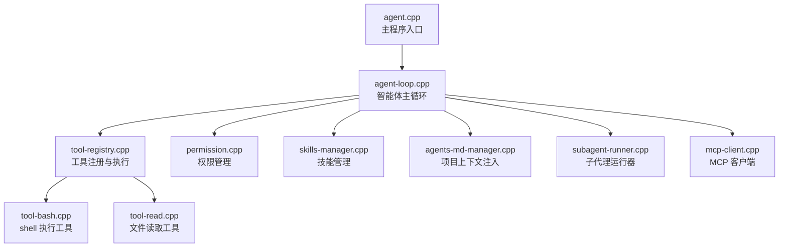
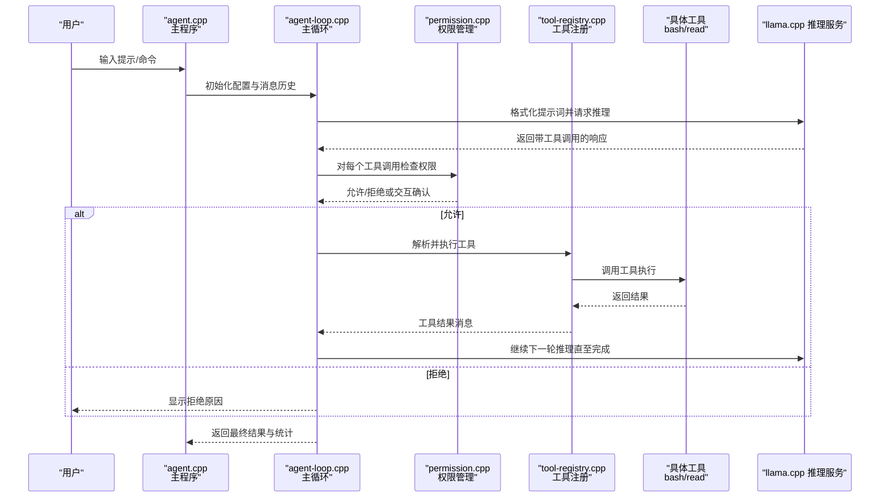
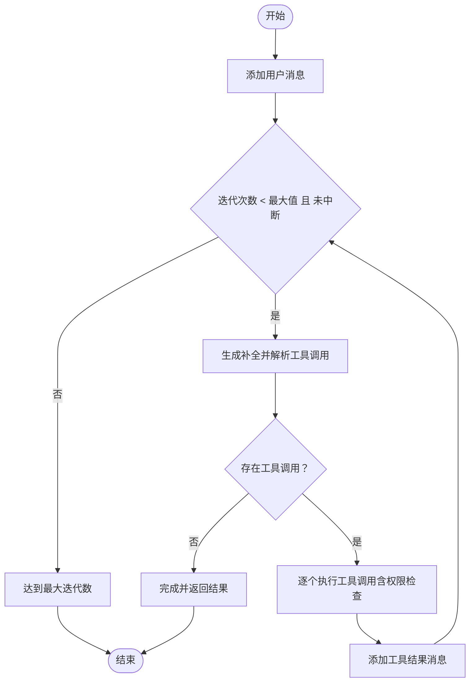
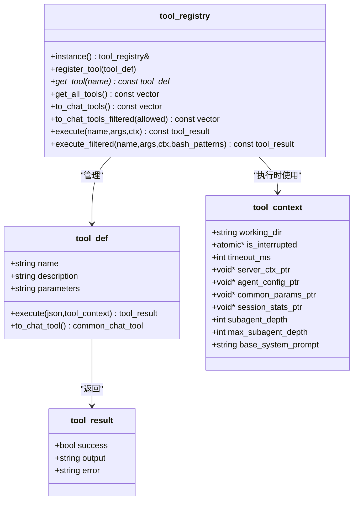
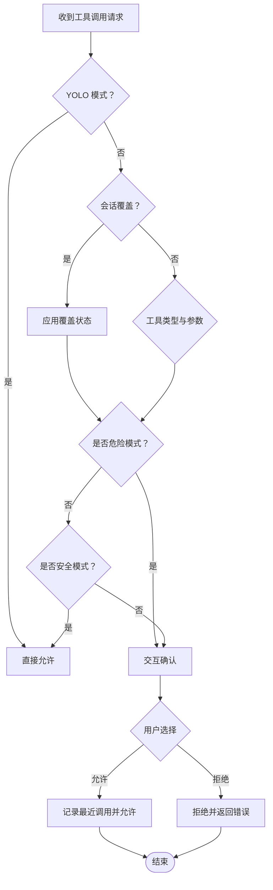
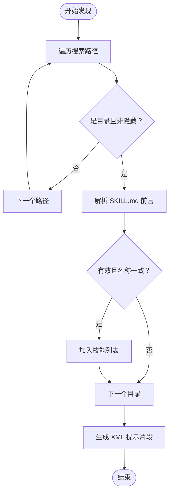
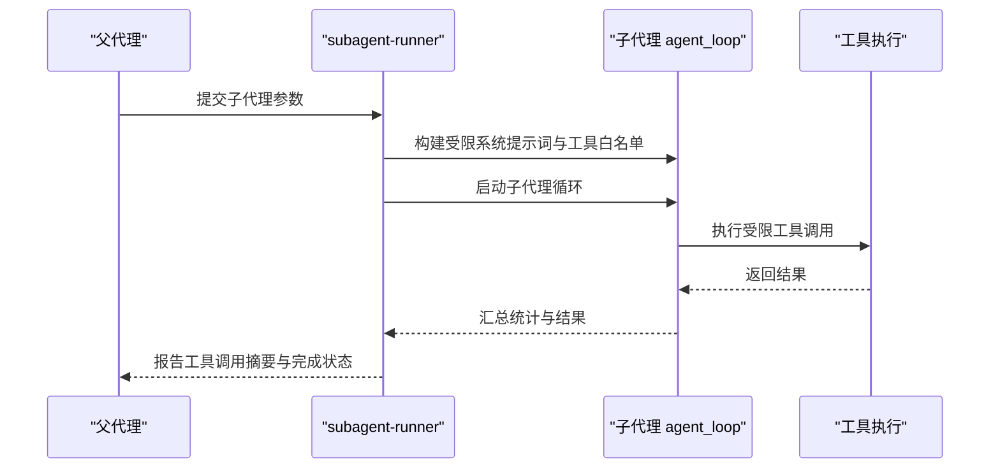
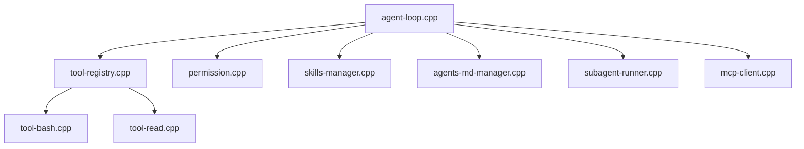

# 核心功能特性

<cite>
**本文引用的文件**
- [agent.cpp](file://agent/agent.cpp)
- [agent-loop.cpp](file://agent/agent-loop.cpp)
- [agent-loop.h](file://agent/agent-loop.h)
- [tool-registry.cpp](file://agent/tool-registry.cpp)
- [tool-registry.h](file://agent/tool-registry.h)
- [tool-bash.cpp](file://agent/tools/tool-bash.cpp)
- [tool-read.cpp](file://agent/tools/tool-read.cpp)
- [permission.cpp](file://agent/permission.cpp)
- [permission.h](file://agent/permission.h)
- [skills-manager.cpp](file://agent/skills/skills-manager.cpp)
- [skills-manager.h](file://agent/skills/skills-manager.h)
- [agents-md-manager.cpp](file://agent/agents-md/agents-md-manager.cpp)
- [subagent-runner.cpp](file://agent/subagent/subagent-runner.cpp)
- [subagent-types.h](file://agent/subagent/subagent-types.h)
- [mcp-client.cpp](file://agent/mcp/mcp-client.cpp)
</cite>

## 目录
1. [简介](#简介)
2. [项目结构](#项目结构)
3. [核心组件](#核心组件)
4. [架构总览](#架构总览)
5. [详细组件分析](#详细组件分析)
6. [依赖分析](#依赖分析)
7. [性能考虑](#性能考虑)
8. [故障排查指南](#故障排查指南)
9. [结论](#结论)
10. [附录](#附录)

## 简介
本文件面向 llama.cpp-agent 项目，系统性阐述其核心功能特性与实现机制，覆盖本地大语言模型推理、工具执行系统、权限控制系统、技能管理系统、子代理架构与 MCP 工具集成。文档以循序渐进的方式组织内容，既适合初学者快速上手，也为高级用户提供了深入的技术细节与优化建议。

## 项目结构
项目采用“按功能域分层”的组织方式：
- agent/：核心智能体逻辑（主循环、工具注册、权限、技能、子代理、MCP）
- SDKs/：多语言 SDK（Go/Java/Python/Rust/TypeScript），提供外部集成入口
- third_party/：第三方依赖（llama.cpp、MiniMemory 等）
- docs/：使用与技术文档（模型加载、并发请求、ASR/TTS 等）

下图给出与本文相关的核心模块关系概览：

图表来源
- [agent.cpp:101-588](file://agent/agent.cpp#L101-L588)
- [agent-loop.cpp:1-800](file://agent/agent-loop.cpp#L1-L800)
- [tool-registry.cpp:1-86](file://agent/tool-registry.cpp#L1-L86)
- [permission.cpp:1-310](file://agent/permission.cpp#L1-L310)
- [skills-manager.cpp:1-330](file://agent/skills/skills-manager.cpp#L1-L330)
- [agents-md-manager.cpp:1-179](file://agent/agents-md/agents-md-manager.cpp#L1-L179)
- [subagent-runner.cpp:1-388](file://agent/subagent/subagent-runner.cpp#L1-L388)
- [mcp-client.cpp:1-364](file://agent/mcp/mcp-client.cpp#L1-L364)
- [tool-bash.cpp:1-281](file://agent/tools/tool-bash.cpp#L1-L281)
- [tool-read.cpp:1-120](file://agent/tools/tool-read.cpp#L1-L120)

章节来源
- [agent.cpp:101-588](file://agent/agent.cpp#L101-L588)

## 核心组件
- 智能体主循环（agent-loop）：负责对话历史构建、提示词格式化、推理生成、工具调用解析与执行、权限校验、统计收集与迭代控制。
- 工具注册与执行（tool-registry）：统一注册工具、转换为模型可理解的工具描述、执行工具并返回结果。
- 权限管理（permission）：基于工具类型与参数进行默认策略、交互式确认、危险模式检测与会话级覆盖。
- 技能管理（skills-manager）：发现并解析 SKILL.md，生成 XML 片段注入系统提示词，支持脚本与工具白名单。
- 项目上下文（agents-md-manager）：扫描 AGENTS.md 文件，按深度优先生成 XML 上下文注入提示词。
- 子代理（subagent-runner）：在受限工具集与 Bash 前缀策略下运行子任务，支持同步/后台模式与输出缓冲。
- MCP 集成（mcp-client）：通过 JSON-RPC 与外部 MCP 服务器建立连接，动态发现与调用工具。
- 工具实现：bash 工具（命令执行）、read 工具（安全读取文件）等。

章节来源
- [agent-loop.h:39-276](file://agent/agent-loop.h#L39-L276)
- [tool-registry.h:17-103](file://agent/tool-registry.h#L17-L103)
- [permission.h:8-102](file://agent/permission.h#L8-L102)
- [skills-manager.h:11-63](file://agent/skills/skills-manager.h#L11-L63)
- [subagent-types.h:7-36](file://agent/subagent/subagent-types.h#L7-L36)

## 架构总览
下图展示从用户输入到工具执行与结果回传的完整流程，以及各模块间的协作关系：

图表来源
- [agent.cpp:328-567](file://agent/agent.cpp#L328-L567)
- [agent-loop.cpp:695-788](file://agent/agent-loop.cpp#L695-L788)
- [permission.cpp:108-197](file://agent/permission.cpp#L108-L197)
- [tool-registry.cpp:49-86](file://agent/tool-registry.cpp#L49-L86)
- [tool-bash.cpp:50-258](file://agent/tools/tool-bash.cpp#L50-L258)
- [tool-read.cpp:17-93](file://agent/tools/tool-read.cpp#L17-L93)

## 详细组件分析

### 智能体主循环（agent-loop）
- 角色与职责
  - 维护对话历史与系统提示词，支持 AGENTS.md 与技能注入。
  - 将消息与工具列表格式化为推理服务可接受的模板参数。
  - 生成推理流式输出，解析工具调用，执行工具并回填结果。
  - 支持中断（ESC/Ctrl+C）、最大迭代次数限制、统计信息收集。
- 关键流程
  - 格式化提示词与工具描述：将工具集合转换为模型可用的工具签名。
  - 生成补全：提交任务给推理服务，接收增量输出与最终消息。
  - 工具调用执行：逐个解析工具调用，进行权限检查与执行，记录结果。
  - 迭代终止：无工具调用、达到最大迭代、用户取消或错误发生。
- 性能与体验
  - 使用互斥锁保护提示词与任务提交路径，避免并发冲突。
  - 支持 ESC 中断与超时控制，提升交互体验。
  - 统计令牌用量、缓存命中与生成耗时，便于性能分析。

图表来源
- [agent-loop.cpp:695-788](file://agent/agent-loop.cpp#L695-L788)
- [agent-loop.cpp:333-480](file://agent/agent-loop.cpp#L333-L480)

章节来源
- [agent-loop.cpp:1-800](file://agent/agent-loop.cpp#L1-L800)
- [agent-loop.h:39-276](file://agent/agent-loop.h#L39-L276)

### 工具注册与执行系统（tool-registry）
- 角色与职责
  - 统一注册工具定义（名称、描述、JSON Schema、执行函数）。
  - 将工具转换为模型可理解的工具签名，支持过滤（子代理）。
  - 执行工具并捕获异常，返回统一的结果结构。
- 关键点
  - 工具注册：通过宏自动注册，避免重复样板代码。
  - 过滤执行：子代理可限制 Bash 命令前缀，实现只读模式。
  - 结果封装：统一 success/output/error 字段，便于上层处理。

图表来源
- [tool-registry.h:17-103](file://agent/tool-registry.h#L17-L103)
- [tool-registry.cpp:1-86](file://agent/tool-registry.cpp#L1-86)

章节来源
- [tool-registry.h:17-103](file://agent/tool-registry.h#L17-L103)
- [tool-registry.cpp:1-86](file://agent/tool-registry.cpp#L1-L86)

### 权限控制系统（permission）
- 角色与职责
  - 基于工具类型与参数确定默认策略（允许/询问/拒绝）。
  - 交互式确认：支持“本次允许/拒绝”、“总是允许/拒绝”。
  - 危险模式检测：内置破坏性命令模式匹配，强制确认。
  - 外部目录访问与敏感文件保护：防止越权与泄露。
  - 幽灵循环检测：连续重复相同工具调用的防护。
- 关键点
  - YOLO 模式：跳过所有权限提示，适合可信环境。
  - 会话级覆盖：用户选择“总是”后，后续同请求免打扰。
  - Bash 白名单：EXPLORE 子代理仅允许只读命令前缀。

图表来源
- [permission.cpp:108-197](file://agent/permission.cpp#L108-L197)
- [permission.cpp:217-223](file://agent/permission.cpp#L217-L223)
- [permission.h:8-102](file://agent/permission.h#L8-L102)

章节来源
- [permission.cpp:1-310](file://agent/permission.cpp#L1-L310)
- [permission.h:8-102](file://agent/permission.h#L8-L102)

### 技能管理系统（skills-manager）
- 角色与职责
  - 发现技能：遍历搜索路径，解析 SKILL.md 前言元数据。
  - 校验规范：名称、描述长度与格式校验，目录名与文件名一致性。
  - 生成提示：将技能清单转为 XML，注入系统提示词，增强模型对任务的理解。
  - 脚本支持：识别 scripts 子目录中的可执行脚本，支持外部执行。
- 关键点
  - agentskills.io 规范：frontmatter、allowed-tools 实验字段、脚本发现。
  - 去重与排序：首次发现优先，按名称排序保证稳定性。
  - XML 转义：防止注入与渲染问题。

图表来源
- [skills-manager.cpp:240-288](file://agent/skills/skills-manager.cpp#L240-L288)
- [skills-manager.cpp:290-330](file://agent/skills/skills-manager.cpp#L290-L330)

章节来源
- [skills-manager.cpp:1-330](file://agent/skills/skills-manager.cpp#L1-L330)
- [skills-manager.h:11-63](file://agent/skills/skills-manager.h#L11-L63)

### 项目上下文注入（agents-md-manager）
- 角色与职责
  - 从工作目录向上扫描至 Git 根或根目录，发现 AGENTS.md。
  - 读取文件内容并判断二进制风险，避免误读。
  - 生成 XML 片段，按深度优先顺序注入系统提示词，优先最近文件。
- 关键点
  - 深度优先：离工作目录越近优先级越高。
  - 全局文件：用户配置目录下的 AGENTS.md 作为最低优先级。
  - 内容大小告警：超过阈值给出性能警告。

章节来源
- [agents-md-manager.cpp:75-179](file://agent/agents-md/agents-md-manager.cpp#L75-L179)

### 子代理架构（subagent-runner）
- 角色与职责
  - 在受限工具集与 Bash 前缀策略下运行子任务，隔离主代理能力。
  - 支持同步与后台两种模式，提供输出缓冲与任务生命周期管理。
  - 统计子代理的令牌用量，区分主代理与子代理贡献。
- 关键点
  - 类型配置：EXPLORE（只读）、PLAN（规划）、GENERAL（通用）、BASH（命令）。
  - 深度控制：防止无限递归，受 max_subagent_depth 限制。
  - 回调报告：子代理执行工具时向父代理回调进度与耗时。

图表来源
- [subagent-runner.cpp:133-244](file://agent/subagent/subagent-runner.cpp#L133-L244)
- [subagent-runner.cpp:246-348](file://agent/subagent/subagent-runner.cpp#L246-L348)
- [subagent-types.h:7-36](file://agent/subagent/subagent-types.h#L7-L36)

章节来源
- [subagent-runner.cpp:1-388](file://agent/subagent/subagent-runner.cpp#L1-L388)
- [subagent-types.h:7-36](file://agent/subagent/subagent-types.h#L7-L36)

### MCP 工具集成（mcp-client）
- 角色与职责
  - 通过管道与外部 MCP 服务器建立连接，执行初始化握手。
  - 列出工具、调用工具，支持超时与错误处理。
  - 自动关闭与清理，确保资源释放。
- 关键点
  - JSON-RPC 2.0：标准方法如 tools/list、tools/call。
  - 非阻塞读取：结合 poll 与超时，避免长时间挂起。
  - 进程管理：优雅关闭与强制杀死的双重保障。

章节来源
- [mcp-client.cpp:21-122](file://agent/mcp/mcp-client.cpp#L21-L122)
- [mcp-client.cpp:134-192](file://agent/mcp/mcp-client.cpp#L134-L192)
- [mcp-client.cpp:230-364](file://agent/mcp/mcp-client.cpp#L230-L364)

### 工具实现示例

#### bash 工具
- 功能：在项目工作目录执行 shell 命令，支持超时与输出截断。
- 安全：Windows 与 Unix 双栈实现；输出行数与字符数限制；退出码与超时标记。
- 使用：适用于构建、测试、Git 操作等。

章节来源
- [tool-bash.cpp:50-258](file://agent/tools/tool-bash.cpp#L50-L258)

#### read 工具
- 功能：安全读取文件内容，支持偏移与限制，按行编号输出。
- 安全：敏感文件检测（凭据/密钥/证书等），阻止读取。
- 使用：代码探索、定位问题、对比差异。

章节来源
- [tool-read.cpp:17-93](file://agent/tools/tool-read.cpp#L17-L93)

## 依赖分析
- 组件耦合
  - agent-loop 依赖 tool-registry、permission、skills-manager、agents-md-manager、subagent-runner、mcp-client。
  - tool-registry 依赖工具实现（bash/read）与工具注册宏。
  - permission 依赖文件系统路径判断与交互式输入。
  - skills-manager/agents-md-manager 依赖文件系统与字符串处理。
  - subagent-runner 依赖 agent-loop 的受限构造与回调。
- 外部依赖
  - llama.cpp 推理服务：通过 server_context 与 server_task 交互。
  - 第三方：nlohmann/json、平台原生进程/管道 API。

图表来源
- [agent-loop.cpp:1-800](file://agent/agent-loop.cpp#L1-L800)
- [tool-registry.cpp:1-86](file://agent/tool-registry.cpp#L1-L86)
- [permission.cpp:1-310](file://agent/permission.cpp#L1-L310)
- [skills-manager.cpp:1-330](file://agent/skills/skills-manager.cpp#L1-L330)
- [agents-md-manager.cpp:1-179](file://agent/agents-md/agents-md-manager.cpp#L1-L179)
- [subagent-runner.cpp:1-388](file://agent/subagent/subagent-runner.cpp#L1-L388)
- [mcp-client.cpp:1-364](file://agent/mcp/mcp-client.cpp#L1-L364)
- [tool-bash.cpp:1-281](file://agent/tools/tool-bash.cpp#L1-L281)
- [tool-read.cpp:1-120](file://agent/tools/tool-read.cpp#L1-L120)

## 性能考虑
- KV 缓存复用：主代理与子代理共享基础系统提示词前缀，最大化缓存命中，降低重复计算。
- 输出截断与超时：工具输出行数与字符数限制，命令执行超时，避免长尾阻塞。
- 统计指标：累计输入/输出令牌、缓存命中、生成耗时，支持迭代优化。
- 并发与中断：互斥锁保护关键路径，ESC/Ctrl+C 支持即时中断，减少无效计算。
- MCP 通信：非阻塞读写与超时控制，避免长时间等待。

## 故障排查指南
- 权限被拒
  - 现象：出现权限确认弹窗或直接被拒绝。
  - 排查：检查工具类型与参数，确认是否为危险命令；查看会话覆盖记录；必要时启用 YOLO 模式（仅在可信环境）。
  - 参考
    - [permission.cpp:108-197](file://agent/permission.cpp#L108-L197)
- 工具执行失败
  - 现象：工具返回错误或空输出。
  - 排查：确认命令/文件路径正确；检查超时与输出截断；查看 bash 退出码与 stderr。
  - 参考
    - [tool-bash.cpp:238-258](file://agent/tools/tool-bash.cpp#L238-L258)
    - [tool-read.cpp:32-51](file://agent/tools/tool-read.cpp#L32-L51)
- 子代理未执行或提前结束
  - 现象：子代理未启动或达到最大迭代。
  - 排查：确认 max_subagent_depth 设置；检查受限工具白名单；查看子代理统计。
  - 参考
    - [subagent-runner.cpp:133-244](file://agent/subagent/subagent-runner.cpp#L133-L244)
- MCP 工具不可用
  - 现象：无法列出或调用工具。
  - 排查：检查 MCP 服务器连接状态、握手是否成功、超时设置；查看最后错误信息。
  - 参考
    - [mcp-client.cpp:124-132](file://agent/mcp/mcp-client.cpp#L124-L132)
    - [mcp-client.cpp:230-275](file://agent/mcp/mcp-client.cpp#L230-L275)

## 结论
llama.cpp-agent 通过“本地推理 + 工具执行 + 权限控制 + 技能注入 + 子代理 + MCP 集成”的组合，构建了安全、可控、可扩展的智能代理系统。其设计强调安全性（权限与敏感文件保护）、可维护性（工具注册与过滤、XML 上下文注入）、可观测性（统计与事件流）与可扩展性（子代理与 MCP）。对于不同技术水平的用户，系统既提供开箱即用的交互体验，也具备足够的灵活性满足高级定制需求。

## 附录
- 使用示例与最佳实践
  - 启动与交互
    - 使用 --max-iterations 控制最大迭代，避免长耗时任务。
    - 使用 /tools、/skills、/agents 查看可用能力与上下文。
    - 使用 ESC 或 Ctrl+C 中断生成。
  - 安全建议
    - 默认保留权限确认；对危险命令保持谨慎。
    - 使用子代理 EXPLORE 模式进行只读探索。
  - 性能优化
    - 合理设置工具超时；利用 KV 缓存前缀共享。
    - 减少 AGENTS.md 内容体量，避免过大上下文影响性能。
  - 集成 MCP
    - 通过配置文件发现并启动 MCP 服务器，动态注册工具。
  - 子代理使用
    - 限定工具白名单与 Bash 前缀，确保任务边界清晰。
    - 监控子代理统计，评估任务成本与效果。