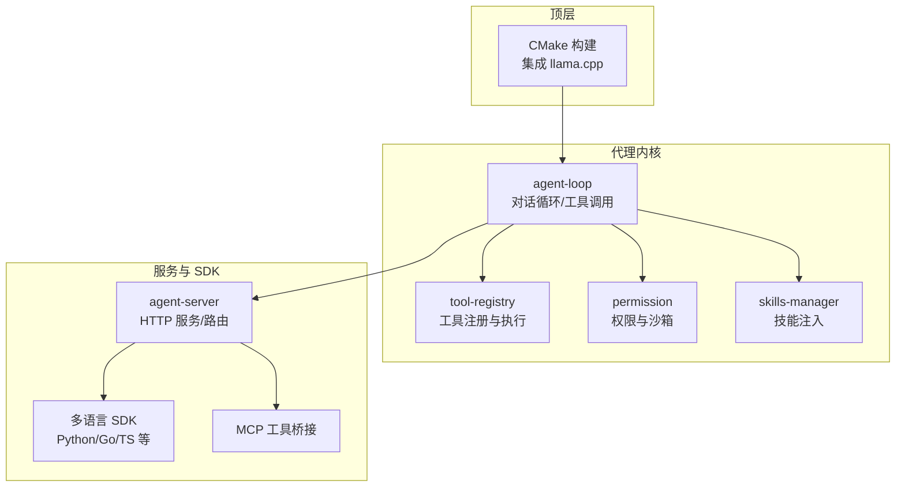
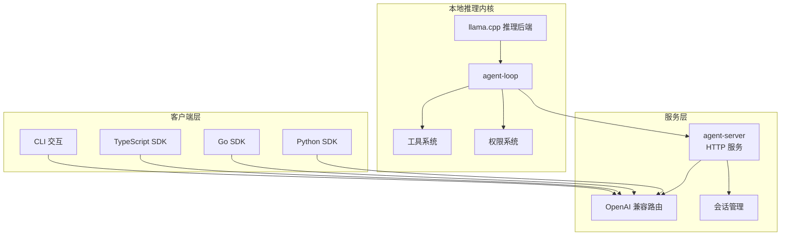
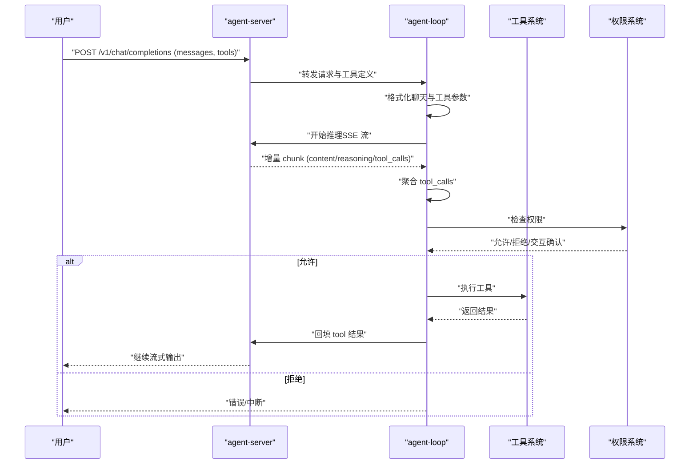
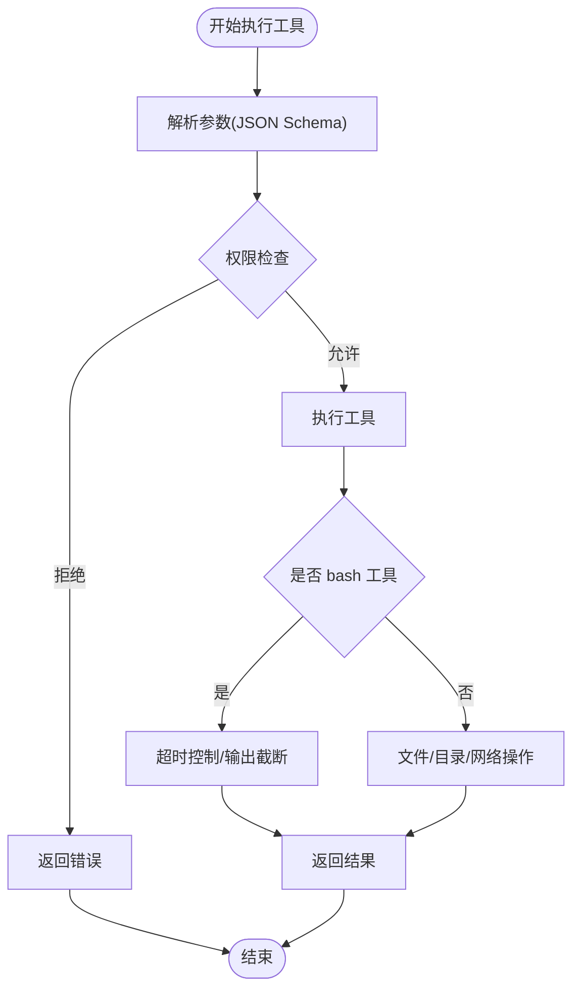
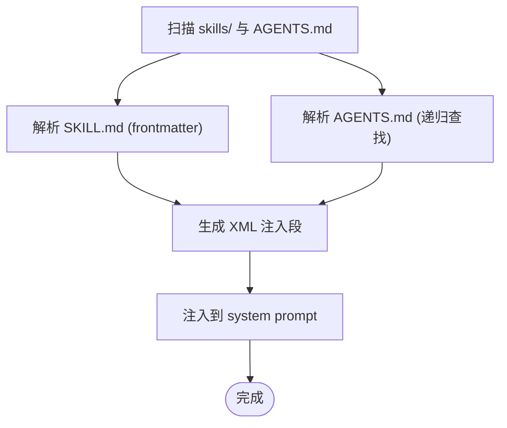
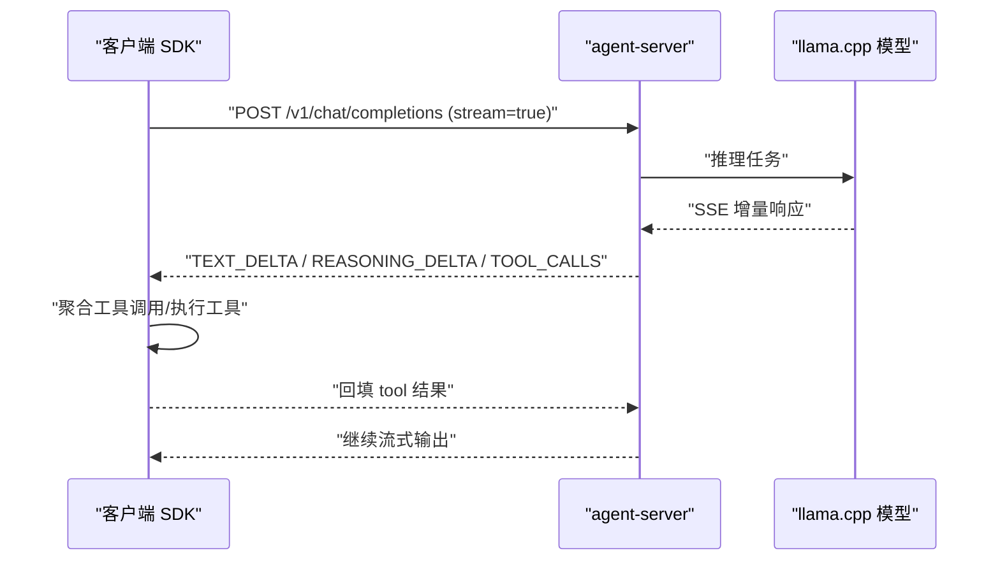
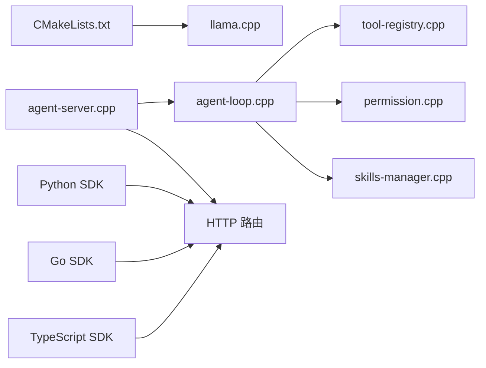

# 项目介绍

<cite>
**本文引用的文件**
- [CMakeLists.txt](file://CMakeLists.txt)
- [agent.cpp](file://agent/agent.cpp)
- [agent-loop.cpp](file://agent/agent-loop.cpp)
- [agent-server.cpp](file://agent/server/agent-server.cpp)
- [skills-manager.cpp](file://agent/skills/skills-manager.cpp)
- [tool-registry.cpp](file://agent/tool-registry.cpp)
- [permission.cpp](file://agent/permission.cpp)
- [sdk.py](file://SDKs/python/src/llama_agent_sdk/sdk.py)
- [sdk.go](file://SDKs/go/llamaagentsdk/sdk.go)
- [index.ts](file://SDKs/typescript/src/index.ts)
- [tool-read.cpp](file://agent/tools/tool-read.cpp)
- [tool-write.cpp](file://agent/tools/tool-write.cpp)
- [tool-bash.cpp](file://agent/tools/tool-bash.cpp)
- [SDK.md](file://agent/sdk/SDK.md)
- [llama-cpp-usage-guide.md](file://docs/llama-cpp-usage-guide.md)
- [README.md](file://third_party/MiniMemory/README.md)
</cite>

## 目录
1. [简介](#简介)
2. [项目结构](#项目结构)
3. [核心组件](#核心组件)
4. [架构总览](#架构总览)
5. [详细组件分析](#详细组件分析)
6. [依赖关系分析](#依赖关系分析)
7. [性能考量](#性能考量)
8. [故障排查指南](#故障排查指南)
9. [结论](#结论)
10. [附录](#附录)

## 简介
llama.cpp-agent 是一个基于本地大语言模型推理的智能代理系统，旨在将强大的本地推理能力与可编程工具链结合，形成“本地可控、安全可信、可扩展”的智能体闭环。项目围绕 llama.cpp 推理后端，提供 CLI 交互、HTTP 服务、多语言 SDK、权限沙箱、技能注入、子代理（Subagent）等能力，既适合开发者进行本地 AI 应用开发，也能满足隐私保护的 AI 服务与企业内部 AI 工具集成需求。

- 核心目标
  - 本地化：模型与工具在本地运行，数据不出域，满足隐私与合规要求
  - 可编程：通过工具与技能机制，将复杂任务分解为可组合的原子操作
  - 安全可控：内置权限系统与工作目录沙箱，防止误操作与越权访问
  - 可扩展：支持多语言 SDK、MCP 工具、AGENTS.md 与 skills 约定，便于生态集成

- 价值主张
  - 低门槛：CLI 与 HTTP 服务双入口，快速上手
  - 高性能：基于 llama.cpp 的推理优化，支持多后端与并行请求
  - 生态友好：遵循 agentskills.io 与 agents.md 规范，便于团队协作与知识沉淀
  - 企业就绪：支持路由模式、会话管理、权限控制与审计统计

## 项目结构
项目采用模块化组织，核心分为三层：
- 顶层构建与依赖：通过 CMake 集成 llama.cpp，并可选启用 CUDA 后端
- 代理内核：agent-loop、工具注册、权限管理、子代理支持
- 服务与 SDK：HTTP 服务、多语言 SDK、MCP 工具桥接、音频/语音能力

**图表来源**
- [CMakeLists.txt:1-44](file://CMakeLists.txt#L1-L44)
- [agent-loop.cpp:1-800](file://agent/agent-loop.cpp#L1-L800)
- [agent-server.cpp:1-731](file://agent/server/agent-server.cpp#L1-L731)
- [SDK.md:1-467](file://agent/sdk/SDK.md#L1-L467)

**章节来源**
- [CMakeLists.txt:1-44](file://CMakeLists.txt#L1-L44)
- [agent.cpp:101-588](file://agent/agent.cpp#L101-L588)
- [agent-server.cpp:105-731](file://agent/server/agent-server.cpp#L105-L731)

## 核心组件
- 代理内核（agent-loop）
  - 负责对话历史管理、推理调度、工具调用聚合、权限检查与统计
  - 支持思考内容（reasoning_content）与工具调用增量流式输出
- 工具系统（tool-registry + 具体工具）
  - 提供 read/write/edit/glob/bash 等常用工具，支持参数校验与超时控制
  - 支持子代理场景下的工具白名单与 bash 模式限制
- 权限与沙箱（permission）
  - 基于工具类型与命令模式的默认策略，支持“本次/会话/永久”决策
  - 工作目录沙箱与敏感文件识别，防止越权与敏感信息泄露
- 技能与上下文（skills-manager + AGENTS.md）
  - 通过 agentskills.io 规范发现与注入技能，增强任务特定能力
  - 通过 AGENTS.md 注入项目上下文，指导代码风格、测试命令与提交规范
- HTTP 服务与 SDK（agent-server + 多语言 SDK）
  - 提供 OpenAI 兼容的 /v1/chat/completions 与 /v1/agent/* 接口
  - 多语言 SDK 复用相同的协议与事件流，便于在不同语言中快速接入

**章节来源**
- [agent-loop.cpp:1-800](file://agent/agent-loop.cpp#L1-L800)
- [tool-registry.cpp:1-86](file://agent/tool-registry.cpp#L1-L86)
- [permission.cpp:1-310](file://agent/permission.cpp#L1-L310)
- [skills-manager.cpp:1-330](file://agent/skills/skills-manager.cpp#L1-L330)
- [SDK.md:1-467](file://agent/sdk/SDK.md#L1-L467)

## 架构总览
llama.cpp-agent 的整体架构分为“本地推理内核 + HTTP 服务 + 多语言 SDK + 工具与权限系统”。

**图表来源**
- [agent-server.cpp:255-426](file://agent/server/agent-server.cpp#L255-L426)
- [SDK.md:17-467](file://agent/sdk/SDK.md#L17-L467)
- [agent-loop.cpp:311-480](file://agent/agent-loop.cpp#L311-L480)

## 详细组件分析

### 代理内核与对话循环
- 系统提示与工具注入
  - 内置系统提示包含工具清单与使用指南，支持根据 AGENTS.md 与 skills 注入上下文
- 工具调用与权限
  - 通过 tool-registry 将工具定义映射为 OpenAI 兼容的 tools 数组
  - 执行前进行权限检查，必要时弹出交互式确认
- 流式输出与统计
  - 支持 content/reasoning_content/tool_calls 的增量聚合
  - 统计 token 使用、生成耗时与子代理开销

**图表来源**
- [agent-server.cpp:303-426](file://agent/server/agent-server.cpp#L303-L426)
- [agent-loop.cpp:311-480](file://agent/agent-loop.cpp#L311-L480)
- [permission.cpp:108-140](file://agent/permission.cpp#L108-L140)

**章节来源**
- [agent-loop.cpp:1-800](file://agent/agent-loop.cpp#L1-L800)
- [SDK.md:46-160](file://agent/sdk/SDK.md#L46-L160)

### 工具系统与安全沙箱
- 工具注册与执行
  - 工具以 JSON Schema 描述参数，执行时进行参数解析与超时控制
  - bash 工具支持超时与输出截断，避免长时间阻塞
- 文件与目录安全
  - read/write/edit 对敏感文件与越权路径进行拦截
  - 支持工作目录沙箱，防止访问外部路径
- 子代理工具白名单
  - 子代理模式下可限制工具集合与 bash 允许列表，实现只读探索等场景

**图表来源**
- [tool-registry.cpp:49-86](file://agent/tool-registry.cpp#L49-L86)
- [tool-bash.cpp:50-281](file://agent/tools/tool-bash.cpp#L50-L281)
- [tool-read.cpp:17-120](file://agent/tools/tool-read.cpp#L17-L120)
- [tool-write.cpp:10-80](file://agent/tools/tool-write.cpp#L10-L80)
- [permission.cpp:306-310](file://agent/permission.cpp#L306-L310)

**章节来源**
- [tool-registry.cpp:1-86](file://agent/tool-registry.cpp#L1-L86)
- [tool-bash.cpp:1-281](file://agent/tools/tool-bash.cpp#L1-L281)
- [tool-read.cpp:1-120](file://agent/tools/tool-read.cpp#L1-L120)
- [tool-write.cpp:1-80](file://agent/tools/tool-write.cpp#L1-L80)
- [permission.cpp:1-310](file://agent/permission.cpp#L1-L310)

### 技能与上下文注入
- skills-manager
  - 发现 SKILL.md，解析 frontmatter，生成 XML 注入段，支持脚本与 allowed-tools
- AGENTS.md
  - 从项目根到 git 根递归查找，注入项目特定的构建、测试、提交与代码风格指导
- 系统提示拼接
  - 将 base prompt、skills 段与 AGENTS.md 段拼接，形成最终 system prompt

**图表来源**
- [skills-manager.cpp:96-330](file://agent/skills/skills-manager.cpp#L96-L330)
- [SDK.md:224-240](file://agent/sdk/SDK.md#L224-L240)

**章节来源**
- [skills-manager.cpp:1-330](file://agent/skills/skills-manager.cpp#L1-L330)
- [SDK.md:1-467](file://agent/sdk/SDK.md#L1-L467)

### HTTP 服务与多语言 SDK
- agent-server
  - 提供 /v1/chat/completions、/v1/agent/* 等 OpenAI 兼容接口
  - 支持路由模式（router）动态切换模型，无需重启
- 多语言 SDK
  - Python/Go/TypeScript SDK 基于相同的 SSE 事件流与工具调用聚合规则
  - 支持会话状态序列化，便于跨进程/跨语言复用

**图表来源**
- [agent-server.cpp:303-426](file://agent/server/agent-server.cpp#L303-L426)
- [sdk.py:62-224](file://SDKs/python/src/llama_agent_sdk/sdk.py#L62-L224)
- [sdk.go:150-267](file://SDKs/go/llamaagentsdk/sdk.go#L150-L267)
- [index.ts:157-221](file://SDKs/typescript/src/index.ts#L157-L221)

**章节来源**
- [agent-server.cpp:1-731](file://agent/server/agent-server.cpp#L1-L731)
- [sdk.py:1-224](file://SDKs/python/src/llama_agent_sdk/sdk.py#L1-L224)
- [sdk.go:1-267](file://SDKs/go/llamaagentsdk/sdk.go#L1-L267)
- [index.ts:1-221](file://SDKs/typescript/src/index.ts#L1-L221)
- [SDK.md:368-467](file://agent/sdk/SDK.md#L368-L467)

## 依赖关系分析
- 构建与后端
  - 通过 CMake 集成 llama.cpp，可选启用 CUDA 后端与 HTTP 库
- 代理内核依赖
  - agent-loop 依赖 tool-registry、permission、skills-manager
  - agent-server 依赖 agent-loop，并提供 HTTP 路由与会话管理
- SDK 依赖
  - 多语言 SDK 依赖 agent-server 的 OpenAI 兼容接口

**图表来源**
- [CMakeLists.txt:1-44](file://CMakeLists.txt#L1-L44)
- [agent-loop.cpp:1-800](file://agent/agent-loop.cpp#L1-L800)
- [agent-server.cpp:1-731](file://agent/server/agent-server.cpp#L1-L731)
- [SDK.md:17-467](file://agent/sdk/SDK.md#L17-L467)

**章节来源**
- [CMakeLists.txt:1-44](file://CMakeLists.txt#L1-L44)
- [agent-loop.cpp:1-800](file://agent/agent-loop.cpp#L1-L800)
- [agent-server.cpp:1-731](file://agent/server/agent-server.cpp#L1-L731)

## 性能考量
- 推理后端与并行
  - llama.cpp 支持多后端与并行请求，可通过 CMake 选项启用 CUDA
- 流式输出与增量处理
  - SSE 增量返回 content/reasoning/tool_calls，降低首字延迟
- 工具执行与超时
  - bash 工具设置超时与输出截断，避免阻塞影响整体性能
- 缓存与统计
  - 通过 KV Cache 前缀共享与统计接口，帮助定位热点与瓶颈

**章节来源**
- [llama-cpp-usage-guide.md:1-1031](file://docs/llama-cpp-usage-guide.md#L1-L1031)
- [agent-loop.cpp:311-480](file://agent/agent-loop.cpp#L311-L480)
- [tool-bash.cpp:25-281](file://agent/tools/tool-bash.cpp#L25-L281)

## 故障排查指南
- 权限相关
  - 当工具被拒绝时，检查 permission 的默认策略与交互确认流程
  - 对于敏感文件与越权路径，确认工作目录沙箱配置
- 工具执行失败
  - 查看工具返回的输出与错误信息，确认参数与超时设置
  - 对于 bash 工具，关注超时与输出截断提示
- HTTP 服务异常
  - 确认 agent-server 的路由模式与模型加载状态
  - 检查 SSE 流解析与工具调用聚合逻辑

**章节来源**
- [permission.cpp:142-197](file://agent/permission.cpp#L142-L197)
- [tool-bash.cpp:238-258](file://agent/tools/tool-bash.cpp#L238-L258)
- [agent-server.cpp:500-731](file://agent/server/agent-server.cpp#L500-L731)

## 结论
llama.cpp-agent 将本地推理、工具链、权限与上下文注入有机结合，形成了一个可扩展、可审计、可移植的智能代理平台。它既适合个人开发者进行本地 AI 应用开发，也能满足企业对隐私与合规的要求。通过多语言 SDK 与 OpenAI 兼容接口，项目易于融入现有生态，实现从原型到生产的平滑过渡。

## 附录
- 应用场景
  - 本地 AI 应用开发：通过 CLI 与 SDK 快速验证想法
  - 隐私保护的 AI 服务：本地部署，数据不出域
  - 企业内部 AI 工具集成：通过 skills/AGENTS.md 与 MCP 工具桥接
- 发展与规划
  - 持续优化推理性能与工具生态
  - 扩展更多语言 SDK 与平台集成
  - 引入更丰富的上下文注入与可视化工具