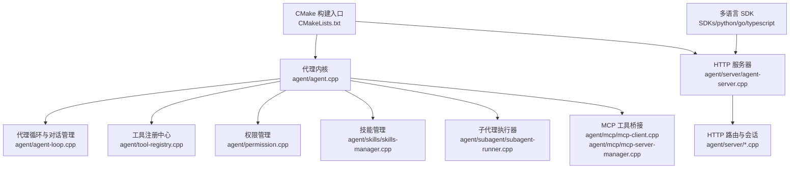
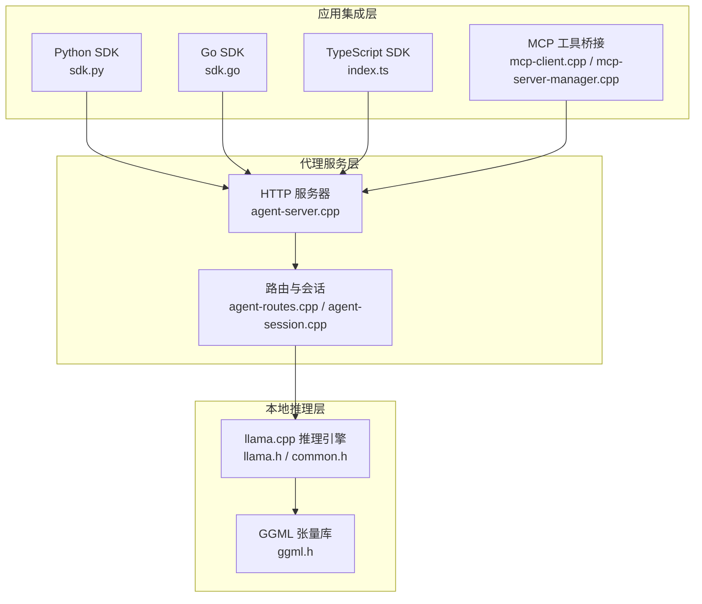
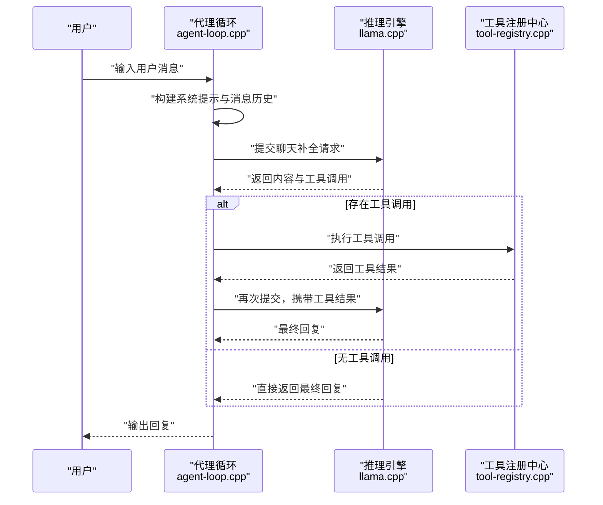
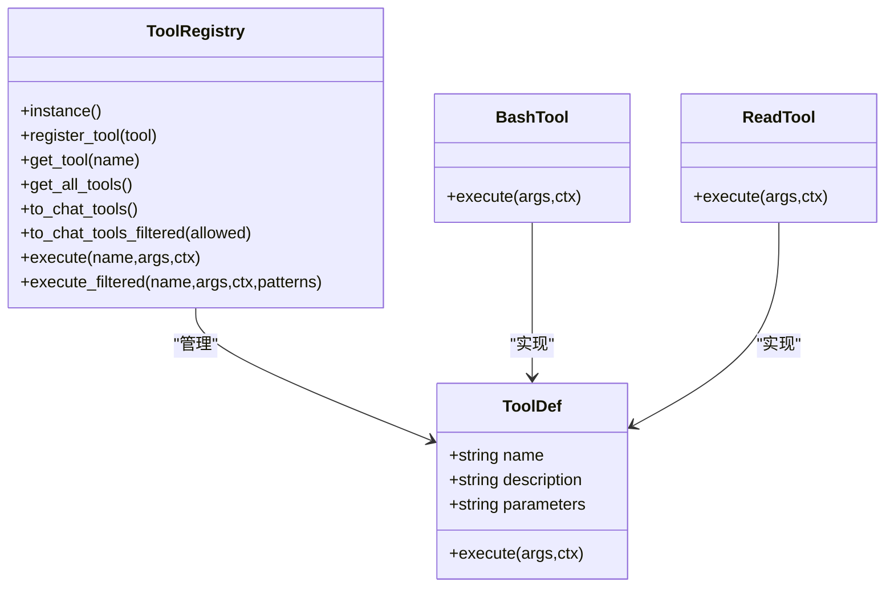
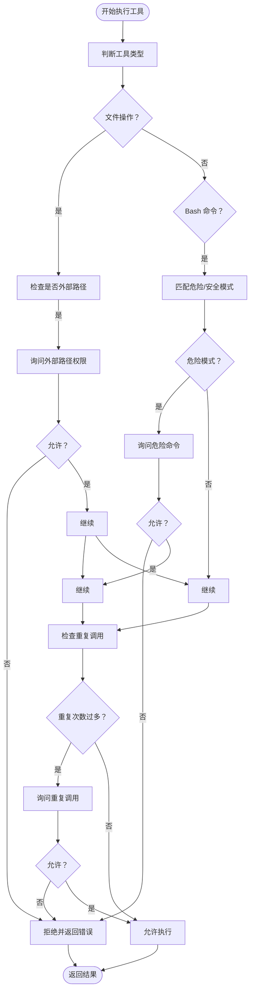
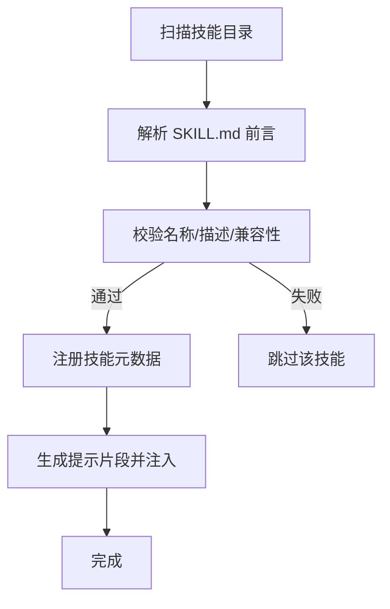
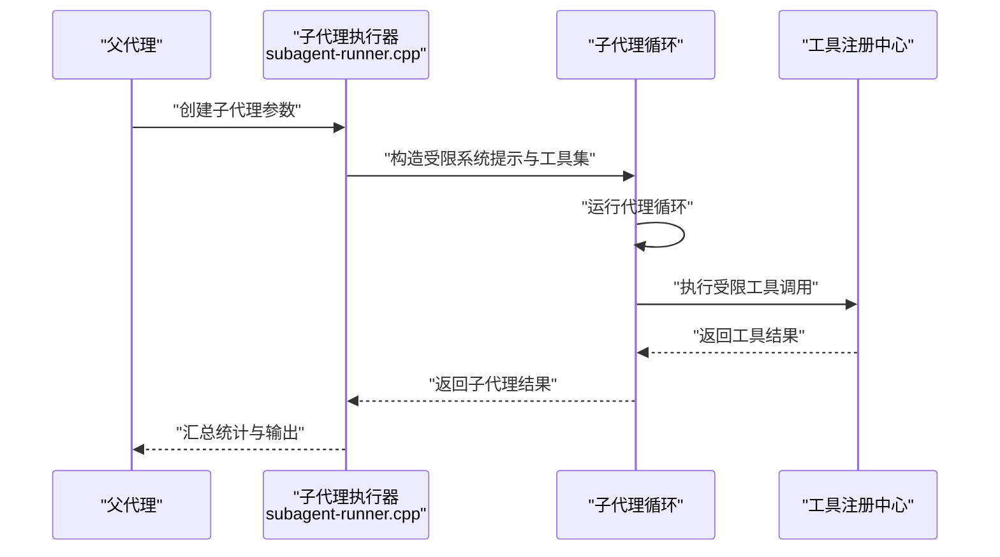
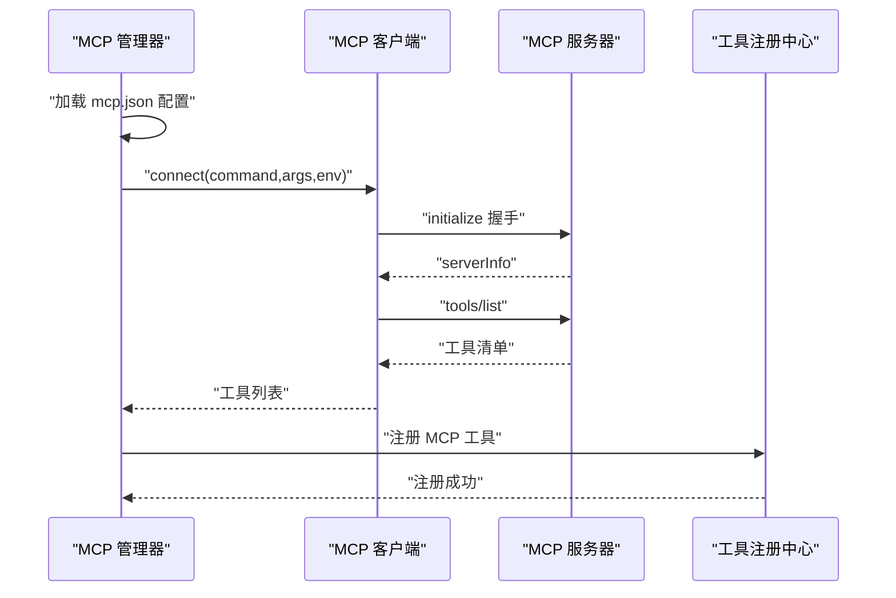
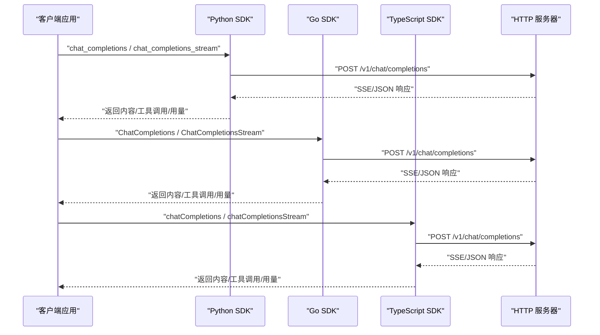
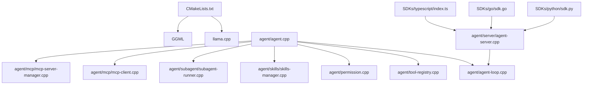

# 项目概述

<cite>
**本文档引用的文件**
- [CMakeLists.txt](file://CMakeLists.txt)
- [agent/agent.cpp](file://agent/agent.cpp)
- [agent/agent-loop.cpp](file://agent/agent-loop.cpp)
- [agent/tool-registry.cpp](file://agent/tool-registry.cpp)
- [agent/skills/skills-manager.cpp](file://agent/skills/skills-manager.cpp)
- [agent/permission.cpp](file://agent/permission.cpp)
- [agent/subagent/subagent-runner.cpp](file://agent/subagent/subagent-runner.cpp)
- [agent/server/agent-server.cpp](file://agent/server/agent-server.cpp)
- [SDKs/python/src/llama_agent_sdk/sdk.py](file://SDKs/python/src/llama_agent_sdk/sdk.py)
- [SDKs/go/llamaagentsdk/sdk.go](file://SDKs/go/llamaagentsdk/sdk.go)
- [SDKs/typescript/src/index.ts](file://SDKs/typescript/src/index.ts)
- [agent/tools/tool-bash.cpp](file://agent/tools/tool-bash.cpp)
- [agent/tools/tool-read.cpp](file://agent/tools/tool-read.cpp)
- [agent/mcp/mcp-client.cpp](file://agent/mcp/mcp-client.cpp)
- [agent/mcp/mcp-server-manager.cpp](file://agent/mcp/mcp-server-manager.cpp)
- [docs/llama-cpp-usage-guide.md](file://docs/llama-cpp-usage-guide.md)
</cite>

## 目录
1. [简介](#简介)
2. [项目结构](#项目结构)
3. [核心组件](#核心组件)
4. [架构总览](#架构总览)
5. [详细组件分析](#详细组件分析)
6. [依赖关系分析](#依赖关系分析)
7. [性能考虑](#性能考虑)
8. [故障排除指南](#故障排除指南)
9. [结论](#结论)
10. [附录](#附录)

## 简介
llama.cpp-agent 是一个基于 llama.cpp 的本地大语言模型推理与智能代理系统，提供安全可控的本地推理能力、工具执行系统、权限控制、技能管理以及子代理架构。项目同时提供多语言 SDK（Python、Go、TypeScript），支持通过 HTTP API 与本地推理服务交互，并内置 MCP（Model Context Protocol）工具桥接能力，便于扩展外部工具与服务。

本项目旨在让开发者与终端用户能够在本地机器上运行强大的本地 AI 助手，完成代码阅读、编辑、文件系统探索、命令执行等任务，且所有数据不出本地，确保隐私与安全。

## 项目结构
项目采用模块化组织，核心目录与职责如下：
- agent：代理内核、工具系统、权限控制、技能管理、子代理、MCP 支持、HTTP 服务器路由与会话管理
- SDKs：多语言 SDK（Python、Go、TypeScript），提供 HTTP 客户端封装与流式响应解析
- third_party：第三方依赖，如 llama.cpp、MiniMemory、Qwen3 ASR/TTS 等
- docs：技术文档，包含 llama.cpp 使用指南、并行请求、新模型支持等

**图表来源**
- [CMakeLists.txt:1-44](file://CMakeLists.txt#L1-L44)
- [agent/agent.cpp:101-588](file://agent/agent.cpp#L101-L588)
- [agent/server/agent-server.cpp:105-731](file://agent/server/agent-server.cpp#L105-L731)

**章节来源**
- [CMakeLists.txt:1-44](file://CMakeLists.txt#L1-L44)
- [agent/agent.cpp:101-588](file://agent/agent.cpp#L101-L588)
- [agent/server/agent-server.cpp:105-731](file://agent/server/agent-server.cpp#L105-L731)

## 核心组件
- 代理内核与主循环：负责系统提示构建、消息历史维护、推理调度、工具调用与结果回传
- 工具系统：统一的工具注册与执行接口，内置 bash、read、write、edit、glob 等常用工具
- 权限控制系统：针对文件访问、外部路径、危险命令进行细粒度控制与用户确认
- 技能管理：遵循 agentskills.io 规范，发现与注入技能描述，增强代理能力边界
- 子代理架构：支持嵌套代理，限制工具集与 Bash 模式，实现只读探索、规划、通用任务与命令执行等角色
- MCP 工具桥接：通过 MCP 协议动态加载外部工具服务器，统一注册为代理可用工具
- HTTP 服务器与 SDK：提供 OpenAI 兼容的 /v1/chat/completions 等端点，多语言 SDK 封装流式与非流式调用

**章节来源**
- [agent/agent-loop.cpp:49-296](file://agent/agent-loop.cpp#L49-L296)
- [agent/tool-registry.cpp:6-86](file://agent/tool-registry.cpp#L6-L86)
- [agent/permission.cpp:35-310](file://agent/permission.cpp#L35-L310)
- [agent/skills/skills-manager.cpp:240-330](file://agent/skills/skills-manager.cpp#L240-L330)
- [agent/subagent/subagent-runner.cpp:22-244](file://agent/subagent/subagent-runner.cpp#L22-L244)
- [agent/mcp/mcp-client.cpp:21-122](file://agent/mcp/mcp-client.cpp#L21-L122)
- [agent/mcp/mcp-server-manager.cpp:21-98](file://agent/mcp/mcp-server-manager.cpp#L21-L98)

## 架构总览
llama.cpp-agent 的整体架构分为三层：
- 本地推理层：基于 llama.cpp 的推理引擎，提供模型加载、KV 缓存、批处理与采样
- 代理服务层：HTTP 服务器与会话管理，提供 OpenAI 兼容 API；同时支持 CLI 交互与子代理执行
- 应用集成层：多语言 SDK 与 MCP 工具桥接，便于在应用中集成与扩展

**图表来源**
- [agent/server/agent-server.cpp:256-426](file://agent/server/agent-server.cpp#L256-L426)
- [SDKs/python/src/llama_agent_sdk/sdk.py:102-224](file://SDKs/python/src/llama_agent_sdk/sdk.py#L102-L224)
- [SDKs/go/llamaagentsdk/sdk.go:38-267](file://SDKs/go/llamaagentsdk/sdk.go#L38-L267)
- [SDKs/typescript/src/index.ts:83-221](file://SDKs/typescript/src/index.ts#L83-L221)
- [docs/llama-cpp-usage-guide.md:14-76](file://docs/llama-cpp-usage-guide.md#L14-L76)

## 详细组件分析

### 代理内核与对话循环
- 系统提示构建：内置系统提示，强调本地运行、工具使用规范、并行执行策略与代码引用格式
- 对话历史：维护消息数组，支持工具调用结果作为“tool”角色消息插入
- 推理与工具调用：通过聊天模板生成完整提示，提交给推理引擎；解析返回的 reasoning 内容与 tool_calls
- 统计与中断：记录 token 使用、耗时统计；支持 ESC 键中断生成

**图表来源**
- [agent/agent-loop.cpp:311-480](file://agent/agent-loop.cpp#L311-L480)
- [agent/tool-registry.cpp:49-86](file://agent/tool-registry.cpp#L49-L86)

**章节来源**
- [agent/agent-loop.cpp:49-296](file://agent/agent-loop.cpp#L49-L296)
- [agent/agent-loop.cpp:695-788](file://agent/agent-loop.cpp#L695-L788)

### 工具系统与内置工具
- 工具注册：集中注册工具定义，提供统一的执行接口与过滤执行（子代理只读模式）
- bash 工具：在工作目录执行命令，支持超时、输出截断与退出码报告
- read 工具：读取文件内容，支持偏移与行数限制，敏感文件保护
- 其他工具：write、edit、glob 等，满足文件系统探索与修改需求

**图表来源**
- [agent/tool-registry.cpp:6-86](file://agent/tool-registry.cpp#L6-L86)
- [agent/tools/tool-bash.cpp:50-281](file://agent/tools/tool-bash.cpp#L50-L281)
- [agent/tools/tool-read.cpp:17-120](file://agent/tools/tool-read.cpp#L17-L120)

**章节来源**
- [agent/tool-registry.cpp:6-86](file://agent/tool-registry.cpp#L6-L86)
- [agent/tools/tool-bash.cpp:50-281](file://agent/tools/tool-bash.cpp#L50-L281)
- [agent/tools/tool-read.cpp:17-120](file://agent/tools/tool-read.cpp#L17-L120)

### 权限控制与安全
- 默认策略：文件读默认允许，写与编辑需确认；Bash 命令按模式分类（危险/安全）
- 外部路径检测：禁止越出工作目录的文件操作
- 重复调用防护：检测重复相同工具调用，防止“永动机”式循环
- 用户确认：交互式询问“是/否/总是/拒绝永久”，支持会话覆盖

**图表来源**
- [agent/permission.cpp:108-223](file://agent/permission.cpp#L108-L223)

**章节来源**
- [agent/permission.cpp:35-310](file://agent/permission.cpp#L35-L310)

### 技能管理（agentskills.io）
- 发现与解析：扫描搜索路径，解析 SKILL.md 前言元数据，校验名称与描述格式
- 注入提示：将可用技能以 XML 片段形式注入系统提示，增强代理在特定领域的执行能力
- 脚本支持：自动发现 scripts 子目录中的脚本，支持外部脚本执行

**图表来源**
- [agent/skills/skills-manager.cpp:96-186](file://agent/skills/skills-manager.cpp#L96-L186)
- [agent/skills/skills-manager.cpp:188-238](file://agent/skills/skills-manager.cpp#L188-L238)
- [agent/skills/skills-manager.cpp:240-288](file://agent/skills/skills-manager.cpp#L240-L288)
- [agent/skills/skills-manager.cpp:290-330](file://agent/skills/skills-manager.cpp#L290-L330)

**章节来源**
- [agent/skills/skills-manager.cpp:240-330](file://agent/skills/skills-manager.cpp#L240-L330)

### 子代理架构
- 角色与限制：支持只读探索（EXPLORE）、规划（PLAN）、通用任务（GENERAL）、命令执行（BASH）等模式
- 工具与 Bash 限制：根据模式限制可用工具与 Bash 命令集合
- 嵌套深度控制：防止无限递归，统计子代理 token 使用并汇总到主代理
- 同步/异步执行：支持同步输出与后台任务管理

**图表来源**
- [agent/subagent/subagent-runner.cpp:133-244](file://agent/subagent/subagent-runner.cpp#L133-L244)
- [agent/subagent/subagent-runner.cpp:246-348](file://agent/subagent/subagent-runner.cpp#L246-L348)

**章节来源**
- [agent/subagent/subagent-runner.cpp:22-244](file://agent/subagent/subagent-runner.cpp#L22-L244)
- [agent/subagent/subagent-runner.cpp:246-388](file://agent/subagent/subagent-runner.cpp#L246-L388)

### MCP 工具桥接
- 服务器管理：解析 mcp.json 配置，启动多个 MCP 工具服务器，收集可用工具
- 客户端协议：通过 JSON-RPC 2.0 与 MCP 服务器握手、列出工具、调用工具
- 工具命名空间：为每个工具生成 mcp__server__tool 的限定名，避免冲突
- 注册为代理工具：将 MCP 工具注册到代理工具系统，参与统一的工具调用流程

**图表来源**
- [agent/mcp/mcp-server-manager.cpp:21-98](file://agent/mcp/mcp-server-manager.cpp#L21-L98)
- [agent/mcp/mcp-client.cpp:21-122](file://agent/mcp/mcp-client.cpp#L21-L122)
- [agent/mcp/mcp-server-manager.cpp:110-158](file://agent/mcp/mcp-server-manager.cpp#L110-L158)

**章节来源**
- [agent/mcp/mcp-server-manager.cpp:21-245](file://agent/mcp/mcp-server-manager.cpp#L21-L245)
- [agent/mcp/mcp-client.cpp:21-364](file://agent/mcp/mcp-client.cpp#L21-L364)

### HTTP 服务器与多语言 SDK
- OpenAI 兼容端点：/v1/chat/completions、/v1/agent/session 等，支持流式与非流式响应
- Python/Go/TypeScript SDK：封装请求构建、SSE 流解析、消息历史维护与工具调用聚合
- 超时与鉴权：支持请求超时、API Key 鉴权头

**图表来源**
- [SDKs/python/src/llama_agent_sdk/sdk.py:102-224](file://SDKs/python/src/llama_agent_sdk/sdk.py#L102-L224)
- [SDKs/go/llamaagentsdk/sdk.go:100-267](file://SDKs/go/llamaagentsdk/sdk.go#L100-L267)
- [SDKs/typescript/src/index.ts:139-221](file://SDKs/typescript/src/index.ts#L139-L221)
- [agent/server/agent-server.cpp:303-426](file://agent/server/agent-server.cpp#L303-L426)

**章节来源**
- [SDKs/python/src/llama_agent_sdk/sdk.py:102-224](file://SDKs/python/src/llama_agent_sdk/sdk.py#L102-L224)
- [SDKs/go/llamaagentsdk/sdk.go:100-267](file://SDKs/go/llamaagentsdk/sdk.go#L100-L267)
- [SDKs/typescript/src/index.ts:139-221](file://SDKs/typescript/src/index.ts#L139-L221)
- [agent/server/agent-server.cpp:303-426](file://agent/server/agent-server.cpp#L303-L426)

## 依赖关系分析
- 构建系统：通过 CMake 集成 llama.cpp，启用 HTTP、工具与服务器选项，并可选择 CUDA 后端
- 推理引擎：llama.cpp 提供模型加载、上下文初始化、解码与采样；common.h 提供便捷接口
- 工具与权限：工具注册中心统一管理工具；权限管理器贯穿工具执行前后
- MCP：Unix 平台下通过 fork/pipe 启动 MCP 服务器，建立 JSON-RPC 通道
- SDK：多语言 SDK 与 HTTP 服务器端点一一对应，保证跨语言一致性

**图表来源**
- [CMakeLists.txt:1-44](file://CMakeLists.txt#L1-L44)
- [agent/agent.cpp:101-588](file://agent/agent.cpp#L101-L588)
- [agent/server/agent-server.cpp:105-731](file://agent/server/agent-server.cpp#L105-L731)

**章节来源**
- [CMakeLists.txt:1-44](file://CMakeLists.txt#L1-L44)
- [agent/agent.cpp:101-588](file://agent/agent.cpp#L101-L588)
- [agent/server/agent-server.cpp:105-731](file://agent/server/agent-server.cpp#L105-L731)

## 性能考虑
- KV 缓存复用：主代理与子代理共享基础系统提示前缀，最大化 KV 缓存命中率，降低 token 成本
- 并行工具执行：在支持的模板与平台上，允许并行工具调用以提升效率
- 输出截断与超时：工具输出与 Bash 命令设置上限与超时，避免长时间阻塞
- 线程与批处理：HTTP 服务器默认并行与统一 KV，合理设置线程数与批大小以平衡吞吐与延迟
- CUDA 后端：在支持平台启用 CUDA，显著提升推理速度

[本节为通用指导，无需特定文件引用]

## 故障排除指南
- 无法加载模型：检查模型路径与 GGUF 格式；查看日志输出与清理函数
- 工具执行失败：查看工具返回的错误信息与输出；确认工作目录与权限
- Bash 超时或被中断：调整超时参数；确认 ESC 键中断触发
- MCP 服务器连接失败：检查 mcp.json 配置、命令可执行性与环境变量展开
- SDK 请求异常：确认端点地址、鉴权头与超时设置；检查服务器健康状态

**章节来源**
- [agent/server/agent-server.cpp:500-511](file://agent/server/agent-server.cpp#L500-L511)
- [agent/mcp/mcp-client.cpp:230-275](file://agent/mcp/mcp-client.cpp#L230-L275)
- [SDKs/python/src/llama_agent_sdk/sdk.py:126-132](file://SDKs/python/src/llama_agent_sdk/sdk.py#L126-L132)

## 结论
llama.cpp-agent 将本地推理能力、工具系统、权限控制与多语言集成有机结合，形成一套可扩展、可审计、可定制的智能代理解决方案。通过子代理与 MCP 桥接，系统能够灵活应对复杂任务场景；通过多语言 SDK，开发者可以快速集成到现有应用中。建议在生产环境中结合权限策略、超时与监控机制，确保稳定与安全。

[本节为总结性内容，无需特定文件引用]

## 附录
- 技术栈概览
  - C++ 核心与 llama.cpp 推理引擎
  - GGML 张量计算库与后端抽象层
  - OpenAI 兼容 HTTP API 与多语言 SDK
  - MCP 协议工具桥接
  - CMake 构建与可选 CUDA 后端

- 实际使用场景与最佳实践
  - 本地代码助手：只读探索、文件读取、命令执行、小范围编辑
  - 项目规划与重构：利用子代理 PLAN 模式生成结构化计划
  - 外部工具集成：通过 MCP 注册外部工具，扩展代理能力
  - 多语言接入：使用 SDK 快速对接 Web/桌面/移动应用

**章节来源**
- [docs/llama-cpp-usage-guide.md:14-76](file://docs/llama-cpp-usage-guide.md#L14-L76)
- [agent/server/agent-server.cpp:697-714](file://agent/server/agent-server.cpp#L697-L714)